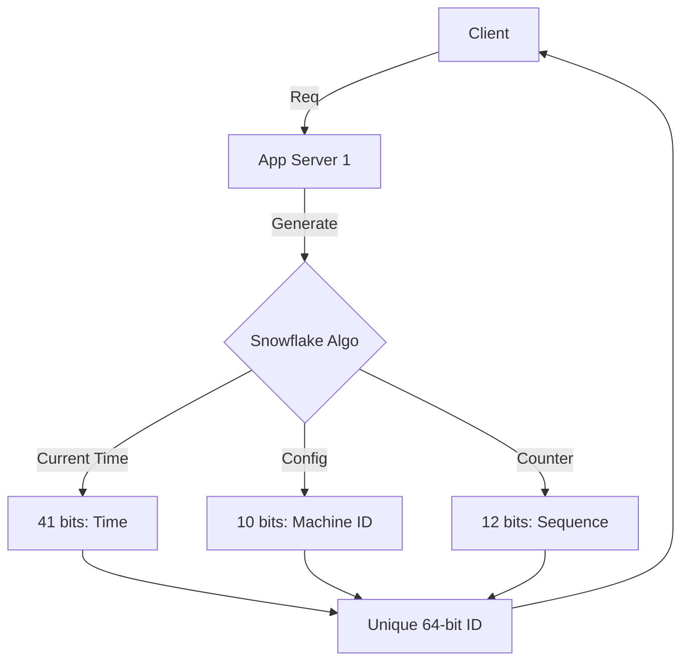

# Distributed ID Generators

## 1. The Requirement

We need a unique ID for every record (Order, Tweet, Chat Message).
**Why not use Auto-Increment?**

- In a horizontally sharded database (100 servers), synchronizing a central "Atomic Counter" is a bottleneck.
- Shards might generate duplicates if not careful (`Shard 1: ID 1`, `Shard 2: ID 1`).

## 2. Approach 1: Multi-Master Replication (Auto-Increment with Offset)

- Server 1 generates: 1, 4, 7...
- Server 2 generates: 2, 5, 8...
- Server 3 generates: 3, 6, 9...
- **Pros**: Simple.
- **Cons**: Poor scaling. Adding Server 4 requires changing the step/offset of ALL servers. Hard to maintain.

## 3. Approach 2: UUID (Universally Unique Identifier)

- 128-bit hexadecimal number.
- Generated locally (Offline). No network call needed.
- `f47ac10b-58cc-4372-a567-0e02b2c3d479`
- **Pros**: Zero collision chance, simple, fast.
- **Cons**:
  - **Too Long** (128 bits vs 64 bits). Indexes become huge.
  - **Non-Numeric**: Hard to sort.
  - **Random**: Writes to DB are random (page fragmentation), killing performance.

## 4. Approach 3: Ticket Server (Centralized)

- A single specialized DB (Flickr Ticket Server) only used to generate IDs.
- `REPLACE INTO Tickets64 (stub) VALUES ('a'); SELECT LAST_INSERT_ID();`
- **Pros**: Numeric, sorted.
- **Cons**: Single Point of Failure (SPOF).

## 5. Approach 4: Twitter Snowflake (The Standard)

Generate a 64-bit ID that is roughly sorted by time.

| Bit Allocation | Description |
|---|---|
| 1 bit | Sign bit (always 0) |
| 41 bits | Timestamp (Milliseconds since Epoch) |
| 10 bits | Machine ID (DC ID + Worker ID) |
| 12 bits | Sequence Number (For same ms) |

- **41 bits Time**: Works for 69 years.
- **10 bits Machine**: 1024 nodes supported.
- **12 bits Sequence**: 4096 IDs per millisecond per node.

**Why this is best?**

- **Sortable**: Time is the leading part. New IDs are > Old IDs.
- **Distributed**: Each machine generates IDs independently (no coordination).
- **Compact**: 64-bit (fits in `BigInt`).

### Implementation Diagram (Mermaid)

