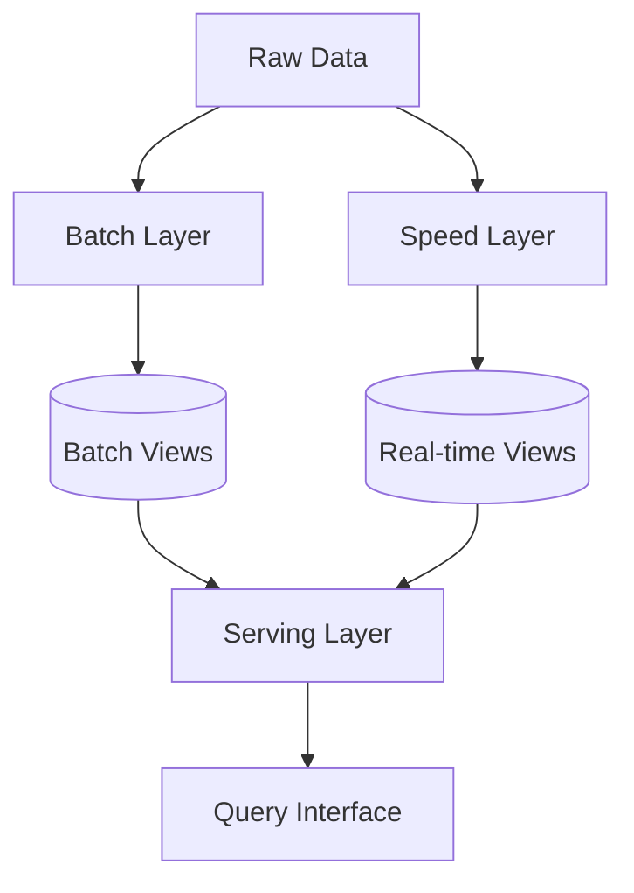
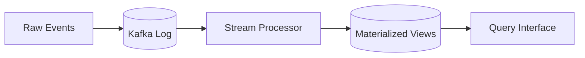
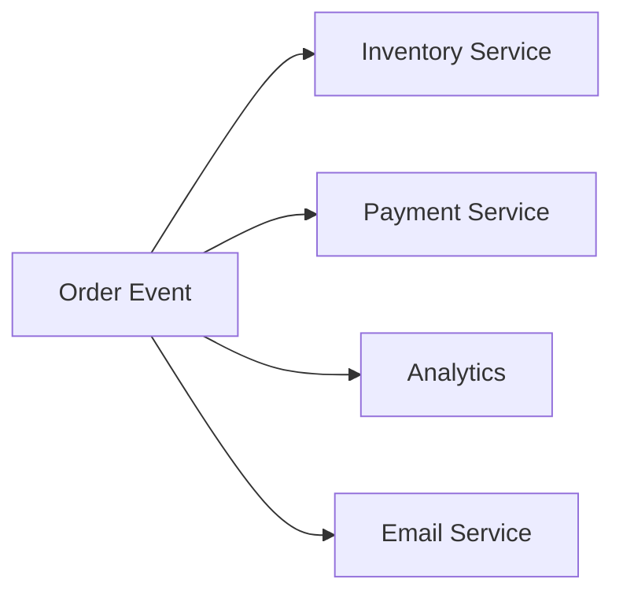
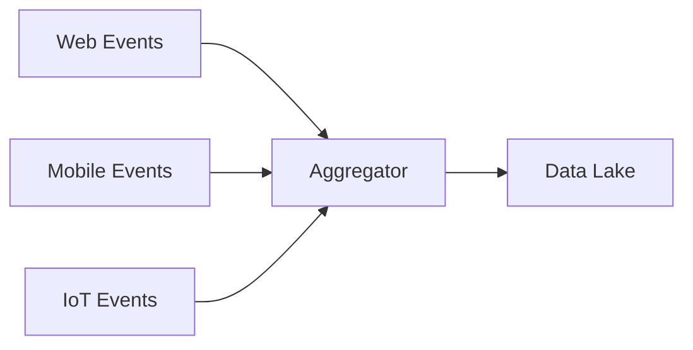
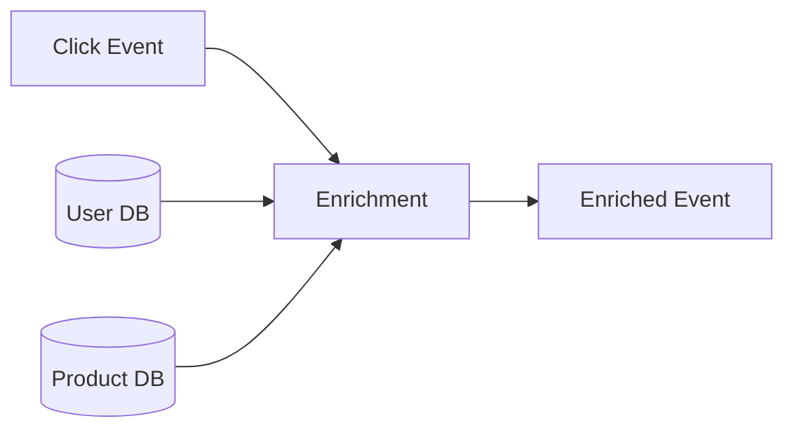
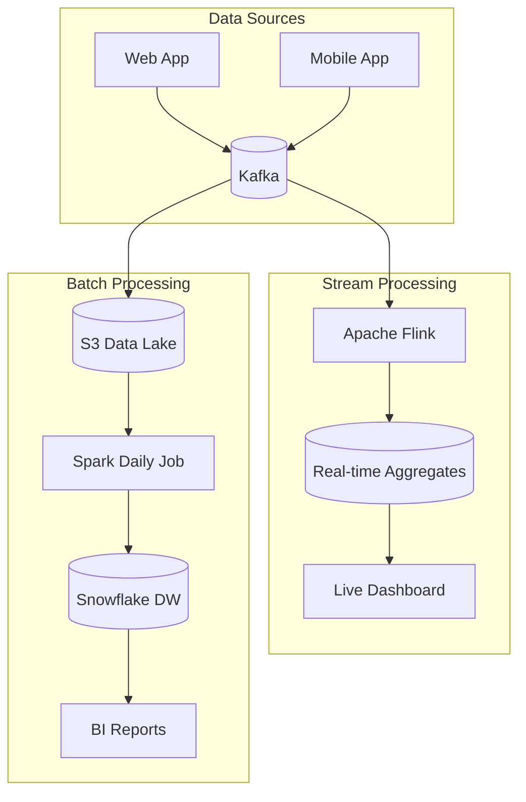

# Data Pipelines & Processing

Modern systems generate massive amounts of data. Understanding how to process, transform, and store this data is essential for L5 interviews.

## 1. Batch vs Stream Processing

### Batch Processing

Process data in large chunks at scheduled intervals.

```
Data Lake → Batch Job (Daily) → Data Warehouse → BI Reports
```

**Characteristics**:

- High latency (hours to days)
- High throughput (process TBs at once)
- Complete data view
- Cost-efficient for large volumes

**Use Cases**:

- Daily analytics reports
- ML model training
- Data warehouse loads
- Monthly billing calculations

### Stream Processing

Process data continuously as it arrives.

```
Events → Stream Processor → Real-time Dashboard
                        → Alerts
                        → Derived Streams
```

**Characteristics**:

- Low latency (seconds to minutes)
- Unbounded data (never complete)
- Approximate or windowed aggregations
- Higher operational complexity

**Use Cases**:

- Real-time fraud detection
- Live dashboards
- Recommendation updates
- Real-time alerting

### Comparison

| Aspect | Batch | Stream |
|--------|-------|--------|
| **Latency** | Hours/Days | Seconds/Minutes |
| **Throughput** | Very High | Medium-High |
| **Complexity** | Lower | Higher |
| **Accuracy** | Exact | Approximate (windowed) |
| **State** | Full dataset | Windowed/Incremental |

---

## 2. Lambda Architecture

Combines batch and stream for best of both worlds.



### Layers

1. **Batch Layer**: Processes full dataset, produces accurate batch views
2. **Speed Layer**: Processes recent data in real-time, fills latency gap
3. **Serving Layer**: Merges batch and real-time views for queries

### Example: User Analytics

```
Batch: Daily job computes total user actions (accurate)
Speed: Stream job counts actions since last batch (approximate)
Query: Total = BatchCount + SpeedCount
```

### Trade-offs

**Pros**:

- Accurate results (batch corrects speed layer errors)
- Fault-tolerant (replay from raw data)

**Cons**:

- Dual codebase (batch and stream logic)
- Complex to maintain
- Data sync issues between layers

---

## 3. Kappa Architecture

Simplifies Lambda by using only stream processing.



### Key Insight

> If you can process everything as a stream, why maintain two systems?

### How It Works

- Store all raw events in Kafka (append-only log)
- Stream processor creates materialized views
- To recompute: replay from Kafka with new logic

### When to Use

- Event-sourced systems
- When batch and stream logic is identical
- Simpler operational model preferred

---

## 4. ETL vs ELT

### ETL (Extract, Transform, Load)

```
Source → [Extract] → [Transform] → [Load] → Data Warehouse
```

**Traditional approach**:

1. Extract from source systems
2. Transform in staging area
3. Load cleaned data into warehouse

**Pros**: Clean data in warehouse, lower storage costs
**Cons**: Slow to adapt (schema changes require pipeline changes)

### ELT (Extract, Load, Transform)

```
Source → [Extract] → [Load] → Data Lake → [Transform] → Warehouse
```

**Modern approach** (enabled by cheap storage):

1. Extract raw data as-is
2. Load into data lake
3. Transform on-demand using SQL or Spark

**Pros**: Flexible, schema-on-read, raw data preserved
**Cons**: More storage, transforms at query time can be slow

### Comparison

| Aspect | ETL | ELT |
|--------|-----|-----|
| **Storage** | Less (only clean data) | More (raw + clean) |
| **Flexibility** | Low (predefined transforms) | High (transform on demand) |
| **Speed** | Slow initial, fast query | Fast initial, may slow query |
| **Tools** | Informatica, Talend | dbt, Spark, BigQuery |

---

## 5. Key Technologies

### Batch Processing

| Tool | Managed Service | Use Case |
|------|-----------------|----------|
| **Apache Spark** | AWS EMR, Databricks | Large-scale batch, ML |
| **Apache Hadoop** | AWS EMR, GCP Dataproc | Legacy, HDFS-based |
| **Google Dataflow** | Fully managed | Unified batch/stream |
| **dbt** | dbt Cloud | SQL transformations |

### Stream Processing

| Tool | Managed Service | Use Case |
|------|-----------------|----------|
| **Apache Kafka Streams** | Confluent | Stream processing in Kafka |
| **Apache Flink** | AWS Kinesis Data Analytics | Complex event processing |
| **Apache Spark Streaming** | Databricks | Micro-batch streaming |
| **Google Dataflow** | Fully managed | Unified batch/stream |

### Message Queues / Event Stores

| Tool | Type | Use Case |
|------|------|----------|
| **Apache Kafka** | Distributed log | Event streaming, replay |
| **AWS Kinesis** | Managed streaming | AWS-native streaming |
| **Google Pub/Sub** | Managed pub/sub | GCP-native, serverless |
| **RabbitMQ** | Message broker | Task queues, traditional MQ |

### Data Storage

| Type | Examples | Use Case |
|------|----------|----------|
| **Data Lake** | S3, GCS, ADLS | Raw, unstructured data |
| **Data Warehouse** | Snowflake, BigQuery, Redshift | Structured analytics |
| **OLTP Database** | PostgreSQL, MySQL | Transactional workloads |

---

## 6. Data Lake vs Data Warehouse

| Aspect | Data Lake | Data Warehouse |
|--------|-----------|----------------|
| **Schema** | Schema-on-read | Schema-on-write |
| **Data Types** | Structured + Unstructured | Structured only |
| **Cost** | Low (object storage) | Higher (compute + storage) |
| **Query Speed** | Slower (needs processing) | Fast (optimized storage) |
| **Users** | Data scientists, engineers | Business analysts, BI |
| **Examples** | S3 + Spark | Snowflake, BigQuery |

### Modern Lakehouse Architecture

Combines best of both:

```
Data Lake (S3) → Delta Lake / Iceberg → Query Engine (Spark/Presto)
```

- Open formats (Parquet, ORC)
- ACID transactions on data lake
- Time travel and versioning

---

## 7. Common Pipeline Patterns

### Fan-Out Pattern

One event triggers multiple downstream processors.



### Fan-In Pattern

Multiple sources aggregated into one.



### Enrichment Pattern

Add context to events by looking up external data.



---

## 8. Data Pipeline Design (Interview Template)

When asked to design a data pipeline, cover:

### 1. Data Sources

- What are the inputs? (DBs, APIs, files, streams)
- Volume and velocity?
- Schema or schemaless?

### 2. Processing Requirements

- Real-time or batch? (or both)
- Transformation complexity?
- Windowing for streams?

### 3. Storage

- Where does output go? (Lake, warehouse, DB)
- Retention policy?
- Access patterns?

### 4. Reliability

- Exactly-once vs at-least-once?
- Replay capability?
- Error handling (dead letter queues)?

### 5. Monitoring

- Data quality checks?
- Latency monitoring?
- Alerting on failures?

---

## 9. Example: Designing an Analytics Pipeline

**Requirement**: Process user click events for real-time dashboards and batch reports.

### Architecture



### Data Flow

1. **Ingestion**: Events → Kafka (partitioned by user_id)
2. **Stream**: Flink aggregates last 5 minutes → Redis → Dashboard
3. **Batch**: Kafka → S3 (hourly) → Spark (daily) → Snowflake

### Key Design Decisions

| Decision | Choice | Rationale |
|----------|--------|-----------|
| **Message Queue** | Kafka | Durability, replay, high throughput |
| **Stream Processor** | Flink | Low latency, exactly-once semantics |
| **Batch Storage** | S3 | Cheap, durable, Spark compatible |
| **Warehouse** | Snowflake | Separation of compute/storage, SQL |

---

## 10. Interview Talking Points

- **Why Kafka?** Durable log, replay capability, partitioning for parallelism
- **Exactly-once in streaming?** Checkpointing + idempotent sinks (Flink does this)
- **How to handle late data?** Watermarks, allowed lateness, reprocessing
- **Partition strategy?** By user_id for related events together
- **Backfilling historical data?** Replay from Kafka or S3, process with same logic
