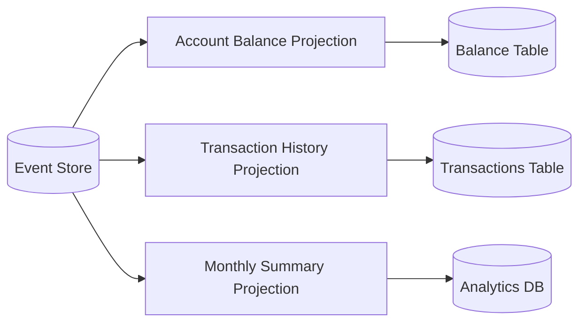
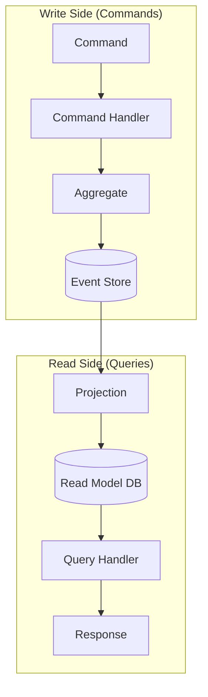

# Event Sourcing & CQRS

Event Sourcing stores all changes as a sequence of events, rather than just the current state. CQRS separates read and write models for scalability.

## 1. Event Sourcing Fundamentals

### Traditional State-Based vs Event Sourcing

| Aspect | State-Based (CRUD) | Event Sourcing |
|--------|-------------------|----------------|
| **Stores** | Current state only | All events that led to state |
| **Updates** | Overwrite in place | Append new event |
| **History** | Lost (unless audited) | Complete audit trail |
| **Debugging** | "What is the state?" | "How did we get here?" |

### Example: Bank Account

**State-Based**:

```sql
UPDATE accounts SET balance = 150 WHERE id = 123;
-- Previous balance (100) is lost
```

**Event Sourcing**:

```
Event 1: AccountOpened { id: 123, initialBalance: 100 }
Event 2: MoneyDeposited { id: 123, amount: 200 }
Event 3: MoneyWithdrawn { id: 123, amount: 150 }

Current Balance = replay(events) = 100 + 200 - 150 = 150
```

---

## 2. Event Store Design

### Event Structure

```json
{
  "eventId": "uuid-12345",
  "aggregateId": "account-123",
  "aggregateType": "BankAccount",
  "eventType": "MoneyDeposited",
  "version": 3,
  "timestamp": "2024-01-15T10:30:00Z",
  "data": {
    "amount": 200,
    "currency": "USD"
  },
  "metadata": {
    "userId": "user-456",
    "correlationId": "req-789"
  }
}
```

### Storage Requirements

1. **Append-only**: Events are immutable, never updated or deleted
2. **Ordered**: Events for an aggregate must be in sequence
3. **Version**: Optimistic concurrency control

### Implementation Options

| Option | Pros | Cons |
|--------|------|------|
| **PostgreSQL** | ACID, familiar, JSON support | Not optimized for event patterns |
| **EventStoreDB** | Purpose-built, projections | Specialized skill needed |
| **Kafka** | High throughput, replay | Not a true event store (no aggregate streams) |
| **DynamoDB** | Scalable, sorted keys | Query limitations |

### PostgreSQL Schema

```sql
CREATE TABLE events (
    event_id UUID PRIMARY KEY,
    aggregate_id UUID NOT NULL,
    aggregate_type VARCHAR(100) NOT NULL,
    event_type VARCHAR(100) NOT NULL,
    version INT NOT NULL,
    data JSONB NOT NULL,
    metadata JSONB,
    created_at TIMESTAMP DEFAULT NOW(),
    
    UNIQUE (aggregate_id, version)  -- Optimistic locking
);

CREATE INDEX idx_aggregate ON events(aggregate_id, version);
```

---

## 3. Replaying Events to Rebuild State

### Aggregate Reconstruction

```python
class BankAccount:
    def __init__(self):
        self.balance = 0
        self.version = 0
    
    def apply(self, event):
        if event.type == "AccountOpened":
            self.balance = event.data["initialBalance"]
        elif event.type == "MoneyDeposited":
            self.balance += event.data["amount"]
        elif event.type == "MoneyWithdrawn":
            self.balance -= event.data["amount"]
        self.version = event.version

def load_account(account_id):
    events = event_store.get_events(account_id)
    account = BankAccount()
    for event in events:
        account.apply(event)
    return account
```

### Snapshotting (Performance Optimization)

For aggregates with many events, replaying from scratch is slow.

```
Snapshot at version 1000: { balance: 50000, version: 1000 }

To load current state:
1. Load snapshot (version 1000)
2. Replay events 1001-1050
3. Current state ready
```

**Snapshot Strategy**: Create snapshot every N events (e.g., 100).

---

## 4. Projections and Read Models

### What is a Projection?

A **projection** transforms the event stream into a queryable read model.



### Building a Projection

```python
class AccountBalanceProjection:
    def __init__(self, db):
        self.db = db
    
    def handle(self, event):
        if event.type == "AccountOpened":
            self.db.insert("balances", {
                "account_id": event.aggregate_id,
                "balance": event.data["initialBalance"],
                "last_updated": event.timestamp
            })
        elif event.type == "MoneyDeposited":
            self.db.update("balances", 
                account_id=event.aggregate_id,
                balance=F("balance") + event.data["amount"])
        elif event.type == "MoneyWithdrawn":
            self.db.update("balances",
                account_id=event.aggregate_id,
                balance=F("balance") - event.data["amount"])
```

### Projection Patterns

| Pattern | Description | Use Case |
|---------|-------------|----------|
| **Inline** | Update projection synchronously with event | Consistency critical |
| **Async** | Background worker processes events | High throughput |
| **Catchup** | Rebuild from event 0 | Schema changes, new projections |

---

## 5. CQRS Pattern

**Command Query Responsibility Segregation** separates write and read models.



### Why CQRS?

| Benefit | Explanation |
|---------|-------------|
| **Scalability** | Scale reads and writes independently |
| **Optimization** | Read model optimized for queries (denormalized) |
| **Flexibility** | Multiple read models for different use cases |
| **Separation** | Clean domain model, no query concerns |

### CQRS Without Event Sourcing

CQRS doesn't require Event Sourcing. You can use a traditional DB for writes and replicate to a read-optimized store.

```
Write DB (PostgreSQL) → CDC → Read DB (Elasticsearch)
```

---

## 6. When to Use Event Sourcing

### ✅ Good Fit

| Scenario | Why |
|----------|-----|
| **Audit requirements** | Complete history is mandatory (finance, healthcare) |
| **Complex domain** | Business rules evolve, need to understand "why" |
| **Temporal queries** | "What was the state on Jan 1st?" |
| **Event-driven architecture** | Events are natural integration points |
| **Debugging** | Replay to reproduce bugs |

### ❌ Poor Fit

| Scenario | Why |
|----------|-----|
| **Simple CRUD** | Overhead not justified |
| **High-frequency updates** | Too many events (IoT sensor data) |
| **GDPR "right to forget"** | Immutability conflicts with deletion |
| **Inexperienced team** | Steep learning curve |

---

## 7. Challenges and Solutions

| Challenge | Solution |
|-----------|----------|
| **Event schema evolution** | Upcasting (transform old events to new schema) |
| **GDPR deletion** | Crypto-shredding (encrypt PII, delete key) |
| **Eventual consistency** | Accept it, or use synchronous projections |
| **Debugging projections** | Rebuild from scratch, check idempotency |
| **Large event streams** | Snapshots, archiving old events |

### Event Versioning Example

```json
// V1 Event
{ "type": "UserCreated", "name": "John Doe" }

// V2 Event (split name)
{ "type": "UserCreated", "firstName": "John", "lastName": "Doe" }

// Upcaster
def upcast_user_created_v1_to_v2(event):
    parts = event["name"].split()
    return {
        "type": "UserCreated",
        "firstName": parts[0],
        "lastName": parts[1] if len(parts) > 1 else ""
    }
```

---

## 8. Real-World Examples

| System | Why Event Sourcing |
|--------|-------------------|
| **Banking** | Complete audit trail for transactions |
| **E-commerce orders** | Order lifecycle (placed → paid → shipped → delivered) |
| **Collaborative editing** | Google Docs: operations as events, merge conflicts |
| **Version control** | Git: commits are events |
| **Gaming** | Replay matches, detect cheating |

---

## 9. Event Sourcing vs Change Data Capture (CDC)

| Aspect | Event Sourcing | CDC |
|--------|---------------|-----|
| **Source of truth** | Events | Database state |
| **Who creates events** | Application | Database log reader |
| **Event semantics** | Domain events | Database changes |
| **Use case** | Domain-driven design | Data sync, analytics |

CDC (e.g., Debezium) captures database changes as events but lacks domain meaning.

---

## 10. Interview Talking Points

1. **Core benefit**: Complete audit trail + ability to rebuild any past state
2. **Projections**: Explain how read models are built from events
3. **Trade-off**: Eventual consistency vs complexity vs audit needs
4. **CQRS relationship**: Often paired but independent patterns
5. **Real-world**: Banking, order management, collaborative editing
6. **Challenges**: Schema evolution (upcasting), GDPR (crypto-shredding)
7. **When NOT to use**: Simple CRUD, high-frequency sensor data
