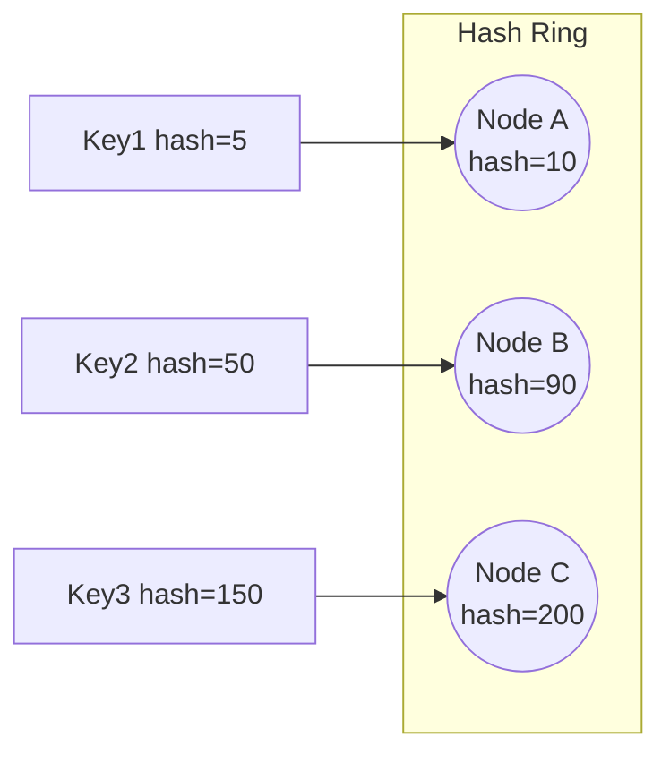
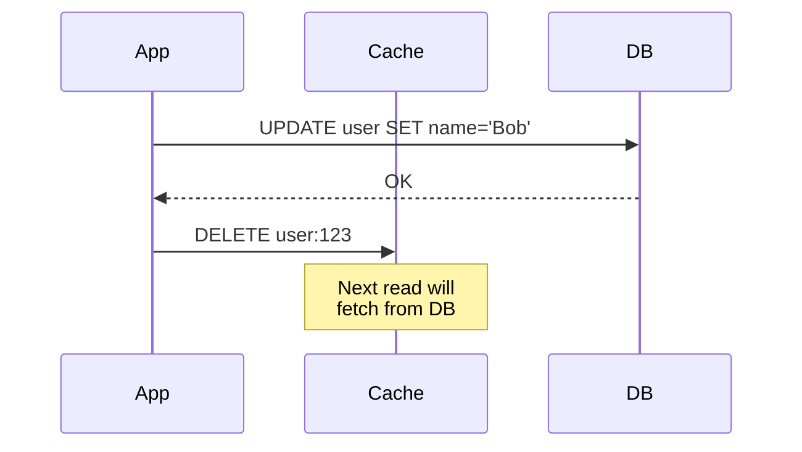

# Distributed Caching

Distributed caching stores frequently accessed data across multiple cache nodes to reduce database load and latency.

## 1. Cache Topology Patterns

### Single Node Cache

```
App Server 1 ─┐
App Server 2 ─┼──► Redis (Single)
App Server 3 ─┘
```

- **Pros**: Simple, low latency
- **Cons**: Single point of failure, limited capacity

### Replicated Cache

```
App ──► Redis Primary ──► Redis Replica 1
                     ──► Redis Replica 2
```

- **Pros**: High availability (failover to replica)
- **Cons**: Write amplification, eventual consistency on reads from replica

### Sharded (Partitioned) Cache

```
App ──► [Hash Function] ──► Shard 0: keys A-M
                       ──► Shard 1: keys N-Z
```

- **Pros**: Horizontal scalability, higher capacity
- **Cons**: Complexity, hot key issues

### Redis Cluster (Sharded + Replicated)

```
┌─────────────────────────────────────────┐
│          Redis Cluster (16384 slots)     │
├─────────────┬─────────────┬─────────────┤
│ Shard 0     │ Shard 1     │ Shard 2     │
│ slots 0-5460│ 5461-10922  │ 10923-16383 │
│ Primary + 1 │ Primary + 1 │ Primary + 1 │
│ Replica     │ Replica     │ Replica     │
└─────────────┴─────────────┴─────────────┘
```

---

## 2. Consistent Hashing for Cache Nodes

### Problem with Modulo Hashing

```
node = hash(key) % N
```

When N changes (add/remove node), **almost all keys** remap → massive cache miss storm.

### Consistent Hashing Solution

Nodes and keys are placed on a **hash ring**. Each key belongs to the first node clockwise.



**Adding a node**: Only keys between new node and its predecessor move.

### Virtual Nodes

Problem: With few physical nodes, load can be uneven.

Solution: Each physical node has multiple "virtual nodes" on the ring.

```
Physical Node A → Virtual: A1(hash=10), A2(hash=120), A3(hash=250)
Physical Node B → Virtual: B1(hash=50), B2(hash=180), B3(hash=300)
```

More virtual nodes = better load distribution.

---

## 3. Cache Stampede (Thundering Herd)

### The Problem

```
1. Popular key expires
2. 1000 concurrent requests find cache MISS
3. All 1000 hit the database simultaneously
4. Database overwhelmed → cascading failure
```

### Solutions

#### A. Locking (Mutex)

Only one request fetches from DB; others wait.

```python
def get_with_lock(key):
    value = cache.get(key)
    if value:
        return value
    
    if cache.acquire_lock(f"lock:{key}", timeout=5):
        try:
            value = db.query(key)
            cache.set(key, value, ttl=300)
        finally:
            cache.release_lock(f"lock:{key}")
    else:
        # Wait and retry
        time.sleep(0.1)
        return get_with_lock(key)
    
    return value
```

#### B. Probabilistic Early Expiration

Refresh the cache **before** it expires, randomly.

```python
def get_with_early_refresh(key):
    value, ttl = cache.get_with_ttl(key)
    
    # Random early refresh (e.g., when < 10% TTL left)
    if ttl < original_ttl * 0.1 * random.random():
        # Refresh in background
        async_refresh(key)
    
    return value
```

#### C. Request Coalescing (Singleflight)

Multiple requests for the same key share one DB call.

```go
// Go singleflight pattern
group := &singleflight.Group{}
result, _, _ := group.Do(key, func() (interface{}, error) {
    return db.Query(key)
})
```

#### D. Background Refresh (Never Expire)

Cache never expires. Background job refreshes periodically.

```
Cache: key → value (no TTL)
Cron: Every 5 min, refresh all keys
```

---

## 4. Hot Key Problem

### What is a Hot Key?

One key receives disproportionate traffic (e.g., celebrity tweet, viral product).

```
Key "taylor_swift_profile" → 100,000 QPS
Key "regular_user_123" → 10 QPS
```

Single cache node handling hot key becomes bottleneck.

### Solutions

#### A. Local Cache (L1 + L2)

```
Request → L1 (Local, in-process) → L2 (Redis) → DB
```

Even with short TTL (seconds), local cache absorbs burst.

#### B. Key Replication

Replicate hot key across multiple shards with suffix.

```
GET hot_key:0  (shard 0)
GET hot_key:1  (shard 1)
GET hot_key:2  (shard 2)

Client randomly picks suffix → load distributed
```

#### C. Read Replicas for Hot Keys

Route hot key reads to dedicated read replicas.

```
if is_hot_key(key):
    return read_replica.get(key)
else:
    return primary.get(key)
```

#### D. Real-time Hot Key Detection

Track key access frequency. Promote hot keys to local cache.

```python
# Redis + HyperLogLog or Count-Min Sketch
access_count = hot_key_detector.increment(key)
if access_count > HOT_THRESHOLD:
    promote_to_local_cache(key)
```

---

## 5. Cache Coherence Strategies

| Strategy | How It Works | Consistency |
|----------|--------------|-------------|
| **TTL-based** | Cache expires after X seconds | Eventual (stale window) |
| **Write-through** | Write to cache and DB together | Strong |
| **Write-invalidate** | Delete cache on DB write | Strong (next read fetches fresh) |
| **Pub/Sub invalidation** | Publish invalidation events | Near real-time |

### Write-Invalidate Pattern



---

## 6. Redis Cluster vs Memcached

| Feature | Redis Cluster | Memcached |
|---------|---------------|-----------|
| **Data Structures** | Strings, Lists, Sets, Hashes, Sorted Sets | Strings only |
| **Persistence** | RDB/AOF (optional) | None |
| **Replication** | Built-in primary-replica | External (mcrouter) |
| **Sharding** | Built-in (hash slots) | Client-side consistent hashing |
| **Memory Efficiency** | Lower (overhead for structures) | Higher |
| **Multi-threaded** | Single-threaded (mostly) | Multi-threaded |
| **Use Case** | Rich data types, persistence needed | Simple K/V, maximum throughput |

---

## 7. Local vs Distributed Cache

| Aspect | Local (In-Process) | Distributed (Redis/Memcached) |
|--------|-------------------|-------------------------------|
| **Latency** | ~1μs | ~1ms (network hop) |
| **Capacity** | Limited by heap | Scales horizontally |
| **Consistency** | Inconsistent across nodes | Single source of truth |
| **Use Case** | Hot keys, config, static data | Shared state, sessions |

### Hybrid Pattern (L1 + L2)

```
Request → Local Cache (L1, TTL=10s)
        → Distributed Cache (L2, TTL=5min)
        → Database
```

---

## 8. Cache Sizing and Eviction

### Memory Estimation

```
Items = 1 million users
Avg size = 1 KB per user
Total = 1 GB

With 20% overhead = 1.2 GB
```

### Eviction Policies

| Policy | Description | Best For |
|--------|-------------|----------|
| **LRU** | Least Recently Used | General purpose |
| **LFU** | Least Frequently Used | Stable access patterns |
| **Random** | Random eviction | When access pattern unknown |
| **TTL** | Time-based expiration | Session data |

Redis LRU is **approximate** (samples 5 keys, evicts least recent).

---

## 9. Interview Talking Points

1. **Cache stampede** – Always mention locking or singleflight pattern
2. **Consistent hashing** – Explain virtual nodes for load balancing
3. **Hot keys** – L1 local cache + key replication
4. **Trade-off**: Local cache = fast but inconsistent; Distributed = consistent but slower
5. **Eviction**: LRU is default choice, explain why
6. **Write patterns**: Write-through vs write-invalidate based on consistency needs
