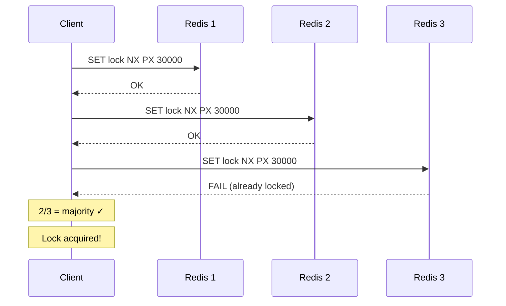
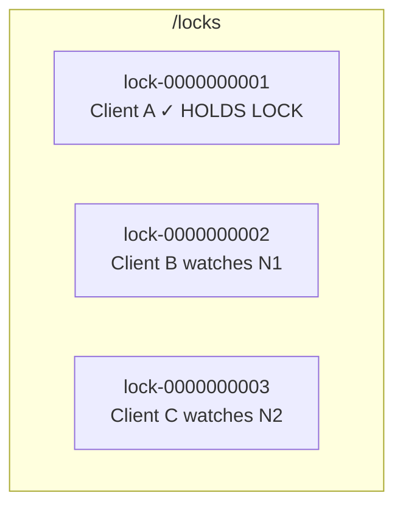
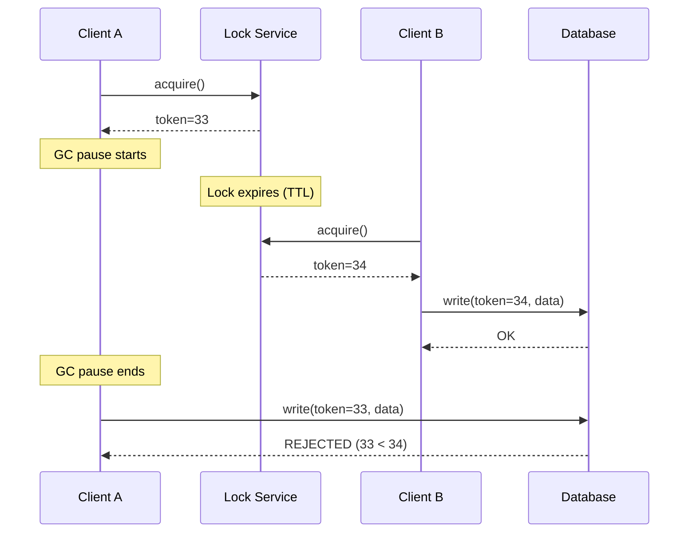

# Distributed Locking

Distributed locks ensure **mutual exclusion** across multiple nodes. Only one process can hold the lock at a time, even in a distributed system.

## 1. Why Distributed Locks?

| Scenario | Problem Without Lock |
|----------|---------------------|
| Scheduled jobs | Multiple instances run same job simultaneously |
| Inventory update | Two users buy last item → oversold |
| Leader election | Multiple leaders cause split-brain |
| Rate limiting | Counters become inconsistent |

---

## 2. Redis-Based Locking

### Simple Lock (Single Redis)

```python
# Acquire lock
SET resource_name my_random_value NX PX 30000
# NX = only if not exists
# PX = expire in 30000ms (prevent deadlock if holder crashes)

# Release lock (Lua script for atomicity)
if redis.call("get", KEYS[1]) == ARGV[1] then
    return redis.call("del", KEYS[1])
else
    return 0
end
```

**Why random value?** Prevents accidentally releasing someone else's lock.

### Redlock Algorithm (Multiple Redis Instances)

For higher availability, use **Redlock** with N independent Redis masters (typically N=5).

```
1. Get current time T1
2. Try to acquire lock on ALL N instances (same key, same random value)
   - Use short timeout per instance (5-10ms)
3. Calculate elapsed time: T2 - T1
4. Lock acquired if:
   - Majority (N/2 + 1) instances locked
   - Total time < lock TTL
5. Effective TTL = original TTL - elapsed time
6. If failed, unlock ALL instances
```



### Redlock Controversy

Martin Kleppmann's critique:

| Issue | Description |
|-------|-------------|
| **Clock drift** | If Redis clock drifts, TTL becomes unreliable |
| **GC pauses** | Client pauses after acquiring lock → lock expires → another client gets it |
| **Network delays** | Similar to GC pauses |

**Mitigation**: Use **fencing tokens** (see Section 5).

---

## 3. ZooKeeper Locking

ZooKeeper provides stronger guarantees via **ephemeral sequential nodes**.

### Lock Recipe

```
1. Create ephemeral sequential node: /locks/resource-lock-0000000001
2. Get all children of /locks/
3. If your node has lowest sequence number → you have the lock
4. Else, watch the node just before yours (avoids herd effect)
5. When notified, repeat from step 2
```



### Why Ephemeral?

If client crashes, ZooKeeper automatically deletes the node → lock released.

### Curator Framework (Java)

```java
InterProcessMutex lock = new InterProcessMutex(client, "/locks/my-resource");
if (lock.acquire(10, TimeUnit.SECONDS)) {
    try {
        // Critical section
    } finally {
        lock.release();
    }
}
```

---

## 4. etcd Locking

etcd uses **leases** for distributed locking.

```bash
# Create a lease (TTL = 10s)
etcdctl lease grant 10
# Returns: lease 694d7550a]

# Put key with lease
etcdctl put /locks/my-resource "owner-1" --lease=694d7550a

# Keep lease alive (heartbeat)
etcdctl lease keep-alive 694d7550a
```

If client crashes and stops heartbeating, lease expires → key deleted → lock released.

---

## 5. Fencing Tokens (Critical for Correctness)

**Problem**: Client A gets lock → long GC pause → lock expires → Client B gets lock → Client A resumes and writes (thinking it still has lock) → **DATA CORRUPTION**.

**Solution**: Every lock acquisition returns a monotonically increasing **fencing token**.



**Implementation**: Storage layer tracks highest token seen. Rejects writes with lower tokens.

---

## 6. Comparison Table

| Feature | Redis (Redlock) | ZooKeeper | etcd |
|---------|-----------------|-----------|------|
| **Consistency** | Best-effort | Strong (ZAB) | Strong (Raft) |
| **Performance** | Fastest | Medium | Medium |
| **Complexity** | Simple | Complex | Medium |
| **Failure mode** | May grant to multiple | Safe | Safe |
| **Use case** | Efficiency (prevent duplicate work) | Correctness (mutual exclusion) | Kubernetes-native |

---

## 7. Common Pitfalls

| Pitfall | Description | Solution |
|---------|-------------|----------|
| **Deadlock** | Client crashes holding lock | Use TTL/lease with expiration |
| **Clock skew** | Nodes have different times | Use ZK/etcd (no clock dependency) |
| **Long GC pause** | Lock expires during pause | Fencing tokens |
| **Split-brain** | Network partition | Majority quorum (Redlock, Raft) |
| **Herd effect** | All waiters wake on release | Watch only predecessor (ZK) |
| **Stale lock release** | Release lock you don't own | Use unique owner ID / random value |

---

## 8. When to Use What

| Scenario | Recommendation |
|----------|----------------|
| **Efficiency** (avoid duplicate work) | Redis single-node lock |
| **Correctness** (financial, inventory) | ZooKeeper or etcd + fencing tokens |
| **Kubernetes environment** | etcd (already deployed) |
| **High availability lock** | Redlock (but consider trade-offs) |

---

## 9. Interview Talking Points

1. **Always mention TTL** – prevents deadlocks from crashed clients
2. **Fencing tokens** – shows you understand the deep correctness issues
3. **Trade-off**: Redis is faster but less safe; ZK/etcd are safer but slower
4. **Real-world**: Most systems use Redis for efficiency, accept rare edge cases
5. **CAP implications**: Locks need CP system (not AP) for correctness
