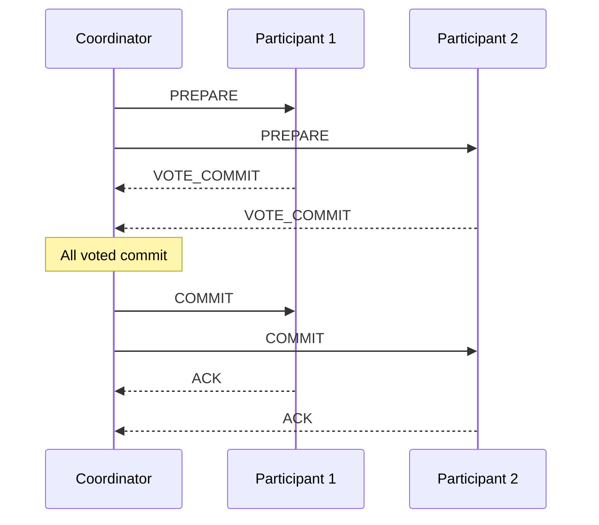
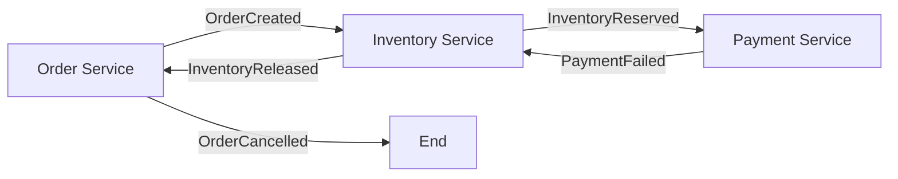
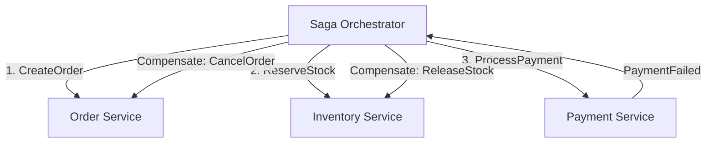

# Distributed Transactions

In a microservices or distributed database world, a single business operation often spans multiple services or data stores. Ensuring atomicity across these boundaries is the challenge of **distributed transactions**.

## 1. The Problem

**Example**: E-commerce checkout involves:

1. **Order Service**: Create order
2. **Inventory Service**: Reserve stock
3. **Payment Service**: Charge customer
4. **Notification Service**: Send confirmation

If payment fails after inventory is reserved, we need to **rollback** the reservation. Traditional single-database ACID doesn't work across services.

---

## 2. Two-Phase Commit (2PC)

The classic solution for distributed ACID transactions.

### Roles

- **Coordinator (Transaction Manager)**: Orchestrates the transaction.
- **Participants (Resource Managers)**: Individual databases/services.

### Phase 1: Prepare (Voting)

```
Coordinator → All Participants: "PREPARE to commit Transaction T"
Each Participant:
  - Acquire locks
  - Write to WAL (Write-Ahead Log)
  - Reply: VOTE_COMMIT or VOTE_ABORT
```

### Phase 2: Commit/Abort

```
If ALL voted COMMIT:
  Coordinator → All: "COMMIT Transaction T"
  Participants: Make changes permanent, release locks

If ANY voted ABORT:
  Coordinator → All: "ABORT Transaction T"
  Participants: Rollback changes, release locks
```

### Sequence Diagram



### Problems with 2PC

| Problem | Description |
|---------|-------------|
| **Blocking** | Participants hold locks while waiting for coordinator decision |
| **Coordinator SPOF** | If coordinator crashes after PREPARE, participants are stuck |
| **Latency** | 2 round trips minimum (4 messages per participant) |
| **No Partition Tolerance** | Network partition can leave system in uncertain state |

### When to Use 2PC

- Homogeneous databases (same vendor)
- Low-latency networks (same datacenter)
- When strong consistency is non-negotiable
- Examples: **Google Spanner** (uses Paxos + 2PC hybrid)

---

## 3. Three-Phase Commit (3PC)

Attempts to solve 2PC's blocking problem by adding a **pre-commit phase**.

### Phases

1. **CanCommit**: Coordinator asks if participants can commit (no locks yet)
2. **PreCommit**: If all agree, participants acquire locks and prepare
3. **DoCommit**: Final commit

### Improvement Over 2PC

- If coordinator fails during PreCommit, participants can timeout and abort
- Reduces blocking window

### Why It's Rarely Used

- Still vulnerable to network partitions
- More messages = higher latency
- Complexity doesn't justify marginal benefits
- Most systems prefer **Saga pattern** instead

---

## 4. Saga Pattern (Preferred for Microservices)

A Saga is a sequence of local transactions where each step has a **compensating action** to undo it if a later step fails.

### Key Insight

> Instead of locking resources across services, we accept **eventual consistency** and define how to rollback each step.

### Example: E-commerce Order Saga

| Step | Action | Compensating Action |
|------|--------|---------------------|
| 1 | Create Order (PENDING) | Cancel Order |
| 2 | Reserve Inventory | Release Inventory |
| 3 | Process Payment | Refund Payment |
| 4 | Confirm Order (COMPLETED) | - |

If Step 3 (Payment) fails:

1. Execute Compensating Action 2: Release Inventory
2. Execute Compensating Action 1: Cancel Order

### Choreography vs Orchestration

#### Choreography (Event-Driven)

Each service listens for events and reacts. No central coordinator.



**Pros**: Loose coupling, no SPOF
**Cons**: Hard to track flow, debugging is difficult, cyclic dependencies

#### Orchestration (Central Coordinator)

A **Saga Orchestrator** tells each service what to do and handles failures.



**Pros**: Easier to understand, centralized error handling
**Cons**: Orchestrator can become complex, potential SPOF

### Saga Implementation Tips

1. **Idempotent operations**: Compensations may be retried
2. **Timeout handling**: What if a service doesn't respond?
3. **Saga state machine**: Track current step and history
4. **Dead letter queue**: For failed compensations

---

## 5. TCC Pattern (Try-Confirm-Cancel)

A reservation-based pattern similar to 2PC but at the application level.

### Three Phases

| Phase | Description |
|-------|-------------|
| **Try** | Reserve resources (soft lock, not committed) |
| **Confirm** | Commit all reservations (make permanent) |
| **Cancel** | Release all reservations (rollback) |

### Example: Flight + Hotel Booking

```
TRY Phase:
  - Flight Service: Reserve seat (status=RESERVED)
  - Hotel Service: Reserve room (status=RESERVED)

If both Try succeed → CONFIRM Phase:
  - Flight: Confirm reservation (status=BOOKED)
  - Hotel: Confirm reservation (status=BOOKED)

If any Try fails → CANCEL Phase:
  - Release all reservations
```

### TCC vs Saga

| Aspect | TCC | Saga |
|--------|-----|------|
| **Isolation** | Better (resources reserved during Try) | Weaker (changes visible immediately) |
| **Complexity** | Each service needs Try/Confirm/Cancel APIs | Only needs action + compensation |
| **Use Case** | Reservations, bookings | General microservices |

---

## 6. Comparison Table

| Pattern | Consistency | Latency | Complexity | Best For |
|---------|-------------|---------|------------|----------|
| **2PC** | Strong (ACID) | High (blocking) | Medium | Same-DC databases |
| **3PC** | Strong | Higher | High | Rarely used |
| **Saga** | Eventual | Low | Medium-High | Microservices |
| **TCC** | Eventual (with reserves) | Medium | High | Reservations/Booking |

---

## 7. Real-World Examples

| System | Pattern | Notes |
|--------|---------|-------|
| **Google Spanner** | Paxos + 2PC | TrueTime for global ordering |
| **AWS Step Functions** | Saga Orchestration | Built-in error handling |
| **Uber Cadence/Temporal** | Saga Orchestration | Durable execution, retries |
| **Banking (SWIFT)** | Saga | ISO 20022 messages as events |
| **Booking.com** | TCC | Hotel/flight reservations |

---

## 8. Interview Talking Points

### When Asked "How to ensure consistency across services?"

1. **Start with requirements**: Do we need strong consistency or is eventual OK?
2. **If strong**: Consider 2PC (but mention blocking issues)
3. **If eventual**: Saga with compensating transactions
4. **Mention trade-offs**: Latency vs consistency vs complexity

### Key Phrases for L5

- "We'd use a Saga pattern with orchestration for better observability"
- "Each step must be idempotent to handle retries safely"
- "Compensating transactions ensure we can rollback partial failures"
- "For strong consistency across regions, Google Spanner uses Paxos for consensus combined with 2PC for cross-shard transactions"

### Common Follow-up Questions

1. **What if compensation fails?** → Retry with exponential backoff, dead letter queue, manual intervention
2. **How do you track saga state?** → Dedicated saga table or workflow engine (Temporal)
3. **What about concurrent sagas?** → Optimistic locking, version numbers, conflict detection
