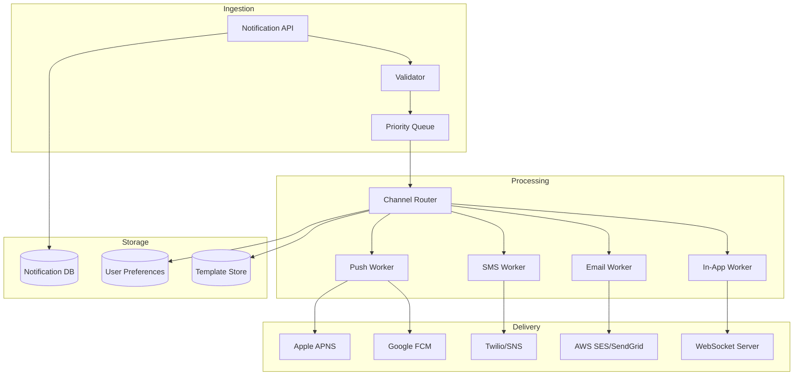
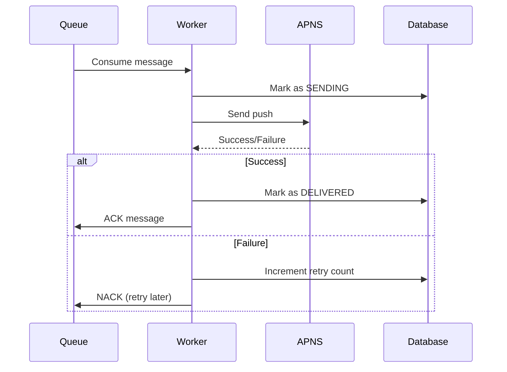
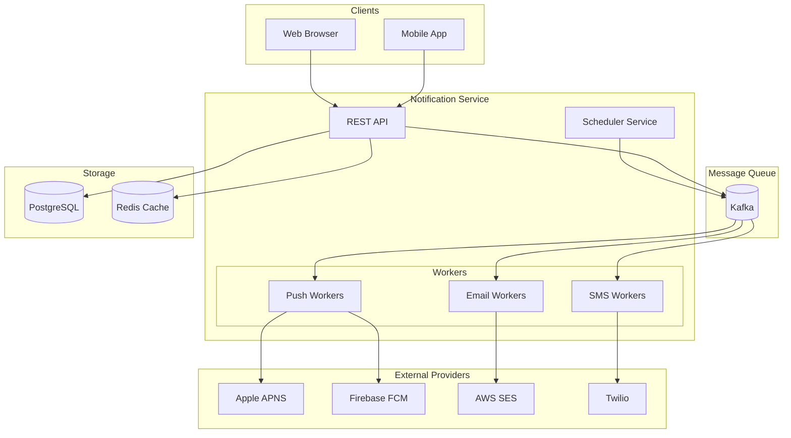
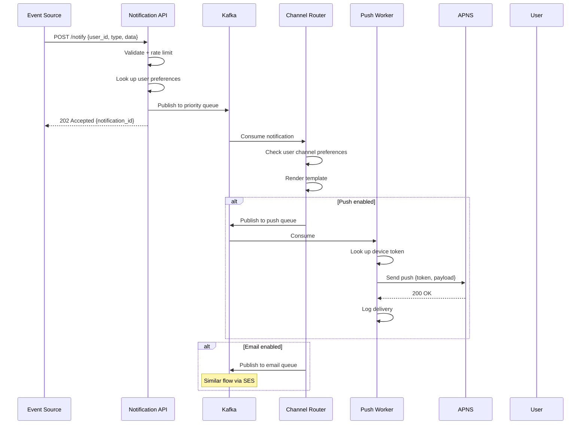
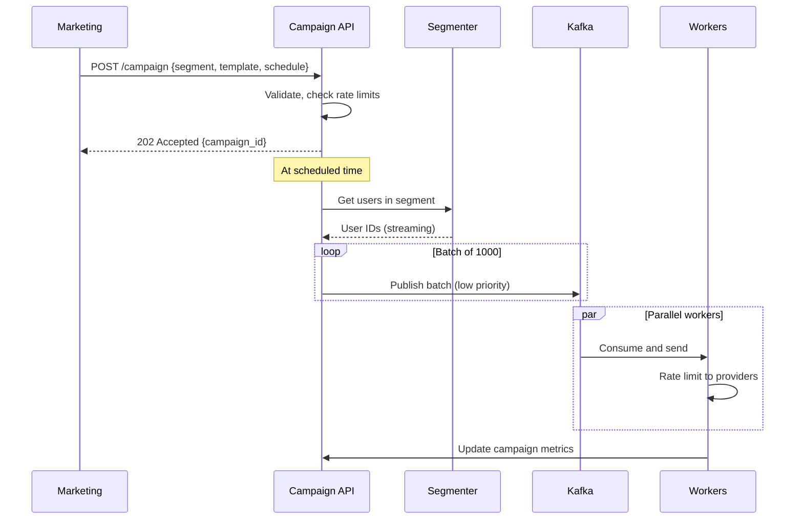

# Design a Notification System

> **Model Interview Answer** - This document demonstrates L4/L5 level depth with complete BOTE, SLOs, failure modes, and runbooks.

A notification system delivers messages to users across multiple channels (push, SMS, email, in-app). Think Facebook notifications, Uber ride updates, or banking alerts.

## 1. Requirements

### Functional

1. **Multi-channel delivery**: Push (iOS/Android), SMS, Email, In-app
2. **User preferences**: Let users control what notifications they receive
3. **Template support**: Reusable message templates with variables
4. **Scheduling**: Send now or schedule for later
5. **Analytics**: Track delivery, open rates, click-through

### Non-Functional

1. **High throughput**: Millions of notifications per day
2. **Reliability**: At-least-once delivery guarantee
3. **Low latency**: Real-time notifications in < 1 second
4. **Scalability**: Handle traffic spikes (e.g., flash sales)

## 2. Capacity Estimation

| Metric | Value |
|--------|-------|
| DAU | 100 Million |
| Notifications/user/day | 5 |
| Total daily notifications | 500 Million |
| Peak QPS | 500M / 86400 × 5 (peak) ≈ 30,000 QPS |
| Average payload size | 1 KB |
| Daily bandwidth | 500M × 1KB = 500 GB |

---

## 3. High-Level Architecture



---

## 4. Core Components

### 4.1 Notification API

Entry point for all notification requests.

```json
POST /v1/notifications
{
  "user_ids": ["user123", "user456"],
  "template_id": "order_shipped",
  "channels": ["push", "email"],
  "priority": "high",
  "data": {
    "order_id": "ORD-789",
    "tracking_url": "https://..."
  },
  "scheduled_at": null  // null = send immediately
}
```

### 4.2 Validation & Rate Limiting

Before queuing:

- Validate user exists
- Check user preferences (opted-in?)
- Apply rate limiting (max X notifications per user per hour)
- Deduplicate (same notification within Y minutes?)

### 4.3 Priority Queue

Use **multiple queues** by priority:

| Priority | Queue | Use Case |
|----------|-------|----------|
| Critical | `notifications-critical` | Security alerts, OTPs |
| High | `notifications-high` | Transactional (orders, payments) |
| Medium | `notifications-medium` | Social (likes, comments) |
| Low | `notifications-low` | Marketing, promotions |

**Technology**: Apache Kafka (partitioned by user_id for ordering) or AWS SQS.

### 4.4 Channel Router

Decides which channels to use based on:

1. User's delivery preferences
2. Channel availability (fallback if push fails → send SMS)
3. Device registration (has push token?)

```python
def route_notification(user, notification):
    channels = []
    prefs = get_user_preferences(user.id)
    
    if "push" in notification.channels and prefs.push_enabled:
        if user.push_tokens:
            channels.append("push")
        elif prefs.sms_fallback:
            channels.append("sms")
    
    if "email" in notification.channels and prefs.email_enabled:
        channels.append("email")
    
    return channels
```

### 4.5 Channel Workers

Dedicated workers per channel for isolation:

#### Push Notifications

| Platform | Service | Protocol |
|----------|---------|----------|
| iOS | Apple Push Notification Service (APNS) | HTTP/2, TLS |
| Android | Firebase Cloud Messaging (FCM) | HTTP, REST |

**Challenges**:

- Token refresh (devices get new tokens)
- Token invalidation (app uninstalled)
- Batch sending (FCM supports up to 500 tokens per request)

#### Email

- Use providers: AWS SES, SendGrid, Mailgun
- Handle bounces and complaints (feedback loops)
- Warm up IPs to avoid spam filters

#### SMS

- Providers: Twilio, AWS SNS
- Handle carrier throttling
- Opt-out management (STOP keywords)

---

## 5. Reliability & Delivery Guarantees

### At-Least-Once Delivery

1. Persist notification before sending
2. Acknowledge queue message only after provider confirms delivery
3. Retry on failure with exponential backoff



### Deduplication

Prevent sending duplicate notifications:

```sql
-- Before sending, check
SELECT 1 FROM notifications 
WHERE user_id = ? AND template_id = ? AND created_at > NOW() - INTERVAL 5 minutes
```

Or use idempotency key in the API request.

### Fallback Channels

```
Primary: Push
  ↓ fails
Fallback 1: SMS
  ↓ fails
Fallback 2: Email
```

---

## 6. User Preferences

### Schema

```sql
CREATE TABLE notification_preferences (
    user_id BIGINT PRIMARY KEY,
    push_enabled BOOLEAN DEFAULT true,
    email_enabled BOOLEAN DEFAULT true,
    sms_enabled BOOLEAN DEFAULT false,
    quiet_hours_start TIME,  -- e.g., 22:00
    quiet_hours_end TIME,    -- e.g., 08:00
    category_settings JSONB  -- {"marketing": false, "transactional": true}
);
```

### Granular Controls

Allow per-category preferences:

| Category | Push | Email | SMS |
|----------|------|-------|-----|
| Order Updates | ✅ | ✅ | ✅ |
| Marketing | ❌ | ❌ | ❌ |
| Social | ✅ | ❌ | ❌ |
| Security | ✅ | ✅ | ✅ |

---

## 7. Template Engine

### Template Storage

```json
{
  "template_id": "order_shipped",
  "channels": {
    "push": {
      "title": "Your order is on the way!",
      "body": "Order {{order_id}} shipped. Track: {{tracking_url}}"
    },
    "email": {
      "subject": "Shipment Confirmation - Order {{order_id}}",
      "html_template": "templates/order_shipped.html"
    }
  },
  "category": "transactional"
}
```

### Variable Substitution

```python
def render_template(template, data):
    # Simple: use regex or Jinja2
    for key, value in data.items():
        template = template.replace(f"{{{{{key}}}}}", str(value))
    return template
```

---

## 8. Analytics & Tracking

### Metrics to Track

| Metric | How |
|--------|-----|
| **Sent** | Count when worker sends |
| **Delivered** | APNS/FCM delivery receipt |
| **Opened** | Tracking pixel in email, push open callback |
| **Clicked** | UTM parameters, link shortener |
| **Unsubscribed** | Track opt-outs |

### Funnel

```
Sent (1M) → Delivered (950K) → Opened (200K) → Clicked (50K)
Delivery Rate: 95%
Open Rate: 21%
CTR: 25% of opens
```

---

## 9. Scaling Considerations

### Horizontal Scaling

- **API Servers**: Stateless, behind load balancer
- **Workers**: Scale independently per channel
- **Queue**: Kafka partitions = parallelism
- **Database**: Shard by user_id

### Handling Traffic Spikes

1. **Buffer in queue**: Kafka can absorb bursts
2. **Backpressure**: Workers control consumption rate
3. **Priority queues**: Critical notifications skip the line
4. **Provider rate limits**: Respect APNS/FCM limits (batch wisely)

### Multi-Region

- Deploy close to users (latency)
- Replicate user preferences globally
- Use regional providers where possible

---

## 10. Data Model

### Notifications Table

```sql
CREATE TABLE notifications (
    id UUID PRIMARY KEY,
    user_id BIGINT NOT NULL,
    template_id VARCHAR(100),
    channel VARCHAR(20),  -- push, email, sms, in_app
    status VARCHAR(20),   -- pending, sending, delivered, failed
    priority INT,
    payload JSONB,
    created_at TIMESTAMP,
    sent_at TIMESTAMP,
    delivered_at TIMESTAMP,
    retry_count INT DEFAULT 0,
    error_message TEXT
);

-- Indexes
CREATE INDEX idx_user_status ON notifications(user_id, status);
CREATE INDEX idx_created_at ON notifications(created_at);
```

### Device Tokens Table

```sql
CREATE TABLE device_tokens (
    id BIGSERIAL PRIMARY KEY,
    user_id BIGINT NOT NULL,
    platform VARCHAR(10),  -- ios, android, web
    token TEXT NOT NULL,
    is_valid BOOLEAN DEFAULT true,
    created_at TIMESTAMP,
    updated_at TIMESTAMP,
    UNIQUE(user_id, token)
);
```

---

## 11. Architecture Diagram



---

## 12. Failure Modes & Runbooks

### Failure Scenarios

| Failure | Impact | Detection | Mitigation |
|---------|--------|-----------|------------|
| APNS/FCM outage | Push notifications fail | Provider health check, delivery rate | Queue and retry, fallback to SMS |
| Kafka broker down | Processing stops | Consumer lag, broker health | Failover to replica, partition reassignment |
| Worker OOM | Channel delivery stops | Memory alert, pod restarts | Restart, reduce batch size |
| Provider rate limit | Delivery delayed | 429 responses, queue growth | Backoff, batch efficiently |
| Template rendering error | Notifications fail | Error rate, template ID | Fix template, skip malformed |

### Runbook: Push Delivery Rate Drop

```markdown
## Alert: Push Delivery Rate < 90% (P1)

### Symptoms
- Users not receiving push notifications
- Increased 400/500 from APNS/FCM

### Diagnosis Steps

1. Check provider status:
   - APNS: https://developer.apple.com/system-status/
   - FCM: https://status.firebase.google.com/

2. Check token validity:
   - High invalid token rate?
   - Recent app release that changed registration?

3. Check worker health:
   - Workers running?
   - Connection pool exhaustion?

4. Check payload:
   - Valid JSON?
   - Within size limits (APNS: 4KB, FCM: 4KB)?

### Mitigation

1. **If provider issue**:
   - Enable fallback channels (SMS for critical)
   - Queue for retry when recovered

2. **If token issue**:
   - Clean invalid tokens from database
   - Force app to re-register on next open

3. **If worker issue**:
   - Restart workers
   - Scale horizontally

### Recovery
- Delivery rate should recover within 10-15 min
- Replay failed messages from dead letter queue
```

### Runbook: Notification Queue Backlog

```markdown
## Alert: Kafka Consumer Lag > 1M (P2)

### Symptoms
- Notifications delayed by minutes
- Users complaining about late alerts

### Diagnosis

1. Check consumer health:
   - All consumers connected?
   - Rebalancing issues?

2. Check for traffic spike:
   - Marketing campaign?
   - System event (order confirmations)?

3. Check processing rate:
   - Slow external providers?
   - Worker CPU/memory issues?

### Mitigation

1. **Scale workers**:
   - Add more consumer instances
   - Increase partitions if bottleneck

2. **Prioritize critical**:
   - Process critical queue first
   - Skip/delay low priority

3. **Batch to providers**:
   - FCM supports 500 tokens per request
   - Batch email sends

### Prevention
- Pre-scale before known campaigns
- Auto-scaling based on queue depth
```

### Degraded Mode

```markdown
## Graceful Degradation

### Level 1: High Load
- Delay marketing/low priority notifications
- Increase batching to providers
- Skip open/click tracking

### Level 2: Provider Issues
- Enable SMS fallback for critical
- Queue non-critical for later
- Reduce retry frequency

### Level 3: Severe Degradation
- Only send security/transactional
- Disable marketing completely
- Manual approval for batch sends

### Level 4: Complete Outage
- Queue all notifications for replay
- Notify users via in-app banner if possible
- Status page update
```

---

## 13. Trade-offs Summary

| Decision | Choice | Trade-off |
|----------|--------|-----------|
| **Delivery Guarantee** | At-least-once | May duplicate, need dedup |
| **Queue Technology** | Kafka | Complex but scalable, ordered |
| **Per-channel Workers** | Isolated | More resources, but fault isolated |
| **Priority Queues** | 4 levels | Critical never delayed, complexity |
| **Template Engine** | Server-side | Centralized control, less flexible |

---

## 14. Security & Threat Model

### Attack Vectors

| Threat | Attack | Mitigation |
|--------|--------|------------|
| **Spam** | Send excessive notifications | Rate limiting per user, frequency caps |
| **Phishing** | Inject malicious links | URL scanning, domain whitelist |
| **Token Theft** | Steal push tokens | Encrypt at rest, rotate on logout |
| **Data Leak** | PII in notifications | Encrypt sensitive fields, minimal data |
| **Notification Bomb** | Trigger 1M notifications | Rate limit per source, approval for bulk |
| **Template Injection** | XSS in notification content | Template escaping, content validation |

### Security Controls

```yaml
Authentication:
  - API key + signature for internal callers
  - OAuth2 for third-party integrations
  - Mutual TLS with APNS

Data Protection:
  - Encrypt push tokens at rest (AES-256)
  - PII fields encrypted in transit and at rest
  - Retention: 30 days for logs, 7 days for content

Rate Limiting:
  - Per user: 50 notifications/hour max
  - Per source: 1000/minute for internal, 100/minute for external
  - Global: 50K QPS (circuit breaker at 60K)
```

---

## 15. Sequence Diagrams

### Notification Send Flow



### Bulk Send (Campaign)



---

## 16. Data Schema

### PostgreSQL (User Preferences)

```sql
CREATE TABLE notification_preferences (
    user_id BIGINT PRIMARY KEY,
    push_enabled BOOLEAN DEFAULT true,
    email_enabled BOOLEAN DEFAULT true,
    sms_enabled BOOLEAN DEFAULT false,
    quiet_hours_start TIME,
    quiet_hours_end TIME,
    frequency_cap INT DEFAULT 50,  -- per hour
    updated_at TIMESTAMP
);

CREATE TABLE device_tokens (
    token_id UUID PRIMARY KEY,
    user_id BIGINT,
    platform ENUM('ios', 'android', 'web'),
    token TEXT ENCRYPTED,  -- Encrypted at rest
    app_version TEXT,
    last_seen TIMESTAMP,
    active BOOLEAN DEFAULT true
);
CREATE INDEX idx_user_tokens ON device_tokens(user_id);
```

### Kafka Topics

```yaml
Topics:
  notifications.critical:
    partitions: 100
    retention: 7 days
  notifications.high:
    partitions: 100
    retention: 3 days
  notifications.medium:
    partitions: 50
    retention: 1 day
  notifications.low:
    partitions: 50
    retention: 1 day
  
  channels.push:
    partitions: 200
  channels.email:
    partitions: 100
  channels.sms:
    partitions: 50
```

### Redis (Deduplication + Rate Limiting)

```
# Deduplication (idempotency)
dedup:{notification_id}: "1"
TTL: 1 hour

# Rate limiting (sliding window)
ratelimit:{user_id}:{hour}: sorted set of timestamps
TTL: 2 hours

# In-flight tracking
inflight:{notification_id}: {status, channel, started_at}
TTL: 10 minutes
```

---

## 17. Cost Estimate (Monthly)

### Assumptions

- 500M notifications/day, 30K QPS peak
- 100M users, 200M devices

| Resource | Quantity | Unit Cost | Monthly Cost |
|----------|----------|-----------|--------------|
| **API Servers** (c5.xlarge) | 50 instances | $0.17/hr | $6,120 |
| **Channel Workers** (c5.2xlarge) | 100 instances | $0.34/hr | $24,480 |
| **Kafka (MSK)** | 20 brokers | $0.21/hr | $3,024 |
| **Redis** (rate limiting, r6g.large) | 10 nodes | $0.13/hr | $936 |
| **PostgreSQL RDS** (db.r5.2xlarge) | 3 instances | $0.96/hr | $2,074 |
| **Push (FCM)** | 10B/month | $0 | $0 (free) |
| **Push (APNS)** | 5B/month | $0 | $0 (free) |
| **Email (SES)** | 1B/month | $0.10/1K | $100,000 |
| **SMS (Twilio)** | 10M/month | $0.0075 | $75,000 |
| **Total** | | | **~$211,634/month** |

### Cost Optimization

- Push is free (APNS/FCM) - prefer over SMS
- Batch emails to SES (reduces API calls)
- Use dedicated short codes for SMS volume discount

---

## 14. Interview Presentation Tips

```markdown
### Opening (30 sec)
"A notification system delivers messages across push, SMS, email, and in-app channels.
The key challenges are:
1) Multi-channel routing with user preferences
2) At-least-once delivery with deduplication
3) 30K QPS peak handling with priority queues
4) Integration with external providers (APNS, FCM, Twilio)"

### Key Talking Points
- "Priority queues ensure OTPs and security alerts skip the marketing backlog"
- "Per-channel workers isolate failures - SMS outage won't affect push"
- "At-least-once with idempotency key prevents duplicate sends"
- "Template engine separates content from delivery logic"

### Numbers to Remember
- 500M notifications/day
- 30K QPS peak
- 4 priority levels (critical, high, medium, low)
- ~95% delivery rate for push (token churn)
- 500 tokens per FCM batch request

### Common Follow-ups
Q: "How do you handle a million users for one event?"
A: "Fan-out on write. Batch by user segment. Rate limit to provider."

Q: "How do you prevent spam?"
A: "Rate limit per user per hour. Dedup by template + user + time window."

Q: "What's the difference between APNS and FCM?"
A: "APNS uses TLS client certs, FCM uses API keys. Both have different payload limits."
```
