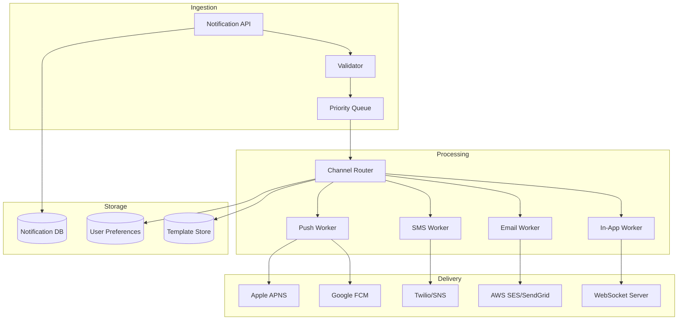
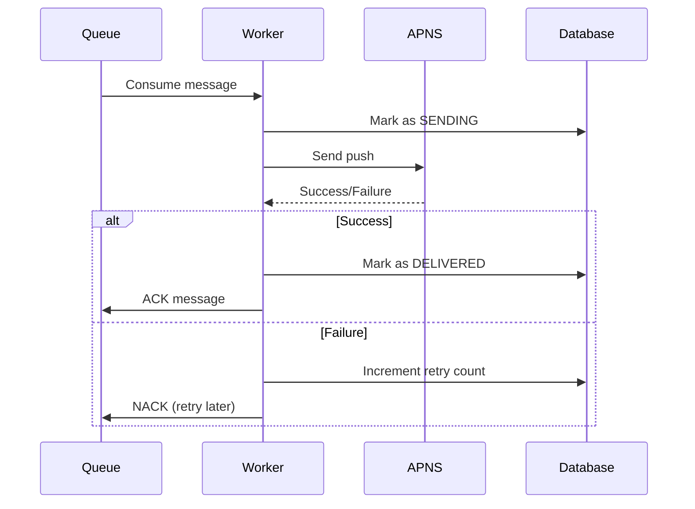
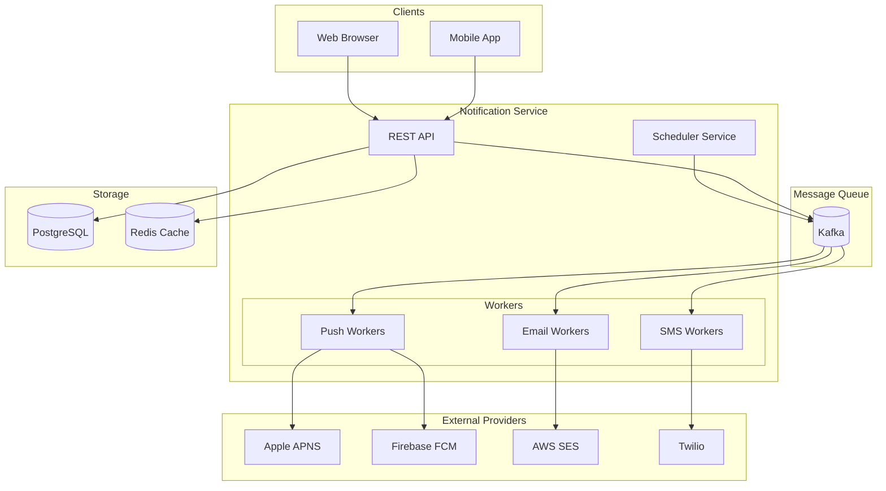

# Design a Notification System

A notification system delivers messages to users across multiple channels (push, SMS, email, in-app). Think Facebook notifications, Uber ride updates, or banking alerts.

## 1. Requirements

### Functional

1. **Multi-channel delivery**: Push (iOS/Android), SMS, Email, In-app
2. **User preferences**: Let users control what notifications they receive
3. **Template support**: Reusable message templates with variables
4. **Scheduling**: Send now or schedule for later
5. **Analytics**: Track delivery, open rates, click-through

### Non-Functional

1. **High throughput**: Millions of notifications per day
2. **Reliability**: At-least-once delivery guarantee
3. **Low latency**: Real-time notifications in < 1 second
4. **Scalability**: Handle traffic spikes (e.g., flash sales)

## 2. Capacity Estimation

| Metric | Value |
|--------|-------|
| DAU | 100 Million |
| Notifications/user/day | 5 |
| Total daily notifications | 500 Million |
| Peak QPS | 500M / 86400 × 5 (peak) ≈ 30,000 QPS |
| Average payload size | 1 KB |
| Daily bandwidth | 500M × 1KB = 500 GB |

---

## 3. High-Level Architecture



---

## 4. Core Components

### 4.1 Notification API

Entry point for all notification requests.

```json
POST /v1/notifications
{
  "user_ids": ["user123", "user456"],
  "template_id": "order_shipped",
  "channels": ["push", "email"],
  "priority": "high",
  "data": {
    "order_id": "ORD-789",
    "tracking_url": "https://..."
  },
  "scheduled_at": null  // null = send immediately
}
```

### 4.2 Validation & Rate Limiting

Before queuing:

- Validate user exists
- Check user preferences (opted-in?)
- Apply rate limiting (max X notifications per user per hour)
- Deduplicate (same notification within Y minutes?)

### 4.3 Priority Queue

Use **multiple queues** by priority:

| Priority | Queue | Use Case |
|----------|-------|----------|
| Critical | `notifications-critical` | Security alerts, OTPs |
| High | `notifications-high` | Transactional (orders, payments) |
| Medium | `notifications-medium` | Social (likes, comments) |
| Low | `notifications-low` | Marketing, promotions |

**Technology**: Apache Kafka (partitioned by user_id for ordering) or AWS SQS.

### 4.4 Channel Router

Decides which channels to use based on:

1. User's delivery preferences
2. Channel availability (fallback if push fails → send SMS)
3. Device registration (has push token?)

```python
def route_notification(user, notification):
    channels = []
    prefs = get_user_preferences(user.id)
    
    if "push" in notification.channels and prefs.push_enabled:
        if user.push_tokens:
            channels.append("push")
        elif prefs.sms_fallback:
            channels.append("sms")
    
    if "email" in notification.channels and prefs.email_enabled:
        channels.append("email")
    
    return channels
```

### 4.5 Channel Workers

Dedicated workers per channel for isolation:

#### Push Notifications

| Platform | Service | Protocol |
|----------|---------|----------|
| iOS | Apple Push Notification Service (APNS) | HTTP/2, TLS |
| Android | Firebase Cloud Messaging (FCM) | HTTP, REST |

**Challenges**:

- Token refresh (devices get new tokens)
- Token invalidation (app uninstalled)
- Batch sending (FCM supports up to 500 tokens per request)

#### Email

- Use providers: AWS SES, SendGrid, Mailgun
- Handle bounces and complaints (feedback loops)
- Warm up IPs to avoid spam filters

#### SMS

- Providers: Twilio, AWS SNS
- Handle carrier throttling
- Opt-out management (STOP keywords)

---

## 5. Reliability & Delivery Guarantees

### At-Least-Once Delivery

1. Persist notification before sending
2. Acknowledge queue message only after provider confirms delivery
3. Retry on failure with exponential backoff



### Deduplication

Prevent sending duplicate notifications:

```sql
-- Before sending, check
SELECT 1 FROM notifications 
WHERE user_id = ? AND template_id = ? AND created_at > NOW() - INTERVAL 5 minutes
```

Or use idempotency key in the API request.

### Fallback Channels

```
Primary: Push
  ↓ fails
Fallback 1: SMS
  ↓ fails
Fallback 2: Email
```

---

## 6. User Preferences

### Schema

```sql
CREATE TABLE notification_preferences (
    user_id BIGINT PRIMARY KEY,
    push_enabled BOOLEAN DEFAULT true,
    email_enabled BOOLEAN DEFAULT true,
    sms_enabled BOOLEAN DEFAULT false,
    quiet_hours_start TIME,  -- e.g., 22:00
    quiet_hours_end TIME,    -- e.g., 08:00
    category_settings JSONB  -- {"marketing": false, "transactional": true}
);
```

### Granular Controls

Allow per-category preferences:

| Category | Push | Email | SMS |
|----------|------|-------|-----|
| Order Updates | ✅ | ✅ | ✅ |
| Marketing | ❌ | ❌ | ❌ |
| Social | ✅ | ❌ | ❌ |
| Security | ✅ | ✅ | ✅ |

---

## 7. Template Engine

### Template Storage

```json
{
  "template_id": "order_shipped",
  "channels": {
    "push": {
      "title": "Your order is on the way!",
      "body": "Order {{order_id}} shipped. Track: {{tracking_url}}"
    },
    "email": {
      "subject": "Shipment Confirmation - Order {{order_id}}",
      "html_template": "templates/order_shipped.html"
    }
  },
  "category": "transactional"
}
```

### Variable Substitution

```python
def render_template(template, data):
    # Simple: use regex or Jinja2
    for key, value in data.items():
        template = template.replace(f"{{{{{key}}}}}", str(value))
    return template
```

---

## 8. Analytics & Tracking

### Metrics to Track

| Metric | How |
|--------|-----|
| **Sent** | Count when worker sends |
| **Delivered** | APNS/FCM delivery receipt |
| **Opened** | Tracking pixel in email, push open callback |
| **Clicked** | UTM parameters, link shortener |
| **Unsubscribed** | Track opt-outs |

### Funnel

```
Sent (1M) → Delivered (950K) → Opened (200K) → Clicked (50K)
Delivery Rate: 95%
Open Rate: 21%
CTR: 25% of opens
```

---

## 9. Scaling Considerations

### Horizontal Scaling

- **API Servers**: Stateless, behind load balancer
- **Workers**: Scale independently per channel
- **Queue**: Kafka partitions = parallelism
- **Database**: Shard by user_id

### Handling Traffic Spikes

1. **Buffer in queue**: Kafka can absorb bursts
2. **Backpressure**: Workers control consumption rate
3. **Priority queues**: Critical notifications skip the line
4. **Provider rate limits**: Respect APNS/FCM limits (batch wisely)

### Multi-Region

- Deploy close to users (latency)
- Replicate user preferences globally
- Use regional providers where possible

---

## 10. Data Model

### Notifications Table

```sql
CREATE TABLE notifications (
    id UUID PRIMARY KEY,
    user_id BIGINT NOT NULL,
    template_id VARCHAR(100),
    channel VARCHAR(20),  -- push, email, sms, in_app
    status VARCHAR(20),   -- pending, sending, delivered, failed
    priority INT,
    payload JSONB,
    created_at TIMESTAMP,
    sent_at TIMESTAMP,
    delivered_at TIMESTAMP,
    retry_count INT DEFAULT 0,
    error_message TEXT
);

-- Indexes
CREATE INDEX idx_user_status ON notifications(user_id, status);
CREATE INDEX idx_created_at ON notifications(created_at);
```

### Device Tokens Table

```sql
CREATE TABLE device_tokens (
    id BIGSERIAL PRIMARY KEY,
    user_id BIGINT NOT NULL,
    platform VARCHAR(10),  -- ios, android, web
    token TEXT NOT NULL,
    is_valid BOOLEAN DEFAULT true,
    created_at TIMESTAMP,
    updated_at TIMESTAMP,
    UNIQUE(user_id, token)
);
```

---

## 11. Architecture Diagram



---

## 12. Interview Talking Points

### Key Design Decisions

1. **Priority queues**: Ensure critical notifications aren't delayed
2. **Per-channel workers**: Isolate failures, scale independently
3. **At-least-once with deduplication**: Reliability without spam
4. **Template engine**: Separation of content from logic

### Trade-offs

| Decision | Trade-off |
|----------|-----------|
| Push-first vs Email-first | Engagement vs Reliability |
| Real-time vs Batched | Latency vs Cost |
| Direct provider vs Aggregator | Control vs Simplicity |

### Common Follow-ups

1. **How to handle millions of notifications for one event?** → Fan-out on write vs read, batch to providers
2. **How to prevent abuse?** → Rate limiting per user, per IP, per template
3. **iOS vs Android differences?** → APNS requires TLS certs, FCM uses API keys
