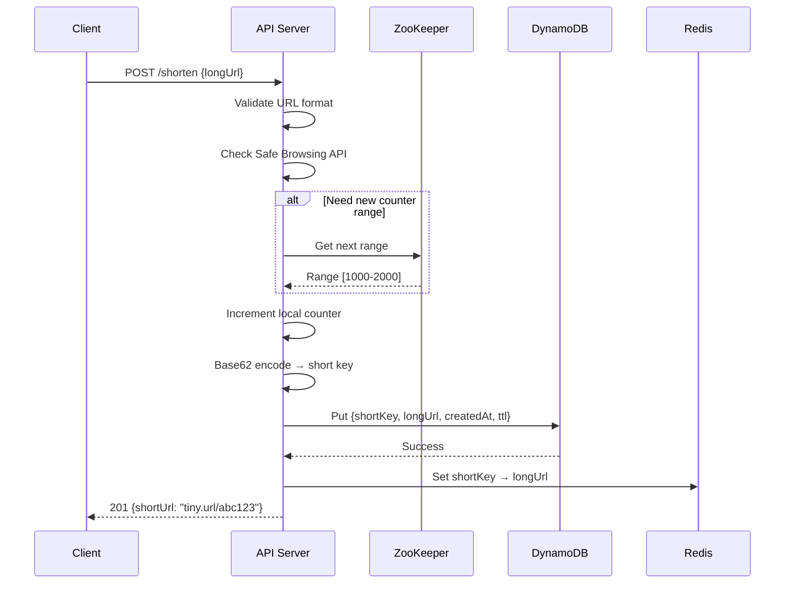
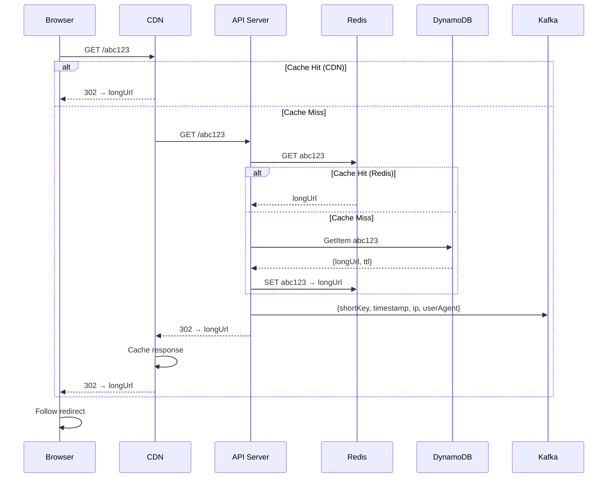

# Design URL Shortener (TinyURL / Bit.ly)

> **Model Interview Answer** - This document demonstrates L4/L5 level depth with complete BOTE, SLOs, failure modes, and runbooks.

---

## 1. Requirements Clarification (5 min)

### 1.1 Functional Requirements

**Core Features**:

- Shorten a long URL to a unique short URL
- Redirect short URL to original long URL (with low latency)
- Custom short aliases (user-defined)
- Link expiration (TTL)

**Analytics (optional)**:

- Click count per link
- Geographic distribution of clicks
- Referrer tracking
- Time-series click data

**User Management (optional)**:

- User accounts to manage their links
- Dashboard to view link performance

### 1.2 Non-Functional Requirements

| Requirement | Target | Rationale |
|-------------|--------|-----------|
| **Availability** | 99.99% | Broken redirects = broken internet |
| **Redirect Latency** | p99 < 50ms | User shouldn't notice redirect |
| **URL Length** | 7-8 characters | Short enough to share |
| **Non-guessable** | High entropy | Prevent enumeration attacks |
| **Scale** | 100M+ URLs | Years of growth |

### 1.3 Scope

**In Scope**: URL shortening, redirection, custom aliases, TTL, basic analytics
**Out of Scope**: Full analytics dashboard, A/B testing, QR codes

---

## 2. Capacity Estimation (5 min)

### 2.1 Traffic Estimation

```
Assumption: Read-heavy system (100:1 read/write ratio)

URL Creations:
- 100 Million new URLs per month
- 100M / 30 / 24 / 3600 = 38.5 URLs/sec
- Peak (5×): 200 URLs/sec

URL Redirections:
- 100:1 ratio = 10 Billion redirects/month
- 10B / 30 / 24 / 3600 = 3,858 redirects/sec
- Peak (3×): ~12,000 redirects/sec
```

### 2.2 Storage Estimation

```
URL Record Size:
- Short URL (7 chars):     7 bytes
- Long URL (avg 200 chars): 200 bytes
- Created timestamp:        8 bytes
- Expiry timestamp:         8 bytes
- User ID (optional):       8 bytes
- Click count:              8 bytes
- Metadata:                 ~70 bytes
- Total:                    ~300 bytes per URL

Storage:
- 5 years of data: 100M/month × 12 × 5 = 6 Billion URLs
- 6B × 300 bytes = 1.8 TB

With replication (3×): 5.4 TB
```

### 2.3 Key Space Analysis

```
Character Set: [A-Za-z0-9] = 62 characters
Key Length: 7 characters

Total Combinations: 62^7 = 3.5 Trillion
Required Capacity:  6 Billion URLs

Utilization: 6B / 3.5T = 0.17%

✅ 7 characters is MORE than sufficient
   (Even with 10× growth, we'd use < 2%)
```

### 2.4 Bandwidth

```
Redirect Response Size: ~500 bytes (headers + redirect HTML)
Write Response Size:    ~200 bytes (short URL + metadata)

Read Bandwidth:  12K req/sec × 500B = 6 MB/sec
Write Bandwidth: 200 req/sec × 200B = 40 KB/sec

Total: ~6 MB/sec (trivial for modern infrastructure)
```

### 2.5 BOTE Summary Table

| Resource | Calculation | Result |
|----------|-------------|--------|
| Write QPS | 100M/month ÷ 2.6M sec × 5 (peak) | 200/sec |
| Read QPS | Write × 100 × 3 (peak) | 12K/sec |
| Storage (5 years) | 6B URLs × 300B × 3 (replication) | 5.4 TB |
| Key Space | 62^7 | 3.5 Trillion |
| Key Utilization | 6B / 3.5T | 0.17% |
| Bandwidth | 12K × 500B | 6 MB/sec |

---

## 3. SLOs & Operational Targets

### 3.1 Service Level Objectives

| Service | SLI | Target | Error Budget |
|---------|-----|--------|--------------|
| **Redirect API** | Availability | 99.99% | 4.3 min/month |
| **Redirect API** | p99 latency | < 50ms | - |
| **Shorten API** | Availability | 99.9% | 43 min/month |
| **Shorten API** | p99 latency | < 200ms | - |
| **Cache** | Hit rate | > 95% | - |
| **Data** | Durability | 99.99% | - |

### 3.2 Key Metrics to Monitor

```yaml
Redirect Service:
  - redirects_total{status: success/404/expired}
  - redirect_latency_ms (p50, p99)
  - cache_hit_rate
  - cache_miss_latency_ms

Shortening Service:
  - urls_created_total
  - creation_latency_ms
  - key_generation_mode{mode: counter/hash/custom}
  - custom_alias_conflicts_total

Database:
  - db_read_latency_ms
  - db_write_latency_ms
  - db_connection_pool_usage
  - replication_lag_seconds
```

### 3.3 Alerting Thresholds

| Alert | Condition | Severity |
|-------|-----------|----------|
| Redirect p99 > 100ms | 5 min window | P1 - Page |
| Redirect 404 rate > 1% | 5 min window | P2 - Ticket |
| Cache hit rate < 80% | 15 min window | P2 - Ticket |
| Key generation failures > 0 | Any | P1 - Page |
| DB replication lag > 5s | Any replica | P2 - Ticket |

---

## 4. High-Level Architecture (10 min)

### 4.1 Architecture Diagram

```
┌─────────────────────────────────────────────────────────────────────────┐
│                              CLIENTS                                     │
├─────────────────────────────────────────────────────────────────────────┤
│  ┌──────────────┐    ┌──────────────┐    ┌──────────────┐              │
│  │   Browser    │    │  Mobile App  │    │  API Client  │              │
│  └──────┬───────┘    └──────┬───────┘    └──────┬───────┘              │
└─────────┼───────────────────┼───────────────────┼───────────────────────┘
          │                   │                   │
          ▼                   ▼                   ▼
┌─────────────────────────────────────────────────────────────────────────┐
│                         EDGE LAYER                                       │
│  ┌─────────────────────────────────────────────────────────────────┐   │
│  │                    Global Load Balancer                          │   │
│  │              (GeoDNS → closest region)                           │   │
│  └───────────────────────────┬─────────────────────────────────────┘   │
│                              │                                          │
│  ┌─────────────────────────────────────────────────────────────────┐   │
│  │                    CDN / Edge Cache                              │   │
│  │    Cache redirect mappings for hot URLs (top 20% = 80% traffic) │   │
│  └───────────────────────────┬─────────────────────────────────────┘   │
└──────────────────────────────┼──────────────────────────────────────────┘
                               │
                               ▼
┌─────────────────────────────────────────────────────────────────────────┐
│                         APPLICATION LAYER                                │
│                                                                          │
│  ┌─────────────────────────────┐  ┌─────────────────────────────────┐  │
│  │      REDIRECT SERVICE       │  │      SHORTENING SERVICE         │  │
│  │                             │  │                                 │  │
│  │  GET /:shortCode            │  │  POST /api/v1/shorten          │  │
│  │  1. Check cache             │  │  1. Validate long URL          │  │
│  │  2. Lookup DB if miss       │  │  2. Check custom alias         │  │
│  │  3. Return 301/302          │  │  3. Generate unique key        │  │
│  │  4. Log analytics (async)   │  │  4. Store mapping              │  │
│  │                             │  │  5. Return short URL           │  │
│  └──────────────┬──────────────┘  └───────────────┬─────────────────┘  │
│                 │                                 │                     │
└─────────────────┼─────────────────────────────────┼─────────────────────┘
                  │                                 │
                  ▼                                 ▼
┌─────────────────────────────────────────────────────────────────────────┐
│                         CACHING LAYER                                    │
│  ┌─────────────────────────────────────────────────────────────────┐   │
│  │                    Redis Cluster                                 │   │
│  │                                                                  │   │
│  │   short_code → long_url (with TTL matching expiry)              │   │
│  │   Cache aside pattern: Read from cache, populate on miss        │   │
│  └─────────────────────────────────────────────────────────────────┘   │
└─────────────────────────────────────────────────────────────────────────┘
                               │
                               ▼
┌─────────────────────────────────────────────────────────────────────────┐
│                         DATA LAYER                                       │
│                                                                          │
│  ┌─────────────────────────┐      ┌─────────────────────────────────┐  │
│  │   URL MAPPINGS          │      │   KEY GENERATION SERVICE        │  │
│  │   (DynamoDB/Cassandra)  │      │                                 │  │
│  │                         │      │   ┌─────────────────────────┐   │  │
│  │   Partition: short_code │      │   │  RANGE ALLOCATOR        │   │  │
│  │   Attributes:           │      │   │  (ZooKeeper/etcd)       │   │  │
│  │   - long_url            │      │   │                         │   │  │
│  │   - created_at          │      │   │  Server A: 1M - 2M      │   │  │
│  │   - expires_at          │      │   │  Server B: 2M - 3M      │   │  │
│  │   - user_id             │      │   │  Server C: 3M - 4M      │   │  │
│  │   - click_count         │      │   └─────────────────────────┘   │  │
│  │                         │      │                                 │  │
│  └─────────────────────────┘      └─────────────────────────────────┘  │
│                                                                          │
│  ┌─────────────────────────────────────────────────────────────────┐   │
│  │                    ANALYTICS PIPELINE                            │   │
│  │                                                                  │   │
│  │   Click Event → Kafka → Spark Streaming → TimescaleDB/ClickHouse│   │
│  └─────────────────────────────────────────────────────────────────┘   │
└─────────────────────────────────────────────────────────────────────────┘
```

### 4.2 Component Responsibilities

| Component | Responsibility | Tech Choice | Scale |
|-----------|---------------|-------------|-------|
| **Global LB** | Geographic routing | AWS Global Accelerator | 3 regions |
| **Edge Cache** | Hot URL caching | CloudFront | 100+ PoPs |
| **Redirect Service** | URL lookup + redirect | Go | 50 instances |
| **Shortening Service** | Create short URLs | Go | 20 instances |
| **Cache** | In-region caching | Redis Cluster | 10 nodes |
| **URL Database** | Persistent storage | DynamoDB/Cassandra | Multi-region |
| **Key Generator** | Unique ID allocation | ZooKeeper + Go | 5 nodes |

---

## 5. API Design (5 min)

### 5.1 Shorten URL API

```http
POST /api/v1/shorten
Headers: 
  Authorization: Bearer <token>  # Optional for anonymous
  X-Idempotency-Key: <uuid>      # For retry safety

Body: {
  "long_url": "https://example.com/very/long/path?with=params",
  "custom_alias": "my-link",     # Optional
  "expires_at": "2024-12-31T23:59:59Z",  # Optional
  "tags": ["marketing", "q1"]    # Optional for organization
}

Response 201 Created:
{
  "short_url": "https://tiny.url/a1b2c3d",
  "short_code": "a1b2c3d",
  "long_url": "https://example.com/...",
  "created_at": "2024-01-15T10:30:00Z",
  "expires_at": "2024-12-31T23:59:59Z"
}

Response 409 Conflict (custom alias taken):
{
  "error": "ALIAS_EXISTS",
  "message": "The custom alias 'my-link' is already in use"
}
```

### 5.2 Redirect API

```http
GET /:shortCode
# Example: GET /a1b2c3d

Response 301 Moved Permanently:
Location: https://example.com/very/long/path?with=params

# OR

Response 302 Found (temporary, for analytics):
Location: https://example.com/very/long/path?with=params

Response 404 Not Found:
{
  "error": "NOT_FOUND",
  "message": "Short URL not found or expired"
}
```

### 5.3 Analytics API

```http
GET /api/v1/urls/:shortCode/stats
Headers: Authorization: Bearer <token>

Response:
{
  "short_code": "a1b2c3d",
  "total_clicks": 15234,
  "unique_visitors": 12890,
  "clicks_by_country": {
    "US": 5000,
    "UK": 3000,
    "IN": 2500,
    ...
  },
  "clicks_by_day": [
    { "date": "2024-01-14", "clicks": 1200 },
    { "date": "2024-01-15", "clicks": 1500 },
    ...
  ],
  "top_referrers": [
    { "referrer": "twitter.com", "clicks": 5000 },
    { "referrer": "facebook.com", "clicks": 3000 }
  ]
}
```

### 5.4 301 vs 302 Decision

| Aspect | 301 (Permanent) | 302 (Temporary) |
|--------|-----------------|-----------------|
| **Browser Behavior** | Caches redirect forever | Always checks server |
| **Server Load** | Lower (browser cached) | Higher (every click hits server) |
| **Analytics** | Can't track clicks | Full click tracking |
| **SEO** | Passes link equity | Doesn't pass link equity |
| **Use When** | Personal/permanent links | Marketing/analytics needed |

**Default**: 302 for analytics, option for 301 for power users.

---

## 6. Deep Dive: Key Generation

### 6.1 Approaches Comparison

| Approach | Pros | Cons | Verdict |
|----------|------|------|---------|
| **Random + Check** | Simple | Collision risk, DB check overhead | ❌ Not scalable |
| **MD5/SHA256 Hash** | Deterministic | Collisions, long output needs truncation | ⚠️ Works with collision handling |
| **Counter + Base62** | Guaranteed unique, fast | Sequential (guessable), counter sync | ✅ With range allocation |
| **Snowflake ID** | Distributed, unique | 64-bit is long, wastes key space | ⚠️ Overkill for URL shortener |

### 6.2 Recommended: Counter with Range Allocation

```
Architecture:

┌─────────────────────────────────────────────────────────────────────────┐
│                    ZOOKEEPER / ETCD                                      │
│                                                                          │
│   Global Counter: 50,000,000                                            │
│   Range Size: 1,000,000                                                 │
│                                                                          │
│   /ranges/server-a: 48,000,000 - 48,999,999 (in use)                   │
│   /ranges/server-b: 49,000,000 - 49,999,999 (in use)                   │
│   /ranges/server-c: 50,000,000 - 50,999,999 (just allocated)           │
└─────────────────────────────────────────────────────────────────────────┘
          │
          │ Allocate new range when current exhausted
          ▼
┌─────────────────────────────────────────────────────────────────────────┐
│                    APPLICATION SERVERS                                   │
│                                                                          │
│   Server A:                    Server B:                                │
│   ┌─────────────────────┐     ┌─────────────────────┐                  │
│   │ Local Counter:      │     │ Local Counter:      │                  │
│   │ 48,523,456          │     │ 49,001,234          │                  │
│   │ Max: 48,999,999     │     │ Max: 49,999,999     │                  │
│   │                     │     │                     │                  │
│   │ No coordination!    │     │ Super fast!         │                  │
│   │ Just increment      │     │ In-memory counter   │                  │
│   └─────────────────────┘     └─────────────────────┘                  │
│                                                                          │
└─────────────────────────────────────────────────────────────────────────┘
```

### 6.3 Implementation

```python
class KeyGenerator:
    def __init__(self, zk_client, server_id):
        self.zk = zk_client
        self.server_id = server_id
        self.current = 0
        self.max = 0
        self.range_size = 1_000_000
        self.lock = threading.Lock()
    
    def get_next_key(self):
        with self.lock:
            if self.current >= self.max:
                self._allocate_new_range()
            
            key_id = self.current
            self.current += 1
            return self._to_base62(key_id)
    
    def _allocate_new_range(self):
        """Atomically get next range from ZooKeeper"""
        # ZK transaction: read counter, increment, write back
        counter_path = "/url-shortener/counter"
        
        while True:
            data, stat = self.zk.get(counter_path)
            current_counter = int(data)
            new_counter = current_counter + self.range_size
            
            try:
                self.zk.set(counter_path, str(new_counter).encode(), stat.version)
                self.current = current_counter
                self.max = current_counter + self.range_size
                
                # Log range for disaster recovery
                self.zk.create(
                    f"/url-shortener/ranges/{self.server_id}",
                    f"{self.current}-{self.max}".encode(),
                    ephemeral=True
                )
                return
            except BadVersionError:
                continue  # Retry on conflict
    
    def _to_base62(self, num):
        """Convert integer to base62 string"""
        chars = "0123456789ABCDEFGHIJKLMNOPQRSTUVWXYZabcdefghijklmnopqrstuvwxyz"
        if num == 0:
            return chars[0]
        
        result = []
        while num > 0:
            result.append(chars[num % 62])
            num //= 62
        
        # Pad to 7 characters for consistent length
        while len(result) < 7:
            result.append(chars[0])
        
        return ''.join(reversed(result))
```

### 6.4 Handling Custom Aliases

```python
def create_short_url(long_url, custom_alias=None, user_id=None):
    if custom_alias:
        # Validate custom alias
        if not is_valid_alias(custom_alias):
            raise ValidationError("Invalid alias format")
        
        if len(custom_alias) < 4:
            raise ValidationError("Alias must be at least 4 characters")
        
        # Check if exists (DynamoDB conditional write)
        try:
            db.put_item(
                TableName='urls',
                Item={
                    'short_code': custom_alias,
                    'long_url': long_url,
                    'created_at': now(),
                    'user_id': user_id,
                    'is_custom': True
                },
                ConditionExpression='attribute_not_exists(short_code)'
            )
            return custom_alias
        except ConditionalCheckFailedException:
            raise AliasExistsError(f"Alias '{custom_alias}' already exists")
    else:
        # Generate unique key
        while True:
            short_code = key_generator.get_next_key()
            
            # Very unlikely collision with custom aliases, but check
            try:
                db.put_item(
                    TableName='urls',
                    Item={
                        'short_code': short_code,
                        'long_url': long_url,
                        'created_at': now(),
                        'user_id': user_id,
                        'is_custom': False
                    },
                    ConditionExpression='attribute_not_exists(short_code)'
                )
                return short_code
            except ConditionalCheckFailedException:
                continue  # Try next key (extremely rare)
```

---

## 7. Deep Dive: Redirect Flow

### 7.1 Optimized Redirect Path

```
User Browser          CDN Edge           App Server          Redis           DynamoDB
      │                  │                   │                 │                 │
      │──GET /a1b2c3d───▶│                   │                 │                 │
      │                  │                   │                 │                 │
      │                  │──Cache check──────│                 │                 │
      │                  │  (top 1% URLs)    │                 │                 │
      │                  │                   │                 │                 │
      │                  │  MISS             │                 │                 │
      │                  │──────────────────▶│                 │                 │
      │                  │                   │                 │                 │
      │                  │                   │──GET a1b2c3d──▶│                 │
      │                  │                   │◀─────HIT────────│ (95% hit rate) │
      │                  │                   │                 │                 │
      │                  │◀──302 + Location──│                 │                 │
      │                  │                   │                 │                 │
      │◀──302 + Location─│                   │                 │                 │
      │  (cached at edge │                   │                 │                 │
      │   for 5 min)     │                   │                 │                 │
      │                  │                   │                 │                 │
      │──Follow redirect─────────────────────────────────────────────────────────▶
      │  to long URL     │                   │                 │                 │
```

### 7.2 Implementation

```python
async def redirect(request, short_code):
    # 1. Validate short code format
    if not is_valid_code(short_code):
        return Response(status=400, body="Invalid short code")
    
    # 2. Check cache first
    cache_key = f"url:{short_code}"
    cached = await redis.get(cache_key)
    
    if cached:
        url_data = json.loads(cached)
    else:
        # 3. Query database
        url_data = await db.get_item(
            TableName='urls',
            Key={'short_code': short_code}
        )
        
        if not url_data:
            return Response(status=404, body="URL not found")
        
        # 4. Populate cache
        ttl = calculate_ttl(url_data.get('expires_at'))
        await redis.setex(cache_key, ttl, json.dumps(url_data))
    
    # 5. Check expiration
    if url_data.get('expires_at') and url_data['expires_at'] < now():
        await redis.delete(cache_key)
        return Response(status=404, body="URL expired")
    
    # 6. Log click asynchronously (don't block redirect)
    asyncio.create_task(log_click(short_code, request))
    
    # 7. Return redirect
    return Response(
        status=302,  # or 301 based on user preference
        headers={
            'Location': url_data['long_url'],
            'Cache-Control': 'private, max-age=300',  # 5 min edge cache
        }
    )

async def log_click(short_code, request):
    """Fire-and-forget analytics logging"""
    try:
        click_event = {
            'short_code': short_code,
            'timestamp': now(),
            'ip': request.remote_addr,
            'user_agent': request.headers.get('User-Agent'),
            'referrer': request.headers.get('Referer'),
            'country': geoip_lookup(request.remote_addr)
        }
        await kafka.produce('clicks', click_event)
    except Exception as e:
        logger.error(f"Failed to log click: {e}")
        # Don't fail redirect for analytics failure
```

---

## 8. Data Model

### 8.1 DynamoDB Schema

```yaml
Table: urls
  Partition Key: short_code (String)
  
  Attributes:
    - short_code: String     # Primary key
    - long_url: String       # The original URL
    - created_at: Number     # Unix timestamp
    - expires_at: Number     # Unix timestamp (optional)
    - user_id: String        # Owner (optional)
    - is_custom: Boolean     # Custom alias vs generated
    - click_count: Number    # Denormalized counter

  GSI: user-urls-index
    Partition Key: user_id
    Sort Key: created_at
    Projection: ALL
    # For listing user's URLs

  TTL Attribute: expires_at
    # DynamoDB auto-deletes expired items
```

### 8.2 Analytics Schema (ClickHouse)

```sql
CREATE TABLE clicks (
    short_code String,
    timestamp DateTime,
    date Date DEFAULT toDate(timestamp),
    hour UInt8 DEFAULT toHour(timestamp),
    ip String,
    country LowCardinality(String),
    city String,
    user_agent String,
    referrer String,
    is_unique UInt8  -- Based on IP + short_code daily
) ENGINE = MergeTree()
PARTITION BY toYYYYMM(date)
ORDER BY (short_code, date, hour)
TTL date + INTERVAL 90 DAY;

-- Materialized view for real-time counts
CREATE MATERIALIZED VIEW click_counts
ENGINE = SummingMergeTree()
ORDER BY (short_code, date)
AS SELECT
    short_code,
    date,
    count() as clicks,
    uniqExact(ip) as unique_visitors
FROM clicks
GROUP BY short_code, date;
```

---

## 9. Failure Modes & Runbooks

### 9.1 Failure Scenarios

| Failure | Impact | Detection | Mitigation |
|---------|--------|-----------|------------|
| Redis cache down | All traffic hits DB | Health check, latency spike | DB can handle (with higher latency) |
| DynamoDB throttling | 5xx errors on reads | CloudWatch alarms | Auto-scaling, circuit breaker |
| ZooKeeper down | Can't generate new keys | Health check | Servers continue with current range |
| Key range exhausted | 503 on create | Counter near max in range | Pre-fetch next range at 80% |
| Analytics Kafka lag | Stats not updating | Consumer lag metric | Scale consumers, not user-facing |

### 9.2 Runbook: High Redirect Latency

```markdown
## Alert: Redirect p99 > 100ms (P1)

### Symptoms
- Users complaining about slow redirects
- Increased bounce rate
- CDN reporting origin slowness

### Diagnosis Steps

1. Check cache hit rate:
   `redis-cli INFO stats | grep keyspace_hits`
   
   - Hit rate < 80%: Cache size issue or cold start
   - Normal hit rate: DB or network issue

2. Check Redis latency:
   `redis-cli --latency`
   
   - > 5ms: Redis overloaded
   - Check memory usage and evictions

3. Check DynamoDB metrics:
   - ConsumedReadCapacity
   - ThrottledRequests
   - SuccessfulRequestLatency

4. Check application instances:
   - CPU/memory usage
   - Connection pool exhaustion

### Mitigation

1. **If cache miss rate high**:
   - Increase Redis memory
   - Pre-warm cache with popular URLs
   - Extend cache TTL temporarily

2. **If DynamoDB throttled**:
   - Increase read capacity units
   - Enable auto-scaling
   - Add DAX (DynamoDB Accelerator)

3. **If application overloaded**:
   - Scale horizontally
   - Enable connection pooling
   - Check for N+1 query issues

### Recovery
- Latency should recover within 2-3 minutes after fix
- Monitor for 15 minutes post-mitigation
```

### 9.3 Runbook: Key Generation Failure

```markdown
## Alert: Key Generation Failures > 0 (P1)

### Context
Without key generation, service cannot create new short URLs.
This is a critical service failure.

### Symptoms
- 503 errors on POST /shorten
- "Unable to generate short code" errors
- ZooKeeper connection errors in logs

### Diagnosis

1. Check ZooKeeper cluster:
   `echo stat | nc zk1.internal 2181`
   
   - Leader elected?
   - All nodes connected?

2. Check application logs:
   - Connection timeouts to ZK
   - Range allocation failures

3. Check range usage:
   - All servers at end of range simultaneously?
   - Counter value near limit?

### Mitigation

1. **If ZK cluster down**:
   - Failover to secondary ZK cluster
   - Servers can continue with remaining range
   
2. **If range exhausted on all servers**:
   - Manually allocate ranges
   - Increase pre-fetch threshold (80% → 50%)

3. **Emergency: Pre-allocate ranges**:
   ```bash
   # Manually assign ranges to servers
   zkCli.sh
   > set /url-shortener/counter 100000000
   > create /url-shortener/ranges/server-a "90000000-91000000"
   ```

### Prevention

- Pre-fetch at 50% range usage
- Monitor range consumption rate
- Alert when < 10% range remaining

```

### 9.4 Degraded Mode Operation

```markdown
## Graceful Degradation

### Level 1: High Load
- Increase cache TTL (5 min → 30 min)
- Reduce analytics sampling (100% → 10%)
- Defer non-critical writes

### Level 2: Cache Failure
- Direct DB queries (higher latency acceptable)
- Enable DynamoDB DAX
- Rate limit creates to protect DB

### Level 3: Partial DB Failure
- Serve from cache only (no new URLs)
- Queue create requests for retry
- Read from replicas

### Level 4: Critical
- Static error page for creates
- Redirects continue from cache
- Priority: Existing URLs must work
```

---

## 10. Security Considerations

### 10.1 Threat Model

| Threat | Impact | Mitigation |
|--------|--------|------------|
| URL enumeration | Privacy leak, spam | Non-sequential keys, rate limiting |
| Malicious URL shortening | Phishing, malware distribution | URL scanning, blocklist |
| Redirect open redirect | Phishing attacks | Only allow http/https protocols |
| DDOS on redirects | Service unavailable | CDN absorption, rate limiting |
| Key exhaustion attack | Can't create new URLs | Rate limiting per IP/user |

### 10.2 URL Validation

```python
def validate_long_url(url):
    """Validate URL before shortening"""
    parsed = urlparse(url)
    
    # Only allow HTTP/HTTPS
    if parsed.scheme not in ('http', 'https'):
        raise ValidationError("Only HTTP/HTTPS URLs allowed")
    
    # Block localhost/internal IPs
    if is_internal_ip(parsed.hostname):
        raise ValidationError("Internal URLs not allowed")
    
    # Check blocklist
    if is_blocklisted(parsed.hostname):
        raise ValidationError("Domain is blocklisted")
    
    # Optional: Scan with Safe Browsing API
    if is_malicious(url):
        raise ValidationError("URL flagged as malicious")
    
    return True
```

---

## 11. Trade-offs Summary

| Decision | Choice | Trade-off |
|----------|--------|-----------|
| **Key Generation** | Counter + Range allocation | Fast, sequential (mitigated by base62 scrambling) |
| **Database** | DynamoDB | Managed, scalable; higher cost than self-hosted |
| **Redirect Type** | 302 default | Better analytics; slightly higher server load |
| **Cache Strategy** | Cache-aside | Simple; potential thundering herd on miss |
| **Analytics** | Async Kafka | Non-blocking; eventual consistency for stats |
| **Expiration** | DynamoDB TTL | Automatic cleanup; up to 48h delay in deletion |

---

## 12. Security & Threat Model

### Attack Vectors

| Threat | Attack | Mitigation |
|--------|--------|------------|
| **URL Spam** | Create millions of links to abuse service | Rate limit per IP/account (10/min), CAPTCHA |
| **Malicious Redirects** | Shorten phishing/malware URLs | URL validation, Safe Browsing API check |
| **Enumeration** | Guess short codes to find private URLs | Random base62 keys, not sequential |
| **Link Hijacking** | Claim expired short codes | 30-day quarantine before reuse |
| **Analytics Spoofing** | Fake clicks to inflate stats | Bot detection, IP fingerprinting |
| **DDoS** | Overwhelm redirect service | CDN, rate limiting, edge caching |

### Security Controls

```yaml
Input Validation:
  - URL format validation (RFC 3986)
  - Protocol whitelist (http, https only)
  - Domain blacklist check
  - Max URL length (2048 chars)

Authentication:
  - API key for programmatic access
  - OAuth for user dashboard
  - Rate limiting per credential

Monitoring:
  - Log all URL creations with IP
  - Alert on suspicious patterns (same IP, many URLs)
  - Abuse reports queue for review
```

---

## 13. Sequence Diagrams

### URL Creation Flow



### URL Redirect Flow



---

## 14. Data Schema

### DynamoDB Table Design

```mermaid
erDiagram
    URL_MAPPINGS {
        string short_key PK "Base62 encoded key"
        string long_url "Original URL"
        string user_id "Creator (optional)"
        number created_at "Unix timestamp"
        number expires_at "TTL timestamp"
        number click_count "Denormalized counter"
    }
    
    ANALYTICS {
        string short_key PK "Short URL key"
        string timestamp SK "Click timestamp"
        string ip_address "Visitor IP"
        string user_agent "Browser info"
        string referrer "Traffic source"
        string country "Geo from IP"
    }
    
    COUNTER_RANGES {
        string server_id PK "Server identifier"
        number range_start "Allocated start"
        number range_end "Allocated end"
        number current "Current position"
    }
    
    URL_MAPPINGS ||--o{ ANALYTICS : "has clicks"
```

### Redis Cache Structure

```
Key: "url:{short_key}"
Value: "{long_url}"
TTL: 24 hours (or until expiry)

Key: "rate:{ip}"
Value: "{request_count}"
TTL: 1 minute (sliding window)
```

---

## 15. Cost Estimate (Monthly)

### Assumptions

- 100M new URLs/month, 10B redirects/month
- 5-year data retention

| Resource | Quantity | Unit Cost | Monthly Cost |
|----------|----------|-----------|--------------|
| **API Servers** (c5.xlarge) | 10 instances | $0.17/hr | $1,224 |
| **DynamoDB** (on-demand) | 100M writes, 10B reads | $1.25/M write, $0.25/M read | $2,625 |
| **DynamoDB Storage** | 1 TB | $0.25/GB | $256 |
| **Redis ElastiCache** (r6g.large) | 3 nodes | $0.13/hr | $281 |
| **CloudFront CDN** | 10B requests, 1 TB transfer | $0.01/10K req, $0.085/GB | $1,085 |
| **Kafka (MSK)** | 3 brokers (m5.large) | $0.21/hr | $454 |
| **S3** (analytics logs) | 100 GB/month | $0.023/GB | $2 |
| **Total** | | | **~$5,927/month** |

### Cost Optimization Opportunities

- Reserved instances for API servers (40% savings)
- DynamoDB provisioned capacity with reserved (50% savings)
- Optimize CDN caching to reduce origin hits

---

## 12. Interview Presentation Tips

```markdown
### Opening (30 sec)
"A URL shortener like Bit.ly converts long URLs to short, shareable links.
The key challenges are:
1) Generating unique keys at scale (200 URLs/sec)
2) Ultra-low latency redirects (12K req/sec, < 50ms)
3) High availability (99.99% - broken redirects break the internet)
4) Handling 6 billion URLs over 5 years"

### Key Talking Points
- "I'll use counter with range allocation for key generation - no collisions"
- "Base62 encoding gives 3.5 trillion combinations with 7 characters"
- "Multi-layer caching: CDN edge + Redis + DynamoDB DAX"
- "Async analytics via Kafka - don't block redirects"

### Numbers to Remember
- 62^7 = 3.5 trillion possible URLs
- 100:1 read/write ratio
- 200 writes/sec, 12K reads/sec
- 5.4 TB storage for 5 years
- p99 redirect < 50ms

### Common Follow-ups
Q: "How do you prevent someone from guessing URLs?"
A: "Base62 scrambles counter. Rate limit enumeration. Short codes have 3.5T combinations."

Q: "What if ZooKeeper is down?"
A: "Servers continue with current range. Pre-fetch at 50% to avoid exhaustion."

Q: "301 vs 302?"
A: "302 for analytics (server sees every click). 301 for performance (browser caches)."
```
