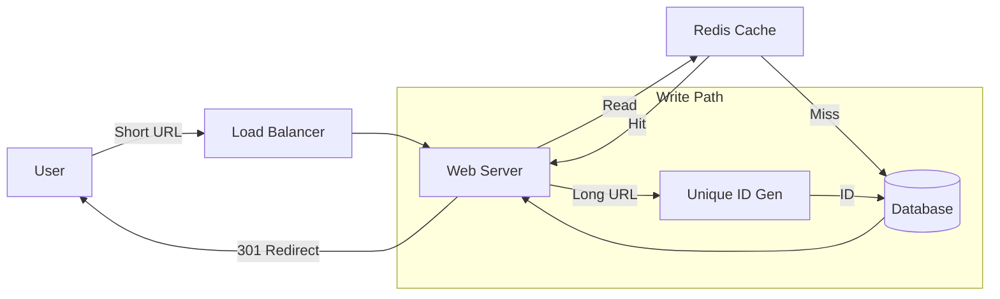

# Design a URL Shortener (TinyURL)

## 1. Requirements

### Functional Requirements

1. **Shorten**: Given a long URL, return a unique short URL.
2. **Redirect**: Given a short URL, redirect to the original long URL.
3. **Custom Alias**: Users should be able to pick a custom short link (optional).
4. **Expiry**: Links should expire after a default timespan (optional).

### Non-Functional Requirements

1. **Highly Available**: If the service is down, URL redirection stops working.
2. **Real-time redirection**: Minimal latency.
3. **Non-predictable**: Short links shouldn't be easily guessable (security).

## 2. Back of the Envelope Estimation

- **Read vs Write**: Read-heavy system (100:1 ratio).
- **Traffic**:
  - Assume 500M new URLs per month.
  - 100 * 500M = 50B reads per month.
  - **QPS (Writes)**: 500M / (30 days *24 hrs* 3600 sec) $\approx$ 200 writes/sec.
  - **QPS (Reads)**: 200 * 100 $\approx$ 20,000 reads/sec.
- **Storage**:
  - Assume 5 years of storage.
  - 500M *12* 5 = 30 Billion URLs.
  - 500 bytes per URL entry.
  - Total Storage: 30B * 500 bytes = 15 TB.

## 3. Database Design

Since we need **massive scale** and the data is simple (key-value text), NoSQL is usually preferred (e.g., Cassandra, DynamoDB, Riak) for horizontal scaling. However, RDBMS can work with sharding.

**Scanning Table**:

- `Hash` (Primary Key): e.g., "ab12xyz"
- `OriginalURL`: String
- `CreationDate`: Timestamp
- `ExpirationDate`: Timestamp
- `UserID`: (Optional)

## 4. High-Level Design

1. **Client** sends `LongURL`.
2. **Web Server** takes request, calls **Shortening Service**.
3. **Shortening Service** generates unique ID.
4. **DB** stores `ID -> LongURL`.
5. **Client** gets `http://tiny.url/ID`.
6. For retrieval: Client hits `shortURL` -> Load Balancer -> Web Server -> **Cache** (Check if present) -> **DB** (If miss) -> Return 301/302 Redirect.

### Architecture Diagram

### 301 vs 302 Redirect

- **301 (Permanent)**: Browser caches the mapping. Good for reducing server load, bad for analytics.
- **302 (Temporary)**: Browser always hits server. Good for analytics, higher server load.

## 5. Detailed Component Design - Key Generation

### Approach 1: Hash Function (MD5/SHA256)

- Keep first 7 chars of hash.
- *Problem*: Collisions possible. Needs checking DB and retrying.

### Approach 2: Base62 Conversion (Preferred)

- Character set: [A-Z, a-z, 0-9] = 26 + 26 + 10 = 62 characters.
- A 7-character string: $62^7 \approx 3.5$ Trillion combinations. Enough for our 30B requirement.

**How to get a unique number to convert to Base62?**

- **UUID**: Too long (128-bit).
- **Counter**: Distributed counter is hard to sync.
- **ZooKeeper Range Allocator**:
  - Use a separate service (ZK) to manage ranges.
  - Server A grabs range 1,000,000 - 2,000,000.
  - Server B grabs range 2,000,001 - 3,000,000.
  - Each server increments its local counter in memory (super fast).
  - When range exhausted, ask ZK for a new range.
  - Convert this unique Integer ID to Base62 Base. `ID: 123456 -> Base62: "abc"`

## 6. Bottlenecks & Optimizations

- **Caching**: Cache top 20% of URLs (Pareto Principle). Use Redis/Memcached. Eviction policy: LRU.
- **Database Scaling**: Shard based on the first character of the hash or simple hash-mod.
- **Cleanup**: Lazy cleanup. Only delete expired links when a user tries to access them, or run a background "sweeper" job during off-peak hours.
