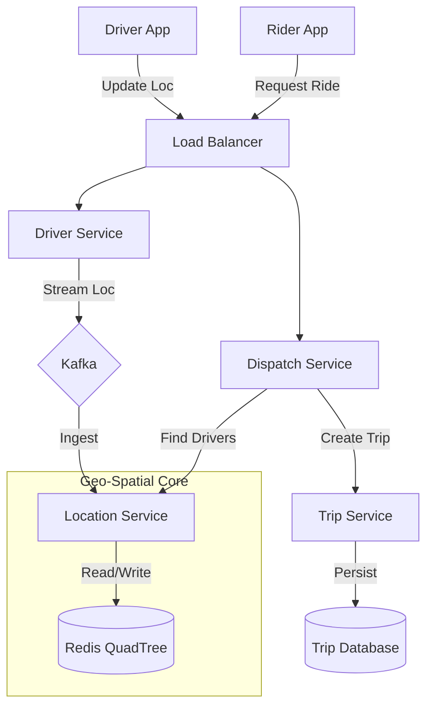

# Design Uber (Ride Hailing Service)

## 1. Requirements

### Functional

1. **Rider**: Update location, Request ride, See nearby drivers, See ETA/Price, Start/End Trip.
2. **Driver**: Update location (frequent), Accept/Decline ride, Start/End Trip.
3. **Matching**: Match Rider with nearest available Driver.

### Non-Functional

1. **Low Latency**: Matching execution must be fast (< 200ms).
2. **High Availability**: Reliable service, no downtime.
3. **Consistency**: Driver must check availability accurately (avoid double booking).

## 2. Capacity Estimation

- 100M Active Users, 1M Active Drivers.
- 1M Daily Rides.
- **Driver Location Updates**: Key challenge. Every 3 seconds.
- 1M Drivers * 1 update/3sec $\approx$ 333k QPS. Significant write load.

## 3. High-Level Architecture

1. **Rider Service**: Handles rider requests.
2. **Driver Service**: Handles driver availability and actions.
3. **Location Service (The Core)**: Ingests millions of GPS points.
4. **Cab Matching Service**: Finds drivers for a rider.
5. **Trip Service**: Manages state of a trip.

### Architecture Diagram

## 4. Key Component: Location Service & Geo-Spatial Indexing

We need to efficiently query: "Return all drivers within radius R of (Lat, Lon)".
SQL Standard Indexing is inadequate for 2D range queries.

### Option 1: Geohash

- Divides the world into recursive grids.
- String encoded (e.g., "9q8yy"). Longer string = higher precision.
- Nearby locations usually share common prefixes.
- **Problem**: Boundary issues (two close points might have completely different hashes). Solved by querying neighbor hashes.

### Option 2: QuadTree (Preferred)

- Tree data structure. Root = World.
- Recursively divide into 4 quadrants (NW, NE, SW, SE) until a bucket has < N drivers.
- **In-Memory**: QuadTrees are fast but building them on disk is slow. Keep the QuadTree in memory for each city/region.
- **Updates**: When driver moves, remove from old node, add to new node.
- **Sharding**: Shard by City/RegionID. Each server holds the QuadTree for a specific city.

## 5. Detailed Orchestration (Request Ride Flow)

1. Rider requests ride (Lat, Lon).
2. Request goes to **Dispatch Service**.
3. Dispatch Service calls **Location Service** (QuadTree/Geohash) with Redis Geospacial functions.
4. Finds top 10 available drivers in radius.
5. Locks the first driver (Distributed Lock / Redis).
6. Sends notification to Driver A.
7. If Driver A rejects/timeouts, unlock and try Driver B.
8. If Driver A accepts, create **Trip** entity.

## 6. Comparison: Geohash (Redis) vs QuadTree

- **Redis Geohash**: Easier to implement. Built-in `GEOADD`, `GEORADIUS`. Good for simple use cases.
- **QuadTree**: Better control, custom logic easier, optimized for density. Uber actually moved from MongoDB to Ringpop (custom) + Google S2 (similar to Geohash/Quadtree hybrid).

## 7. Bottlenecks & Failure Handling

- **Dispatch Service Failure**: Use Consistent Hashing (Ringpop) to distribute state. If a node dies, neighbors take over.
- **Driver Location Stream**: Use Kafka to ingest 300k+ QPS, preventing DB meltdown. A dedicated "Location updater" service reads from Kafka and updates Redis/QuadTree in batches.
