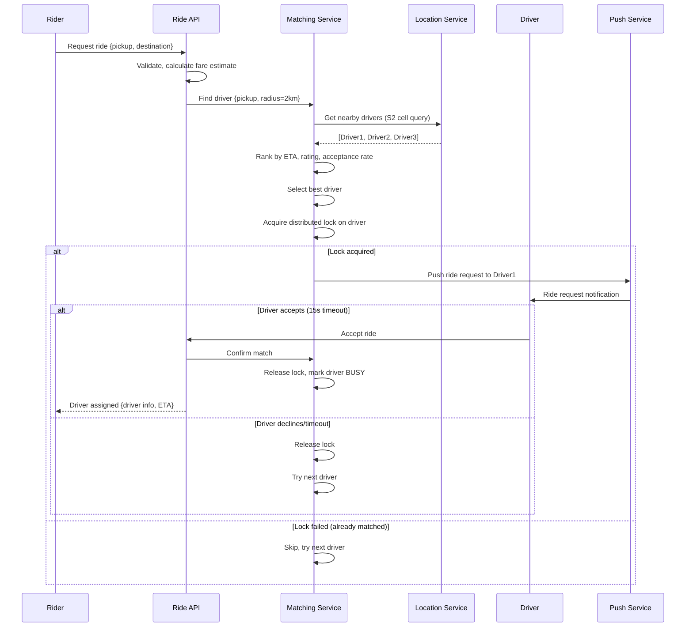
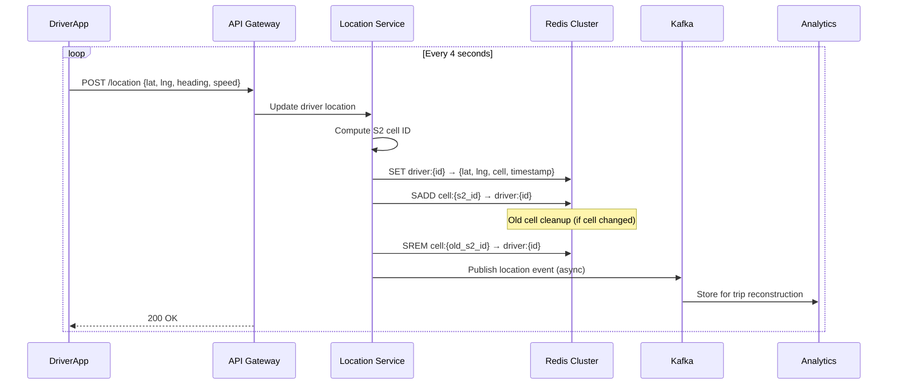
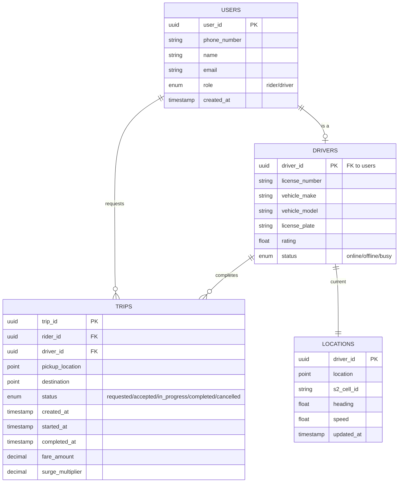

# Design Uber (Ride Hailing Service)

> **Model Interview Answer** - This document demonstrates L4/L5 level depth with complete BOTE, SLOs, failure modes, and runbooks.

---

## 1. Requirements Clarification (5 min)

### 1.1 Functional Requirements

**Rider Features**:

- View nearby available drivers on map
- Request a ride (pickup → destination)
- See ETA and price estimate before confirming
- Real-time tracking during ride
- Payment processing and receipts

**Driver Features**:

- Update location continuously
- Receive ride requests with accept/decline
- Navigate to rider, start/complete trip
- View earnings

**Matching System**:

- Match rider with optimal nearby driver
- Handle surge pricing based on demand

### 1.2 Non-Functional Requirements

| Requirement | Target | Rationale |
|-------------|--------|-----------|
| **Availability** | 99.99% | Revenue-critical, users depend on it |
| **Matching Latency** | < 1 sec | User expects instant matching |
| **Location Update** | < 500ms | Real-time tracking needs |
| **Consistency** | Strong for matching | Prevent double-booking |
| **Scale** | Global, 100M+ users | Multi-region deployment |

### 1.3 Scope

**In Scope**: Core ride matching, location tracking, trip management
**Out of Scope**: Payments (assume exists), UberEats, driver onboarding

---

## 2. Capacity Estimation (5 min)

### 2.1 User Scale

```
Total Users:     100M riders, 5M drivers
DAU:             20M riders, 1M drivers
Concurrent:      ~2M riders, 500K drivers (peak hours)
Daily Rides:     15M rides/day
```

### 2.2 Location Updates (Critical Path)

```
Active Drivers:           1M (peak)
Update Frequency:         Every 4 seconds
Location Update QPS:      1M / 4 = 250,000 QPS

Peak (2x):                500,000 QPS location updates

Data per update:          ~200 bytes (driver_id, lat, lon, timestamp, status)
Write Bandwidth:          500K × 200B = 100 MB/s
```

### 2.3 Ride Requests

```
Daily Rides:              15M
Peak Hour (10% of daily): 1.5M rides/hour
Ride Request QPS:         1.5M / 3600 = ~420 QPS

With retries/queries:     ~2,000 QPS for ride-related operations
```

### 2.4 Storage Estimation

```
Trip Data:
- 15M trips/day × 2KB = 30 GB/day
- 1 year retention: 30 × 365 = ~11 TB

Location History (for analytics):
- 500K QPS × 200B × 86400s = 8.6 TB/day
- Keep 7 days hot: 60 TB
- Archive compressed: ~5 TB/month cold storage

Driver/Rider Profiles:
- 105M users × 5KB = 525 GB (easily fits one DB)
```

### 2.5 Shard Count Estimation

```
Location Service (Redis):
- 500K QPS write, 1M QPS read (nearby queries)
- Single Redis: ~100K ops/sec
- Shards needed: 1.5M / 100K = 15 shards minimum
- With headroom (3x): 45 Redis instances across regions

Trip Database (PostgreSQL):
- 2K QPS × 3 regions = 6K QPS global
- Single Postgres: ~5K QPS with read replicas
- Shards: 2 per region (by city_id) with 3 replicas each
```

### 2.6 BOTE Summary Table

| Resource | Calculation | Result |
|----------|-------------|--------|
| Location Write QPS | 1M drivers / 4s × 2 (peak) | 500K QPS |
| Location Read QPS | 2M riders × 0.5 queries/sec | 1M QPS |
| Ride Request QPS | 15M/day ÷ 86400 × 10 | ~2K QPS |
| Location Storage (hot) | 500K × 200B × 86400 × 7 | 60 TB |
| Trip Storage (yearly) | 15M × 2KB × 365 | 11 TB |
| Redis Shards | 1.5M QPS ÷ 100K per shard | 15-45 |

---

## 3. SLOs & Operational Targets

### 3.1 Service Level Objectives

| Service | SLI | Target | Error Budget |
|---------|-----|--------|--------------|
| **Matching** | Successful match rate | 99.5% | 0.5% = 75K failed matches/day |
| **Matching** | p99 latency | < 1000ms | - |
| **Location** | Update success rate | 99.9% | 43 min downtime/month |
| **Location** | p99 write latency | < 100ms | - |
| **Trip Service** | Availability | 99.99% | 4.3 min downtime/month |
| **ETA API** | p99 latency | < 200ms | - |

### 3.2 Key Metrics to Monitor

```
Matching Service:
- match_request_total{status}
- match_latency_seconds (p50, p99)
- drivers_available_per_region
- match_failure_reason{reason}

Location Service:
- location_updates_per_second
- location_update_latency_ms
- quadtree_query_latency_ms
- nearby_drivers_count{radius}

Trip Service:
- trips_created_total
- trips_completed_total
- trip_state_transitions{from, to}
- payment_success_rate
```

### 3.3 Alerting Thresholds

| Alert | Condition | Severity |
|-------|-----------|----------|
| Match failure rate > 1% | 5 min window | P1 - Page |
| Location update lag > 10s | Any region | P1 - Page |
| No drivers in city | drivers < 10 | P2 - Ticket |
| Trip DB replication lag > 5s | Any replica | P2 - Ticket |
| Redis memory > 80% | Any shard | P2 - Ticket |

---

## 4. High-Level Architecture (10 min)

### 4.1 Architecture Diagram

```
┌─────────────────────────────────────────────────────────────────────────┐
│                              CLIENTS                                     │
├─────────────────────────────────────────────────────────────────────────┤
│  ┌──────────────┐         ┌──────────────┐         ┌──────────────┐    │
│  │  Rider App   │         │  Driver App  │         │  Ops Dashboard│    │
│  └──────┬───────┘         └──────┬───────┘         └──────┬───────┘    │
└─────────┼────────────────────────┼───────────────────────┼─────────────┘
          │                        │                        │
          ▼                        ▼                        ▼
┌─────────────────────────────────────────────────────────────────────────┐
│                           API GATEWAY                                    │
│  ┌─────────────────────────────────────────────────────────────────┐   │
│  │ Load Balancer → Auth → Rate Limit → Route → Circuit Breaker     │   │
│  └─────────────────────────────────────────────────────────────────┘   │
└─────────┬───────────────────────┬───────────────────────┬───────────────┘
          │                       │                       │
          ▼                       ▼                       ▼
┌─────────────────┐   ┌─────────────────┐   ┌─────────────────────────────┐
│  RIDER SERVICE  │   │ DRIVER SERVICE  │   │     DISPATCH SERVICE        │
│                 │   │                 │   │  ┌───────────────────────┐  │
│ - Request ride  │   │ - Update loc    │   │  │   Matching Engine     │  │
│ - Get ETA       │   │ - Accept/reject │   │  │   (Stateful, Sharded) │  │
│ - Track ride    │   │ - Complete trip │   │  └───────────────────────┘  │
└────────┬────────┘   └────────┬────────┘   └─────────────┬───────────────┘
         │                     │                          │
         │                     │     ┌────────────────────┘
         │                     │     │
         ▼                     ▼     ▼
┌─────────────────────────────────────────────────────────────────────────┐
│                          LOCATION SERVICE                                │
│  ┌──────────────────┐    ┌──────────────────┐    ┌──────────────────┐  │
│  │ Location Writer  │───▶│   Kafka Cluster  │───▶│ Location Indexer │  │
│  └──────────────────┘    └──────────────────┘    └────────┬─────────┘  │
│                                                           │             │
│                                         ┌─────────────────┘             │
│                                         ▼                               │
│  ┌──────────────────────────────────────────────────────────────────┐  │
│  │              GEO-SPATIAL INDEX (Sharded by City)                 │  │
│  │  ┌─────────┐ ┌─────────┐ ┌─────────┐ ┌─────────┐ ┌─────────┐    │  │
│  │  │ NYC     │ │ LA      │ │ Chicago │ │ London  │ │ Mumbai  │    │  │
│  │  │ Redis + │ │ Redis + │ │ Redis + │ │ Redis + │ │ Redis + │    │  │
│  │  │ S2/Geo  │ │ S2/Geo  │ │ S2/Geo  │ │ S2/Geo  │ │ S2/Geo  │    │  │
│  │  └─────────┘ └─────────┘ └─────────┘ └─────────┘ └─────────┘    │  │
│  └──────────────────────────────────────────────────────────────────┘  │
└─────────────────────────────────────────────────────────────────────────┘
                                    │
                                    ▼
┌─────────────────────────────────────────────────────────────────────────┐
│                           TRIP SERVICE                                   │
│  ┌──────────────────┐    ┌──────────────────┐    ┌──────────────────┐  │
│  │  Trip Manager    │───▶│  PostgreSQL      │    │  Trip Events     │  │
│  │  (State Machine) │    │  (Sharded by     │    │  (Kafka → Analytics)│
│  └──────────────────┘    │   city_id)       │    └──────────────────┘  │
│                          └──────────────────┘                           │
└─────────────────────────────────────────────────────────────────────────┘
```

### 4.2 Component Responsibilities

| Component | Responsibility | Tech Choice |
|-----------|---------------|-------------|
| **API Gateway** | Auth, rate limit, routing | Kong / Envoy |
| **Rider Service** | Rider operations | Go microservice |
| **Driver Service** | Driver operations | Go microservice |
| **Dispatch Service** | Matching engine | Go, stateful (Ringpop) |
| **Location Service** | Geo-indexing, nearby queries | Redis + S2 cells |
| **Trip Service** | Trip state management | Go + PostgreSQL |
| **Kafka** | Location ingestion, events | Kafka cluster |

---

## 5. API Design (5 min)

### 5.1 Core APIs

```http
# Rider APIs
POST   /v1/rides/estimate
       Body: { pickup: {lat, lon}, destination: {lat, lon} }
       Returns: { price_range, eta_minutes, surge_multiplier }

POST   /v1/rides
       Body: { pickup: {lat, lon}, destination: {lat, lon}, payment_method_id }
       Returns: { ride_id, status: "matching", eta_to_pickup }

GET    /v1/rides/{ride_id}
       Returns: { status, driver: {name, car, location}, eta }

DELETE /v1/rides/{ride_id}
       # Cancel ride (within cancellation window)

# Driver APIs
PUT    /v1/drivers/{driver_id}/location
       Body: { lat, lon, heading, speed, timestamp }
       Headers: Idempotency-Key: {uuid}
       Returns: 204 No Content

PUT    /v1/drivers/{driver_id}/status
       Body: { status: "available" | "busy" | "offline" }

POST   /v1/rides/{ride_id}/accept
POST   /v1/rides/{ride_id}/arrive
POST   /v1/rides/{ride_id}/start
POST   /v1/rides/{ride_id}/complete
       Body: { final_location: {lat, lon} }
```

### 5.2 WebSocket for Real-time Updates

```
# Rider subscribes to ride updates
WS /v1/rides/{ride_id}/stream
   → { type: "driver_location", lat, lon, eta }
   → { type: "status_change", status: "driver_arrived" }
   
# Driver receives ride requests
WS /v1/drivers/{driver_id}/requests
   ← { type: "ride_request", ride_id, pickup, destination, price }
   → { type: "accept" | "decline" }
```

---

## 6. Deep Dive: Location Service & Geo-Spatial Indexing

### 6.1 The Challenge

```
Query: "Find 10 available drivers within 3km of (40.7128, -74.0060)"
Constraints:
- 500K location updates/sec
- 1M nearby queries/sec  
- < 100ms query latency
- Real-time (locations stale after 30 sec)
```

### 6.2 Approach: S2 Geometry + Redis

**Why S2 over Geohash/QuadTree?**

| Approach | Pros | Cons |
|----------|------|------|
| Geohash | Simple, built into Redis | Edge effects, imprecise circles |
| QuadTree | Good for static data | Complex updates, hard to shard |
| **S2 Cells** | Precise circles, hierarchical, shards well | More complex implementation |

**S2 Cell Levels**:

```
Level 12: ~3.3km² cells (city-level indexing)
Level 14: ~0.8km² cells (neighborhood precision)
Level 16: ~0.05km² cells (block-level, too fine)

We use Level 14 for driver indexing.
```

### 6.3 Data Model

```python
# Redis Key Structure (per city shard)
# Key: s2_cell_id → Set of driver_ids
"s2:nyc:89c25a" → {"driver_123", "driver_456", "driver_789"}

# Driver Location (Hash)
"driver:123" → {
    "lat": 40.7128,
    "lon": -74.0060,
    "s2_cell": "89c25a",
    "status": "available",
    "updated_at": 1705234567
}
```

### 6.4 Location Update Flow

```
Driver App                   Location Service              Redis (NYC shard)
    │                              │                            │
    │──PUT /location {lat, lon}──▶│                            │
    │                              │                            │
    │                              │──1. Calculate new S2 cell─▶│
    │                              │                            │
    │                              │──2. Get old cell from hash─│
    │                              │◀────"89c25a"───────────────│
    │                              │                            │
    │                              │──3. If cell changed:───────│
    │                              │   SREM s2:nyc:89c25a d123 ▶│
    │                              │   SADD s2:nyc:89c25b d123 ▶│
    │                              │                            │
    │                              │──4. Update driver hash────▶│
    │                              │   HSET driver:123 lat lon  │
    │                              │    s2_cell updated_at      │
    │                              │                            │
    │◀──────204 No Content─────────│                            │
```

### 6.5 Nearby Drivers Query

```python
def find_nearby_drivers(lat, lon, radius_km, limit=10):
    # 1. Convert location to S2 cell
    center_cell = s2.cell_from_lat_lon(lat, lon, level=14)
    
    # 2. Find covering cells for the radius
    # S2 can compute minimal set of cells covering a circle
    covering_cells = s2.get_covering(lat, lon, radius_km, max_cells=20)
    
    # 3. Query each cell for drivers
    driver_ids = []
    for cell in covering_cells:
        cell_drivers = redis.smembers(f"s2:{city}:{cell}")
        driver_ids.extend(cell_drivers)
    
    # 4. Filter by actual distance and availability
    candidates = []
    for driver_id in driver_ids:
        driver = redis.hgetall(f"driver:{driver_id}")
        if driver['status'] != 'available':
            continue
        if driver['updated_at'] < now() - 30:  # stale
            continue
        distance = haversine(lat, lon, driver['lat'], driver['lon'])
        if distance <= radius_km:
            candidates.append((driver_id, distance))
    
    # 5. Sort by distance, return top N
    candidates.sort(key=lambda x: x[1])
    return candidates[:limit]
```

**Query Complexity**: O(C × D) where C = covering cells (~10-20), D = drivers per cell (~100)

### 6.6 Sharding Strategy

```
Shard Key: city_id (derived from lat/lon → reverse geocode → city)

Benefits:
- Matching is always local (NYC rider → NYC drivers)
- Each city shard independent, can scale per city
- No cross-shard queries for core matching

Shard Distribution:
┌─────────────┬──────────────┬─────────────┬───────────┐
│ City        │ Active Drivers│ Redis Shard │ Replicas  │
├─────────────┼──────────────┼─────────────┼───────────┤
│ NYC         │ 50,000       │ 3 masters   │ 6         │
│ LA          │ 40,000       │ 2 masters   │ 4         │
│ Chicago     │ 20,000       │ 1 master    │ 2         │
│ London      │ 30,000       │ 2 masters   │ 4         │
│ Mumbai      │ 80,000       │ 4 masters   │ 8         │
└─────────────┴──────────────┴─────────────┴───────────┘
```

---

## 7. Deep Dive: Matching & Dispatch

### 7.1 Matching Algorithm

```python
def match_rider_to_driver(ride_request):
    # 1. Find nearby available drivers
    candidates = location_service.find_nearby(
        lat=ride_request.pickup.lat,
        lon=ride_request.pickup.lon,
        radius_km=5,
        limit=20
    )
    
    if not candidates:
        return None  # No drivers available
    
    # 2. Score candidates (not just distance!)
    scored = []
    for driver_id, distance in candidates:
        score = calculate_match_score(driver_id, ride_request, distance)
        scored.append((driver_id, score))
    
    # 3. Sort by score (higher is better)
    scored.sort(key=lambda x: x[1], reverse=True)
    
    # 4. Try to lock and dispatch
    for driver_id, score in scored:
        if try_lock_driver(driver_id, ride_request.id):
            return dispatch_to_driver(driver_id, ride_request)
    
    return None  # All candidates busy/declined

def calculate_match_score(driver_id, ride_request, distance):
    """
    Scoring factors (weights tuned by ML in production):
    - Distance: closer is better
    - ETA: accounts for traffic (from routing service)
    - Driver rating: higher is better  
    - Acceptance rate: drivers who accept more get priority
    - Direction: driver heading toward pickup is better
    """
    driver = get_driver_profile(driver_id)
    eta = routing_service.get_eta(driver.location, ride_request.pickup)
    
    score = 0
    score += (5 - distance) * 10          # Distance factor (0-50)
    score += (10 - eta) * 5                # ETA factor (0-50)
    score += driver.rating * 5             # Rating (0-25)
    score += driver.acceptance_rate * 20   # Acceptance (0-20)
    
    return score
```

### 7.2 Distributed Locking for Driver

```python
def try_lock_driver(driver_id, ride_id):
    """
    Use Redis SETNX for distributed lock.
    Lock key: driver_lock:{driver_id}
    Lock value: ride_id
    TTL: 30 seconds (in case dispatch fails)
    """
    lock_key = f"driver_lock:{driver_id}"
    
    # SETNX with TTL (atomic)
    acquired = redis.set(lock_key, ride_id, nx=True, ex=30)
    
    if acquired:
        # Update driver status
        redis.hset(f"driver:{driver_id}", "status", "dispatched")
        return True
    
    return False

def release_driver_lock(driver_id, ride_id):
    """Release lock only if we hold it (Lua script for atomicity)"""
    lua_script = """
    if redis.call('get', KEYS[1]) == ARGV[1] then
        redis.call('del', KEYS[1])
        redis.call('hset', KEYS[2], 'status', 'available')
        return 1
    end
    return 0
    """
    redis.eval(lua_script, [f"driver_lock:{driver_id}", f"driver:{driver_id}"], [ride_id])
```

### 7.3 Sequence Diagram: Ride Request Flow

```
Rider          Gateway       Dispatch        Location       Redis         Driver
  │               │             │               │             │             │
  │──POST /rides─▶│             │               │             │             │
  │               │──Validate──▶│               │             │             │
  │               │             │──Find nearby─▶│             │             │
  │               │             │               │──S2 query──▶│             │
  │               │             │               │◀──drivers───│             │
  │               │             │◀──candidates──│             │             │
  │               │             │                             │             │
  │               │             │────Score & rank────────────▶│             │
  │               │             │                             │             │
  │               │             │────SETNX lock driver_1─────▶│             │
  │               │             │◀───OK (acquired)────────────│             │
  │               │             │                             │             │
  │               │             │──────────Push request──────────────────▶│
  │               │             │                             │             │
  │◀─{ride_id,    │             │                             │             │
  │  status:      │             │                             │             │
  │  matching}────│             │                             │             │
  │               │             │                             │             │
  │               │             │◀──────────Accept─────────────────────────│
  │               │             │                             │             │
  │               │             │──Create trip──▶Trip Service               │
  │               │             │                             │             │
  │◀─WS: driver   │             │                             │             │
  │  assigned─────│             │                             │             │
```

---

## 8. Trip State Machine

### 8.1 State Diagram

```
                                  ┌──────────────┐
                                  │  REQUESTED   │
                                  └──────┬───────┘
                                         │ match found
                                         ▼
    ┌────────────┐  timeout    ┌──────────────────┐
    │ CANCELLED  │◀────────────│    MATCHING      │
    └────────────┘             └────────┬─────────┘
         ▲                              │ driver accepts
         │ rider cancels                ▼
         │                     ┌──────────────────┐
         ├─────────────────────│ DRIVER_ASSIGNED  │
         │                     └────────┬─────────┘
         │                              │ driver arrives
         │                              ▼
         │                     ┌──────────────────┐
         ├─────────────────────│  DRIVER_ARRIVED  │
         │                     └────────┬─────────┘
         │                              │ driver starts trip
         │     ┌────────────────────────┘
         │     ▼
         │   ┌──────────────────┐
         │   │    IN_PROGRESS   │
         │   └────────┬─────────┘
         │            │ driver completes
         │            ▼
         │   ┌──────────────────┐          ┌──────────────────┐
         └───│    COMPLETED     │─────────▶│      PAID        │
             └──────────────────┘  payment └──────────────────┘
```

### 8.2 Trip Data Model

```sql
CREATE TABLE trips (
    id              UUID PRIMARY KEY,
    rider_id        UUID NOT NULL,
    driver_id       UUID,
    city_id         INT NOT NULL,  -- Shard key
    
    -- Locations
    pickup_lat      DECIMAL(9,6) NOT NULL,
    pickup_lon      DECIMAL(9,6) NOT NULL,
    destination_lat DECIMAL(9,6),
    destination_lon DECIMAL(9,6),
    
    -- State
    status          VARCHAR(20) NOT NULL,
    created_at      TIMESTAMP NOT NULL,
    updated_at      TIMESTAMP NOT NULL,
    
    -- Financials
    estimated_price DECIMAL(10,2),
    final_price     DECIMAL(10,2),
    surge_multiplier DECIMAL(3,2) DEFAULT 1.0,
    
    -- Indexes
    INDEX idx_rider_status (rider_id, status),
    INDEX idx_driver_status (driver_id, status),
    INDEX idx_city_created (city_id, created_at)
);

-- Partition by city_id for sharding
-- Each city's trips stored in separate shard
```

---

## 9. Failure Modes & Runbooks

### 9.1 Failure Scenarios

| Failure | Impact | Detection | Mitigation |
|---------|--------|-----------|------------|
| Location Redis down | Can't find drivers | Redis health check | Failover to replica |
| Dispatch service crash | Match requests fail | Health check, error rate | Restart, Ringpop rebalances |
| Kafka lag > 30s | Stale driver locations | Consumer lag metric | Scale consumers |
| Trip DB master down | Can't create trips | Replication lag, errors | Promote replica, failover |
| Driver app disconnects | Location goes stale | No updates for 30s | Mark driver offline |

### 9.2 Runbook: Location Service Degradation

```markdown
## Alert: Location Update Latency > 100ms (P1)

### Symptoms
- Riders see "no drivers available" despite drivers online
- Driver locations not updating on rider map
- Match success rate dropping

### Diagnosis Steps
1. Check Kafka consumer lag:
   `kafka-consumer-groups --describe --group location-indexer`
   - Lag > 100K messages: Scale consumers
   
2. Check Redis memory and CPU:
   `redis-cli INFO memory` 
   - Memory > 80%: Eviction happening, scale up
   - CPU > 70%: Query load too high, add read replicas

3. Check S2 cell distribution:
   `redis-cli DBSIZE` per shard
   - Uneven: Hot spot in one city, consider sub-sharding

### Mitigation
1. **If Kafka lag**: Scale indexer pods to 3x
2. **If Redis memory**: 
   - Immediate: Reduce TTL on stale drivers (30s → 15s)
   - Short-term: Add Redis node to shard
3. **If hot spot**: Route overflow to secondary shard

### Rollback
- N/A (no deployment change)

### Communication
- Update status page: "Location services degraded, matching may be slow"
- Notify on-call manager if > 15 min
```

### 9.3 Runbook: Matching Service Failure

```markdown
## Alert: Match Success Rate < 95% (P1)

### Symptoms
- Riders stuck on "finding driver" screen
- Driver requests timing out
- Increased cancellation rate

### Diagnosis Steps
1. Check Dispatch service health:
   `kubectl get pods -l app=dispatch`
   - Crashlooping: Check logs, OOM, or panic
   
2. Check driver availability:
   `SELECT COUNT(*) FROM drivers WHERE status='available' AND city_id=X`
   - Low availability: Supply issue, not system issue

3. Check distributed lock contention:
   `redis-cli KEYS "driver_lock:*" | wc -l`
   - High lock count: Locks not releasing, check TTL

### Mitigation
1. **If pod crash**: Rollback to previous version
2. **If supply low**: Alert supply ops, consider surge pricing
3. **If lock contention**: 
   - Force-release locks older than 60s
   - `redis-cli KEYS "driver_lock:*" | xargs redis-cli DEL`

### Escalation
- > 5 min at < 90%: Page secondary
- > 15 min: Declare incident, notify leadership
```

### 9.4 Degraded Mode Operation

```markdown
## Graceful Degradation Strategies

### Level 1: High Load (> 80% capacity)
- Reduce nearby driver search radius (5km → 3km)
- Reduce candidate pool (20 → 10)
- Skip ML scoring, use distance only

### Level 2: Partial Outage (Location service degraded)
- Use cached driver locations (up to 60s stale)
- Fall back to less precise geohash queries
- Accept higher match latency (< 3s)

### Level 3: Critical (Database unavailable)
- Serve cached recent trips (read-only)
- Queue new trip requests in Kafka
- Replay when DB recovers
- Notify riders: "Service temporarily limited"
```

---

## 10. Trade-offs Summary

| Decision | Choice | Trade-off |
|----------|--------|-----------|
| **Geo Index** | S2 Cells | More accurate than geohash, more complex to implement |
| **Location Store** | Redis | In-memory speed, but costly at scale; need persistence strategy |
| **Shard Key** | City | Perfect for local matching, but cross-city trips need special handling |
| **Matching** | Push to driver | Lower latency, but driver can ignore; need timeout |
| **Consistency** | Strong for driver lock | Prevents double-booking, but lock contention under load |
| **Location Updates** | Every 4s | Good accuracy, high write load; could batch to 10s with prediction |

---

## 11. Future Improvements

1. **ML-based ETA**: Use historical traffic + real-time data
2. **Predictive matching**: Pre-position drivers based on demand forecast
3. **Pooling (UberPool)**: Match multiple riders going same direction
4. **Cross-city**: Handle airport trips spanning cities
5. **Driver fraud detection**: Detect GPS spoofing, fake trips

---

## 12. Security & Threat Model

### Attack Vectors

| Threat | Attack | Mitigation |
|--------|--------|------------|
| **Location Spoofing** | Driver fakes GPS to appear closer | Cross-check with cell tower, movement validation |
| **Payment Fraud** | Stolen credit cards | Pre-auth, fraud detection ML, velocity checks |
| **Account Takeover** | Phish driver/rider credentials | MFA, device fingerprinting, session limits |
| **Driver Impersonation** | Someone else picks up rider | Photo verification, license plate match |
| **Surge Manipulation** | Create fake demand to inflate prices | ML detection, cap surge multiplier |
| **Data Exfiltration** | Leak rider locations/patterns | Encryption, access controls, audit logs |

### Security Controls

```yaml
Authentication:
  - Phone-based OTP for login
  - Biometric verification for high-risk actions
  - Device binding (new device = re-verify)

Data Protection:
  - Location data encrypted at rest
  - 90-day retention for trip history
  - Anonymization for analytics

Driver Verification:
  - Background check before approval
  - Periodic re-verification
  - Real-time fraud scoring

Rider Safety:
  - Share trip with contacts
  - Emergency button (silent 911)
  - Trip recording (opt-in)
```

---

## 13. Sequence Diagrams

### Ride Matching Flow



### Location Update Flow



---

## 14. Data Schema

### Primary Entities



### Redis Data Structures

```
# Driver location (hash)
driver:{driver_id}:
  lat: 37.7749
  lng: -122.4194
  cell: "89c28c"
  heading: 90.0
  speed: 25.5
  status: "online"
  updated_at: 1642531200

# Cell membership (set)
cell:{s2_cell_id}: [driver_id_1, driver_id_2, ...]

# Driver lock (string with TTL)
lock:driver:{driver_id}: "trip_12345"
TTL: 15 seconds
```

---

## 15. Cost Estimate (Monthly)

### Assumptions

- 1M active drivers, 500K location updates/sec
- 15M daily trips
- Multi-region (3 regions)

| Resource | Quantity | Unit Cost | Monthly Cost |
|----------|----------|-----------|--------------|
| **API Servers** (c5.2xlarge) | 100 instances × 3 regions | $0.34/hr | $73,440 |
| **Redis Cluster** (r6g.2xlarge) | 30 nodes (10 per region) | $0.52/hr | $11,232 |
| **PostgreSQL RDS** (db.r5.2xlarge) | 6 instances (2 per region) | $0.96/hr | $4,147 |
| **Kafka (MSK)** | 9 brokers (3 per region) | $0.42/hr | $2,722 |
| **Load Balancers** (ALB) | 6 (2 per region) | $16/mo + traffic | $500 |
| **Data Transfer** | 50 TB inter-region | $0.02/GB | $1,024 |
| **Push Notifications** (FCM/APNS) | 500M/month | ~$0 (free tier) | $0 |
| **Maps API** (routing, ETA) | 30M requests | $5/1000 req | $150,000 |
| **Total** | | | **~$243,065/month** |

### Cost Optimization

- Reserved instances (50% savings on compute)
- CDN for static assets
- Batch location updates during low traffic
- Cache map tiles locally

---

## 12. Interview Presentation Tips

```markdown
### Opening (30 sec)
"Uber is a ride-hailing platform connecting riders with drivers. 
The key challenges are: 
1) Real-time location tracking at 500K updates/sec
2) Fast matching with <1s latency
3) Strong consistency to prevent double-booking"

### Key Talking Points
- "The location service is the heart - I'll deep dive there"
- "S2 cells give us precise radius queries unlike geohash"
- "Sharding by city keeps matching local and simple"
- "Distributed locks prevent double-booking"

### Numbers to Remember
- 1M active drivers, 500K location updates/sec
- 15M daily rides, ~2K ride request QPS
- p99 matching < 1s, p99 location update < 100ms
- 99.99% availability target
```
