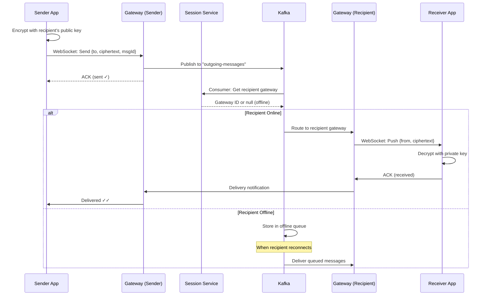
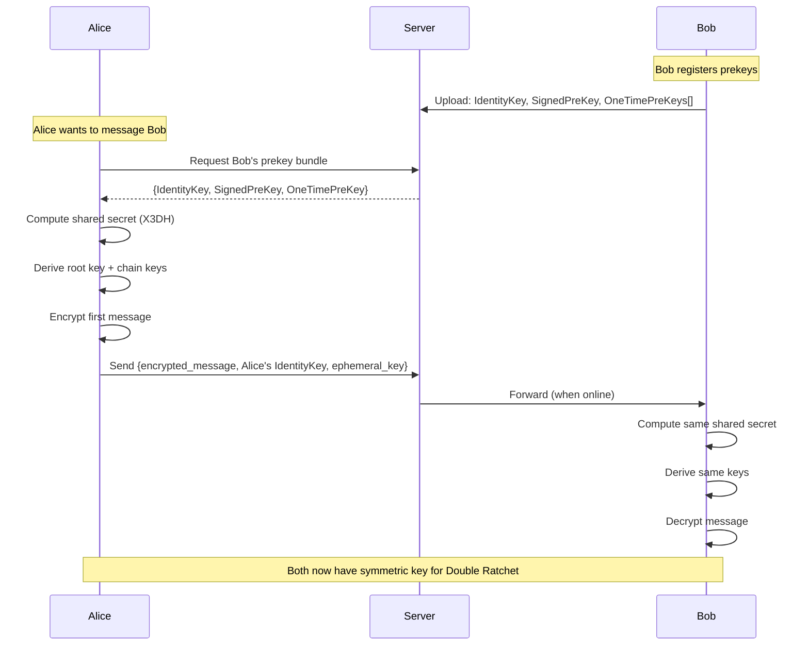

# Design WhatsApp (Messaging System)

> **Model Interview Answer** - This document demonstrates L4/L5 level depth with complete BOTE, SLOs, failure modes, and runbooks.

---

## 1. Requirements Clarification (5 min)

### 1.1 Functional Requirements

**Core Messaging**:

- 1-on-1 text messaging with real-time delivery
- Group chat (up to 1024 members)
- Media sharing (images, videos, documents)
- Message status: Sent ✓, Delivered ✓✓, Read (blue ✓✓)

**Presence & Status**:

- Online/offline status and "last seen"
- Typing indicators
- Status/Stories (24-hour ephemeral content)

**Additional Features**:

- Message history sync across devices
- Push notifications for offline users
- End-to-end encryption (E2EE)

### 1.2 Non-Functional Requirements

| Requirement | Target | Rationale |
|-------------|--------|-----------|
| **Availability** | 99.99% | Communication is critical |
| **Message Delivery** | < 500ms (online users) | Real-time feel |
| **Ordering** | Guaranteed per conversation | Messages must appear in order |
| **Consistency** | Eventual (with ordering) | Prioritize availability |
| **Durability** | No message loss | Users expect reliability |
| **Privacy** | E2E encrypted | Server cannot read content |

### 1.3 Scope

**In Scope**: 1-on-1 chat, group chat, presence, message storage
**Out of Scope**: Voice/video calls, payments, business API

---

## 2. Capacity Estimation (5 min)

### 2.1 User Scale

```
Total Users:         2 Billion registered
Monthly Active:      1.5 Billion MAU
Daily Active:        500 Million DAU
Peak Concurrent:     100 Million connections
```

### 2.2 Message Volume

```
Messages/Day:        100 Billion
Average Message:     100 bytes (text), 100KB (media ~10%)

Text Messages:       90B × 100B = 9 TB/day
Media Messages:      10B × 100KB = 1 PB/day (stored in blob storage)

Messages/Second:
- Average: 100B / 86400 = 1.16M msg/sec
- Peak (2x): 2.3M msg/sec
```

### 2.3 Connection Load

```
Concurrent Connections:  100M peak
Per Gateway Server:      500K connections (with epoll optimization)
Gateway Servers Needed:  100M / 500K = 200 servers minimum
With redundancy (2x):    400 gateway servers globally
```

### 2.4 Storage Estimation

```
Message Retention:       30 days (server-side for sync)
Daily Text Storage:      9 TB
30-Day Storage:          9 × 30 = 270 TB messages

Metadata per Message:    200 bytes (sender, receiver, timestamp, status, etc.)
Daily Metadata:          100B × 200B = 20 TB/day
30-Day Metadata:         600 TB

Total Hot Storage:       ~1 PB (messages + metadata)
```

### 2.5 Database Throughput

```
Write QPS (messages):    1.16M/sec
Write QPS (status updates): ~2× messages = 2.3M/sec (sent, delivered, read)
Total Write QPS:         ~3.5M/sec

Cassandra Node Capacity: ~20K writes/sec per node
Nodes Needed:            3.5M / 20K = 175 nodes minimum
With RF=3:               175 × 3 = 525 Cassandra nodes
```

### 2.6 BOTE Summary Table

| Resource | Calculation | Result |
|----------|-------------|--------|
| Message QPS | 100B / 86400 × 2 (peak) | 2.3M msg/sec |
| Status Update QPS | 2× message QPS | 4.6M/sec |
| Concurrent Connections | 100M peak | 400 gateway servers |
| Daily Text Storage | 90B × 100B | 9 TB/day |
| Media Storage | 10B × 100KB | 1 PB/day |
| 30-Day Hot Storage | Messages + metadata | ~1 PB |
| Cassandra Nodes | 3.5M QPS ÷ 20K × RF3 | 500+ nodes |

---

## 3. SLOs & Operational Targets

### 3.1 Service Level Objectives

| Service | SLI | Target | Error Budget |
|---------|-----|--------|--------------|
| **Gateway** | Connection success rate | 99.99% | 4.3 min/month |
| **Message Delivery** | Online user delivery | 99.9% within 500ms | 43 min/month |
| **Message Delivery** | Offline user (when online) | 99.99% eventually | - |
| **Message Store** | Write success rate | 99.999% | 26 sec/month |
| **Presence** | Accuracy | 95% within 10 sec | - |
| **Group Fanout** | Delivery to all members | 99.9% within 2 sec | - |

### 3.2 Key Metrics to Monitor

```
Gateway Service:
- active_connections_total
- connection_rate_per_second
- connection_errors{reason}
- websocket_message_latency_ms

Message Service:
- messages_sent_total{type: text/media}
- message_delivery_latency_ms (p50, p99)
- messages_queued_offline
- delivery_failures{reason}

Cassandra:
- write_latency_ms (p99)
- read_latency_ms (p99)
- pending_compactions
- disk_usage_percent
```

### 3.3 Alerting Thresholds

| Alert | Condition | Severity |
|-------|-----------|----------|
| Message delivery latency p99 > 1s | 5 min window | P1 - Page |
| Delivery failure rate > 0.1% | 5 min window | P1 - Page |
| Gateway connection errors > 1% | 5 min window | P1 - Page |
| Cassandra write latency p99 > 50ms | 10 min window | P2 - Ticket |
| Offline queue depth > 1M messages | Any region | P2 - Ticket |
| Gateway connections > 80% capacity | Per server | P2 - Ticket |

---

## 4. High-Level Architecture (10 min)

### 4.1 Architecture Diagram

```
┌─────────────────────────────────────────────────────────────────────────┐
│                              CLIENTS                                     │
├─────────────────────────────────────────────────────────────────────────┤
│  ┌──────────────┐    ┌──────────────┐    ┌──────────────┐              │
│  │  Mobile App  │    │  Web Client  │    │  Desktop App │              │
│  │  (iOS/Android)│    │  (Browser)   │    │  (Electron)  │              │
│  └──────┬───────┘    └──────┬───────┘    └──────┬───────┘              │
└─────────┼───────────────────┼───────────────────┼───────────────────────┘
          │ WebSocket         │ WebSocket         │ WebSocket
          ▼                   ▼                   ▼
┌─────────────────────────────────────────────────────────────────────────┐
│                         EDGE LAYER                                       │
│  ┌─────────────────────────────────────────────────────────────────┐   │
│  │                    Global Load Balancer                          │   │
│  │              (GeoDNS → Regional LB → Gateway)                    │   │
│  └─────────────────────────────────────────────────────────────────┘   │
│                                 │                                        │
│         ┌───────────────────────┼───────────────────────┐               │
│         ▼                       ▼                       ▼               │
│  ┌─────────────┐         ┌─────────────┐         ┌─────────────┐       │
│  │ Gateway US  │         │ Gateway EU  │         │ Gateway Asia│       │
│  │ (100 nodes) │         │ (80 nodes)  │         │ (120 nodes) │       │
│  └──────┬──────┘         └──────┬──────┘         └──────┬──────┘       │
└─────────┼───────────────────────┼───────────────────────┼───────────────┘
          │                       │                       │
          └───────────────────────┼───────────────────────┘
                                  ▼
┌─────────────────────────────────────────────────────────────────────────┐
│                        SESSION LAYER                                     │
│  ┌─────────────────────────────────────────────────────────────────┐   │
│  │                   Session Service (Redis Cluster)                │   │
│  │     user_id → {gateway_id, connection_id, last_seen}            │   │
│  └─────────────────────────────────────────────────────────────────┘   │
└─────────────────────────────────────────────────────────────────────────┘
                                  │
                                  ▼
┌─────────────────────────────────────────────────────────────────────────┐
│                       MESSAGING LAYER                                    │
│                                                                          │
│  ┌──────────────┐    ┌──────────────┐    ┌──────────────┐              │
│  │ Message      │    │ Group        │    │ Presence     │              │
│  │ Router       │    │ Service      │    │ Service      │              │
│  └──────┬───────┘    └──────┬───────┘    └──────┬───────┘              │
│         │                   │                   │                       │
│         └───────────────────┼───────────────────┘                       │
│                             ▼                                            │
│  ┌─────────────────────────────────────────────────────────────────┐   │
│  │                    Message Queue (Kafka)                         │   │
│  │   Topics: messages, group-fanout, notifications, sync           │   │
│  └─────────────────────────────────────────────────────────────────┘   │
└─────────────────────────────────────────────────────────────────────────┘
                                  │
                                  ▼
┌─────────────────────────────────────────────────────────────────────────┐
│                        STORAGE LAYER                                     │
│                                                                          │
│  ┌──────────────────┐  ┌──────────────────┐  ┌──────────────────┐      │
│  │ Message Store    │  │ User Metadata    │  │ Media Store      │      │
│  │ (Cassandra)      │  │ (PostgreSQL)     │  │ (S3/Blob)        │      │
│  │                  │  │                  │  │                  │      │
│  │ Partition: chatId│  │ Users, Groups    │  │ Images, Videos   │      │
│  │ RF=3             │  │ Contacts         │  │ + CDN            │      │
│  └──────────────────┘  └──────────────────┘  └──────────────────┘      │
└─────────────────────────────────────────────────────────────────────────┘
                                  │
                                  ▼
┌─────────────────────────────────────────────────────────────────────────┐
│                      OFFLINE DELIVERY                                    │
│  ┌──────────────────┐                    ┌──────────────────┐          │
│  │ Offline Queue    │───────────────────▶│ Push Notification │          │
│  │ (Redis/Kafka)    │                    │ (APNS/FCM)       │          │
│  └──────────────────┘                    └──────────────────┘          │
└─────────────────────────────────────────────────────────────────────────┘
```

### 4.2 Component Responsibilities

| Component | Responsibility | Tech Choice | Scale |
|-----------|---------------|-------------|-------|
| **Gateway** | WebSocket connections, message relay | Erlang/Go | 400 servers, 500K conn each |
| **Session Service** | User→Gateway mapping | Redis Cluster | 50 nodes |
| **Message Router** | Route to recipient gateway | Go | 100 instances |
| **Group Service** | Group membership, fanout | Go + PostgreSQL | 50 instances |
| **Presence Service** | Online/offline status | Redis + Go | 30 instances |
| **Message Store** | Message persistence | Cassandra | 500+ nodes |
| **Kafka** | Async processing, fanout | Kafka | 100+ brokers |

---

## 5. API Design (5 min)

### 5.1 WebSocket Protocol

```javascript
// Connection handshake
WS wss://chat.whatsapp.com/v1/connect
Headers: Authorization: Bearer <jwt_token>

// Client → Server Messages
{
  "type": "message",
  "id": "msg_uuid",           // Client-generated for idempotency
  "to": "user_id or group_id",
  "content": {
    "type": "text",           // text, image, video, document
    "body": "Hello!",
    "encrypted": true
  },
  "timestamp": 1705234567890
}

{
  "type": "ack",
  "message_id": "msg_uuid",
  "status": "delivered"       // delivered, read
}

{
  "type": "presence",
  "status": "typing",         // online, typing, stopped_typing
  "to": "user_id"
}

// Server → Client Messages
{
  "type": "message",
  "id": "msg_uuid",
  "from": "sender_user_id",
  "content": {...},
  "timestamp": 1705234567890,
  "server_timestamp": 1705234567900
}

{
  "type": "status",
  "message_id": "msg_uuid",
  "status": "sent"            // sent, delivered, read
}

{
  "type": "presence",
  "user_id": "user_id",
  "status": "online",
  "last_seen": 1705234567890
}
```

### 5.2 REST APIs (for non-realtime operations)

```http
# Sync messages (when reconnecting)
GET /v1/messages/sync?since=<timestamp>&limit=100
Returns: { messages: [...], has_more: true, next_cursor: "..." }

# Upload media (returns media_id for message)
POST /v1/media/upload
Content-Type: multipart/form-data
Body: { file: <binary>, type: "image" }
Returns: { media_id: "...", url: "...", expires_at: "..." }

# Group management
POST /v1/groups
Body: { name: "...", members: ["user1", "user2"] }

POST /v1/groups/{group_id}/members
Body: { user_ids: ["user3"] }

# User profile
GET /v1/users/{user_id}/profile
PUT /v1/users/me/profile
```

---

## 6. Deep Dive: Message Delivery Flow

### 6.1 1-on-1 Message Flow

```
  User A                Gateway A            Session           Message         Gateway B           User B
    │                      │                 Service            Router            │                  │
    │                      │                   │                  │               │                  │
    │──WS: send msg────────▶                   │                  │               │                  │
    │                      │                   │                  │               │                  │
    │                      │──1. Persist to Kafka (async)────────▶│               │                  │
    │                      │                   │                  │               │                  │
    │◀──WS: status=sent────│                   │                  │               │                  │
    │                      │                   │                  │               │                  │
    │                      │                   │     2. Consume───▶               │                  │
    │                      │                   │                  │               │                  │
    │                      │                   │◀─3. Get B's gateway              │                  │
    │                      │                   │  {gateway: B, conn: 123}         │                  │
    │                      │                   │                  │               │                  │
    │                      │                   │                  │──4. Route────▶│                  │
    │                      │                   │                  │               │                  │
    │                      │                   │                  │               │──WS: message────▶│
    │                      │                   │                  │               │                  │
    │                      │                   │                  │               │◀──WS: ack────────│
    │                      │                   │                  │               │                  │
    │                      │                   │                  │◀──delivered───│                  │
    │                      │                   │                  │               │                  │
    │◀──WS: status=delivered──────────────────────────────────────│               │                  │
```

### 6.2 Offline User Handling

```python
def route_message(message):
    recipient = message.to
    
    # 1. Check if recipient is online
    session = session_service.get(recipient)
    
    if session and session.is_connected():
        # 2a. Online: Route directly
        gateway = get_gateway(session.gateway_id)
        success = gateway.deliver(session.connection_id, message)
        
        if success:
            update_status(message.id, "delivered")
            return
    
    # 2b. Offline: Queue for later + push notification
    offline_queue.enqueue(recipient, message)
    
    # 3. Send push notification (summary, not content due to E2EE)
    push_service.notify(
        user_id=recipient,
        title="New message",
        body="You have a new message",  # No content - E2EE
        badge=offline_queue.count(recipient)
    )
    
    # 4. When user comes online
    # Gateway calls: offline_queue.drain(user_id)
    # and delivers all pending messages
```

### 6.3 Group Message Fanout

```python
def fanout_group_message(message, group_id):
    # 1. Get group members (cached, refreshed on membership change)
    members = group_service.get_members(group_id)  # Up to 1024
    
    # 2. Exclude sender
    recipients = [m for m in members if m != message.sender]
    
    # 3. Batch by gateway to reduce network calls
    gateway_batches = {}
    offline_recipients = []
    
    for recipient in recipients:
        session = session_service.get(recipient)
        if session and session.is_connected():
            gateway_id = session.gateway_id
            if gateway_id not in gateway_batches:
                gateway_batches[gateway_id] = []
            gateway_batches[gateway_id].append((recipient, session.connection_id))
        else:
            offline_recipients.append(recipient)
    
    # 4. Send to each gateway in parallel
    for gateway_id, batch in gateway_batches.items():
        gateway = get_gateway(gateway_id)
        gateway.deliver_batch(batch, message)  # Single network call
    
    # 5. Queue offline recipients
    for recipient in offline_recipients:
        offline_queue.enqueue(recipient, message)
        push_service.notify(recipient, "New group message")
    
    # 6. Track delivery stats
    metrics.record_fanout(
        group_id=group_id,
        total=len(recipients),
        online=len(recipients) - len(offline_recipients),
        offline=len(offline_recipients)
    )
```

**Fanout Complexity**:

```
Small group (10 members):   O(10) - instant
Medium group (100 members): O(100) - ~10ms
Large group (1024 members): O(1024) - ~50-100ms

Optimization: For very large groups, use Kafka topic per group
Members subscribe to group topic, consume independently
```

---

## 7. Deep Dive: Data Model & Storage

### 7.1 Cassandra Message Schema

```sql
-- Messages table (partitioned by conversation)
CREATE TABLE messages (
    conversation_id UUID,       -- hash(min(user_a, user_b), max(user_a, user_b)) for 1-on-1
                                -- group_id for groups
    message_id TIMEUUID,        -- Time-based UUID for ordering
    sender_id UUID,
    message_type TEXT,          -- 'text', 'image', 'video', etc.
    content BLOB,               -- Encrypted content
    media_url TEXT,             -- For media messages
    status MAP<UUID, TEXT>,     -- {recipient_id: 'delivered'/'read'}
    created_at TIMESTAMP,
    
    PRIMARY KEY (conversation_id, message_id)
) WITH CLUSTERING ORDER BY (message_id DESC);

-- Partition sizing:
-- Active chat: ~100 msgs/day × 30 days = 3000 rows per partition
-- 100 bytes/msg = 300KB per partition = GOOD (< 100MB recommended)
```

### 7.2 Conversation ID Generation

```python
def get_conversation_id(user_a, user_b):
    """
    Consistent ID regardless of who sends first.
    Uses smaller UUID first to ensure consistency.
    """
    if user_a < user_b:
        return hash(f"{user_a}:{user_b}")
    else:
        return hash(f"{user_b}:{user_a}")

def get_group_conversation_id(group_id):
    return group_id  # Groups use their ID directly
```

### 7.3 Session Storage (Redis)

```
# User session (where are they connected?)
Key: session:{user_id}
Value: {
    "gateway_id": "gateway-us-east-1-042",
    "connection_id": "conn_abc123",
    "connected_at": 1705234567,
    "last_active": 1705234890,
    "device_type": "ios"
}
TTL: 86400 (24 hours, refreshed on activity)

# Presence (are they online?)
Key: presence:{user_id}
Value: "online" | "offline"
TTL: 30 (seconds, refreshed by heartbeat)

# Last seen
Key: lastseen:{user_id}
Value: 1705234567890 (timestamp)
TTL: 2592000 (30 days)
```

### 7.4 Offline Queue (Redis List)

```
Key: offline:{user_id}
Value: List of message IDs

# When user goes offline
RPUSH offline:user123 msg_id_1 msg_id_2 msg_id_3

# When user comes online (atomic drain)
messages = LRANGE offline:user123 0 -1
DEL offline:user123

# Also store full message in separate key with TTL
Key: msg:{msg_id}
Value: {full message JSON}
TTL: 2592000 (30 days)
```

---

## 8. Deep Dive: Presence & Typing Indicators

### 8.1 Presence Architecture

```
                    ┌─────────────────┐
                    │  Presence Cache │
                    │     (Redis)     │
                    └────────┬────────┘
                             │
         ┌───────────────────┼───────────────────┐
         │                   │                   │
         ▼                   ▼                   ▼
   ┌──────────┐        ┌──────────┐        ┌──────────┐
   │ Gateway 1│        │ Gateway 2│        │ Gateway 3│
   └────┬─────┘        └────┬─────┘        └────┬─────┘
        │                   │                   │
   Client                Client              Client
 (heartbeat             (heartbeat           (heartbeat
  every 5s)              every 5s)            every 5s)
```

### 8.2 Heartbeat Flow

```python
# Client sends heartbeat every 5 seconds
SETEX presence:{user_id} 30 "online"

# If 30 seconds pass without heartbeat = offline
# TTL handles automatic expiration

# Last seen updated on any activity (more efficient than heartbeat)
def on_user_activity(user_id, activity_type):
    current_time = time.now()
    
    # Only update last_seen if changed by > 60 seconds
    # Reduces Redis writes significantly
    cached_time = cache.get(f"lastseen_local:{user_id}")
    if not cached_time or current_time - cached_time > 60:
        redis.set(f"lastseen:{user_id}", current_time)
        cache.set(f"lastseen_local:{user_id}", current_time)
```

### 8.3 Typing Indicators (Ephemeral)

```python
# Typing indicators are NOT persisted
# Sent directly via WebSocket, P2P through gateways

def handle_typing_indicator(from_user, to_user, is_typing):
    session = session_service.get(to_user)
    
    if not session or not session.is_connected():
        return  # Don't queue typing indicators for offline users
    
    gateway = get_gateway(session.gateway_id)
    gateway.send(session.connection_id, {
        "type": "presence",
        "user_id": from_user,
        "status": "typing" if is_typing else "stopped_typing",
        "expires_in": 10  # Auto-expire client-side
    })
```

---

## 9. Failure Modes & Runbooks

### 9.1 Failure Scenarios

| Failure | Impact | Detection | Mitigation |
|---------|--------|-----------|------------|
| Gateway crash | Users disconnect, reconnect to different gateway | Health check fails | Users auto-reconnect, session updated |
| Redis (session) down | Can't route to users | Redis health check | Fallback to broadcast to likely gateways |
| Cassandra slow | Message persist delayed | Write latency > 50ms | Increase consistency level to LOCAL_ONE |
| Kafka lag | Delayed message delivery | Consumer lag metric | Scale consumers, increase partitions |
| Network partition | Region isolated | Cross-region health | Serve locally, sync when healed |

### 9.2 Runbook: Message Delivery Latency Spike

```markdown
## Alert: Message Delivery p99 > 1s (P1)

### Symptoms
- Users complain messages are slow
- "Sent" status appears but "Delivered" delayed
- Dashboard shows latency spike

### Diagnosis Steps

1. Check Kafka consumer lag:
   `kafka-consumer-groups --describe --group message-router`
   
   - Lag > 100K messages: Consumer bottleneck
   
2. Check Session Service (Redis):
   `redis-cli INFO stats | grep instantaneous_ops`
   
   - Ops > 500K/sec: Redis overloaded
   - Check if session lookups timing out

3. Check Gateway connections:
   `kubectl top pods -l app=gateway`
   
   - CPU > 80%: Gateway overloaded
   - Check WebSocket queue depths

4. Check Cassandra:
   `nodetool tpstats | grep -i pending`
   
   - High pending writes: Cassandra bottleneck

### Mitigation

1. **If Kafka lag**:
   - Scale consumer pods: `kubectl scale deployment message-router --replicas=50`
   - Increase partition count if persistent

2. **If Redis overloaded**:
   - Add read replicas for session lookups
   - Enable local caching in routers (TTL=5s)

3. **If Gateway overloaded**:
   - Add gateway nodes
   - Enable connection shedding for lowest-activity users

4. **If Cassandra slow**:
   - Temporarily reduce consistency to ANY (risk: potential loss)
   - Add nodes to cluster

### Rollback
- N/A (no deployment change)

### Escalation
- > 5 min at p99 > 2s: Page secondary
- > 15 min: Incident commander
```

### 9.3 Runbook: Gateway Failure

```markdown
## Alert: Gateway Node Unresponsive (P1)

### Context
Each gateway handles ~500K connections.
Node failure = 500K users temporarily disconnected.

### Automatic Recovery
1. Load balancer health check fails (10s)
2. LB removes node from rotation
3. Clients detect WebSocket close
4. Clients auto-reconnect to different gateway
5. New gateway updates session service
6. Reconnect time: ~5-15 seconds for most users

### Manual Intervention (if auto-recovery fails)

1. Verify node status:
   `kubectl get pod gateway-xyz -o wide`
   
2. Check for correlated failures:
   `kubectl get pods -l app=gateway | grep -v Running`
   
3. If multiple failures:
   - Check node (EC2/VM) status
   - Check network connectivity
   - Check for deployment in progress

4. Force session cleanup if stale:
   ```bash
   # Find affected sessions
   redis-cli KEYS "session:*" | xargs -I {} redis-cli HGET {} gateway_id | grep "gateway-xyz" | wc -l
   
   # Clean stale sessions (careful!)
   # Users will reconnect and get new session
   ```

### Communication

- If > 1% users affected: Status page update
- If > 5 min: Notify customer support

```

### 9.4 Degraded Mode Operation

```markdown
## Graceful Degradation Strategies

### Level 1: High Load
- Disable typing indicators (ephemeral, not critical)
- Reduce presence update frequency (5s → 15s)
- Batch status updates (sent/delivered/read)

### Level 2: Partial Outage
- Disable "last seen" updates
- Queue group fanout (delay up to 30s acceptable)
- Serve cached user profiles

### Level 3: Regional Failure
- Redirect traffic to nearest healthy region
- Accept increased latency (cross-region)
- Queue messages for failed region users
- Sync when region recovers

### Data Consistency During Degradation
- Messages always persisted before ACK to sender
- Delivery status may be delayed but eventually consistent
- Ordering preserved via TIMEUUID in Cassandra
```

---

## 10. End-to-End Encryption (E2EE)

### 10.1 Signal Protocol Overview

```
┌──────────────────────────────────────────────────────────────┐
│                    KEY GENERATION                            │
│                                                              │
│  User A generates:              User B generates:            │
│  - Identity Key (long-term)     - Identity Key (long-term)   │
│  - Signed Pre-Key (medium)      - Signed Pre-Key (medium)    │
│  - One-Time Pre-Keys (100+)     - One-Time Pre-Keys (100+)   │
│                                                              │
│  Public keys uploaded to server (server never sees private)  │
└──────────────────────────────────────────────────────────────┘
                              │
                              ▼
┌──────────────────────────────────────────────────────────────┐
│                    MESSAGE ENCRYPTION                        │
│                                                              │
│  1. A fetches B's public keys from server                   │
│  2. A derives shared secret using X3DH (Extended Triple DH) │
│  3. A encrypts message with shared secret                   │
│  4. A sends encrypted blob to server                        │
│  5. Server relays encrypted blob to B (cannot decrypt)      │
│  6. B decrypts using shared secret                          │
│                                                              │
│  Forward Secrecy: Keys rotate with each message (ratchet)   │
└──────────────────────────────────────────────────────────────┘
```

### 10.2 Server's Limitations

```
What server CAN see:           What server CANNOT see:
- Who is messaging whom        - Message content
- Message timestamps           - Media content
- Message sizes                - Read receipts (encrypted)
- User online status           - Typing indicators (encrypted metadata)
- Group membership             - Private group names (if encrypted)
```

---

## 11. Trade-offs Summary

| Decision | Choice | Trade-off |
|----------|--------|-----------|
| **Protocol** | WebSocket | Persistent connections (costly) but real-time delivery |
| **Message Store** | Cassandra | High write throughput, but no transactions |
| **Session Store** | Redis | Fast lookups, but memory cost at 100M users |
| **Ordering** | TIMEUUID | Globally unique + sortable, but clock sync required |
| **E2EE** | Signal Protocol | Privacy, but server can't moderate content |
| **Offline Queue** | Redis List | Fast, but durability risk (use AOF) |
| **Group Fanout** | Server-side | Simple client, but O(N) server work |

---

## 12. Security & Threat Model

### Attack Vectors

| Threat | Attack | Mitigation |
|--------|--------|------------|
| **Key Compromise** | Steal device to get private keys | Device encryption, PIN/biometric unlock |
| **MITM Attack** | Intercept key exchange | Safety number verification, key fingerprints |
| **Metadata Leakage** | Analyze who talks to whom, when | Sealed sender (hide sender from server) |
| **Spam/Abuse** | Send unsolicited messages | Rate limiting, report mechanism, ML detection |
| **Account Takeover** | SIM swap, steal phone | 2FA, registration lock, device verification |
| **Message Replay** | Resend old messages | Sequence numbers, HMAC, replay detection |

### E2EE Security Model

```yaml
Key Exchange:
  - X3DH protocol for initial handshake
  - Each party has identity key + signed prekey + one-time prekeys
  - Server never sees plaintext or symmetric keys

Message Encryption:
  - Signal Protocol (Double Ratchet)
  - New encryption key per message (forward secrecy)
  - AES-256-CBC for message content

Group Encryption:
  - Sender Keys: one key per member pair
  - On member change: rotate group key

Verification:
  - Safety numbers derived from key pairs
  - QR code or 60-digit number comparison
  - Alert on key change (new device)
```

### What Server CAN See (Metadata)

```markdown
- Who is messaging whom (sender, recipient IDs)
- When messages are sent (timestamps)
- Message size (but not content)
- Online/offline status
- Group membership

What Server CANNOT See:
- Message content (encrypted)
- Media content (encrypted)
- Call audio/video (encrypted)
```

---

## 13. Sequence Diagrams

### Message Delivery Flow



### Key Exchange (X3DH)



---

## 14. Data Schema

### Cassandra Tables

```mermaid
erDiagram
    MESSAGES {
        uuid conversation_id PK "Partition key"
        timeuuid message_id CK "Clustering key (ordering)"
        uuid sender_id
        blob ciphertext "Encrypted content"
        string content_type "text/image/video"
        timestamp created_at
        boolean deleted
    }
    
    CONVERSATIONS {
        uuid user_id PK
        uuid conversation_id CK
        uuid other_user_id "For 1-1"
        uuid group_id "For groups"
        timeuuid last_message_id
        timestamp last_activity
    }
    
    GROUPS {
        uuid group_id PK
        string name
        uuid creator_id
        timestamp created_at
        set participants "Set of user_ids"
    }
    
    USERS {
        uuid user_id PK
        string phone_number
        string display_name
        blob identity_public_key
        blob signed_prekey
        timestamp last_seen
    }
```

### Redis Structures

```
# Session mapping (hash)
session:{user_id}:
  gateway_id: "gateway-12"
  connected_at: 1642531200
  device_id: "abc123"

# Offline message queue (list)
offline:{user_id}: [msg1, msg2, msg3]

# Presence (string with TTL)
presence:{user_id}: "online"
TTL: 60 seconds (heartbeat refresh)

# Typing indicator (string with TTL)
typing:{conversation_id}:{user_id}: "1"
TTL: 3 seconds
```

---

## 15. Cost Estimate (Monthly)

### Assumptions

- 2B users, 100M DAU, 100M concurrent connections
- 100B messages/day, 500ms avg delivery

| Resource | Quantity | Unit Cost | Monthly Cost |
|----------|----------|-----------|--------------|
| **Gateway Servers** (c5n.4xlarge) | 400 instances | $0.86/hr | $247,680 |
| **Cassandra Cluster** (i3.2xlarge) | 500 nodes | $0.62/hr | $223,200 |
| **Redis Cluster** (r6g.2xlarge) | 100 nodes | $0.52/hr | $37,440 |
| **Kafka (MSK)** | 50 brokers | $0.42/hr | $15,120 |
| **Load Balancers** (NLB) | 20 | $16/mo each | $320 |
| **Data Transfer** | 500 TB | $0.02/GB | $10,240 |
| **Push Notifications** | 10B/month | ~$0 | $0 |
| **S3** (media storage) | 10 PB | $0.023/GB | $235,520 |
| **Total** | | | **~$769,520/month** |

### Cost Optimization

- Spot instances for non-critical batch processing
- Reserved capacity for gateway/Cassandra
- Media compression before upload
- CDN for media delivery

---

## 12. Interview Presentation Tips

```markdown
### Opening (30 sec)
"WhatsApp is a real-time messaging platform handling 100B messages/day.
The key challenges are:
1) Real-time delivery at 2.3M msg/sec
2) Maintaining 100M concurrent WebSocket connections
3) Message ordering and delivery guarantees
4) End-to-end encryption where server can't read content"

### Key Talking Points
- "I'll use WebSocket for persistent bi-directional communication"
- "Session service maps user → gateway for message routing"
- "Cassandra with TIMEUUID ensures message ordering"
- "For E2EE, I'll use Signal Protocol with key exchange"

### Numbers to Remember
- 100B messages/day = 2.3M msg/sec peak
- 100M concurrent connections = 400 gateway servers
- 500K connections per gateway (epoll optimization)
- 500+ Cassandra nodes with RF=3
- Message delivery < 500ms for online users

### Common Follow-ups
Q: "How do you handle message ordering in groups?"
A: "TIMEUUID provides global ordering. Server timestamp used as tiebreaker."

Q: "What if a gateway fails mid-message?"
A: "Kafka provides durability. Message retried from last checkpoint."

Q: "How do you scale the session service?"
A: "Redis Cluster with consistent hashing. Shard by user_id."
```
