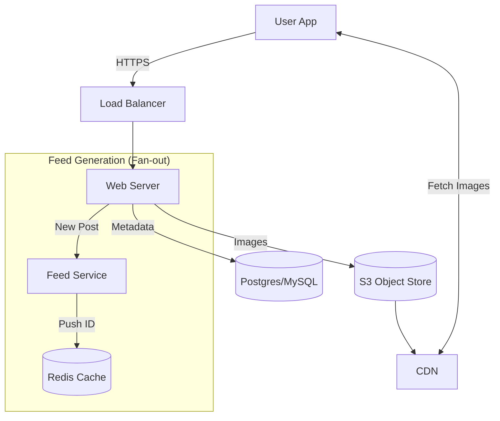

# Design Instagram (Photo Sharing & News Feed)

## 1. Requirements

### Functional

1. **Upload**: Photos/Videos.
2. **View**: Feed of followed users.
3. **Search**: Users, Hashtags.
4. **Like/Comment**: Interactions.

### Non-Functional

1. **High Availability**.
2. **Latency**: Feed generation < 200ms.
3. **Reliability**: Never lose a photo.

## 2. Capacity Estimation

- 500M Active Users.
- 10M Photos uploaded/day.
- Read Heavy: Users view feed much more than upload.
- Storage: 10M * 200KB = 2TB/day. 730TB/year. Need Object Storage (S3).

## 3. High-Level Architecture

1. **Object Storage**: S3/GCS/Azure Blob for actual image files.
2. **Metadata DB**: Stores User info, Photo Metadata (Path in S3, Lat, Lon, UserID).
3. **Graph DB** (Optional): For "Follow" relationships (Neo4j / TAO). Or use RDBMS with join tables.
4. **Feed Service**: Generates the home timeline.

### Architecture Diagram

## 4. Key Components

### A. Database Schema (Metadata)

- **Users**: `ID`, `Name`, `Loc`.
- **Photos**: `ID`, `UserID`, `S3Path`, `Lat`, `Lon`, `Time`.
- **Followers**: `FollowerID`, `FolloweeID`.

**Sharding**:

- Partition by `UserID`. All photos of a user live on same shard.
- *Issue*: Hot User (Celebrity) - one shard gets too much access.
- *Alternative*: Generate unique `PhotoID` (Snowflake/KGS) and shard by `PhotoID`.

### B. Feed Generation (The "News Feed" Problem)

#### Approach 1: Pull Model (Fan-out on Load)

- When User A opens app: Query "Following" table -> Get list of 500 friends -> Query "Photos" table for those 500 friends -> Merge & Sort by Time.
- **Pros**: Simple, realtime.
- **Cons**: Write efficient, Read heavy/slow. DB timeout if following thousands.

#### Approach 2: Push Model (Fan-out on Write) - PREFERRED

- User B uploads photo.
- Service finds all followers of B.
- Push photoID to every follower's "Pre-computed Feed" (Redis List).
- When User A opens app, simply read the Redis List. O(1).
- **Pros**: Instant feed load.
- **Cons**: "Justin Bieber Problem". If user has 10M followers, writing to 10M lists is slow/backlog.

#### Hybrid Approach

- **Normal Users**: Push Model.
- **Celebrities**: Pull Model.
- When generating feed: Fetch pre-computed list + Query recent photos from Celebs I follow -> Merge.

### C. Image Storage & Delivery

- **CDN (Content Delivery Network)**: Cache images geographically closer to users (Cloudfront/Akamai).
- **Compression**: Save multiple resolutions (Thumbnail, Mobile, Desktop) on upload.

## 5. Reliability & Redundancy

- **Photos**: Store multiple replicas in S3 (Cross-region replication).
- **DB**: Master-Slave replication. Use separate Read Replicas to handle the heavy read load.

## 6. Search (ElasticSearch)

- Database not efficient for text search / hashtags.
- Use a dedicated Search Engine (ElasticSearch/Solr).
- Ingest service reads DB writes and updates Index.
