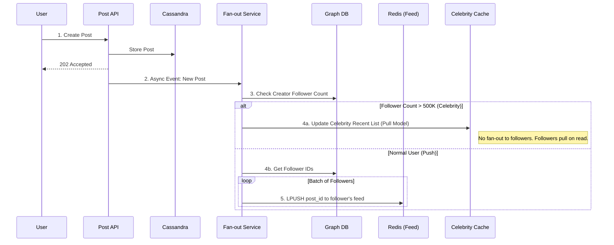
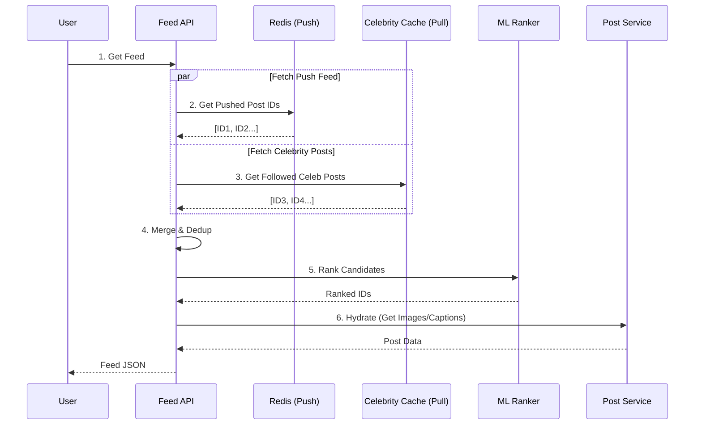
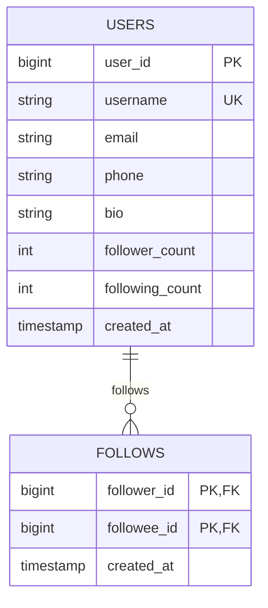

# Design Instagram (Photo Sharing & News Feed)

> **Model Interview Answer** - This document demonstrates L4/L5 level depth with complete BOTE, SLOs, failure modes, and runbooks.

---

## 1. Requirements Clarification (5 min)

### 1.1 Functional Requirements

**Content Creation**:

- Upload photos and short videos (up to 60 seconds)
- Apply filters and edit photos
- Add captions, hashtags, and location tags
- Tag other users in posts

**Content Consumption**:

- View personalized home feed
- View user profiles and their posts
- Explore/discover new content
- Search users, hashtags, and locations

**Social Interactions**:

- Follow/unfollow users
- Like and comment on posts
- Direct messaging (out of scope - see WhatsApp design)
- Stories (24-hour ephemeral content)

### 1.2 Non-Functional Requirements

| Requirement | Target | Rationale |
|-------------|--------|-----------|
| **Availability** | 99.99% | Social platform - users expect always-on |
| **Feed Latency** | p99 < 200ms | Infinite scroll needs instant response |
| **Upload Latency** | < 5 sec for photo | User waits during upload |
| **Durability** | 99.999999999% (11 nines) | Never lose a user's photo |
| **Consistency** | Eventual | Feed can be slightly stale |

### 1.3 Scope

**In Scope**: Photo upload, news feed, likes, comments, follow graph, search
**Out of Scope**: Stories, Reels, DMs, Ads, Shopping

---

## 2. Capacity Estimation (5 min)

### 2.1 User Scale

```
Total Users:         2 Billion registered
Monthly Active:      2 Billion MAU
Daily Active:        500 Million DAU
Peak Concurrent:     50 Million
```

### 2.2 Content Upload

```
Photos Uploaded/Day:     100 Million
Average Photo Size:      2 MB (after compression)
Multiple Resolutions:    5 sizes (thumbnail, small, medium, large, original)

Daily Upload Storage:
- Raw: 100M × 2MB = 200 TB/day
- With 5 resolutions: 200 TB × 2.5 = 500 TB/day (not 5× due to smaller sizes)

Upload QPS:              100M / 86400 = 1,160 uploads/sec
Peak (3×):               3,500 uploads/sec
```

### 2.3 Feed Consumption

```
DAU:                     500 Million
Feed Opens/User/Day:     10
Posts per Feed Load:     20

Daily Feed Requests:     500M × 10 = 5 Billion
Feed QPS:                5B / 86400 = 58,000 req/sec
Peak (2×):               116,000 req/sec

Likes per Day:           4 Billion
Like QPS:                46,000/sec (peak: 92,000/sec)

Comments per Day:        500 Million
Comment QPS:             5,800/sec
```

### 2.4 Follow Graph

```
Average Followers:       200 per user
Average Following:       200 per user
Celebrity Followers:     Up to 500 Million (Cristiano Ronaldo)

Total Follow Edges:      2B × 200 = 400 Billion edges
Edge Storage:            400B × 16 bytes = 6.4 TB
```

### 2.5 Storage Estimation

```
Photo Storage (yearly):  500 TB/day × 365 = 180 PB/year
5-Year Retention:        900 PB = 0.9 EB

Metadata per Photo:      1 KB (user_id, caption, location, timestamp, counts)
Daily Metadata:          100M × 1KB = 100 GB/day
Yearly Metadata:         36 TB/year

Feed Cache (Redis):
- 500M DAU × 200 post IDs × 8 bytes = 800 GB
- With metadata: ~2-3 TB Redis cluster
```

### 2.6 BOTE Summary Table

| Resource | Calculation | Result |
|----------|-------------|--------|
| Upload QPS | 100M / 86400 × 3 (peak) | 3,500/sec |
| Feed QPS | 5B / 86400 × 2 (peak) | 116K/sec |
| Like QPS | 4B / 86400 × 2 (peak) | 92K/sec |
| Daily Photo Storage | 100M × 2MB × 2.5 | 500 TB |
| Yearly Photo Storage | 500 TB × 365 | 180 PB |
| Follow Graph Size | 2B × 200 × 16B | 6.4 TB |
| Feed Cache Size | 500M × 200 × 8B × overhead | 2-3 TB |

---

## 3. SLOs & Operational Targets

### 3.1 Service Level Objectives

| Service | SLI | Target | Error Budget |
|---------|-----|--------|--------------|
| **Feed API** | Availability | 99.99% | 4.3 min/month |
| **Feed API** | p99 latency | < 200ms | - |
| **Upload API** | Success rate | 99.9% | 43 min/month |
| **Upload API** | p99 latency | < 5 sec | - |
| **CDN** | Cache hit rate | > 95% | - |
| **Image Storage** | Durability | 99.999999999% | - |
| **Like/Comment** | p99 latency | < 100ms | - |

### 3.2 Key Metrics to Monitor

```yaml
Upload Pipeline:
  - uploads_started_total
  - uploads_completed_total
  - upload_duration_seconds (p50, p99)
  - image_processing_duration_seconds

Feed Service:
  - feed_requests_total
  - feed_latency_ms (p50, p99)
  - feed_cache_hit_rate
  - posts_per_feed (avg)

Engagement:
  - likes_per_second
  - comments_per_second
  - like_latency_ms
  - counter_update_lag_seconds

Fan-out:
  - fanout_queue_depth
  - fanout_latency_seconds
  - fanout_failures_total
```

### 3.3 Alerting Thresholds

| Alert | Condition | Severity |
|-------|-----------|----------|
| Feed p99 > 500ms | 5 min window | P1 - Page |
| Feed cache hit rate < 80% | 15 min window | P1 - Page |
| Upload error rate > 1% | 5 min window | P2 - Ticket |
| Fan-out queue > 1M | Any region | P2 - Ticket |
| Like counter lag > 5 min | Per post | P3 - Monitor |

---

## 4. High-Level Architecture (10 min)

### 4.1 Architecture Diagram

```
┌─────────────────────────────────────────────────────────────────────────┐
│                              CLIENTS                                     │
├─────────────────────────────────────────────────────────────────────────┤
│  ┌──────────────┐         ┌──────────────┐         ┌──────────────┐    │
│  │  Mobile App  │         │  Web Client  │         │  API Partners│    │
│  │  (iOS/Android)│         │  (React)     │         │  (Embed)     │    │
│  └──────┬───────┘         └──────┬───────┘         └──────┬───────┘    │
└─────────┼───────────────────────┼───────────────────────┼──────────────┘
          │                       │                       │
          ▼                       ▼                       ▼
┌─────────────────────────────────────────────────────────────────────────┐
│                         CDN LAYER (Images)                               │
│  ┌─────────────────────────────────────────────────────────────────┐   │
│  │   Cloudfront / Fastly - Images served directly from edge        │   │
│  │   Cache-Control: max-age=31536000 (immutable content)           │   │
│  └─────────────────────────────────────────────────────────────────┘   │
└─────────────────────────────────────────────────────────────────────────┘
          │ (API requests only)
          ▼
┌─────────────────────────────────────────────────────────────────────────┐
│                         API GATEWAY                                      │
│  ┌─────────────────────────────────────────────────────────────────┐   │
│  │  Load Balancer → Auth → Rate Limit → Route                      │   │
│  └─────────────────────────────────────────────────────────────────┘   │
└─────────────────────────────────────────────────────────────────────────┘
          │
          ├──────────────────────┬──────────────────────┐
          ▼                      ▼                      ▼
┌─────────────────┐   ┌─────────────────┐   ┌─────────────────────────────┐
│   FEED SERVICE  │   │  POST SERVICE   │   │     USER SERVICE            │
│                 │   │                 │   │                             │
│ - Generate feed │   │ - Create post   │   │ - User profiles             │
│ - Pagination    │   │ - Like/comment  │   │ - Follow graph              │
│ - Ranking       │   │ - Delete post   │   │ - Privacy settings          │
└────────┬────────┘   └────────┬────────┘   └─────────────┬───────────────┘
         │                     │                          │
         ▼                     ▼                          ▼
┌─────────────────────────────────────────────────────────────────────────┐
│                         FEED GENERATION                                  │
│                                                                          │
│  ┌──────────────────────────────────────────────────────────────────┐  │
│  │                    Fan-out Service                                │  │
│  │   ┌─────────────┐                      ┌─────────────┐           │  │
│  │   │ On New Post │──── Kafka ─────────▶│ Feed Writer │           │  │
│  │   └─────────────┘                      └──────┬──────┘           │  │
│  │                                               │                   │  │
│  │                            ┌──────────────────┘                   │  │
│  │                            ▼                                      │  │
│  │   ┌────────────────────────────────────────────────────────────┐ │  │
│  │   │              FEED CACHE (Redis Cluster)                    │ │  │
│  │   │                                                            │ │  │
│  │   │  user:123:feed → [post_id_1, post_id_2, ..., post_id_200] │ │  │
│  │   │  (Sorted by timestamp, capped at 800 posts)               │ │  │
│  │   └────────────────────────────────────────────────────────────┘ │  │
│  └──────────────────────────────────────────────────────────────────┘  │
└─────────────────────────────────────────────────────────────────────────┘
          │
          ▼
┌─────────────────────────────────────────────────────────────────────────┐
│                         DATA LAYER                                       │
│                                                                          │
│  ┌──────────────────┐  ┌──────────────────┐  ┌──────────────────┐      │
│  │ Post Metadata    │  │ User/Social      │  │ Counters         │      │
│  │ (Cassandra)      │  │ (PostgreSQL)     │  │ (Redis)          │      │
│  │                  │  │                  │  │                  │      │
│  │ - post_id        │  │ - users          │  │ - like_count     │      │
│  │ - user_id        │  │ - followers      │  │ - comment_count  │      │
│  │ - caption        │  │ - following      │  │ - view_count     │      │
│  │ - media_urls     │  │ - blocks         │  │ (async persist)  │      │
│  └──────────────────┘  └──────────────────┘  └──────────────────┘      │
│                                                                          │
│  ┌──────────────────┐  ┌──────────────────┐  ┌──────────────────┐      │
│  │ Media Storage    │  │ Search Index     │  │ Analytics        │      │
│  │ (S3)             │  │ (Elasticsearch)  │  │ (Kafka → Spark)  │      │
│  └──────────────────┘  └──────────────────┘  └──────────────────┘      │
└─────────────────────────────────────────────────────────────────────────┘
```

### 4.2 Component Responsibilities

| Component | Responsibility | Tech Choice | Scale |
|-----------|---------------|-------------|-------|
| **CDN** | Image delivery | Cloudfront/Fastly | Global, 100+ PoPs |
| **Feed Service** | Personalized timeline | Go + Redis | 500 instances |
| **Post Service** | CRUD for posts | Go + Cassandra | 300 instances |
| **User Service** | Profiles, follow graph | Go + PostgreSQL | 200 instances |
| **Fan-out Service** | Feed updates | Go + Kafka | 1000 consumers |
| **Media Storage** | Photo/video files | S3 | Multi-region |
| **Feed Cache** | Pre-computed feeds | Redis Cluster | 500 nodes, 50TB |

---

## 5. API Design (5 min)

### 5.1 Post APIs

```http
# Create a new post
POST /v1/posts
Headers: Authorization: Bearer <token>
Body: {
  "media_ids": ["media_abc123"],    # Pre-uploaded via /media/upload
  "caption": "Beautiful sunset! #nature",
  "location": { "lat": 40.7128, "lon": -74.0060, "name": "NYC" },
  "tagged_users": ["user_456"]
}
Returns: {
  "post_id": "post_xyz789",
  "created_at": "2024-01-15T10:30:00Z",
  "media": [{ "url": "https://cdn.../post_xyz789/large.jpg", ... }]
}

# Upload media (pre-signed URL approach)
POST /v1/media/upload/init
Body: { "content_type": "image/jpeg", "size_bytes": 2048000 }
Returns: {
  "media_id": "media_abc123",
  "upload_url": "https://s3.../presigned-url",
  "expires_at": "2024-01-15T11:00:00Z"
}

# Then client uploads directly to S3, no server bandwidth used

# Get a single post
GET /v1/posts/{post_id}
Returns: {
  "post_id": "...",
  "user": { "id": "...", "username": "...", "avatar_url": "..." },
  "media": [...],
  "caption": "...",
  "like_count": 1234,
  "comment_count": 56,
  "liked_by_me": true,
  "created_at": "..."
}
```

### 5.2 Feed APIs

```http
# Get home feed
GET /v1/feed?cursor=<cursor>&limit=20
Returns: {
  "posts": [
    { "post_id": "...", "user": {...}, "media": [...], ... },
    ...
  ],
  "next_cursor": "eyJ0cyI6MTcwNTIzNDU2N30=",
  "has_more": true
}

# Cursor is base64 encoded: { "ts": 1705234567, "post_id": "last_seen" }
# Enables stable pagination even with new posts arriving
```

### 5.3 Social APIs

```http
# Like a post
POST /v1/posts/{post_id}/like
Returns: { "liked": true, "like_count": 1235 }

# Unlike
DELETE /v1/posts/{post_id}/like

# Follow a user
POST /v1/users/{user_id}/follow
Returns: { "following": true, "follower_count": 1001 }

# Get comments (paginated)
GET /v1/posts/{post_id}/comments?cursor=<cursor>&limit=20
Returns: {
  "comments": [
    { "id": "...", "user": {...}, "text": "...", "created_at": "..." }
  ],
  "next_cursor": "..."
}

# Add comment
POST /v1/posts/{post_id}/comments
Body: { "text": "Great photo!" }
```

---

## 6. Deep Dive: News Feed Generation

### 6.1 The Fan-out Problem

**Challenge**: When User A posts, how do we update the feeds of their 1M followers?

```
Two Approaches:

┌─────────────────────────────────────────────────────────────────────────┐
│                    PULL MODEL (Fan-out on Read)                         │
│                                                                         │
│  User opens app → Query all users I follow → Get their recent posts   │
│                → Merge & rank → Return                                  │
│                                                                         │
│  ✅ Pros: Simple, real-time, no storage for feeds                      │
│  ❌ Cons: Slow for users following 1000s, high DB load                 │
│                                                                         │
│  Latency: O(following_count × posts_per_user)                          │
│  DB Load: 116K feed requests × 200 following = 23M queries/sec 😱      │
└─────────────────────────────────────────────────────────────────────────┘

┌─────────────────────────────────────────────────────────────────────────┐
│                    PUSH MODEL (Fan-out on Write)                        │
│                                                                         │
│  User posts → Get all followers → Write to each follower's feed cache │
│                                                                         │
│  ✅ Pros: Fast reads (O(1)), predictable latency                       │
│  ❌ Cons: Celebrity problem (500M followers = 500M writes)             │
│                                                                         │
│  For 100 avg followers: 3500 posts/sec × 100 = 350K cache writes/sec  │
│  For celebrity (500M): One post = 500M writes = minutes of lag        │
└─────────────────────────────────────────────────────────────────────────┘
```

### 6.2 Hybrid Approach (Instagram's Solution)

```
┌─────────────────────────────────────────────────────────────────────────┐
│                    HYBRID MODEL                                          │
│                                                                         │
│  Classification:                                                        │
│  - Regular User (< 10K followers): PUSH to all followers               │
│  - Celebrity (> 10K followers): DON'T push, merge at read time         │
│                                                                         │
│  On Post:                                                               │
│  1. If regular user → Fan-out to all followers' caches                 │
│  2. If celebrity → Only update "celebrity_posts" cache                 │
│                                                                         │
│  On Feed Read:                                                          │
│  1. Fetch pre-computed feed from cache (regular users' posts)          │
│  2. Fetch recent posts from celebrities I follow                        │
│  3. Merge both lists by timestamp/ranking                               │
│  4. Return top N posts                                                  │
│                                                                         │
│  Math:                                                                  │
│  - Regular: 99% of users, push to 100 avg followers = 350K writes/sec  │
│  - Celebrity: 1% of posts, merge 10-20 celebrity feeds at read time    │
│  - Feed read: Still fast, just ~20 extra queries for celebrities       │
└─────────────────────────────────────────────────────────────────────────┘
```

### 6.3 Feed Cache Data Structure

```python
# Redis data structure for each user's feed
# Key: feed:{user_id}
# Type: Sorted Set (ZSET)
# Score: timestamp (or ranking score)
# Value: post_id

# Example commands:
ZADD feed:user123 1705234567 post_abc
ZADD feed:user123 1705234500 post_def

# Get feed (most recent 20)
ZREVRANGE feed:user123 0 19 WITHSCORES

# Trim old posts (keep only 800)
ZREMRANGEBYRANK feed:user123 0 -801

# Memory estimate:
# 500M DAU × 800 posts × 20 bytes (post_id + score) = 8 TB
# With 50% active at any time: ~4 TB Redis
```

### 6.4 Fan-out Flow Sequence

```
User A                Post Service          Kafka              Fan-out Workers         Redis
   │                        │                 │                      │                   │
   │──POST /posts──────────▶│                 │                      │                   │
   │                        │                 │                      │                   │
   │                        │──1. Save to Cassandra                  │                   │
   │                        │                 │                      │                   │
   │                        │──2. Publish─────▶│                      │                   │
   │                        │   {post_id,     │                      │                   │
   │                        │    user_id,     │                      │                   │
   │                        │    timestamp}   │                      │                   │
   │                        │                 │                      │                   │
   │◀─{post_id, status:ok}──│                 │                      │                   │
   │                        │                 │                      │                   │
   │                        │                 │──3. Consume──────────▶│                   │
   │                        │                 │                      │                   │
   │                        │                 │                      │──4. Get followers─▶│
   │                        │                 │                      │   (from Postgres)  │
   │                        │                 │                      │                   │
   │                        │                 │                      │──5. For each:─────▶│
   │                        │                 │                      │   ZADD feed:{f}    │
   │                        │                 │                      │   {ts} {post_id}   │
   │                        │                 │                      │                   │
   │                        │                 │                      │──6. Trim old──────▶│
   │                        │                 │                      │   ZREMRANGEBYRANK  │
```

### 6.5 Feed Ranking (Beyond Chronological)

```python
def rank_post(post, viewer):
    """
    Instagram doesn't show pure chronological feed.
    ML model ranks posts based on engagement signals.
    """
    base_score = post.timestamp
    
    # Engagement signals
    engagement_boost = 0
    engagement_boost += post.like_count * 0.1
    engagement_boost += post.comment_count * 0.5
    engagement_boost += post.save_count * 1.0  # Saves are high-intent
    
    # Relationship signals
    relationship_boost = 0
    if viewer.frequently_interacts_with(post.author):
        relationship_boost += 100
    if viewer.recently_messaged(post.author):
        relationship_boost += 50
    
    # Recency decay
    hours_old = (now() - post.timestamp).hours
    recency_factor = 1 / (1 + hours_old * 0.1)
    
    # Final score
    return (base_score + engagement_boost + relationship_boost) * recency_factor
```

---

## 7. Deep Dive: Image Processing Pipeline

### 7.1 Upload and Processing Flow

```
┌─────────────────────────────────────────────────────────────────────────┐
│                    IMAGE UPLOAD PIPELINE                                 │
│                                                                          │
│   ┌──────────┐     ┌──────────┐     ┌──────────┐     ┌──────────┐      │
│   │  Client  │────▶│ Init API │────▶│   S3     │────▶│  Lambda  │      │
│   │          │     │          │     │  (Raw)   │     │ Trigger  │      │
│   └──────────┘     └──────────┘     └──────────┘     └────┬─────┘      │
│                                                           │             │
│        ┌──────────────────────────────────────────────────┘             │
│        ▼                                                                 │
│   ┌──────────────────────────────────────────────────────────────────┐ │
│   │                    IMAGE PROCESSOR                                │ │
│   │                                                                   │ │
│   │   1. Validate (format, size, not corrupt)                        │ │
│   │   2. Extract EXIF metadata (camera, GPS, timestamp)              │ │
│   │   3. Scan for prohibited content (ML model)                      │ │
│   │   4. Generate multiple sizes:                                    │ │
│   │      - thumbnail: 150x150                                        │ │
│   │      - small: 320x320                                            │ │
│   │      - medium: 640x640                                           │ │
│   │      - large: 1080x1080                                          │ │
│   │      - original: as uploaded (for zoom)                          │ │
│   │   5. Apply requested filter (if any)                             │ │
│   │   6. Convert to WebP (smaller than JPEG)                         │ │
│   │   7. Upload all versions to S3 (processed bucket)                │ │
│   │   8. Update post metadata with URLs                              │ │
│   │   9. Trigger CDN cache warm for popular regions                  │ │
│   └──────────────────────────────────────────────────────────────────┘ │
│                                                                          │
└─────────────────────────────────────────────────────────────────────────┘

Processing Time: ~2-5 seconds for single image
Parallel: Multiple images processed concurrently
```

### 7.2 Image URL Strategy

```
# Immutable URLs with content-based hash
https://cdn.instagram.com/v/t51.2345-15/
  e35/
  123456789_987654321_7654321098765432109_n.jpg
  ?stp=dst-jpg_e35_s1080x1080
  &_nc_ht=cdn.instagram.com

# Components:
# - Version: t51.2345-15
# - Hash: e35
# - IDs: user_id, media_id, random
# - Format indicator: _n
# - Size transform: s1080x1080

# Benefits:
# - Immutable: Can cache forever (Cache-Control: immutable)
# - Deduplication: Same content = same hash = one storage
# - CDN efficient: Edge caches for 1 year
```

---

## 8. Deep Dive: Like & Counter System

### 8.1 Challenge: High-Volume Counters

```
Problem:
- 4B likes/day = 46K likes/sec (peak: 92K/sec)
- Each like must increment post's like_count
- Naive approach: UPDATE posts SET like_count = like_count + 1

Why this fails:
- Hot posts (celebrity): 10K likes/sec on single row
- Row-level locking: Contention, timeouts
- Cassandra counter: Still ~1K increments/sec per row
```

### 8.2 Solution: Sharded Counters

```python
# Instead of one counter, shard into N sub-counters
# N = 100 for hot posts, N = 1 for regular posts

# Write path (like action)
def like_post(post_id, user_id):
    # 1. Record individual like (for unlike, dedup)
    db.insert("likes", {
        "post_id": post_id,
        "user_id": user_id,
        "timestamp": now()
    })
    
    # 2. Increment sharded counter
    shard = hash(user_id) % get_shard_count(post_id)
    redis.incr(f"like_count:{post_id}:shard:{shard}")
    
    # 3. Publish event for async aggregation
    kafka.publish("likes", {"post_id": post_id, "delta": 1})

# Read path (get like count)
def get_like_count(post_id):
    # Option A: Sum all shards (expensive for hot posts)
    # total = sum(redis.get(f"like_count:{post_id}:shard:{i}") for i in range(N))
    
    # Option B: Use pre-aggregated count (eventual consistency)
    return redis.get(f"like_count:{post_id}:total")

# Aggregator (background job)
def aggregate_counters():
    for post_id in get_active_posts():
        total = sum(
            redis.get(f"like_count:{post_id}:shard:{i}") or 0
            for i in range(get_shard_count(post_id))
        )
        redis.set(f"like_count:{post_id}:total", total)
        
        # Periodically persist to DB
        if should_persist(post_id):
            db.update("posts", {"like_count": total}, where={"id": post_id})
```

### 8.3 Sequence: Like Flow

```
User                 API                  Redis               Cassandra           Kafka
  │                    │                    │                     │                  │
  │──POST /like───────▶│                    │                     │                  │
  │                    │                    │                     │                  │
  │                    │──1. Check if already liked─────────────▶│                  │
  │                    │◀─────────────────────────ot found───────│                  │
  │                    │                    │                     │                  │
  │                    │──2. Record like────────────────────────▶│                  │
  │                    │                    │                     │                  │
  │                    │──3. INCR shard────▶│                     │                  │
  │                    │◀──new count────────│                     │                  │
  │                    │                    │                     │                  │
  │                    │──4. Publish event──────────────────────────────────────────▶│
  │                    │                    │                     │                  │
  │◀──{liked: true}────│                    │                     │                  │
```

---

## 9. Failure Modes & Runbooks

### 9.1 Failure Scenarios

| Failure | Impact | Detection | Mitigation |
|---------|--------|-----------|------------|
| Feed cache (Redis) down | Feeds slow/empty | Health check, latency spike | Fallback to pull model, rebuild cache |
| Fan-out lag > 5 min | New posts don't appear | Kafka consumer lag | Scale consumers, skip old events |
| S3 region outage | Can't upload, some images 404 | AWS status, error rate | Cross-region replication, CDN serves cached |
| Post DB (Cassandra) slow | Uploads fail, posts 404 | Write latency > 100ms | Scale nodes, reduce consistency level |
| Celebrity posts cascade | All fan-out workers busy | Queue depth, latency | Separate queue for celebrities |

### 9.2 Runbook: Feed Cache Failure

```markdown
## Alert: Feed Cache Hit Rate < 50% (P1)

### Symptoms
- Feed latency spike (p99 > 1s)
- Users seeing empty or stale feeds
- Pull-model fallback overloading DB

### Diagnosis Steps

1. Check Redis cluster health:
   `redis-cli -c cluster nodes | grep -v connected`
   
   - Nodes not connected: Cluster partition
   - Check memory usage: `INFO memory`

2. Check if specific users affected:
   - Pattern: All users = cluster issue
   - Pattern: Some users = shard issue

3. Check recent deployments:
   - Cache key format changed?
   - TTL misconfigured?

### Mitigation

1. **If single shard down**:
   - Failover to replica
   - Rebuild shard from Kafka events (last 24h)

2. **If cluster-wide issue**:
   - Enable pull-model fallback
   - Reduce feed size (20 → 10 posts)
   - Scale DB read replicas

3. **Cache rebuild** (if data loss):
   ```bash
   # Trigger feed regeneration
   for user_id in get_active_users():
       kafka.publish("rebuild_feed", {"user_id": user_id})
   ```

### Recovery

- Feed cache naturally rebuilds from new posts
- Force rebuild for affected users
- Monitor rebuild progress

### Communication
>
- > 5 min: Status page update
- > 15 min: Notify customer support
>
```

### 9.3 Runbook: Fan-out Backlog

```markdown
## Alert: Kafka Consumer Lag > 1M (P2)

### Symptoms
- New posts not appearing in followers' feeds
- Users complaining about missing posts
- "Posted 5 min ago" but not in friend's feed

### Diagnosis

1. Check consumer lag:
   `kafka-consumer-groups --describe --group fanout-workers`

2. Check consumer health:
   `kubectl get pods -l app=fanout-worker`

3. Check for celebrity post:
   - Single post with 10M+ followers creates massive fan-out
   - Check recent posts from top accounts

### Mitigation

1. **Scale consumers**:
   ```bash
   kubectl scale deployment fanout-worker --replicas=500
   ```

1. **Prioritize recent posts**:
   - Skip fan-out for posts older than 1 hour
   - Those will be pulled at read time

2. **Separate celebrity queue**:
   - Route celebrity posts to dedicated workers
   - Accept higher latency for celebrity fan-out

### Prevention

- Pre-scale before known events (e.g., Super Bowl)
- Rate limit celebrity posting during incidents

```

### 9.4 Degraded Mode Operation

```markdown
## Graceful Degradation Strategies

### Level 1: High Load
- Reduce feed size (20 → 10 posts)
- Skip non-essential data (like_count, comment_count)
- Disable "liked by X" list, just show count

### Level 2: Cache Degradation
- Enable pull-model for users with empty cache
- Increase cache TTL (serve stale)
- Disable real-time feed updates

### Level 3: Partial Outage
- Serve cached feed only (no new posts)
- Disable uploads (queue for later)
- Show "limited functionality" banner

### Level 4: Critical
- Static "service unavailable" page
- Preserve upload queue (don't lose user content)
- Priority: Protect data durability over availability
```

---

## 10. Trade-offs Summary

| Decision | Choice | Trade-off |
|----------|--------|-----------|
| **Feed Model** | Hybrid push/pull | Complex but handles celebrities |
| **Feed Storage** | Redis ZSET | Fast (O(logN) reads) but memory-heavy |
| **Counter Updates** | Eventual consistency | Counts may lag 30s but scales |
| **Image Storage** | S3 + CDN | Durable but CDN cache warm-up needed |
| **Post Database** | Cassandra | High write throughput, no transactions |
| **Follow Graph** | PostgreSQL | Supports complex queries, limited scale |

---

## 11. Security & Threat Model

### Attack Vectors

| Threat | Attack | Mitigation |
|--------|--------|------------|
| **Bot Accounts** | Create fake followers/likes | Behavioral ML, phone verification, CAPTCHA |
| **Image Abuse** | CSAM, violence, copyright | ML classification, PhotoDNA, human review |
| **Account Takeover** | Credential stuffing | Rate limiting, 2FA, device verification |
| **Feed Manipulation** | Bot networks to boost content | Graph analysis, engagement velocity limits |
| **Scraping** | Mass download user content | Rate limiting, fingerprinting, legal action |
| **Spam Comments** | Automated promotional comments | ML spam filter, shadowban |

### Content Moderation Flow

```yaml
Upload Pipeline:
  1. Image hash against known bad content (PhotoDNA)
  2. ML classifier: nudity, violence, hate symbols
  3. Text extraction + NLP for captions/comments
  4. Queue for human review if borderline (0.1%)
  
Real-time:
  - Comment spam filter
  - Report queue processing (user reports)
  - Appeal handling (false positives)

Consequences:
  - Content removal
  - Account warning → restriction → ban
  - IP/device ban for severe cases
```

---

## 12. Sequence Diagrams

### 12.1 Post Creation & Hybrid Fan-out

This flow demonstrates the **hybrid push/pull** architecture handling celebrity vs normal users.



### 12.2 Feed Generation (Read Path)

Merges pushed feeds with celebrity updates.



---

## 13. Data Schema

### PostgreSQL (Relational Data)



### Cassandra (Posts)

```sql
CREATE TABLE posts (
    user_id BIGINT,
    post_id TIMEUUID,
    image_urls LIST<TEXT>,
    caption TEXT,
    location TEXT,
    created_at TIMESTAMP,
    PRIMARY KEY (user_id, post_id)
) WITH CLUSTERING ORDER BY (post_id DESC);

CREATE TABLE likes (
    post_id TIMEUUID,
    liker_id BIGINT,
    created_at TIMESTAMP,
    PRIMARY KEY (post_id, liker_id)
);
```

### Redis Structures

```
# User feed (sorted set by timestamp)
feed:{user_id}: ZSET
  score: timestamp
  member: post_id

# Like counter (sharded string)
likes:{post_id}:{shard_id}: "count"
Total shards: 100 per hot post

# Hydration cache (hash)
post:{post_id}:
  user_id: "123"
  image_urls: "[...]"
  caption: "..."
  like_count: "12345"
```

---

## 14. Cost Estimate (Monthly)

### Assumptions

- 500M DAU, 100M photos/day, 5B feed views/day
- 500 TB new media/day, 10 PB total storage

| Resource | Quantity | Unit Cost | Monthly Cost |
|----------|----------|-----------|--------------|
| **API Servers** (c5.2xlarge) | 200 instances | $0.34/hr | $48,960 |
| **Redis Cluster** (r6g.4xlarge) | 200 nodes | $1.06/hr | $152,640 |
| **Cassandra** (i3.4xlarge) | 300 nodes | $1.25/hr | $270,000 |
| **PostgreSQL RDS** (db.r5.4xlarge) | 10 instances | $1.92/hr | $13,824 |
| **S3 Storage** | 10 PB total | $0.023/GB | $235,520 |
| **S3 Requests** | 5B GET/month | $0.0004/1K | $2,000 |
| **CloudFront CDN** | 50 PB transfer | $0.02/GB | $1,000,000 |
| **Kafka (MSK)** | 30 brokers | $0.42/hr | $9,072 |
| **Image Processing** (Lambda) | 100M invocations | $0.20/1M | $20 |
| **Total** | | | **~$1,732,036/month** |

### Cost Optimization

- S3 Intelligent-Tiering for older media
- CDN cache optimization (immutable URLs)
- Reserved capacity for steady-state load
- Spot instances for batch processing

---

## 11. Interview Presentation Tips

```markdown
### Opening (30 sec)
"Instagram is a photo-sharing platform with 500M DAU.
The key challenges are:
1) Generating personalized feeds for 500M users (116K req/sec)
2) Fan-out problem for celebrity posts (500M followers)
3) High-volume counters (46K likes/sec)
4) Media storage at petabyte scale (500 TB/day)"

### Key Talking Points
- "I'll use a hybrid fan-out model - push for regular, pull for celebrities"
- "Feed is stored as Redis sorted set with post IDs by timestamp"
- "Counters use sharding to handle hot posts (10K writes/sec)"
- "Images served from CDN with immutable URLs for infinite caching"

### Numbers to Remember
- 100M photos/day = 3,500 uploads/sec
- 5B feed views/day = 116K req/sec
- 4B likes/day = 46K likes/sec
- 500 TB storage/day for images
- 99% push, 1% pull (celebrity threshold: 10K followers)

### Common Follow-ups
Q: "How do you handle a celebrity with 500M followers?"
A: "Don't fan-out. Store their posts separately, merge at read time."

Q: "How do you ensure like counts are accurate?"
A: "Eventual consistency. Shard counters, aggregate async, dedup on user_id."

Q: "What if Redis goes down?"
A: "Fallback to pull model, rebuild cache from Kafka events."
```
