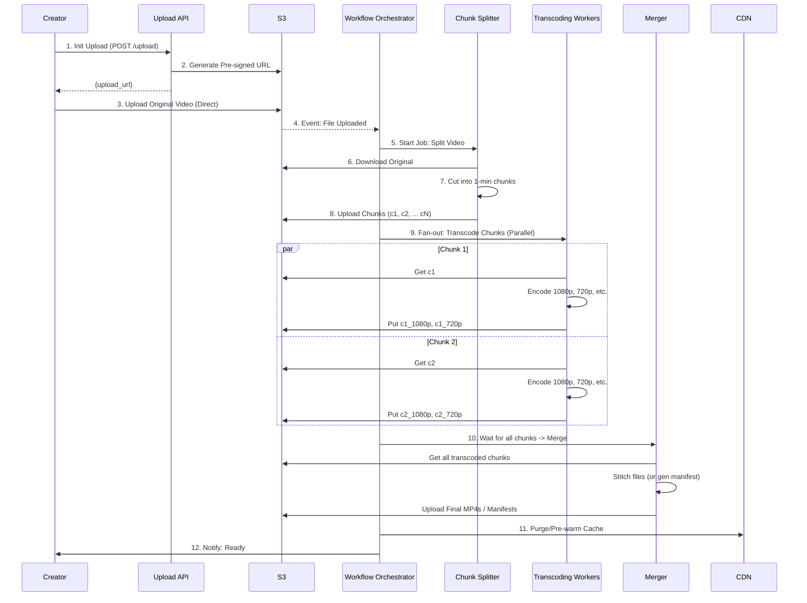
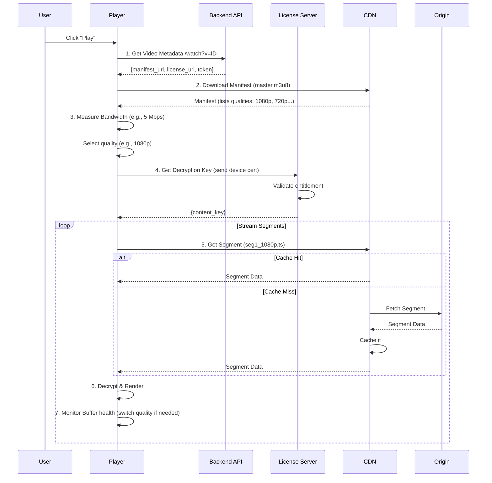
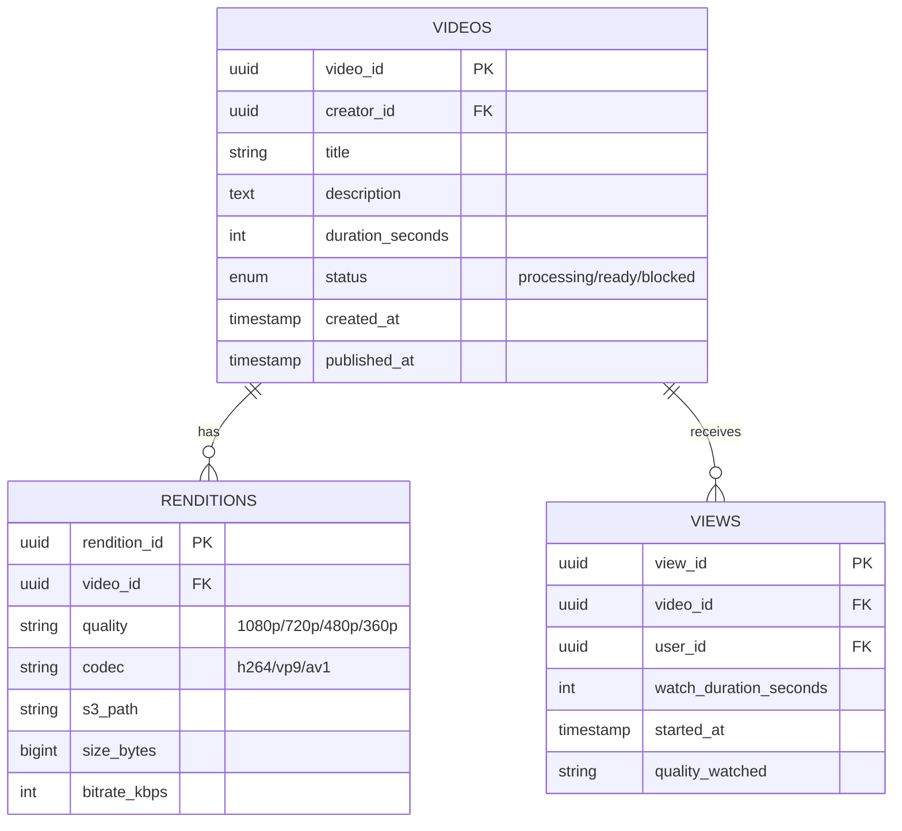

# Design YouTube / Netflix (Video Streaming Platform)

> **Model Interview Answer** - This document demonstrates L4/L5 level depth with complete BOTE, SLOs, failure modes, and runbooks.

---

## 1. Requirements Clarification (5 min)

### 1.1 Functional Requirements

**Video Upload (YouTube focus)**:

- Upload video files (up to 12 hours, 256GB)
- Automatic transcoding to multiple resolutions
- Thumbnail generation (auto + custom)
- Metadata editing (title, description, tags)

**Video Playback**:

- Smooth streaming with adaptive bitrate
- Support multiple devices (mobile, TV, web)
- Resume playback from last position
- Playback speed control (0.5x - 2x)

**Content Discovery**:

- Search by title, description, tags
- Personalized recommendations
- Trending/Popular videos
- Categories and playlists

**Engagement**:

- View count, likes, comments
- Subscriptions and notifications
- Watch history

### 1.2 Non-Functional Requirements

| Requirement | Target | Rationale |
|-------------|--------|-----------|
| **Availability** | 99.99% | Entertainment is critical for retention |
| **Playback Start** | < 2 sec | User expects instant play |
| **Buffering Rate** | < 0.1% of watch time | Primary user frustration |
| **Upload Processing** | < 1 hour for 1-hour video | Creator expectation |
| **Global Reach** | < 100ms to nearest edge | Worldwide audience |

### 1.3 Scope

**In Scope**: Upload, transcode, stream, search, basic recommendations
**Out of Scope**: Live streaming, monetization/ads, content moderation ML

---

## 2. Capacity Estimation (5 min)

### 2.1 User Scale

```
Total Users:         2 Billion registered
Monthly Active:      2 Billion MAU
Daily Active:        1 Billion DAU
Concurrent Viewers:  100 Million peak
```

### 2.2 Video Upload Volume

```
Videos Uploaded:     500 hours/minute = 720,000 hours/day
Average Video:       10 minutes, 500MB raw

Daily Upload Volume: 
- 720,000 hours/day ÷ (10/60) hours/video = 4.32M videos/day
- 4.32M × 500MB = 2.16 PB/day raw uploads

Upload QPS:          4.32M / 86400 = 50 uploads/sec
Peak (3x):           150 uploads/sec
```

### 2.3 Video Viewing Volume

```
Daily Views:         5 Billion video views/day
Average Watch Time:  10 minutes
Total Watch Time:    5B × 10 min = 50B minutes/day = 833M hours/day

View QPS:            5B / 86400 = 58,000 views/sec
Peak (2x):           116,000 views/sec
```

### 2.4 Bandwidth Estimation

```
Average Bitrate:     5 Mbps (1080p average across all quality levels)
Concurrent Viewers:  100M peak

Peak Bandwidth:      100M × 5 Mbps = 500 Pbps (Petabits per second)

This is MASSIVE - requires global CDN with 1000s of edge locations
```

### 2.5 Storage Estimation

```
Raw Upload (daily):           2.16 PB
Transcoded (4 resolutions):   2.16 × 4 = 8.64 PB/day
With 3 codecs (H.264, VP9, AV1): 8.64 × 3 = 26 PB/day

Annual Storage:     26 PB × 365 = 9.5 EB/year

Storage Strategy:
- Hot (< 7 days): SSD/NVMe - fast access
- Warm (7-90 days): HDD - frequent but not critical
- Cold (> 90 days): Glacier/Archive - rarely accessed
- Delete raw after processing (keep transcoded only)
```

### 2.6 Transcoding Capacity

```
Videos/day:          4.32M
Average duration:    10 minutes
Encoding time:       ~2x real-time for each resolution (with GPU)
Resolutions:         4 (360p, 720p, 1080p, 4K)

Total encoding hours: 4.32M × 10 min × 4 × 2 = 576M minutes/day = 9.6M hours/day

Encoding workers:    9.6M hours / 24 hours = 400,000 worker-hours/day
With GPU speedup:    400K / 10 = 40,000 GPU-hours/day
```

### 2.7 BOTE Summary Table

| Resource | Calculation | Result |
|----------|-------------|--------|
| Upload QPS | 4.32M videos / 86400 × 3 (peak) | 150/sec |
| View QPS | 5B views / 86400 × 2 (peak) | 116K/sec |
| Daily Raw Upload | 4.32M × 500MB | 2.16 PB |
| Daily Transcoded | 2.16 PB × 4 res × 3 codecs | 26 PB |
| Peak Bandwidth | 100M × 5 Mbps | 500 Pbps |
| Encoding Workers | 9.6M hours / 24 / 10 (GPU) | 40K GPU-hours |
| CDN Edge Servers | 500 Pbps / 100 Gbps per PoP | 5000+ PoPs |

---

## 3. SLOs & Operational Targets

### 3.1 Service Level Objectives

| Service | SLI | Target | Error Budget |
|---------|-----|--------|--------------|
| **Video Playback** | Start latency | p99 < 2 sec | - |
| **Video Playback** | Buffering ratio | < 0.1% of watch time | - |
| **CDN** | Availability | 99.99% | 4.3 min/month |
| **CDN** | Cache hit rate | > 95% | - |
| **Upload API** | Success rate | 99.9% | 43 min/month |
| **Transcoding** | Completion within SLA | 99% within 1 hour | - |
| **Search** | p99 latency | < 200ms | - |
| **Recommendations** | p99 latency | < 100ms | - |

### 3.2 Key Metrics to Monitor

```
Upload Pipeline:
- uploads_started_total
- uploads_completed_total
- upload_size_bytes (histogram)
- upload_duration_seconds

Transcoding:
- transcoding_jobs_queued
- transcoding_jobs_completed
- transcoding_duration_seconds{resolution}
- transcoding_failures{reason}

Playback:
- playback_starts_total
- playback_errors{error_type}
- rebuffer_rate_percent
- video_quality_level{resolution}

CDN:
- cache_hit_rate
- origin_fetch_latency_ms
- edge_bandwidth_gbps{region}
- edge_server_cpu_percent
```

### 3.3 Alerting Thresholds

| Alert | Condition | Severity |
|-------|-----------|----------|
| Rebuffer rate > 0.5% | 5 min window | P1 - Page |
| CDN cache hit rate < 90% | 15 min window | P1 - Page |
| Transcoding queue > 100K | Any region | P2 - Ticket |
| Upload error rate > 1% | 5 min window | P2 - Ticket |
| Origin bandwidth > 80% | Any origin | P2 - Ticket |
| Search p99 > 500ms | 5 min window | P2 - Ticket |

---

## 4. High-Level Architecture (10 min)

### 4.1 Architecture Diagram

```
┌─────────────────────────────────────────────────────────────────────────┐
│                              CLIENTS                                     │
├─────────────────────────────────────────────────────────────────────────┤
│  ┌──────────────┐    ┌──────────────┐    ┌──────────────┐              │
│  │  Mobile App  │    │  Smart TV    │    │  Web Browser │              │
│  │  (iOS/Android)│    │  (Roku/Fire) │    │  (Chrome/FF) │              │
│  └──────┬───────┘    └──────┬───────┘    └──────┬───────┘              │
└─────────┼───────────────────┼───────────────────┼───────────────────────┘
          │                   │                   │
          ▼                   ▼                   ▼
┌─────────────────────────────────────────────────────────────────────────┐
│                         GLOBAL EDGE LAYER                                │
│  ┌─────────────────────────────────────────────────────────────────┐   │
│  │                      CDN (5000+ PoPs)                            │   │
│  │   ┌─────┐  ┌─────┐  ┌─────┐  ┌─────┐  ┌─────┐  ┌─────┐         │   │
│  │   │ NYC │  │ LON │  │ TYO │  │ SYD │  │ SAO │  │ MUM │  ...    │   │
│  │   └──┬──┘  └──┬──┘  └──┬──┘  └──┬──┘  └──┬──┘  └──┬──┘         │   │
│  │      │ Cache hit? Return immediately                            │   │
│  │      │ Cache miss? Fetch from origin                            │   │
│  └──────┼──────────────────────────────────────────────────────────┘   │
└─────────┼───────────────────────────────────────────────────────────────┘
          │ (cache miss only)
          ▼
┌─────────────────────────────────────────────────────────────────────────┐
│                        API GATEWAY LAYER                                 │
│  ┌─────────────────────────────────────────────────────────────────┐   │
│  │      Load Balancer → Auth → Rate Limit → Route                  │   │
│  └─────────────────────────────────────────────────────────────────┘   │
│                                 │                                        │
│         ┌───────────────────────┼───────────────────────┐               │
│         ▼                       ▼                       ▼               │
│  ┌─────────────┐         ┌─────────────┐         ┌─────────────┐       │
│  │ Video API   │         │ Search API  │         │ User API    │       │
│  │ Service     │         │ Service     │         │ Service     │       │
│  └─────────────┘         └─────────────┘         └─────────────┘       │
└─────────────────────────────────────────────────────────────────────────┘
          │
          ▼
┌─────────────────────────────────────────────────────────────────────────┐
│                        UPLOAD PIPELINE                                   │
│                                                                          │
│  ┌──────────────┐    ┌──────────────┐    ┌──────────────────────────┐  │
│  │ Upload API   │───▶│ Raw Storage  │───▶│ Transcoding Queue        │  │
│  │ (Pre-signed) │    │ (S3 Raw)     │    │ (SQS/Kafka)              │  │
│  └──────────────┘    └──────────────┘    └───────────┬──────────────┘  │
│                                                      │                  │
│                    ┌─────────────────────────────────┘                  │
│                    ▼                                                    │
│  ┌───────────────────────────────────────────────────────────────────┐ │
│  │                   TRANSCODING FARM (GPU Cluster)                  │ │
│  │  ┌─────────┐  ┌─────────┐  ┌─────────┐  ┌─────────┐              │ │
│  │  │ Worker  │  │ Worker  │  │ Worker  │  │ Worker  │  × 10,000   │ │
│  │  │ (GPU)   │  │ (GPU)   │  │ (GPU)   │  │ (GPU)   │              │ │
│  │  └────┬────┘  └────┬────┘  └────┬────┘  └────┬────┘              │ │
│  │       │ Split → Encode → Merge → Output                          │ │
│  └───────┼──────────────────────────────────────────────────────────┘ │
│          ▼                                                             │
│  ┌──────────────────────────────────────────────────────────────────┐ │
│  │                  Processed Storage (S3 Origin)                    │ │
│  │   ┌─────────────────────────────────────────────────────────┐    │ │
│  │   │ video_id/                                                │    │ │
│  │   │   ├── manifest.m3u8 (HLS) / manifest.mpd (DASH)         │    │ │
│  │   │   ├── 360p/  segment_001.ts, segment_002.ts, ...        │    │ │
│  │   │   ├── 720p/  segment_001.ts, segment_002.ts, ...        │    │ │
│  │   │   ├── 1080p/ segment_001.ts, segment_002.ts, ...        │    │ │
│  │   │   └── 4k/    segment_001.ts, segment_002.ts, ...        │    │ │
│  │   └─────────────────────────────────────────────────────────┘    │ │
│  └──────────────────────────────────────────────────────────────────┘ │
└─────────────────────────────────────────────────────────────────────────┘
          │
          ▼
┌─────────────────────────────────────────────────────────────────────────┐
│                        DATA LAYER                                        │
│                                                                          │
│  ┌──────────────────┐  ┌──────────────────┐  ┌──────────────────┐      │
│  │ Video Metadata   │  │ User Data        │  │ Search Index     │      │
│  │ (MySQL/Vitess)   │  │ (MySQL/Vitess)   │  │ (Elasticsearch)  │      │
│  │                  │  │                  │  │                  │      │
│  │ - Title, desc    │  │ - Watch history  │  │ - Title, tags    │      │
│  │ - View count     │  │ - Subscriptions  │  │ - Descriptions   │      │
│  │ - Likes          │  │ - Playlists      │  │ - Full-text      │      │
│  └──────────────────┘  └──────────────────┘  └──────────────────┘      │
│                                                                          │
│  ┌────────────────────────────────────────────────────────────────────┐│
│  │                    Analytics Pipeline (Kafka → Spark → OLAP)       ││
│  └────────────────────────────────────────────────────────────────────┘│
└─────────────────────────────────────────────────────────────────────────┘
```

### 4.2 Component Responsibilities

| Component | Responsibility | Tech Choice | Scale |
|-----------|---------------|-------------|-------|
| **CDN** | Edge caching, video delivery | Akamai/Fastly/Own | 5000+ PoPs globally |
| **Upload API** | Pre-signed URLs, upload coordination | Go + S3 | 200 instances |
| **Transcoding** | Video encoding, chunking | FFmpeg on GPU (NVENC) | 10,000 GPU workers |
| **Video Metadata** | Video info, counts | MySQL + Vitess | 500 nodes |
| **Search** | Full-text search | Elasticsearch | 200 nodes |
| **Recommendations** | ML-based suggestions | TensorFlow Serving | 500 instances |

---

## 5. API Design (5 min)

### 5.1 Upload APIs

```http
# Step 1: Initialize upload
POST /v1/videos/upload/init
Body: { 
  "filename": "my_video.mp4", 
  "size_bytes": 524288000,
  "content_type": "video/mp4"
}
Returns: {
  "upload_id": "up_abc123",
  "upload_url": "https://s3.../presigned-url",  # Direct to S3
  "expires_at": "2024-01-15T12:00:00Z"
}

# Step 2: Client uploads directly to S3 (not through our servers)
PUT {upload_url}
Headers: Content-Type: video/mp4
Body: <binary video data>

# Step 3: Complete upload and start processing
POST /v1/videos/upload/complete
Body: { "upload_id": "up_abc123" }
Returns: {
  "video_id": "vid_xyz789",
  "status": "processing",
  "estimated_ready_at": "2024-01-15T13:00:00Z"
}

# Step 4: Set metadata
PUT /v1/videos/{video_id}
Body: {
  "title": "My Awesome Video",
  "description": "...",
  "tags": ["tutorial", "coding"],
  "visibility": "public"  # public, unlisted, private
}
```

### 5.2 Playback APIs

```http
# Get video metadata + playback info
GET /v1/videos/{video_id}
Returns: {
  "video_id": "vid_xyz789",
  "title": "...",
  "duration_seconds": 600,
  "view_count": 1000000,
  "manifest_url": "https://cdn.../vid_xyz789/manifest.m3u8",
  "thumbnails": {
    "default": "https://cdn.../thumb_default.jpg",
    "hq": "https://cdn.../thumb_hq.jpg"
  },
  "available_qualities": ["360p", "720p", "1080p", "4k"]
}

# Report playback event (for analytics, resume)
POST /v1/videos/{video_id}/events
Body: {
  "event_type": "progress",  # start, progress, complete, pause
  "position_seconds": 125,
  "quality": "1080p"
}

# Get resume position
GET /v1/users/me/watch-history/{video_id}
Returns: { "position_seconds": 125, "watched_at": "..." }
```

### 5.3 HLS Manifest Example

```m3u8
#EXTM3U
#EXT-X-VERSION:3

# Available quality levels
#EXT-X-STREAM-INF:BANDWIDTH=800000,RESOLUTION=640x360
360p/playlist.m3u8

#EXT-X-STREAM-INF:BANDWIDTH=2800000,RESOLUTION=1280x720
720p/playlist.m3u8

#EXT-X-STREAM-INF:BANDWIDTH=5000000,RESOLUTION=1920x1080
1080p/playlist.m3u8

#EXT-X-STREAM-INF:BANDWIDTH=14000000,RESOLUTION=3840x2160
4k/playlist.m3u8
```

```m3u8
# 1080p/playlist.m3u8
#EXTM3U
#EXT-X-VERSION:3
#EXT-X-TARGETDURATION:4
#EXT-X-MEDIA-SEQUENCE:0

#EXTINF:4.000,
segment_000.ts
#EXTINF:4.000,
segment_001.ts
#EXTINF:4.000,
segment_002.ts
...
#EXT-X-ENDLIST
```

---

## 6. Deep Dive: Video Transcoding Pipeline

### 6.1 Transcoding Architecture

```
                 Raw Video (1 GB, 4K, 60fps)
                            │
                            ▼
             ┌──────────────────────────────┐
             │      1. CHUNK SPLITTER       │
             │   Split into 4-sec chunks    │
             │   (150 chunks for 10 min)    │
             └──────────────┬───────────────┘
                            │
            ┌───────────────┼───────────────┐
            ▼               ▼               ▼
     ┌──────────┐    ┌──────────┐    ┌──────────┐
     │ Chunk 1  │    │ Chunk 2  │    │ Chunk N  │
     └────┬─────┘    └────┬─────┘    └────┬─────┘
          │               │               │
          ▼               ▼               ▼
     ┌───────────────────────────────────────────┐
     │           2. PARALLEL ENCODING            │
     │                                           │
     │   Each chunk encoded to:                  │
     │   - 360p  (H.264, VP9, AV1)              │
     │   - 720p  (H.264, VP9, AV1)              │
     │   - 1080p (H.264, VP9, AV1)              │
     │   - 4K    (H.264, VP9, AV1)              │
     │                                           │
     │   Chunk 1 × 4 res × 3 codecs = 12 tasks  │
     │   150 chunks × 12 = 1,800 encoding tasks │
     └───────────────────────────────────────────┘
                            │
                            ▼
             ┌──────────────────────────────┐
             │      3. MERGE & PACKAGE      │
             │   Combine chunks per quality │
             │   Generate manifest files    │
             └──────────────┬───────────────┘
                            │
                            ▼
             ┌──────────────────────────────┐
             │     4. UPLOAD TO ORIGIN      │
             │   S3 bucket, notify CDN      │
             │   Update metadata: "ready"   │
             └──────────────────────────────┘
```

### 6.2 Encoding Job Flow (DAG)

```python
def process_video(video_id, raw_url):
    """
    DAG-based processing:
    1. Download → 2. Analyze → 3. Split → 4. Encode (parallel) → 5. Merge → 6. Upload
    """
    
    # 1. Download raw video from S3
    raw_file = download(raw_url)
    
    # 2. Analyze video properties
    metadata = ffprobe(raw_file)
    # { duration: 600, resolution: "3840x2160", fps: 60, codec: "h264" }
    
    # 3. Determine target resolutions (skip upscaling)
    targets = determine_targets(metadata['resolution'])
    # If source is 1080p, targets = [360p, 720p, 1080p] (skip 4K)
    
    # 4. Split into chunks
    chunks = split_video(raw_file, segment_duration=4)
    # Returns: [chunk_0.ts, chunk_1.ts, ..., chunk_149.ts]
    
    # 5. Fan-out encoding jobs (parallel)
    encoding_jobs = []
    for chunk in chunks:
        for resolution in targets:
            for codec in ['h264', 'vp9']:  # AV1 optional for new videos
                job = EncodingJob(
                    input=chunk,
                    resolution=resolution,
                    codec=codec,
                    output=f"{video_id}/{resolution}/{codec}/{chunk.name}"
                )
                encoding_jobs.append(job)
    
    # Submit to GPU worker pool
    results = worker_pool.map(encode_chunk, encoding_jobs)
    
    # 6. Wait for all chunks, then merge
    for resolution in targets:
        for codec in ['h264', 'vp9']:
            chunks = get_encoded_chunks(video_id, resolution, codec)
            merge_chunks(chunks, f"{video_id}/{resolution}/{codec}/playlist.m3u8")
    
    # 7. Generate master manifest
    generate_master_manifest(video_id, targets)
    
    # 8. Upload to origin and invalidate CDN
    upload_to_origin(video_id)
    invalidate_cdn_cache(video_id)
    
    # 9. Update metadata
    update_video_status(video_id, "ready")
    notify_creator(video_id, "Video is now live!")
```

### 6.3 Codec Comparison

| Codec | Quality | Encode Speed | CPU/GPU | Browser Support |
|-------|---------|--------------|---------|-----------------|
| **H.264** | Good | Fast | Both | Universal |
| **VP9** | Better (-30% bitrate) | Slow | CPU mainly | Chrome, Firefox, Android |
| **AV1** | Best (-50% bitrate) | Very slow | GPU (new) | Chrome, Firefox (growing) |

**Strategy**: Encode H.264 first (fast, universal), VP9 async, AV1 for popular videos only.

---

## 7. Deep Dive: Adaptive Bitrate Streaming (ABR)

### 7.1 How ABR Works

```
┌─────────────────────────────────────────────────────────────────────┐
│                        VIDEO PLAYER                                  │
│                                                                      │
│   1. Fetch manifest.m3u8                                            │
│      ├── 360p available (800 Kbps)                                  │
│      ├── 720p available (2.8 Mbps)                                  │
│      ├── 1080p available (5 Mbps)                                   │
│      └── 4K available (14 Mbps)                                     │
│                                                                      │
│   2. Estimate bandwidth: 10 Mbps                                    │
│      → Select 1080p (5 Mbps <= 10 Mbps with buffer)                │
│                                                                      │
│   3. Fetch 1080p/segment_001.ts (4 seconds of video)               │
│      Measured: Downloaded 2.5MB in 2 seconds = 10 Mbps              │
│                                                                      │
│   4. Continue fetching 1080p segments...                            │
│                                                                      │
│   5. Network degrades: Now measuring 2 Mbps                         │
│      → Switch to 720p (2.8 Mbps) or 360p (800 Kbps)                │
│      Seamless switch at segment boundary                            │
│                                                                      │
│   6. Network improves: Back to 10 Mbps                              │
│      → Gradually step up (720p → 1080p), not jump to 4K            │
│                                                                      │
└─────────────────────────────────────────────────────────────────────┘
```

### 7.2 ABR Algorithms

```python
class AdaptiveBitrateController:
    def __init__(self):
        self.bandwidth_history = []  # Last N measurements
        self.buffer_level = 0  # Seconds of video buffered
        
    def select_quality(self, available_qualities):
        """
        Algorithm: Buffer-based + throughput-based hybrid
        """
        # Estimate available bandwidth (EWMA)
        estimated_bw = self.estimate_bandwidth()
        
        # Safety margin (don't use 100% of bandwidth)
        safe_bw = estimated_bw * 0.8
        
        # Buffer-based adjustment
        if self.buffer_level < 5:  # Low buffer, be conservative
            safe_bw *= 0.5
        elif self.buffer_level > 20:  # High buffer, can be aggressive
            safe_bw *= 1.2
        
        # Select highest quality that fits
        selected = None
        for quality in sorted(available_qualities, key=lambda q: q.bitrate, reverse=True):
            if quality.bitrate <= safe_bw:
                selected = quality
                break
        
        return selected or available_qualities[0]  # Fallback to lowest
    
    def estimate_bandwidth(self):
        """Exponentially weighted moving average"""
        if not self.bandwidth_history:
            return 5_000_000  # Default 5 Mbps
        
        alpha = 0.3  # Weight for recent samples
        ewma = self.bandwidth_history[0]
        for bw in self.bandwidth_history[1:]:
            ewma = alpha * bw + (1 - alpha) * ewma
        return ewma
```

---

## 8. Deep Dive: CDN Architecture

### 8.1 CDN Tiered Caching

```
                          USER REQUEST
                               │
                               ▼
┌────────────────────────────────────────────────────────────────────┐
│                      TIER 1: EDGE POP                              │
│              (5000+ locations, closest to user)                    │
│                                                                    │
│   Cache: Hot content (< 24 hours old, popular videos)             │
│   Hit Rate: 85%                                                    │
│   Latency: < 10ms                                                  │
│                                                                    │
│   MISS? → Forward to Tier 2                                       │
└────────────────────────────────────────────────────────────────────┘
                               │ (15% of requests)
                               ▼
┌────────────────────────────────────────────────────────────────────┐
│                      TIER 2: REGIONAL POP                          │
│              (50 locations, per continent/country)                 │
│                                                                    │
│   Cache: Warm content (< 7 days, medium popularity)               │
│   Hit Rate: 80% of Tier 1 misses                                  │
│   Latency: < 50ms                                                  │
│                                                                    │
│   MISS? → Forward to Origin                                       │
└────────────────────────────────────────────────────────────────────┘
                               │ (3% of requests)
                               ▼
┌────────────────────────────────────────────────────────────────────┐
│                      TIER 3: ORIGIN                                │
│              (3-5 locations, S3 + Origin Shield)                   │
│                                                                    │
│   Storage: ALL content                                             │
│   Access: Rare (long-tail content, new uploads)                   │
│   Latency: 100-300ms                                               │
│                                                                    │
└────────────────────────────────────────────────────────────────────┘

Overall Cache Hit Rate: 85% + (15% × 80%) = 97%
Only 3% of requests reach origin!
```

### 8.2 Cache Invalidation Strategy

```python
def handle_video_update(video_id, update_type):
    """
    Different invalidation strategies based on update type
    """
    if update_type == "new_upload":
        # Don't invalidate, just add to origin
        # CDN will fetch on first request
        pass
        
    elif update_type == "metadata_change":
        # Invalidate only metadata/manifest, not video segments
        cdn.invalidate(f"/v1/videos/{video_id}")
        cdn.invalidate(f"/{video_id}/manifest.m3u8")
        
    elif update_type == "video_delete":
        # Aggressive invalidation
        cdn.invalidate(f"/{video_id}/*")  # All content
        # Also remove from origin
        origin.delete(f"/{video_id}/")
        
    elif update_type == "reprocess":
        # Video re-encoded (fix, quality improvement)
        cdn.invalidate(f"/{video_id}/*")
        # Pre-warm popular edge locations
        if is_popular(video_id):
            cdn.prefetch(f"/{video_id}/manifest.m3u8", 
                        regions=["us-east", "eu-west", "ap-south"])
```

---

## 9. Failure Modes & Runbooks

### 9.1 Failure Scenarios

| Failure | Impact | Detection | Mitigation |
|---------|--------|-----------|------------|
| CDN Edge down | Users in region can't stream | Health checks, 5xx spike | Traffic routed to next closest edge |
| Origin overload | Cache misses fail | Origin CPU/bandwidth alert | Scale origin, enable origin shield |
| Transcoding backlog | Upload SLA missed | Queue depth > threshold | Scale GPU workers, prioritize by creator tier |
| Metadata DB slow | Video pages slow/error | Query latency > 100ms | Failover to replica, add cache |
| S3 outage | Can't serve long-tail content | AWS status, error rate | Multi-region S3, cross-region replication |

### 9.2 Runbook: High Rebuffer Rate

```markdown
## Alert: Rebuffer Rate > 0.5% (P1)

### Symptoms
- Users complaining about buffering
- Player quality dropping to lowest
- Increased abandonment rate

### Diagnosis Steps

1. Check CDN health by region:
   `curl -I https://cdn-healthcheck.example.com/status`
   
   - Per-region latency and error rate
   - Identify affected regions

2. Check CDN cache hit rate:
   - If < 90%: Cache eviction happening or new popular content
   - Check if specific videos causing misses

3. Check origin bandwidth:
   - If origin bandwidth high: CDN not caching properly
   - Check origin CPU (transcoding competing with serving?)

4. Check specific video:
   - Is manifest accessible?
   - Are all segments accessible?
   - Did recent re-encoding happen?

### Mitigation

1. **If regional CDN issue**:
   - Route traffic away from affected PoP
   - Contact CDN provider

2. **If cache miss spike**:
   - Identify hot video not cached
   - Pre-warm: `cdn-cli prefetch /video_id/* --regions all`

3. **If origin overload**:
   - Enable origin shield (single cache in front of origin)
   - Scale origin servers

4. **If specific video broken**:
   - Verify segments exist in S3
   - Re-trigger transcoding if corrupt
   - Temporarily hide video if needed

### Communication
- > 1% rebuffer for > 5 min: Status page update
- > 5%: Incident declared
```

### 9.3 Runbook: Transcoding Backlog

```markdown
## Alert: Transcoding Queue > 100K Jobs (P2)

### Symptoms
- Creators complaining video not processing
- "Processing" status for hours
- Upload SLA (1 hour) being missed

### Diagnosis Steps

1. Check queue depth trend:
   - Sudden spike: Viral upload event or batch import
   - Gradual growth: Worker capacity insufficient

2. Check worker health:
   `kubectl get pods -l app=transcoder | grep -v Running`
   - Crashlooping workers indicate GPU or memory issues

3. Check job failure rate:
   - High failures: Bad input videos or encoding bug

### Mitigation

1. **If capacity issue**:
   ```bash
   # Scale up GPU workers
   kubectl scale deployment transcoder --replicas=500
   
   # Request spot instances for burst
   aws ec2 request-spot-fleet --config burst-transcoder.json
   ```

1. **If worker failures**:
   - Check specific error types
   - Roll back if recent deployment
   - Skip problematic videos, process rest

2. **Prioritization (if can't scale fast enough)**:
   - Partner/monetized creators first
   - Smaller videos first (faster to process)
   - Queue pending webhooks, process async

### Recovery

- Queue clears naturally once capacity restored
- Re-queue any failed jobs

```

### 9.4 Degraded Mode Operation

```markdown
## Graceful Degradation Strategies

### Level 1: High Load
- Serve lower default quality (720p instead of 1080p)
- Reduce pre-buffering (2 segments instead of 4)
- Defer non-critical updates (view count, recommendations)

### Level 2: CDN Degradation
- Direct users to healthy edge PoPs (increase latency acceptable)
- Serve from origin shield (higher latency but available)
- Cache manifest longer (5 min instead of 1 min)

### Level 3: Origin Issues
- Serve only cached content (new/rare videos unavailable)
- Show "temporarily unavailable" for uncached videos
- Queue uploads, process when recovered

### Level 4: Critical (widespread outage)
- Static "service degraded" page
- Links to Twitter/status page for updates
- Preserve upload queue (don't lose user data)
```

---

## 10. Trade-offs Summary

| Decision | Choice | Trade-off |
|----------|--------|-----------|
| **Pre-signed Upload** | Direct to S3 | Reduces server load, but less control |
| **Segment Duration** | 4 seconds | Good ABR granularity, but more files |
| **Multiple Codecs** | H.264 + VP9 | Better compression, but 2× storage |
| **CDN Tiering** | 3 tiers | High hit rate, but complexity |
| **Thumbnail at Upload** | Auto-generated | Instant, but may not be best frame |
| **Async Transcoding** | Queue-based | Scalable, but upload-to-live delay |

---

## 11. Cost Optimization Strategies

### 11.1 Storage Tiering

```
Hot (< 7 days):    S3 Standard     - $0.023/GB/month
Warm (7-90 days):  S3 IA           - $0.0125/GB/month
Cold (> 90 days):  S3 Glacier IR   - $0.004/GB/month

For 10 EB total:
- Without tiering: $230M/month
- With tiering (80% cold): $40M/month
- Savings: $190M/month!
```

### 11.2 Encoding Strategy

```
All videos:     H.264 only (fast, universal)
Popular (>10K): Add VP9 (better compression, saves CDN bandwidth)
Very popular:   Add AV1 (best compression, newest codec)

Bandwidth savings from VP9/AV1:
- 30-50% reduction for popular content
- At YouTube scale: Billions in savings
```

---

## 12. Security & Threat Model

### Attack Vectors

| Threat | Attack | Mitigation |
|--------|--------|------------|
| **DRM Bypass** | Strip encryption, redistribute | Widevine L1 hardware, watermarking |
| **Piracy** | Screen recording, stream capture | Invisible watermarks, legal action |
| **Hotlinking** | Embed videos on unauthorized sites | Signed URLs with expiry, referrer check |
| **Account Sharing** | Excessive concurrent streams | Stream limit per account, device fingerprinting |
| **Bandwidth Theft** | Modify player to download | Signed manifests, segment encryption |
| **SEO Spam** | Upload to gain visibility | Content ID, spam detection ML |

### DRM Implementation

```yaml
Widevine (Google):
  - L1: Hardware-based, most secure (TV, mobile)
  - L2: Software decryption (older devices)
  - L3: Software-only (Chrome)
  
FairPlay (Apple):
  - Required for Safari, iOS, tvOS
  - Key rotation per session
  
PlayReady (Microsoft):
  - Windows, Xbox, Edge
  - Supports offline playback

Multi-DRM Strategy:
  - License server issues keys based on device type
  - Same content encrypted for all DRM systems (CENC)
  - Content Key rotates every 24 hours
```

### Content Protection Flow

```yaml
Upload:
  1. Copyright check (Content ID / fingerprinting)
  2. Terms violation check (ML classifier)
  3. Manual review if borderline

Playback:
  1. User authenticated
  2. Entitlement check (subscription, rental, etc.)
  3. Device attestation (Widevine device cert)
  4. License issued with decryption keys
  5. Watermark user ID into video frames
```

---

## 13. Sequence Diagrams

### 13.1 Video Upload & Parallel Transcoding (DAG)

 This flow demonstrates the **chunk-based parallel processing** required for massive scale.



### 13.2 Adaptive Bitrate (ABR) Playback Flow

Details the interaction between Player, DRM License Server, and CDN.



---

## 14. Data Schema

### PostgreSQL (Metadata)



### S3 Object Structure

```
s3://video-storage/
├── uploads/
│   └── {video_id}/
│       └── original.mp4
├── transcoded/
│   └── {video_id}/
│       ├── manifest.m3u8
│       ├── 1080p/
│       │   ├── init.mp4
│       │   ├── segment_0.m4s
│       │   └── segment_1.m4s
│       ├── 720p/
│       ├── 480p/
│       └── 360p/
└── thumbnails/
    └── {video_id}/
        ├── default.jpg
        └── sprite.jpg
```

### Redis (Real-time)

```
# View count (sharded counter)
views:{video_id}:{shard_id}: "count"

# Live viewers (for live streaming)
live:{video_id}: SET of user_ids
TTL: 30 seconds (heartbeat)

# CDN cache warmth tracking
cdn_warm:{video_id}: "1"
TTL: 1 hour
```

---

## 15. Cost Estimate (Monthly)

### Assumptions

- 500 hours uploaded/minute, 5B views/day
- 10 EB total storage, 500 Pbps peak bandwidth

| Resource | Quantity | Unit Cost | Monthly Cost |
|----------|----------|-----------|--------------|
| **S3 Storage** (tiered) | 10 EB (80% Glacier) | ~$4/TB | $40,000,000 |
| **S3 Requests** | 100B/month | $0.0004/1K | $40,000 |
| **CloudFront CDN** | 500 PB transfer | $0.02/GB | $10,240,000 |
| **Transcoding** (MediaConvert) | 4M videos × 6 renditions | $0.015/min | $21,600,000 |
| **API Servers** (c5.4xlarge) | 500 instances | $0.68/hr | $244,800 |
| **PostgreSQL RDS** (r5.8xlarge) | 20 instances | $3.84/hr | $55,296 |
| **Redis ElastiCache** | 100 nodes (r6g.2xlarge) | $0.52/hr | $37,440 |
| **License Server** | 50 instances | $0.34/hr | $12,240 |
| **Total** | | | **~$72,230,000/month** |

### Cost Optimization (Already Applied)

- S3 tiering saves ~$190M/month
- VP9/AV1 for popular content saves ~30% CDN
- Edge caching at 97% hit rate
- Lazy transcoding (VP9 only for popular)

---

```markdown
### Opening (30 sec)
"YouTube/Netflix is a video streaming platform handling 5B views/day.
The key challenges are:
1) Massive storage (26 PB/day of transcoded video)
2) Global delivery at 500+ Pbps peak bandwidth
3) Transcoding pipeline processing 4M videos/day
4) Adaptive streaming for varying network conditions"

### Key Talking Points
- "Pre-signed URLs let clients upload directly to S3"
- "Transcoding is parallelized using DAG of chunk processing"
- "HLS/DASH manifest enables adaptive bitrate streaming"
- "3-tier CDN architecture achieves 97% cache hit rate"

### Numbers to Remember
- 500 hours uploaded per minute
- 5B views/day = 116K views/sec
- 500 Petabits/sec peak bandwidth
- 4-second segments for ABR
- 97% CDN cache hit rate

### Common Follow-ups
Q: "How do you handle a viral video?"
A: "CDN pre-warms edges. Origin shield prevents thundering herd."

Q: "Why not transcode to all resolutions immediately?"
A: "Cost. We encode H.264 first, add VP9/AV1 for popular videos only."

Q: "How does the player choose quality?"
A: "Buffer-based + throughput-based hybrid. Conservative when buffer low."
```
