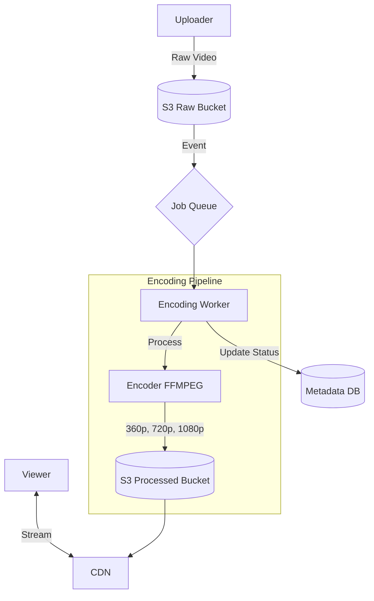

# Design YouTube / Netflix (Video Streaming)

## 1. Requirements

### Functional

1. **Upload Video**: Users upload raw video files.
2. **View Video**: Smooth streaming, adaptive quality.
3. **Search**: By title (Youtube).
4. **Stats**: View counts, Likes.

### Non-Functional

1. **Reliability**: No buffering.
2. **Availability**: Videos always available.
3. **Scalability**: Handle massive storage and bandwidth.

## 2. Capacity Estimation

- 1B Users.
- 500 Hours of video uploaded per minute.
- **Storage**: Huge. Need efficient compression and tiering (Hot/Cold storage).
- **Bandwidth**: The biggest cost factor.

## 3. High-Level Architecture

1. **Upload Service**: Handles raw file ingestion.
2. **Processing Queue**: Kafka/RabbitMQ.
3. **Video Encoder (Transcoder)**: Converts raw video into multiple formats (MP4, WebM) and resolutions (360p, 720p, 1080p, 4K).
4. **Metadata DB**: Title, Description, Uploader info.
5. **CDN**: Stores the processed video chunks.
6. **Streaming Service**: Adaptive Bitrate Streaming.

### Architecture Diagram

## 4. Key Components

### A. Video Encoding (DAG Model)

- Video processing is CPU intensive.
- Split video into chunks (e.g., 2-4 seconds).
- Process chunks in parallel using map-reduce style logic.
- **Codecs**: H.264 (common), VP9 (better compression), AV1 (future).
- **Audio**: AAC.

### B. Adaptive Bitrate Streaming (MPEG-DASH / HLS)

- Don't download the whole file. Download chunks.
- If network speed is high, download high-quality chunks.
- If network drops, switch to 360p chunks instantly.
- **Manifest File (.m3u8 / .mpd)**: Describes available qualities and chunk URLs. Player reads this first.

### C. Content Delivery (CDN)

- **Edge Servers**: Place popular content (80/20 rule) in edge locations.
- **Long-tail content**: Fetch from origin server / S3 on demand.

## 5. Database & Deduplication

- **Metadata**: Distributed SQL (Spanner/CockroachDB) or Sharded MySQL (Vitess).
- **Deduplication**: Checking hash of entire file is fragile (1 bit change changes hash).
- **Intelligent Matching**: Compare audio fingerprints or frame sampling to detect duplicates/copyright (ContentID).

## 6. Detailed Upload Flow

1. User sends file to **Pre-signed URL** (S3).
2. S3 event triggers Lambda/Worker -> Add job to **Message Queue**.
3. **Encoder Service** picks job -> Splits file -> Encodes chunks parallelly -> Merges.
4. Uploads artifacts to **S3** + Updates **CDN**.
5. Updates **Metadata DB** "Status: Ready".
6. Notifies user.

## 7. Safety Optimization

- **Pre-signed URLs**: Don't stream data through your Web Server. Let clients upload/download directly from Cloud Storage/CDN. Your server just generates the authorized "signed" link. Less load on your backend.
