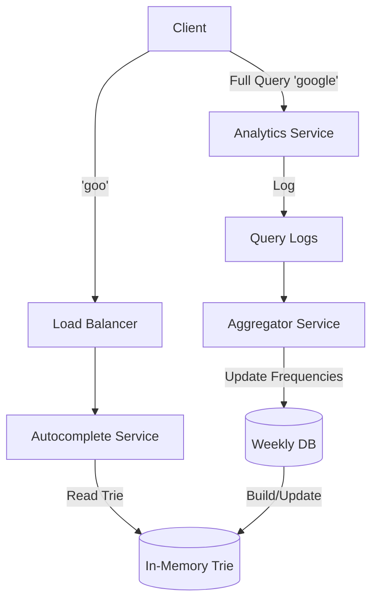

# Design a Distributed Search Autocomplete System (Typeahead)

## 1. Requirements

### Functional

1. **Search**: As user types, show top $K$ (e.g., 5) query suggestions.
2. **Real-time**: High speed showing results (< 200ms).
3. **Freshness**: New popular queries should appear quickly.

### Non-Functional

1. **High Availability**: 99.99%.
2. **Low Latency**: Critical for typing experience.
3. **Scalability**: Billions of searches/day.

## 2. Capacity Estimation

- 10M DAU.
- Average user searches 10 times/day.
- Each query is ~20 characters.
- **Write**: 100M queries / day.
- **Read**: As user types "google", they hit the server 6 times (`g`, `go`, `goo`...).
- **QPS**: High Read QPS (approx 20k - 50k QPS).

## 3. Data Structure: Trie (Prefix Tree)

Stroing strings in a DB is slow for prefix searches (`LIKE 'prefix%'`).
We use a **Trie** in memory.

- Root -> 'a', 'b', ...
- Node 'a' -> 'p', 'r'...
- Each node stores the Top 5 most searched queries ending at that node.

### Optimization

Traversing the whole subtree to find top 5 is slow.
**Store Top 5 at the node itself**.

- When query "amazon" comes in, update the frequency at the node "n".
- Bubble up the new frequency to parents "o", "z", "a", "m", "a".
- This makes Reads O(1) (just read the precomputed list at node).
- Makes Writes slower (need to update chain), but that is acceptable.

## 4. High-Level Architecture

1. **Client**: Sends char stream. Debounce (wait 50ms) to reduce requests.
2. **Load Balancer**: Distributes traffic.
3. **Autocomplete Service**: Holds the Trie in memory. Returns Top 5.
4. **Data Gathering Service**: Async. Logs queries to perform analytics and update the Trie.

### Architecture Diagram

## 5. Distributed Trie (Sharding)

A single server cannot hold the Trie for all Google searches.
**Sharding Strategy**:

1. **Range Based**: 'a'-'m' on Server 1, 'n'-'z' on Server 2.
    - *Issue*: 's' (starts, stop, super) is much commoner than 'x'. Hotspots.
2. **Shard by Prefix Hash**: `Hash(prefix) % N`.
    - Request for 'a' goes to S1. Request for 'aa' might go to S8.
    - *Issue*: Hard to stick sessions or aggregate.
3. **Two-Level Sharding (Preferred)**:
    - Dedicated shard mapper.
    - 'a' -> S1.
    - 's' -> S2.
    - 'sh' -> S3. (If 's' is too big, split it).

## 6. Updates & Persistence

- **Snapshot**: Periodically save Trie to disk (DB/File).
- **Reconstruction**: On restart, load Snapshot + replay logs.
- **Real-time updates**:
  - Don't update the Main Trie instantly (Performance hit).
  - Use a separate "Trending Trie" for breaking news (Real-time).
  - Merge Trending Trie with Main Trie hourly/daily.
