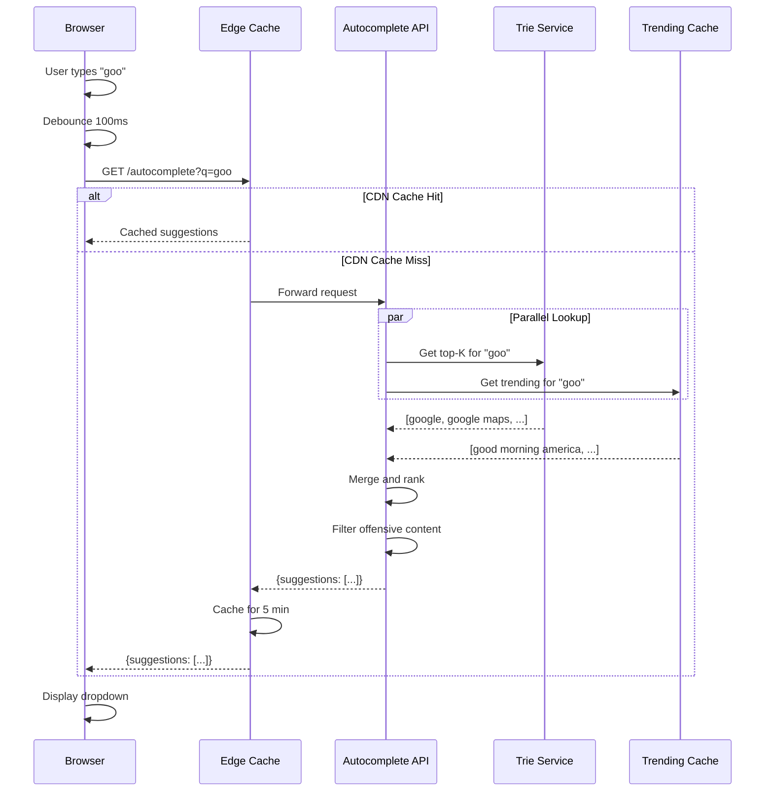
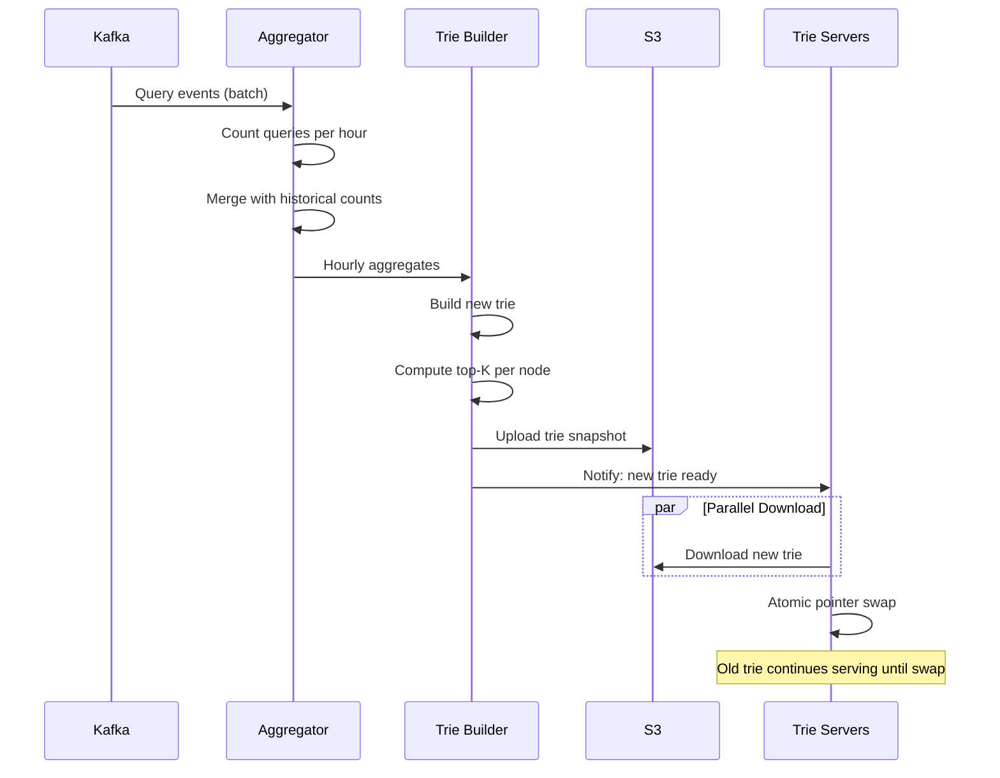

# Design Typeahead / Autocomplete System (Google Search Suggestions)

> **Model Interview Answer** - This document demonstrates L4/L5 level depth with complete BOTE, SLOs, failure modes, and runbooks.

---

## 1. Requirements Clarification (5 min)

### 1.1 Functional Requirements

**Core Features**:

- Show top K (typically 5-10) query suggestions as user types
- Suggestions based on historical search popularity
- Real-time updates for trending/breaking topics
- Personalized suggestions based on user history (optional)

**Query Matching**:

- Prefix matching (primary): "goo" → "google", "good morning"
- Typo tolerance (optional): "gogle" → "google"
- Multi-word queries: "how to" → "how to cook rice"

### 1.2 Non-Functional Requirements

| Requirement | Target | Rationale |
|-------------|--------|-----------|
| **Latency** | p99 < 100ms | Must feel instant while typing |
| **Availability** | 99.99% | Core search UX |
| **Freshness** | < 1 hour for trending | Breaking news visibility |
| **Scalability** | 700K+ QPS | Every keystroke triggers request |

### 1.3 Scope

**In Scope**: Prefix-based suggestions, popularity ranking, trending topics
**Out of Scope**: Personalization, spell correction, full search results

---

## 2. Capacity Estimation (5 min)

### 2.1 Traffic Estimation

```
Search queries per day:     10 Billion
Average query length:       20 characters
Keystrokes per query:       ~6 requests (with debouncing)
  - User types "google maps"
  - Debounce: g, go, goo, goog, google, google m (6 requests)

Autocomplete requests/day:  10B × 6 = 60 Billion
QPS:                        60B / 86400 = 694,000 QPS
Peak (2×):                  ~1.4 Million QPS
```

### 2.2 Unique Queries

```
Total unique queries:       5 Billion (historically)
Popular queries (80/20):    1 Billion cover 80% of searches
Average query length:       20 characters

Trie Storage (naive):
- 1B queries × 20 chars × 1 byte = 20 GB (just strings)
- With metadata (frequency, timestamp): ~50 GB
- With overhead and top-K at each node: ~200 GB

Can fit in memory on a few large servers!
```

### 2.3 Top-K Storage at Each Node

```
Unique prefixes:           ~500 Million (many queries share prefixes)
Top-K per prefix:          10 suggestions
Storage per suggestion:    50 bytes (query + score)

Top-K storage:             500M × 10 × 50B = 250 GB
Total Trie with Top-K:     ~500 GB

Sharding:
- 500 GB / 64 GB per server = 8 shards minimum
- With replication (3×): 24 servers
```

### 2.4 Update Volume

```
New queries per day:        100 Million unique
Query frequency updates:    10 Billion (each search updates counts)

Batch updates:             Hourly aggregation → Trie rebuild
Real-time trending:        Separate streaming pipeline
```

### 2.5 BOTE Summary Table

| Resource | Calculation | Result |
|----------|-------------|--------|
| Daily Autocomplete Requests | 10B queries × 6 keystroke | 60B/day |
| Peak QPS | 60B / 86400 × 2 | 1.4M QPS |
| Unique Queries | Historical corpus | 5 Billion |
| Trie Memory (with Top-K) | 500M prefixes × 10 × 50B | ~500 GB |
| Shard Count | 500 GB / 64 GB × 3 replicas | 24 servers |
| Update Frequency | Batch hourly, trending real-time | - |

---

## 3. SLOs & Operational Targets

### 3.1 Service Level Objectives

| Service | SLI | Target | Error Budget |
|---------|-----|--------|--------------|
| **Autocomplete API** | Availability | 99.99% | 4.3 min/month |
| **Autocomplete API** | p99 latency | < 100ms | - |
| **Autocomplete API** | p50 latency | < 20ms | - |
| **Trie Update** | Freshness | < 1 hour for hot queries | - |
| **Trending** | Freshness | < 5 min for breaking news | - |

### 3.2 Key Metrics to Monitor

```yaml
Read Path:
  - autocomplete_requests_total
  - autocomplete_latency_ms (p50, p99)
  - cache_hit_rate
  - suggestions_returned_count (avg ~8)

Trie Health:
  - trie_memory_bytes
  - trie_node_count
  - trie_query_count (unique queries in trie)
  - trie_last_update_timestamp

Trending:
  - trending_queries_count
  - trending_update_lag_seconds
  - trending_trie_merge_latency_ms
```

### 3.3 Alerting Thresholds

| Alert | Condition | Severity |
|-------|-----------|----------|
| Autocomplete p99 > 200ms | 5 min window | P1 - Page |
| Trie update > 2 hours stale | Any shard | P2 - Ticket |
| Trending lag > 15 min | — | P2 - Ticket |
| Memory usage > 85% | Any trie server | P2 - Ticket |
| Empty suggestions rate > 5% | 5 min window | P2 - Ticket |

---

## 4. High-Level Architecture (10 min)

### 4.1 Architecture Diagram

```
┌─────────────────────────────────────────────────────────────────────────┐
│                              CLIENTS                                     │
├─────────────────────────────────────────────────────────────────────────┤
│  ┌──────────────────────────────────────────────────────────────────┐  │
│  │  Search Box (Web/Mobile)                                          │  │
│  │  - Debounce: Wait 50-100ms after keystroke before request        │  │
│  │  - Cancel: Abort previous request if new keystroke arrives        │  │
│  └───────────────────────────────────┬──────────────────────────────┘  │
└──────────────────────────────────────┼──────────────────────────────────┘
                                       │ GET /autocomplete?q=goo
                                       ▼
┌─────────────────────────────────────────────────────────────────────────┐
│                         API GATEWAY                                      │
│  ┌─────────────────────────────────────────────────────────────────┐   │
│  │  Load Balancer → Rate Limit → Route to Shard                    │   │
│  │  Shard key: first 2 characters of query (aa, ab, ac... zz)      │   │
│  └─────────────────────────────────────────────────────────────────┘   │
└─────────────────────────────────────────────────────────────────────────┘
                                       │
              ┌────────────────────────┼────────────────────────┐
              ▼                        ▼                        ▼
┌──────────────────────┐  ┌──────────────────────┐  ┌──────────────────────┐
│   TRIE SHARD A-H     │  │   TRIE SHARD I-P     │  │   TRIE SHARD Q-Z     │
│                      │  │                      │  │                      │
│  ┌────────────────┐  │  │  ┌────────────────┐  │  │  ┌────────────────┐  │
│  │  Main Trie     │  │  │  │  Main Trie     │  │  │  │  Main Trie     │  │
│  │  (Hourly)      │  │  │  │  (Hourly)      │  │  │  │  (Hourly)      │  │
│  └────────────────┘  │  │  └────────────────┘  │  │  └────────────────┘  │
│         +            │  │         +            │  │         +            │
│  ┌────────────────┐  │  │  ┌────────────────┐  │  │  ┌────────────────┐  │
│  │ Trending Trie  │  │  │  │ Trending Trie  │  │  │  │ Trending Trie  │  │
│  │ (Real-time)    │  │  │  │ (Real-time)    │  │  │  │ (Real-time)    │  │
│  └────────────────┘  │  │  └────────────────┘  │  │  └────────────────┘  │
│                      │  │                      │  │                      │
│  Replica 1, 2, 3     │  │  Replica 1, 2, 3     │  │  Replica 1, 2, 3     │
└──────────────────────┘  └──────────────────────┘  └──────────────────────┘
              ▲                        ▲                        ▲
              │                        │                        │
              └────────────────────────┼────────────────────────┘
                                       │
┌─────────────────────────────────────────────────────────────────────────┐
│                         DATA PIPELINE                                    │
│                                                                          │
│  ┌──────────────┐    ┌──────────────┐    ┌──────────────────────────┐  │
│  │ Search Logs  │───▶│   Kafka      │───▶│  Aggregation Service     │  │
│  │ (All queries)│    │              │    │  (Spark/Flink)           │  │
│  └──────────────┘    └──────────────┘    └───────────┬──────────────┘  │
│                                                      │                  │
│                                           ┌──────────┴──────────┐       │
│                                           ▼                     ▼       │
│                               ┌───────────────────┐  ┌────────────────┐│
│                               │ Hourly Aggregate  │  │ Trending       ││
│                               │ (Batch → Trie)    │  │ (Stream → Trie)││
│                               └───────────────────┘  └────────────────┘│
└─────────────────────────────────────────────────────────────────────────┘
```

### 4.2 Component Responsibilities

| Component | Responsibility | Tech Choice | Scale |
|-----------|---------------|-------------|-------|
| **API Gateway** | Route to correct shard | nginx + Lua | 100 instances |
| **Trie Servers** | Serve autocomplete | Go/C++ | 24 servers (8 shards × 3 replicas) |
| **Aggregation** | Count query frequencies | Spark/Flink | Batch cluster |
| **Trending** | Real-time hot topics | Flink + Count-Min Sketch | 10 instances |
| **Trie Builder** | Rebuild trie from aggregates | Custom | Per shard |

---

## 5. Data Structure: Optimized Trie

### 5.1 Naive Trie (Don't Do This)

```python
class NaiveTrieNode:
    def __init__(self):
        self.children = {}  # char → TrieNode
        self.is_end = False
        self.frequency = 0

# Problem: To find top-K suggestions for prefix "goo":
# 1. Navigate to node for "goo"
# 2. DFS entire subtree to find all completions
# 3. Sort by frequency, return top K
# Time: O(subtree_size × log(subtree_size))
# For "g" prefix: Could be millions of nodes!
```

### 5.2 Optimized Trie with Precomputed Top-K

```python
class OptimizedTrieNode:
    def __init__(self):
        self.children = {}  # char → TrieNode
        self.top_k = []      # Precomputed: [(query, score), ...] sorted

# Example structure:
# Node "g":     top_k = [("google", 1B), ("gmail", 500M), ("github", 200M), ...]
# Node "go":    top_k = [("google", 1B), ("google maps", 400M), ("golang", 100M), ...]
# Node "goo":   top_k = [("google", 1B), ("google maps", 400M), ("google docs", 300M), ...]
# Node "goog":  top_k = [("google", 1B), ("google maps", 400M), ("google docs", 300M), ...]

# Lookup is now O(1):
def get_suggestions(prefix):
    node = navigate_to_node(prefix)
    return node.top_k if node else []
```

### 5.3 Update Algorithm

```python
def update_query_frequency(query, new_frequency):
    """
    When a query's frequency changes, bubble up the top-K.
    Only update if it affects the top-K at any node.
    """
    for i in range(len(query)):
        prefix = query[:i+1]
        node = get_node(prefix)
        
        # Check if this query should be in top-K
        current_min = node.top_k[-1][1] if len(node.top_k) == K else 0
        
        if new_frequency > current_min:
            # Update top-K for this node
            node.top_k = update_top_k(node.top_k, query, new_frequency)

def update_top_k(top_k, query, frequency):
    """Insert/update and maintain sorted top-K list"""
    # Remove old entry if exists
    top_k = [(q, f) for q, f in top_k if q != query]
    
    # Insert new entry
    top_k.append((query, frequency))
    top_k.sort(key=lambda x: -x[1])
    
    # Keep only top K
    return top_k[:K]
```

### 5.4 Memory Optimization: Compressed Trie (Radix Tree)

```
Standard Trie:        Compressed Trie (Radix Tree):
      g                       g
      │                       │
      o                      oogle ─────────┐
      │                       │              │
      o                     (docs)        (maps)
      │
      g
      │
      l
      │
      e

# Saves memory by merging single-child paths
# Lookup still O(prefix length)
```

---

## 6. Deep Dive: Ranking & Freshness

### 6.1 Scoring Formula

```python
def calculate_score(query, base_frequency):
    """
    Score = Popularity × Freshness × Quality
    """
    # Time decay: Recent queries weighted more
    age_hours = (now() - query.last_seen).hours
    freshness_factor = 1 / (1 + age_hours * 0.01)  # Decay over days
    
    # Base popularity (log scale to dampen outliers)
    popularity = log10(base_frequency + 1)
    
    # Quality signals (optional)
    quality_factor = 1.0
    if is_spam(query):
        quality_factor = 0
    if has_adult_content(query):
        quality_factor = 0  # or filter for safe search
    
    return popularity * freshness_factor * quality_factor
```

### 6.2 Handling Trending Topics (Breaking News)

```
Main Trie (Hourly):                Trending Trie (Real-time):
────────────────────               ───────────────────────────
- Based on historical data         - Based on last 15 minutes
- Updated every hour               - Updated every 1 minute
- Contains all queries             - Contains only recent spikes
- Slow to react to breaking news   - Fast reaction

Query Flow:
1. Get top-K from Main Trie
2. Get top-K from Trending Trie
3. Merge with Trending having boost factor (2×)
4. Return final top-K
```

### 6.3 Count-Min Sketch for Trending

```python
class CountMinSketch:
    """
    Probabilistic data structure for frequency estimation.
    Much smaller than exact counts - fits in memory for streaming.
    """
    def __init__(self, width=10000, depth=7):
        self.width = width
        self.depth = depth
        self.table = [[0] * width for _ in range(depth)]
        self.hash_funcs = [make_hash(i) for i in range(depth)]
    
    def add(self, item, count=1):
        for i, hash_func in enumerate(self.hash_funcs):
            idx = hash_func(item) % self.width
            self.table[i][idx] += count
    
    def estimate(self, item):
        """Returns minimum across all hash positions (reduces overcount)"""
        return min(
            self.table[i][self.hash_funcs[i](item) % self.width]
            for i in range(self.depth)
        )

# Usage for trending detection:
# - Maintain two sketches: current_minute, previous_minute
# - If current[query] >> previous[query], it's trending
# - Add to trending trie with boost
```

---

## 7. Deep Dive: Sharding Strategy

### 7.1 Sharding Options

| Strategy | Pros | Cons |
|----------|------|------|
| **Range (A-M, N-Z)** | Simple | Hotspots (S >> X) |
| **Hash of Prefix** | Even load | Multi-hop for same prefix |
| **Two-Level** | Balanced, logical | More complex routing |

### 7.2 Two-Level Sharding (Recommended)

```
Level 1: First character
Level 2: Split hot prefixes

Shard Map:
"a" → Shard 1
"b" → Shard 1
"c" → Shard 2
"d" → Shard 2
...
"s" → Shard 5 (split because 's' is large)
"sh" → Shard 6
"st" → Shard 7
...

# Maintained in ZooKeeper/etcd
# Can be updated dynamically when shards get hot
```

### 7.3 Routing Logic

```python
def route_to_shard(prefix):
    """Find the longest matching prefix in shard map"""
    for length in range(len(prefix), 0, -1):
        key = prefix[:length]
        if key in shard_map:
            return shard_map[key]
    
    # Fallback: hash-based
    return hash(prefix[0]) % num_shards
```

---

## 8. API Design

### 8.1 Autocomplete API

```http
GET /v1/autocomplete?q={prefix}&limit={K}&lang={lang}

Headers:
  X-User-ID: optional (for personalization)
  X-Request-ID: for tracing

Example:
GET /v1/autocomplete?q=goo&limit=10&lang=en

Response 200 OK:
{
  "query": "goo",
  "suggestions": [
    {"text": "google", "score": 0.95},
    {"text": "google maps", "score": 0.85},
    {"text": "google docs", "score": 0.80},
    {"text": "google translate", "score": 0.75},
    {"text": "good morning", "score": 0.70}
  ],
  "latency_ms": 12
}
```

### 8.2 Client-Side Optimization

```javascript
class AutocompleteClient {
  constructor(debounceMs = 100) {
    this.debounceMs = debounceMs;
    this.pendingRequest = null;
    this.cache = new Map();  // prefix → suggestions
  }

  async getSuggestions(prefix) {
    // Check local cache first
    if (this.cache.has(prefix)) {
      return this.cache.get(prefix);
    }

    // Cancel pending request
    if (this.pendingRequest) {
      this.pendingRequest.abort();
    }

    // Debounce
    await sleep(this.debounceMs);

    // Make request
    const controller = new AbortController();
    this.pendingRequest = controller;

    try {
      const response = await fetch(
        `/v1/autocomplete?q=${encodeURIComponent(prefix)}`,
        { signal: controller.signal }
      );
      const data = await response.json();
      
      // Cache result
      this.cache.set(prefix, data.suggestions);
      
      return data.suggestions;
    } catch (e) {
      if (e.name === 'AbortError') return null;  // Cancelled
      throw e;
    }
  }
}
```

---

## 9. Failure Modes & Runbooks

### 9.1 Failure Scenarios

| Failure | Impact | Detection | Mitigation |
|---------|--------|-----------|------------|
| Trie server OOM | Shard unavailable | Memory alert, health check | Restart, route to replica |
| Trie corruption | Wrong/empty suggestions | Anomaly in suggestion count | Restore from snapshot |
| Trending pipeline lag | Missing breaking news | Consumer lag metric | Scale Flink consumers |
| Build pipeline failure | Stale trie data | Build job monitoring | Manual trigger, fallback |
| Hotspot on prefix | One shard overloaded | Latency spike per shard | Split shard dynamically |

### 9.2 Runbook: High Latency Alert

```markdown
## Alert: Autocomplete p99 > 200ms (P1)

### Symptoms
- Search box feels slow
- Users seeing delayed suggestions

### Diagnosis Steps

1. Check if one shard or all:
   - Per-shard latency metrics
   - If one shard: likely hotspot or memory issue
   - If all shards: likely gateway or upstream issue

2. Check memory usage:
   - Memory > 85%: Possible GC pressure
   - Check for memory leaks (growing over time?)

3. Check request distribution:
   - Is one prefix getting disproportionate traffic?
   - Recent viral event causing hotspot?

### Mitigation

1. **If single shard overloaded**:
   - Scale up replicas for that shard
   - Or split the hot prefix to new shard

2. **If memory pressure**:
   - Restart instances (rolling)
   - Investigate for memory leak

3. **If viral event**:
   - Cache the hot prefix at edge
   - Temporarily increase capacity

### Prevention
- Pre-scale before known events (elections, Super Bowl)
- Automatic shard splitting when load exceeds threshold
```

### 9.3 Runbook: Stale Trie Data

```markdown
## Alert: Trie Last Update > 2 Hours (P2)

### Symptoms
- New popular queries not appearing
- Old trending queries still showing

### Diagnosis

1. Check aggregation pipeline:
   - Is Spark job running?
   - Any failures in job logs?

2. Check Kafka consumer lag:
   - Are search logs being consumed?

3. Check trie build job:
   - Build success/failure status
   - Time taken for last successful build

### Mitigation

1. **If aggregation job failed**:
   - Check logs for errors
   - Restart job manually
   - If data issue, use last good checkpoint

2. **If trie build failed**:
   - Check disk space
   - Verify source data integrity
   - Manual build from last aggregate

3. **If deployment issue**:
   - Roll back trie server deployment
   - Restore from last known good snapshot

### Recovery Time
- Aggregation restart: 30-60 min
- Trie rebuild: 15-30 min
```

### 9.4 Degraded Mode Operation

```markdown
## Graceful Degradation

### Level 1: High Load
- Increase debounce from 100ms to 200ms on client
- Reduce suggestions from 10 to 5
- Disable trending overlay

### Level 2: Shard Failure
- Route to remaining replicas
- Accept slightly stale data
- Skip trending merge

### Level 3: Multiple Shard Failures
- Serve cached suggestions only
- Static fallback for common prefixes (precomputed)
- Show "suggestions temporarily unavailable"

### Level 4: Complete Outage
- Search still works, just no autocomplete
- Hide search box suggestions UI
```

---

## 10. Trade-offs Summary

| Decision | Choice | Trade-off |
| **Top-K at Node** | Precomputed | Fast reads, slow updates |
| **Sharding** | Two-level by prefix | Logical but needs dynamic rebalancing |
| **Trending** | Separate trie | Extra merge step but isolated freshness |
| **Update Frequency** | Hourly batch | Not real-time but predictable |
| **Count-Min Sketch** | Approximate | Uses less memory, ~1% error acceptable |

---

## 11. Security & Threat Model

### Attack Vectors

| Threat | Attack | Mitigation |
|--------|--------|------------|
| **Query Injection** | Inject offensive suggestions | Content filtering, blacklist |
| **Data Poisoning** | Spam queries to boost terms | Rate limiting, 1 count per user/day |
| **Offensive Suggestions** | Autocomplete to hate speech | ML classifier on suggestions |
| **Competitor Manipulation** | Boost negative terms for competitor | Human review of top suggestions |
| **DDoS** | Flood with random prefixes | Rate limiting per IP, CAPTCHA |
| **Privacy Leak** | Suggest private queries | Never suggest queries with PII |

### Content Safety

```yaml
Filtering Pipeline:
  1. Blacklist check (hardcoded offensive terms)
  2. ML classifier (toxicity, adult content)
  3. Named entity check (no personal names in top-K)
  4. Human review for top 10K suggestions

Update Safeguards:
  - New suggestions quarantined for 1 hour
  - Sudden spikes trigger manual review
  - Geographic filtering (region-specific blacklists)
```

---

## 12. Sequence Diagrams

### Query Flow



### Trie Update Flow



---

## 13. Data Schema

### Trie Structure (In-Memory)

```java
class TrieNode {
    Map<Character, TrieNode> children;
    boolean isEndOfWord;
    List<ScoredTerm> topK;  // Precomputed top-K suggestions
    
    class ScoredTerm {
        String term;
        float score;
        long count;
    }
}

// Memory layout per node:
// - Character map: ~50 bytes (average)
// - topK list: 10 * (64 + 4 + 8) = 760 bytes
// - Total: ~800 bytes per node
// - 500M nodes → ~400 GB
```

### Kafka Query Log Schema

```json
{
  "topic": "query-events",
  "schema": {
    "query": "string",
    "user_id": "string (hashed)",
    "timestamp": "long",
    "locale": "string",
    "result_count": "int",
    "selected_position": "int (if clicked)"
  }
}
```

### Redis Trending Cache

```
# Trending counts (sorted set)
trending:{locale}:{hour}: ZSET
  score: count
  member: query_term
TTL: 2 hours

# Count-Min Sketch state (string)
cms:{locale}:{minute}: binary blob
TTL: 10 minutes
```

---

## 14. Cost Estimate (Monthly)

### Assumptions

- 60B autocomplete requests/day (1.4M QPS peak)
- 500 GB trie, 24 shards

| Resource | Quantity | Unit Cost | Monthly Cost |
|----------|----------|-----------|--------------|
| **Trie Servers** (r6g.4xlarge, 128GB) | 48 instances (24 primary + 24 replica) | $1.06/hr | $36,590 |
| **API Servers** (c5.xlarge) | 50 instances | $0.17/hr | $6,120 |
| **Redis** (trending cache, r6g.large) | 6 nodes | $0.13/hr | $561 |
| **Kafka (MSK)** | 6 brokers | $0.21/hr | $908 |
| **CloudFront CDN** | 60B requests/month | $0.0085/10K | $51,000 |
| **S3** (trie snapshots) | 10 TB | $0.023/GB | $235 |
| **Total** | | | **~$95,414/month** |

### Cost Optimization

- CDN caching (~60% hit rate for common prefixes)
- Edge deployment reduces origin traffic
- Spot instances for trie build jobs

---

## 11. Interview Presentation Tips

```markdown
### Opening (30 sec)
"Typeahead is a prefix-based suggestion system showing top-K results as users type.
The key challenges are:
1) Ultra-low latency (< 100ms) - must feel instant
2) High throughput (1.4M QPS) - every keystroke triggers request
3) Freshness for trending topics (breaking news within minutes)
4) Memory-efficient storage for billions of queries"

### Key Talking Points
- "I'll use a Trie with precomputed top-K at each node for O(1) lookup"
- "Client debouncing reduces requests by 70%"
- "Two-tier: hourly batch trie + real-time trending trie merged on query"
- "Count-Min Sketch for approximate trending detection"

### Numbers to Remember
- 10B queries/day × 6 keystrokes = 60B autocomplete/day
- 1.4M QPS peak
- ~500 GB trie with top-K
- Debounce: 100ms client-side
- p99 < 100ms required

### Common Follow-ups
Q: "How do you handle a trending topic like election results?"
A: "Separate trending trie updated every minute. Count-Min Sketch detects spikes."

Q: "Why not use Elasticsearch?"
A: "Network hop adds latency. In-memory trie is sub-millisecond."

Q: "How do you update the trie without downtime?"
A: "Build new trie, atomic pointer swap. Old trie serves until swap complete."
```
