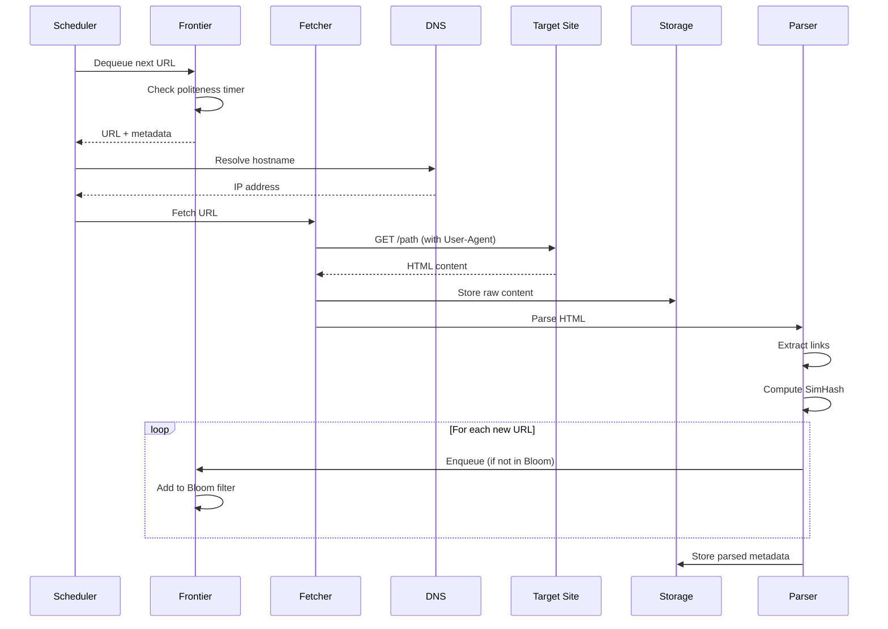
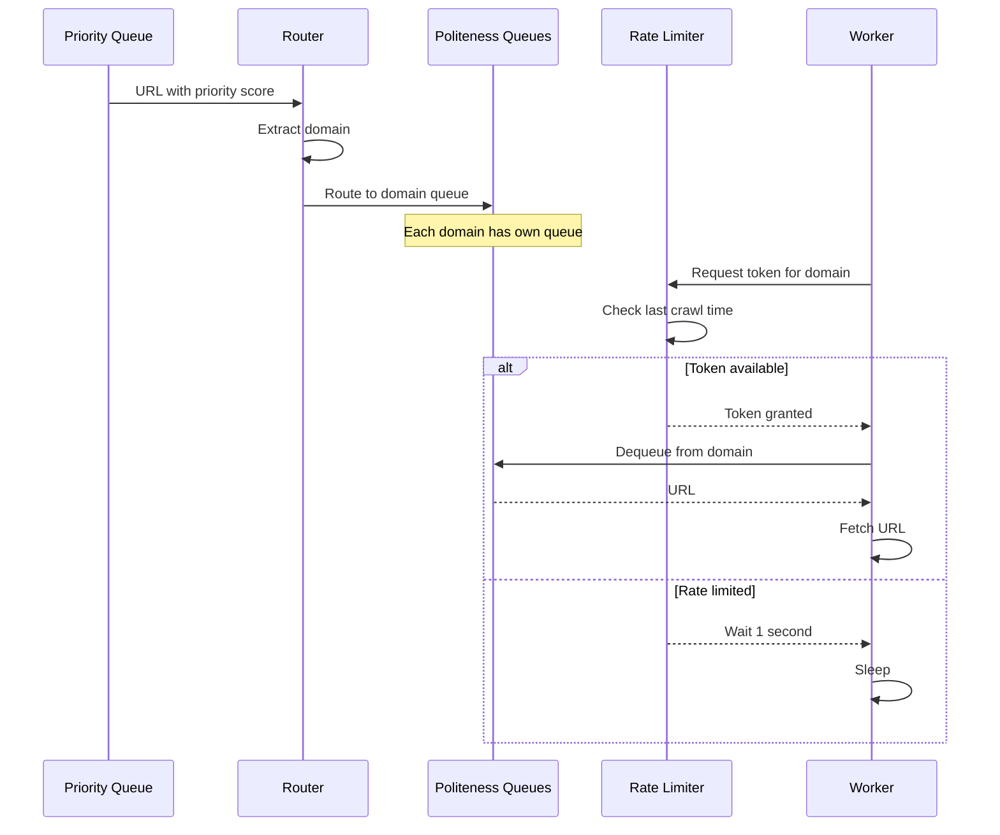

# Design Web Crawler (Googlebot / Bingbot)

> **Model Interview Answer** - This document demonstrates L4/L5 level depth with complete BOTE, SLOs, failure modes, and runbooks.

---

## 1. Requirements Clarification (5 min)

### 1.1 Functional Requirements

**Core Crawling**:

- Start from seed URLs and discover the web
- Follow hyperlinks to find new pages
- Download HTML content for indexing
- Handle various content types (HTML, PDF, images)

**Politeness & Compliance**:

- Respect robots.txt directives
- Rate limit per domain (don't DDOS sites)
- Handle crawl-delay directives
- Support sitemap.xml for discovery

**Quality & Freshness**:

- Prioritize important pages (PageRank, freshness)
- Re-crawl pages based on change frequency
- Detect and skip duplicate content
- Handle redirects (301, 302, meta refresh)

### 1.2 Non-Functional Requirements

| Requirement | Target | Rationale |
|-------------|--------|-----------|
| **Throughput** | 1 Billion pages/day | Web scale |
| **Politeness** | Max 1 req/sec per domain | Don't harm sites |
| **Freshness** | News < 1 hour, static < 1 week | Content relevance |
| **Robustness** | Handle malformed HTML, traps | Web is messy |
| **Storage** | Petabyte scale | Years of web history |

### 1.3 Scope

**In Scope**: URL discovery, HTML fetching, politeness, duplicate detection
**Out of Scope**: JavaScript rendering, full-text indexing, ranking

---

## 2. Capacity Estimation (5 min)

### 2.1 Crawl Volume

```
Target: 1 Billion pages/day
Pages per second: 1B / 86400 = 11,574 pages/sec
Peak (2×): ~23,000 pages/sec

With 1000 crawler workers:
- Each worker: ~12 pages/sec average
- Accounting for politeness delays: 1 page every 80ms per worker
```

### 2.2 URL Frontier Size

```
Known URLs (to crawl): 100 Billion
Average URL length: 100 bytes

URL Storage: 100B × 100B = 10 TB
With metadata (priority, last_crawl, domain): 30 TB

Frontier must be disk-backed (too large for RAM)
```

### 2.3 Content Storage

```
Average page size: 500 KB (raw HTML)
Compressed (gzip): 50 KB

Daily storage: 1B × 50 KB = 50 TB/day
Monthly: 1.5 PB
Yearly: 18 PB
5-year retention: 90 PB

Use tiered storage: Hot (SSD) → Warm (HDD) → Cold (Archive)
```

### 2.4 DNS Lookups

```
Unique domains per day: 10 Million
DNS TTL: Varies (1 hour to 1 day)

DNS cache size: 10M × 200 bytes = 2 GB
DNS QPS: 10M / 86400 = ~116 lookups/sec (if all cache miss)
With caching: << 10 lookups/sec to external DNS
```

### 2.5 robots.txt Cache

```
Active domains: 500 Million
robots.txt avg size: 5 KB
robots.txt refresh: Every 24 hours

Storage: 500M × 5 KB = 2.5 TB
In-memory cache for hot domains: 50 GB
```

### 2.6 BOTE Summary Table

| Resource | Calculation | Result |
|----------|-------------|--------|
| Pages per second | 1B / 86400 × 2 (peak) | 23K pages/sec |
| Crawler workers | 23K / 12 pages/worker | ~2000 workers |
| URL Frontier | 100B URLs × 300 bytes | 30 TB |
| Daily Content | 1B × 50 KB compressed | 50 TB/day |
| DNS Cache | 10M domains × 200B | 2 GB |
| robots.txt Cache | 500M × 5 KB | 2.5 TB |

---

## 3. SLOs & Operational Targets

### 3.1 Service Level Objectives

| Service | SLI | Target | Error Budget |
|---------|-----|--------|--------------|
| **Crawl Throughput** | Pages/day | 1 Billion | 10% variance |
| **Freshness (News)** | Time to re-crawl | < 1 hour | - |
| **Freshness (Blogs)** | Time to re-crawl | < 24 hours | - |
| **Freshness (Static)** | Time to re-crawl | < 7 days | - |
| **Politeness** | Max req/sec per domain | ≤ 1 | 0 violations |
| **robots.txt Compliance** | Violations | 0 | 0 tolerance |

### 3.2 Key Metrics to Monitor

```yaml
Crawl Rate:
  - pages_fetched_per_second
  - pages_fetched_per_day_total
  - successful_fetch_rate
  - fetch_latency_ms (p50, p99)

Content:
  - unique_urls_discovered_per_hour
  - duplicate_pages_skipped_count
  - content_type_distribution
  - average_page_size_bytes

Politeness:
  - domain_request_rate (should be ≤ 1/sec per domain)
  - robots_txt_cache_hit_rate
  - crawl_delay_applied_count

Quality:
  - spider_trap_detected_count
  - malformed_html_count
  - redirect_chain_length_avg
```

### 3.3 Alerting Thresholds

| Alert | Condition | Severity |
|-------|-----------|----------|
| Crawl rate < 500M pages/day | 1 hour window | P1 - Page |
| Domain politeness violation | Any | P1 - Page |
| robots.txt fetch failure rate > 5% | 15 min | P2 - Ticket |
| Frontier queue empty | Any worker | P2 - Ticket |
| Duplicate ratio > 50% | 1 hour | P2 - Ticket |
| Spider trap detection spike | 10× baseline | P3 - Monitor |

---

## 4. High-Level Architecture (10 min)

### 4.1 Architecture Diagram

```
┌─────────────────────────────────────────────────────────────────────────┐
│                         FRONTIER SERVICE                                 │
│                                                                          │
│  ┌─────────────────────────────────────────────────────────────────┐   │
│  │                     URL FRONTIER                                 │   │
│  │                                                                  │   │
│  │  ┌──────────────────────┐    ┌──────────────────────┐          │   │
│  │  │  PRIORITY QUEUES     │    │  POLITENESS QUEUES   │          │   │
│  │  │  (Front-end)         │    │  (Back-end)          │          │   │
│  │  │                      │    │                      │          │   │
│  │  │  Q1: News (High)     │───▶│  domain1.com         │          │   │
│  │  │  Q2: Popular (Med)   │    │  domain2.org         │          │   │
│  │  │  Q3: Long-tail (Low) │    │  domain3.net         │          │   │
│  │  │                      │    │  (one queue per host)│          │   │
│  │  └──────────────────────┘    └──────────────────────┘          │   │
│  │                                       │                         │   │
│  │                                       ▼                         │   │
│  │                            ┌──────────────────┐                │   │
│  │                            │ QUEUE SELECTOR   │                │   │
│  │                            │ (Rate Limited)   │                │   │
│  │                            └────────┬─────────┘                │   │
│  └─────────────────────────────────────┼───────────────────────────┘   │
└────────────────────────────────────────┼────────────────────────────────┘
                                         │
                                         ▼
┌─────────────────────────────────────────────────────────────────────────┐
│                         FETCHER CLUSTER                                  │
│                                                                          │
│  ┌──────────────┐  ┌──────────────┐  ┌──────────────┐                  │
│  │   Fetcher 1  │  │   Fetcher 2  │  │   Fetcher N  │  × 2000         │
│  │              │  │              │  │              │                  │
│  │  1. Get URL  │  │  1. Get URL  │  │  1. Get URL  │                  │
│  │  2. DNS      │  │  2. DNS      │  │  2. DNS      │                  │
│  │  3. HTTP GET │  │  3. HTTP GET │  │  3. HTTP GET │                  │
│  │  4. Store    │  │  4. Store    │  │  4. Store    │                  │
│  └──────┬───────┘  └──────┬───────┘  └──────┬───────┘                  │
│         │                 │                 │                           │
│         ▼                 ▼                 ▼                           │
│  ┌─────────────────────────────────────────────────────────────────┐   │
│  │                    DNS RESOLVER (Cached)                         │   │
│  │    Local cache → DNS over HTTPS → External Resolver             │   │
│  └─────────────────────────────────────────────────────────────────┘   │
└─────────────────────────────────────────────────────────────────────────┘
                                         │
                                         ▼
┌─────────────────────────────────────────────────────────────────────────┐
│                         PROCESSING PIPELINE                              │
│                                                                          │
│  ┌──────────────┐  ┌──────────────┐  ┌──────────────┐  ┌────────────┐ │
│  │  HTML Parser │─▶│ Content      │─▶│ Link         │─▶│ Content    │ │
│  │              │  │ Validator    │  │ Extractor    │  │ Storage    │ │
│  └──────────────┘  └──────────────┘  └──────┬───────┘  └────────────┘ │
│                                             │                          │
│                                             ▼                          │
│                                    ┌──────────────────┐               │
│                                    │ URL NORMALIZER   │               │
│                                    │ & DEDUPLICATOR   │               │
│                                    └────────┬─────────┘               │
│                                             │                          │
│                    ┌────────────────────────┼────────────────────┐    │
│                    ▼                        ▼                    ▼    │
│           ┌──────────────┐         ┌──────────────┐    ┌────────────┐│
│           │ URL Seen?    │         │ Content Seen?│    │ Add to     ││
│           │ (Bloom)      │         │ (SimHash)    │    │ Frontier   ││
│           └──────────────┘         └──────────────┘    └────────────┘│
└─────────────────────────────────────────────────────────────────────────┘
                                         │
                                         ▼
┌─────────────────────────────────────────────────────────────────────────┐
│                         CONTENT STORAGE                                  │
│                                                                          │
│  ┌─────────────────────────────────────────────────────────────────┐   │
│  │                    DISTRIBUTED FILE SYSTEM                       │   │
│  │                    (HDFS / S3 / GCS)                            │   │
│  │                                                                  │   │
│  │   /crawl/                                                       │   │
│  │     ├── 2024-01-15/                                            │   │
│  │     │     ├── segment_001.warc.gz                              │   │
│  │     │     ├── segment_002.warc.gz                              │   │
│  │     │     └── ...                                              │   │
│  │     └── 2024-01-16/                                            │   │
│  │           └── ...                                              │   │
│  │                                                                  │   │
│  │   Format: WARC (Web ARChive) - industry standard               │   │
│  └─────────────────────────────────────────────────────────────────┘   │
└─────────────────────────────────────────────────────────────────────────┘
```

### 4.2 Component Responsibilities

| Component | Responsibility | Tech Choice | Scale |
|-----------|---------------|-------------|-------|
| **URL Frontier** | Priority + politeness scheduling | Custom + RocksDB | 100s of GB |
| **Fetchers** | HTTP downloads | Go/Python + async | 2000 workers |
| **DNS Resolver** | Domain → IP caching | DNS over HTTPS | Local cache |
| **HTML Parser** | Extract text, links | libxml2 / BeautifulSoup | — |
| **Deduplicator** | Skip seen URLs/content | Bloom Filter + SimHash | — |
| **Content Store** | Archive raw HTML | HDFS/S3, WARC format | Petabytes |

---

## 5. Deep Dive: URL Frontier

### 5.1 Two-Level Queue Architecture

```
The Frontier must balance:
1. Priority: Which pages are most important?
2. Politeness: Don't hammer any single domain

┌─────────────────────────────────────────────────────────────────────┐
│                     FRONT-END (Priority Queues)                      │
│                                                                      │
│   ┌────────────────────────────────────────────────────────────┐    │
│   │  Priority 1: Breaking News, Recently Updated                │    │
│   │  [cnn.com/breaking, bbc.com/news, ...]                      │    │
│   └────────────────────────────────────────────────────────────┘    │
│   ┌────────────────────────────────────────────────────────────┐    │
│   │  Priority 2: High PageRank, Popular Sites                   │    │
│   │  [wikipedia.org/..., amazon.com/..., ...]                   │    │
│   └────────────────────────────────────────────────────────────┘    │
│   ┌────────────────────────────────────────────────────────────┐    │
│   │  Priority 3: Medium Importance                              │    │
│   │  [medium.com/..., blogpost.example/..., ...]               │    │
│   └────────────────────────────────────────────────────────────┘    │
│   ┌────────────────────────────────────────────────────────────┐    │
│   │  Priority 4: Low Priority, Long Tail                        │    │
│   │  [random-forum.com/..., old-blog.net/..., ...]             │    │
│   └────────────────────────────────────────────────────────────┘    │
└─────────────────────────────────────────────────────────────────────┘
                              │
                              ▼ Prioritizer selects from queues
                              │ (weighted round-robin: 10:5:3:1)
                              ▼
┌─────────────────────────────────────────────────────────────────────┐
│                     BACK-END (Politeness Queues)                     │
│                                                                      │
│   Each domain has its own queue + rate limiter                      │
│                                                                      │
│   ┌─────────────────┐  ┌─────────────────┐  ┌─────────────────┐    │
│   │  cnn.com        │  │  wikipedia.org  │  │  amazon.com     │    │
│   │  [url1, url2]   │  │  [url1, url2]   │  │  [url1, url2]   │    │
│   │  Last: 12:00:01 │  │  Last: 12:00:02 │  │  Last: 12:00:00 │    │
│   │  Delay: 1s      │  │  Delay: 2s      │  │  Delay: 5s      │    │
│   └─────────────────┘  └─────────────────┘  └─────────────────┘    │
│                                                                      │
│   Selector: Pick queue where (now - last_fetch) >= delay           │
└─────────────────────────────────────────────────────────────────────┘
```

### 5.2 Implementation

```python
class URLFrontier:
    def __init__(self):
        # Front-end: Priority queues
        self.priority_queues = {
            1: PriorityQueue(),  # Highest priority
            2: PriorityQueue(),
            3: PriorityQueue(),
            4: PriorityQueue()   # Lowest priority
        }
        
        # Back-end: Per-domain queues
        self.domain_queues = {}  # domain → deque of URLs
        self.domain_last_fetch = {}  # domain → timestamp
        self.domain_delay = {}  # domain → crawl delay (from robots.txt)
        
        # Default crawl delay
        self.default_delay = 1.0  # seconds
    
    def add_url(self, url, priority):
        """Add URL to frontier"""
        domain = extract_domain(url)
        
        # Check robots.txt first
        if not is_allowed(url):
            return
        
        # Add to priority queue
        self.priority_queues[priority].put((url, domain))
        
        # Initialize domain queue if needed
        if domain not in self.domain_queues:
            self.domain_queues[domain] = deque()
            self.domain_delay[domain] = get_crawl_delay(domain) or self.default_delay
    
    def get_next_url(self):
        """Get next URL respecting priority and politeness"""
        # Try each priority level
        for priority in [1, 2, 3, 4]:
            url = self._try_get_from_priority(priority)
            if url:
                return url
        
        return None  # Frontier empty or all domains on cooldown
    
    def _try_get_from_priority(self, priority):
        """Get URL from priority queue if politeness allows"""
        queue = self.priority_queues[priority]
        
        for _ in range(queue.qsize()):
            url, domain = queue.get()
            
            # Check politeness constraint
            last_fetch = self.domain_last_fetch.get(domain, 0)
            delay = self.domain_delay.get(domain, self.default_delay)
            
            if time.time() - last_fetch >= delay:
                # OK to fetch
                self.domain_last_fetch[domain] = time.time()
                return url
            else:
                # Put back and try another
                queue.put((url, domain))
        
        return None
```

---

## 6. Deep Dive: Duplicate Detection

### 6.1 URL Deduplication: Bloom Filter

```python
class URLDeduplicator:
    """
    Bloom Filter for URL deduplication.
    Space-efficient probabilistic set.
    """
    def __init__(self, expected_elements=10_000_000_000, fp_rate=0.01):
        # Calculate optimal size
        # m = -n * ln(p) / (ln(2)^2)
        self.size = int(-expected_elements * math.log(fp_rate) / (math.log(2) ** 2))
        self.hash_count = int(self.size / expected_elements * math.log(2))
        self.bit_array = bitarray(self.size)
        self.bit_array.setall(0)
        
        # Size: ~1.2 GB for 10B URLs with 1% FP rate
    
    def add(self, url):
        normalized = normalize_url(url)
        for i in range(self.hash_count):
            idx = mmh3.hash(normalized, i) % self.size
            self.bit_array[idx] = 1
    
    def might_contain(self, url):
        normalized = normalize_url(url)
        for i in range(self.hash_count):
            idx = mmh3.hash(normalized, i) % self.size
            if not self.bit_array[idx]:
                return False
        return True  # Might be false positive

def normalize_url(url):
    """Normalize URL to canonical form"""
    parsed = urlparse(url)
    
    # Lowercase scheme and host
    scheme = parsed.scheme.lower()
    host = parsed.netloc.lower()
    
    # Remove default port
    if (scheme == 'http' and ':80' in host) or (scheme == 'https' and ':443' in host):
        host = host.rsplit(':', 1)[0]
    
    # Sort query parameters
    query = urlencode(sorted(parse_qs(parsed.query).items()))
    
    # Remove fragment
    return f"{scheme}://{host}{parsed.path}?{query}"
```

### 6.2 Content Deduplication: SimHash

```python
class ContentDeduplicator:
    """
    SimHash for near-duplicate content detection.
    Unlike MD5, tolerates small changes (timestamps, ads).
    """
    def __init__(self, hash_bits=64):
        self.hash_bits = hash_bits
        self.seen_hashes = {}  # simhash → url
    
    def compute_simhash(self, content):
        """Compute 64-bit SimHash of content"""
        # Tokenize
        tokens = tokenize(content)
        
        # Get shingle hashes
        v = [0] * self.hash_bits
        for token in tokens:
            h = mmh3.hash64(token)[0]
            for i in range(self.hash_bits):
                if h & (1 << i):
                    v[i] += 1
                else:
                    v[i] -= 1
        
        # Convert to hash
        simhash = 0
        for i in range(self.hash_bits):
            if v[i] > 0:
                simhash |= (1 << i)
        
        return simhash
    
    def hamming_distance(self, h1, h2):
        """Count differing bits"""
        return bin(h1 ^ h2).count('1')
    
    def is_duplicate(self, content, threshold=3):
        """Check if content is near-duplicate (≤ threshold bits differ)"""
        simhash = self.compute_simhash(content)
        
        for seen_hash in self.seen_hashes:
            if self.hamming_distance(simhash, seen_hash) <= threshold:
                return True, self.seen_hashes[seen_hash]
        
        return False, None
    
    def add(self, content, url):
        simhash = self.compute_simhash(content)
        self.seen_hashes[simhash] = url
```

---

## 7. Deep Dive: robots.txt & Politeness

### 7.1 robots.txt Parsing

```python
class RobotsTxtCache:
    def __init__(self):
        self.cache = {}  # domain → RobotFileParser
        self.cache_time = {}  # domain → fetch timestamp
        self.ttl = 3600 * 24  # Refresh every 24 hours
    
    def is_allowed(self, url, user_agent="Googlebot"):
        domain = extract_domain(url)
        
        # Check cache freshness
        if domain not in self.cache or self._is_stale(domain):
            self._fetch_robots_txt(domain)
        
        parser = self.cache.get(domain)
        if parser is None:
            return True  # Default allow if no robots.txt
        
        return parser.can_fetch(user_agent, url)
    
    def get_crawl_delay(self, domain, user_agent="Googlebot"):
        if domain not in self.cache:
            self._fetch_robots_txt(domain)
        
        parser = self.cache.get(domain)
        if parser:
            delay = parser.crawl_delay(user_agent)
            if delay:
                return max(delay, 1.0)  # At least 1 second
        
        return None  # Use default
    
    def _fetch_robots_txt(self, domain):
        try:
            url = f"https://{domain}/robots.txt"
            response = requests.get(url, timeout=10)
            
            parser = RobotFileParser()
            parser.parse(response.text.splitlines())
            
            self.cache[domain] = parser
            self.cache_time[domain] = time.time()
        except Exception:
            self.cache[domain] = None  # Allow if fetch fails
```

### 7.2 Crawl Rate Limiting

```python
class RateLimiter:
    """Token bucket rate limiter per domain"""
    
    def __init__(self, default_rate=1.0):  # 1 request per second
        self.default_rate = default_rate
        self.domain_buckets = {}  # domain → (tokens, last_update)
    
    def acquire(self, domain, custom_rate=None):
        """Block until a token is available"""
        rate = custom_rate or self.default_rate
        
        if domain not in self.domain_buckets:
            self.domain_buckets[domain] = (1.0, time.time())
        
        while True:
            tokens, last_update = self.domain_buckets[domain]
            now = time.time()
            
            # Add tokens based on time passed
            elapsed = now - last_update
            tokens = min(1.0, tokens + elapsed * rate)
            
            if tokens >= 1.0:
                # Consume token
                self.domain_buckets[domain] = (tokens - 1.0, now)
                return
            
            # Wait for token to replenish
            wait_time = (1.0 - tokens) / rate
            time.sleep(wait_time)
```

---

## 8. Deep Dive: Spider Traps

### 8.1 Common Traps

| Trap Type | Example | Solution |
|-----------|---------|----------|
| **Infinite URL Params** | `page.php?id=1`, `?id=2`, ... | Limit unique URLs per pattern |
| **Calendar Traps** | `/2024/01/01`, `/2024/01/02`, ... | Max depth + date detection |
| **Session IDs in URL** | `?JSESSIONID=abc123` | Strip known session params |
| **Soft 404s** | Returns 200 but "Page not found" | Content analysis |
| **Redirect Loops** | A → B → C → A | Max redirect hops |

### 8.2 Trap Detection

```python
class TrapDetector:
    def __init__(self):
        self.url_patterns = {}  # pattern → count
        self.domain_depth = {}  # domain → max path depth seen
        self.max_pattern_urls = 1000
        self.max_depth = 20
    
    def is_trap(self, url):
        parsed = urlparse(url)
        
        # Check URL depth
        depth = len(parsed.path.split('/'))
        if depth > self.max_depth:
            return True, "MAX_DEPTH_EXCEEDED"
        
        # Check URL pattern repetition
        pattern = self._extract_pattern(url)
        count = self.url_patterns.get(pattern, 0)
        if count > self.max_pattern_urls:
            return True, "PATTERN_REPETITION"
        
        # Check for calendar-like patterns
        if self._looks_like_calendar(parsed.path):
            return True, "CALENDAR_TRAP"
        
        return False, None
    
    def _extract_pattern(self, url):
        """Extract URL pattern by replacing numbers with placeholder"""
        pattern = re.sub(r'\d+', '{N}', url)
        pattern = re.sub(r'[a-f0-9]{32}', '{HASH}', pattern)  # MD5/UUID
        return pattern
    
    def _looks_like_calendar(self, path):
        """Detect /YYYY/MM/DD patterns"""
        return bool(re.search(r'/\d{4}/\d{2}/\d{2}', path))
    
    def record_url(self, url):
        pattern = self._extract_pattern(url)
        self.url_patterns[pattern] = self.url_patterns.get(pattern, 0) + 1
```

---

## 9. Failure Modes & Runbooks

### 9.1 Failure Scenarios

| Failure | Impact | Detection | Mitigation |
|---------|--------|-----------|------------|
| DNS resolver down | Can't resolve new domains | DNS failure rate | Fallback DNS, cached entries |
| Frontier disk full | Can't add new URLs | Disk space alert | Purge low-priority URLs |
| Fetcher OOM | Worker crash | Memory alert | Restart, limit page size |
| robots.txt cache stale | Crawling disallowed pages | Cache age metric | Force refresh |
| Spider trap | Worker stuck | URLs-per-domain spike | Blacklist pattern |

### 9.2 Runbook: Crawl Rate Drop

```markdown
## Alert: Crawl Rate < 500M Pages/Day (P1)

### Symptoms
- Search index freshness degrading
- New content not being indexed

### Diagnosis Steps

1. Check fetcher health:
   - How many workers running?
   - Any crashlooping pods?

2. Check frontier status:
   - Is frontier empty?
   - Are all URLs on cooldown (politeness)?

3. Check network issues:
   - DNS resolution latency
   - Timeout rate by region

4. Check for blocking:
   - Increased 403/429 responses?
   - Are major CDNs blocking us?

### Mitigation

1. **If fetcher crashes**:
   - Check OOM (increase memory limit)
   - Check for poison URLs (malformed responses)
   - Restart failed workers

2. **If frontier starved**:
   - Check seed URL injection
   - Verify link extraction is working
   - Reduce politeness delay temporarily

3. **If blocked by sites**:
   - Review user-agent string
   - Check robots.txt compliance
   - Reduce request rate to affected domains

### Recovery
- Crawl rate should recover within 1-2 hours
- May need to backfill missed pages
```

### 9.3 Runbook: Politeness Violation Detected

```markdown
## Alert: Domain Politeness Violation (P1)

### Context
A politeness violation means we may be DDOSing a site.
This can lead to legal issues and IP blocking.

### Immediate Actions

1. **Identify affected domain**:
   - Check logs for domain with > 1 req/sec
   
2. **Stop crawling that domain**:
   ```bash
   curl -X POST http://crawler-api/pause-domain?domain=affected.com
   ```

1. **Investigate cause**:
   - Is crawl-delay being respected?
   - Multiple fetchers hitting same domain?
   - Clock skew between nodes?

### Root Cause Analysis

Common causes:

- robots.txt parsing bug
- Rate limiter not shared across workers
- Frontier assigning same domain to multiple workers

### Prevention

- Centralized domain lock service
- Double-check rate limiting logic
- Alert threshold well below violation

```

### 9.4 Degraded Mode

```markdown
## Graceful Degradation

### Level 1: Reduced Capacity
- Reduce fetcher count
- Increase politeness delay (1s → 2s)
- Skip low-priority URLs

### Level 2: Targeted Crawling
- Only crawl high-priority domains
- Skip non-HTML content
- Shorter re-crawl intervals

### Level 3: Maintenance Mode
- Stop discovering new URLs
- Only re-crawl highest priority pages
- Preserve existing index freshness

### Level 4: Full Stop
- Pause all crawling
- Preserve frontier state for resume
- Notify search ranking team
```

---

## 10. Trade-offs Summary

| Decision | Choice | Trade-off |
|----------|--------|-----------|
| **Politeness** | 1 req/sec per domain | Slower crawl, but ethical and legal |
| **Frontier Storage** | Disk-backed (RocksDB) | Handles 100B URLs, but slower than RAM |
| **Duplicate Detection** | Bloom + SimHash | Some false positives, saves massive storage |
| **Content Format** | WARC | Industry standard, verbose but complete |
| **Crawl Delay** | Respect robots.txt | May slow down important sites |

---

## 11. Security & Threat Model

### Attack Vectors

| Threat | Attack | Mitigation |
|--------|--------|------------|
| **Spider Traps** | Infinite URL generation | Max depth, URL pattern detection |
| **Malicious Content** | Serve malware to crawler | Sandbox execution, no JS by default |
| **DoS to Site** | Crawl too fast | Strict rate limiting, respect Crawl-delay |
| **IP Blocking** | Site blocks crawler IP | Rotate IPs, identify as Googlebot |
| **Crawler Exploitation** | Malformed HTML causing OOM | Resource limits, timeout on parsing |
| **Legal Issues** | Scraping copyrighted content | Respect robots.txt, nofollow directives |

### Ethical Crawling

```yaml
Must Respect:
  - robots.txt directives
  - Crawl-delay in robots.txt
  - nofollow/noindex meta tags
  - Rate limits (back off on 429s)

Best Practices:
  - Use identifiable User-Agent
  - Provide contact email in User-Agent
  - Crawl during off-peak hours if possible
  - Don't overload small sites
```

---

## 12. Sequence Diagrams

### URL Discovery & Crawl Flow



### Politeness Queue Flow



---

## 13. Data Schema

### Frontier Storage (RocksDB)

```
# Priority Queue Entry
Key: priority:{score}:{url_hash}
Value: {
  url: "https://example.com/page1",
  depth: 3,
  last_crawl: null,
  discovered_from: "https://example.com",
  priority: 0.85
}

# Domain Queue Entry
Key: domain:{domain}:{timestamp}
Value: {url_hash}

# Bloom Filter (separate file)
bloom.dat: 1.2 GB bit vector

# Domain Metadata
Key: meta:{domain}
Value: {
  last_crawl: 1642531200,
  crawl_delay: 10,
  robots_txt_hash: "abc123",
  error_count: 0
}
```

### Content Storage (WARC format on S3)

```
s3://crawler-content/
├── 2024/
│   └── 01/
│       └── 15/
│           ├── warc-00001.warc.gz  (1 GB each)
│           ├── warc-00002.warc.gz
│           └── ...
└── metadata/
    ├── url_to_warc_index.parquet
    └── simhash_index.parquet
```

### PostgreSQL (Crawl Metadata)

```sql
CREATE TABLE crawl_log (
    url_hash BYTEA PRIMARY KEY,
    url TEXT,
    domain TEXT,
    status_code INT,
    content_type TEXT,
    content_length BIGINT,
    simhash BIGINT,
    crawl_time TIMESTAMP,
    warc_file TEXT,
    warc_offset BIGINT
);

CREATE INDEX idx_domain ON crawl_log(domain, crawl_time);
CREATE INDEX idx_simhash ON crawl_log(simhash);
```

---

## 14. Cost Estimate (Monthly)

### Assumptions

- 1B pages/day (23K/sec peak)
- 50 TB new content/day
- 100B total URLs tracked

| Resource | Quantity | Unit Cost | Monthly Cost |
|----------|----------|-----------|--------------|
| **Fetcher Workers** (c5.xlarge) | 500 instances | $0.17/hr | $61,200 |
| **Frontier (RocksDB)** (i3.2xlarge) | 20 nodes | $0.62/hr | $8,928 |
| **DNS Cache** (Redis, r6g.large) | 6 nodes | $0.13/hr | $561 |
| **Content Storage** (S3) | 1.5 PB/month new | $0.023/GB | $35,328 |
| **S3 Glacier** (archive) | 10 PB total | $0.004/GB | $40,960 |
| **Parser Workers** (c5.2xlarge) | 100 instances | $0.34/hr | $24,480 |
| **Kafka (MSK)** | 10 brokers | $0.42/hr | $3,024 |
| **PostgreSQL RDS** | 5 instances | $0.96/hr | $3,456 |
| **Network Transfer** | 50 TB/day | $0.02/GB | $30,720 |
| **Total** | | | **~$208,657/month** |

### Cost Optimization

- Spot instances for fetcher workers (70% savings)
- S3 lifecycle to Glacier after 30 days
- Compress content before storage
- De-prioritize low-value domains

---

## 11. Interview Presentation Tips

```markdown
### Opening (30 sec)
"A web crawler discovers and downloads web pages for search indexing.
The key challenges are:
1) Scale: 1 billion pages/day at 23K pages/sec
2) Politeness: Max 1 request/second per domain
3) Duplicate detection: Skip 30%+ duplicate content
4) Robustness: Handle malformed HTML, spider traps, infinite URLs"

### Key Talking Points
- "Two-level frontier: Priority queues feed politeness queues"
- "Bloom filter for URL dedup (1.2 GB for 10B URLs)"
- "SimHash for near-duplicate content (tolerates ads/timestamps)"
- "robots.txt caching with 24-hour refresh"

### Numbers to Remember
- 1B pages/day = 23K pages/sec peak
- 100B known URLs = 30 TB frontier
- 50 TB/day content storage
- 1 request/sec max per domain
- 500M domains tracked

### Common Follow-ups
Q: "How do you prioritize which pages to crawl?"
A: "Weighted scoring: PageRank + freshness + update frequency. News sites re-crawled hourly."

Q: "How do you handle JavaScript-rendered pages?"
A: "Separate rendering farm with headless Chrome. Expensive, so only for high-value pages."

Q: "What if a domain blocks you?"
A: "Respect their decision. Lower crawl rate, review robots.txt. Don't try to circumvent."
```
