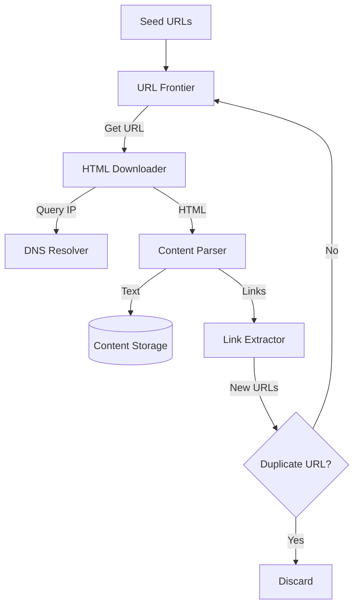

# Design a Web Crawler (Google Bot)

## 1. Requirements

### Functional

1. **Crawl**: Start from seed URLs and crawl the web.
2. **Extract**: Parse HTML and extract dynamic links.
3. **Store**: Save content (HTML/Text) for the Indexer.

### Non-Functional

1. **Politeness**: Don't DDOS websites. Respect `robots.txt`.
2. **Scalability**: Billions of pages.
3. **Robustness**: Handle malformed HTML, infinite loops, traps.

## 2. Capacity Estimation

- 1 Billion pages/month.
- Peak QPS: ~400 pages/sec.
- Storage: 1B * 500KB = 500TB/month. (Save for 5 years = 30 PB).

## 3. High-Level Architecture

1. **Seed URLs**: Entry point.
2. **URL Frontier**: The brain. Prioritizes and Schedules URLs to crawl.
3. **HTML Downloader (Fetcher)**: Fetches the page.
4. **DNS Resolver**: Caches IP addresses.
5. **Content Parser**: Validates and cleans HTML.
6. **Duplicate Detector**: Checks checksum (MD5/CRC) to skip known pages.
7. **Link Extractor**: Finds new `<a>` tags and adds to Frontier.

### Architecture Diagram

## 4. Key Components Detail

### A. URL Frontier (The Scheduler)

Must handle **Politeness** and **Priority**.

- **Front-end Queues (Priority)**:
  - Queue 1: High Priority (News sites).
  - Queue 2: Low Priority (Forums).
- **Back-end Queues (Politeness)**:
  - Map specific domains (`wikipedia.org`) to specific queues.
  - Ensures we don't hit the same domain parallelly.
  - A "Queue Router" maps Priority -> Politeness queues.

### B. Duplicate Detection (MinHash / SimHash)

- Storing full HTML to compare is slow.
- **Fingerprinting**:
  - **MD5**: Exact match. Fails if 1 byte changes (e.g., dynamic timestamp).
  - **SimHash**: Detects *near* duplicates. If Hamming Distance is small, pages are similar.

## 5. Handling Traps

- **Spider Traps**: Infinite loops (e.g., `calendar.com/2020/jan`, `.../feb`).
- **Solution**: Limit max URL length. Limit max depth per domain. Use a "seen URL" Bloom Filter.
