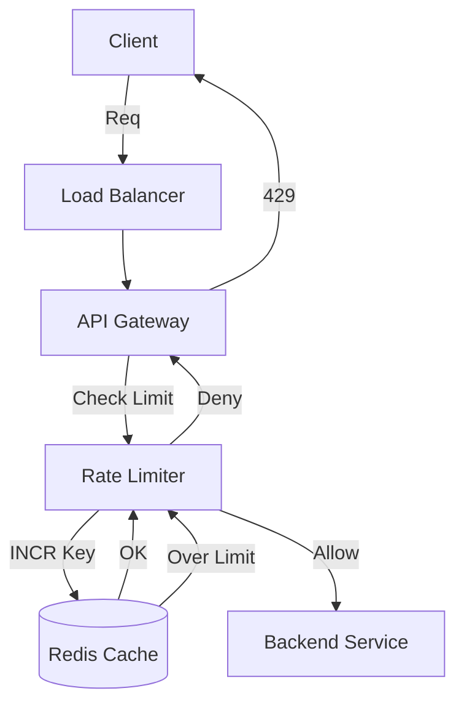

# Design a Distributed Rate Limiter

## 1. Requirements

### Functional

1. **Limit**: Restrict requests to $N$ per window (e.g., 10 req / sec).
2. **Scope**: Per UserID, per IP, or Global.
3. **Response**: Return HTTP 429 (Too Many Requests).

### Non-Functional

1. **Low Latency**: Must be extremely fast (< 10ms).
2. **Distributed**: Work across multiple API Gateway nodes.
3. **Accuracy**: Should be reasonably accurate.

## 2. Algorithms (Recap)

- **Token Bucket**: Standard. Good for bursts.
- **Leaky Bucket**: Smooth output.
- **Fixed Window**: Edge case bursts.
- **Sliding Window Log**: Expensive memory.
- **Sliding Window Counter (Key)**: Best balance.

## 3. Distributed Architecture

- **Web Servers**: Stateless. Receive requests.
- **Rate Limiter Service / Middleware**: Checks allow/deny.
- **Storage**: Redis (In-memory, atomic). Database is too slow.

### Architecture Diagram

## 4. Race Conditions (Concurrency)

**Scenario**: Limit = 1.

- User sends 2 requests A and B instantly.
- Both read Counter = 0.
- Both Increment to 1.
- Both pass. **Fail!** Limit was exceeded.

### Solution 1: Redis `INCR` (Atomic)

- Redis operations are atomic.
- `INCR user_id` returns the new value.
- If (New_Val > Limit) -> Reject.
- This works perfectly for Fixed Window.

### Solution 2: Lua Scripts

- For complex logic (Token Bucket: read tokens, refill, subtract), combine logic into a Lua script.
- Redis executes Lua scripts atomically.

## 5. Optimization: Local Memory Caching

- Hitting Redis for *every* request is network heavy.
- **Optimization**: Keep a small counter in local RAM of the Web Server.
- Sync with Redis every few seconds.
- *Trade-off*: Accuracy drops slightly (Total limit might be exceeded by `(N_Servers * Sync_Interval)`). Acceptable for high-volume APIs.

## 6. Hard vs Soft Rate Limiting

- **Hard**: Strict. Never exceed 10.
- **Soft**: Allow spikes briefly. Good for shopping carts (don't block a purchase flow).
