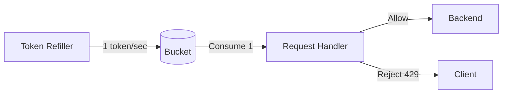
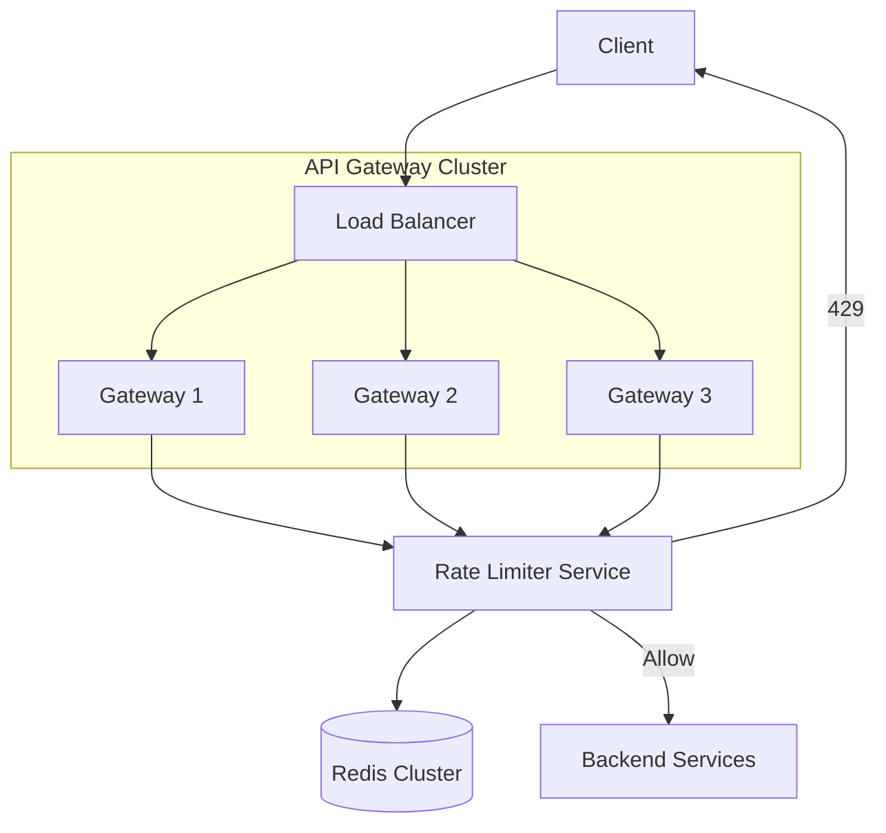
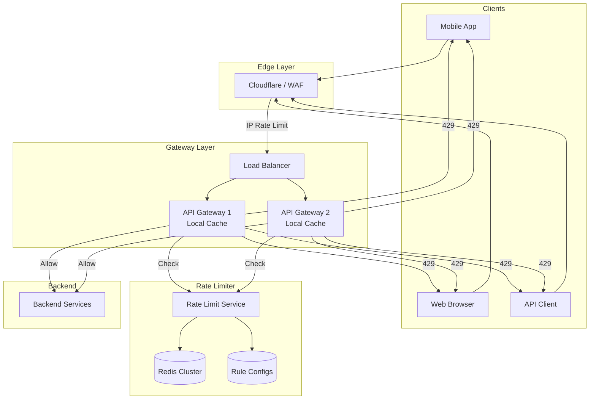

# Design a Distributed Rate Limiter

Rate limiting protects systems from abuse, ensures fair usage, and prevents cascading failures. It's a **must-know** topic for FAANG interviews.

## 1. Requirements

### Functional

1. **Limit requests**: Restrict to N requests per time window (e.g., 100 req/min)
2. **Multiple scopes**: Per User, per IP, per API key, per endpoint
3. **Response**: Return HTTP 429 (Too Many Requests) with Retry-After header
4. **Configurable rules**: Different limits for different API endpoints

### Non-Functional

1. **Low Latency**: < 5ms overhead per request
2. **Distributed**: Work across multiple API Gateway nodes
3. **Fault Tolerant**: If rate limiter fails, system should still work (fail-open vs fail-closed)
4. **Accuracy**: Reasonably accurate (not blocking legitimate users, not allowing significant overages)

---

## 2. Rate Limiting Algorithms (Deep Dive)

### 2.1 Token Bucket

**Concept**: A bucket holds tokens. Each request consumes a token. Tokens are refilled at a constant rate.

```
Bucket Capacity: 10 tokens
Refill Rate: 1 token/second

Request arrives → Check bucket
  - If tokens > 0: Allow, decrement token
  - If tokens = 0: Reject (429)
```

**Diagram**:



**Pros**:

- Allows short bursts (up to bucket capacity)
- Smooth long-term rate

**Cons**:

- More complex to implement than fixed window

**Parameters**:

- `bucket_size`: Maximum burst size
- `refill_rate`: Sustained rate limit

### 2.2 Leaky Bucket

**Concept**: Requests enter a queue (bucket). Requests are processed at a fixed rate (leak). If bucket overflows, reject.

```
Bucket Size: 10
Leak Rate: 1 req/second

Request arrives → Add to bucket
  - If bucket not full: Queue request
  - If bucket full: Reject
```

**Pros**:

- Perfectly smooth output rate
- Great for APIs that need consistent processing

**Cons**:

- Bursts are queued, not served immediately (higher latency)

### 2.3 Fixed Window Counter

**Concept**: Count requests in fixed time windows (e.g., 0:00-0:59, 1:00-1:59).

```
Limit: 10 req/minute
Window: Every minute boundary

0:00-0:59 → Counter: 8 → Allow
1:00-1:59 → Counter resets to 0
```

**Implementation (Redis)**:

```lua
key = "rate_limit:user123:minute:1705123200"  -- Unix timestamp rounded to minute
count = INCR(key)
if count == 1 then
    EXPIRE(key, 60)
end
if count > limit then
    return REJECT
end
return ALLOW
```

**Problem: Boundary Burst**:

```
Limit: 10/minute
0:30-0:59 → 10 requests → Allowed
1:00-1:30 → 10 requests → Allowed
─────────────────────────────────
Net: 20 requests in 60 seconds!
```

### 2.4 Sliding Window Log

**Concept**: Keep a log of all request timestamps. Count requests in the sliding window.

```
Window: 60 seconds
Limit: 10

Current time: 1:30
Requests in [0:30, 1:30]: Count them
If count >= 10: Reject
```

**Implementation (Redis Sorted Set)**:

```lua
key = "rate_limit:user123"
now = current_timestamp()
window_start = now - 60

-- Remove old entries
ZREMRANGEBYSCORE(key, 0, window_start)

-- Count entries in window
count = ZCARD(key)

if count < limit then
    ZADD(key, now, request_id)
    return ALLOW
else
    return REJECT
end
```

**Pros**: Perfectly accurate, no boundary issues
**Cons**: Memory-intensive (stores every timestamp)

### 2.5 Sliding Window Counter (Best Balance)

**Concept**: Combine fixed window with weighted interpolation.

```
Previous window count: 8
Current window count: 3
Current window progress: 30% through

Effective count = 3 + 8 × (1 - 0.30) = 3 + 5.6 = 8.6
```

**Diagram**:

```
|←── Previous Window ──→|←── Current Window ──→|
        (8 requests)            (3 requests)
                         ▲
                    Now (30% into current)

Weighted: 8 × 0.7 + 3 = 8.6
```

**Pros**: Low memory (just 2 counters), good accuracy
**Cons**: Approximate (but good enough for most cases)

---

## 3. Algorithm Comparison

| Algorithm | Memory | Accuracy | Burst Handling | Complexity |
|-----------|--------|----------|----------------|------------|
| **Token Bucket** | O(1) per user | High | Allows bursts | Medium |
| **Leaky Bucket** | O(bucket size) | High | Queues bursts | Medium |
| **Fixed Window** | O(1) per user | Low (boundary) | Edge case burst | Low |
| **Sliding Log** | O(requests) | Perfect | N/A | High |
| **Sliding Counter** | O(2) per user | Good | Smooth | Medium |

**Recommendation**: Use **Token Bucket** for user-facing APIs, **Sliding Window Counter** for simplicity.

---

## 4. Distributed Architecture



### Where to Place Rate Limiter

| Location | Pros | Cons |
|----------|------|------|
| **API Gateway** | Centralized, before app logic | Single point for all services |
| **Middleware** | Per-service control | Duplicated logic |
| **Sidecar (Envoy)** | Service mesh native | Complexity |
| **Cloud Provider** | Zero code (AWS WAF, Cloudflare) | Less control |

---

## 5. Redis Implementation (Production-Ready)

### Atomic Operations with Lua Script

**Why Lua?** Multiple Redis commands need to be atomic. Lua scripts execute atomically on Redis.

### Token Bucket Lua Script

```lua
-- Keys: rate_limit_key
-- Args: capacity, refill_rate, requested_tokens, current_time

local key = KEYS[1]
local capacity = tonumber(ARGV[1])
local refill_rate = tonumber(ARGV[2])  -- tokens per second
local requested = tonumber(ARGV[3])
local now = tonumber(ARGV[4])

-- Get current state
local data = redis.call('HMGET', key, 'tokens', 'last_refill')
local tokens = tonumber(data[1]) or capacity
local last_refill = tonumber(data[2]) or now

-- Calculate refill
local elapsed = now - last_refill
local refill = elapsed * refill_rate
tokens = math.min(capacity, tokens + refill)

-- Check if request allowed
if tokens >= requested then
    tokens = tokens - requested
    redis.call('HMSET', key, 'tokens', tokens, 'last_refill', now)
    redis.call('EXPIRE', key, 86400)  -- 24 hour TTL
    return 1  -- Allowed
else
    return 0  -- Rejected
end
```

### Fixed Window with INCR

```lua
local key = KEYS[1]
local limit = tonumber(ARGV[1])
local window_seconds = tonumber(ARGV[2])

local current = redis.call('INCR', key)

if current == 1 then
    redis.call('EXPIRE', key, window_seconds)
end

if current > limit then
    return 0  -- Rejected
end

return 1  -- Allowed
```

---

## 6. Multi-Tier Rate Limiting

Apply multiple rate limits simultaneously:

| Tier | Scope | Limit | Purpose |
|------|-------|-------|---------|
| Global | All traffic | 1M/min | DDoS protection |
| Per IP | IP address | 1000/min | Bot protection |
| Per User | Authenticated user | 100/min | Fair usage |
| Per API Key | Developer API key | 5000/hour | Pricing tiers |
| Per Endpoint | `/api/expensive` | 10/min | Resource protection |

```python
def check_rate_limits(request):
    checks = [
        ("global", "global", 1000000),
        ("ip", request.ip, 1000),
        ("user", request.user_id, 100),
        ("api_key", request.api_key, 5000),
    ]
    
    for scope, key, limit in checks:
        if not rate_limiter.allow(f"{scope}:{key}", limit):
            return False, scope  # Return which limit was hit
    
    return True, None
```

---

## 7. Rate Limit Headers

Return headers so clients can adapt:

```http
HTTP/1.1 200 OK
X-RateLimit-Limit: 100
X-RateLimit-Remaining: 57
X-RateLimit-Reset: 1705123260  # Unix timestamp when window resets

# When limit exceeded:
HTTP/1.1 429 Too Many Requests
Retry-After: 45  # Seconds until client should retry
X-RateLimit-Limit: 100
X-RateLimit-Remaining: 0
X-RateLimit-Reset: 1705123260
```

---

## 8. Failure Handling

### Fail-Open vs Fail-Closed

| Strategy | Behavior | Use Case |
|----------|----------|----------|
| **Fail-Open** | If Redis down, allow all requests | Better UX, security risk |
| **Fail-Closed** | If Redis down, reject all requests | More secure, worse UX |

**Recommendation**: Fail-open with monitoring alerts. Rate limiting is defense-in-depth.

### Local Caching for Resilience

Keep approximate counters in local memory:

```python
class HybridRateLimiter:
    def __init__(self):
        self.local_cache = {}  # Local approximate counts
        self.sync_interval = 1  # Sync with Redis every 1 second
    
    def allow(self, key, limit):
        # Try Redis first
        try:
            return self.redis_check(key, limit)
        except RedisConnectionError:
            # Fallback to local
            return self.local_check(key, limit * 1.2)  # Allow 20% buffer
```

---

## 9. Architecture Diagram (Complete)



---

## 10. Interview Talking Points

### Key Design Decisions

1. **Token Bucket**: Best for user-facing APIs (allows bursts)
2. **Redis + Lua**: Atomic operations, low latency
3. **Multi-tier limits**: Defense in depth
4. **Fail-open**: Better UX for non-critical limits

### Trade-offs to Discuss

| Trade-off | Option A | Option B |
|-----------|----------|----------|
| Accuracy vs Memory | Sliding Log (exact) | Sliding Counter (approximate) |
| Latency vs Consistency | Local cache | Central Redis |
| Security vs UX | Fail-closed | Fail-open |

### Common Follow-up Questions

1. **How to rate limit across regions?**
   - Global Redis (high latency) vs Regional with eventual sync

2. **What if user hits limit legitimately?**
   - Return Retry-After, allow limit increase requests

3. **How to prevent gaming (rotating IPs)?**
   - Device fingerprinting, account-level limits, CAPTCHA

4. **How does this scale to millions of users?**
   - Redis Cluster sharding by key
   - Each user's limit data lives on one shard
   - Throughput scales horizontally
