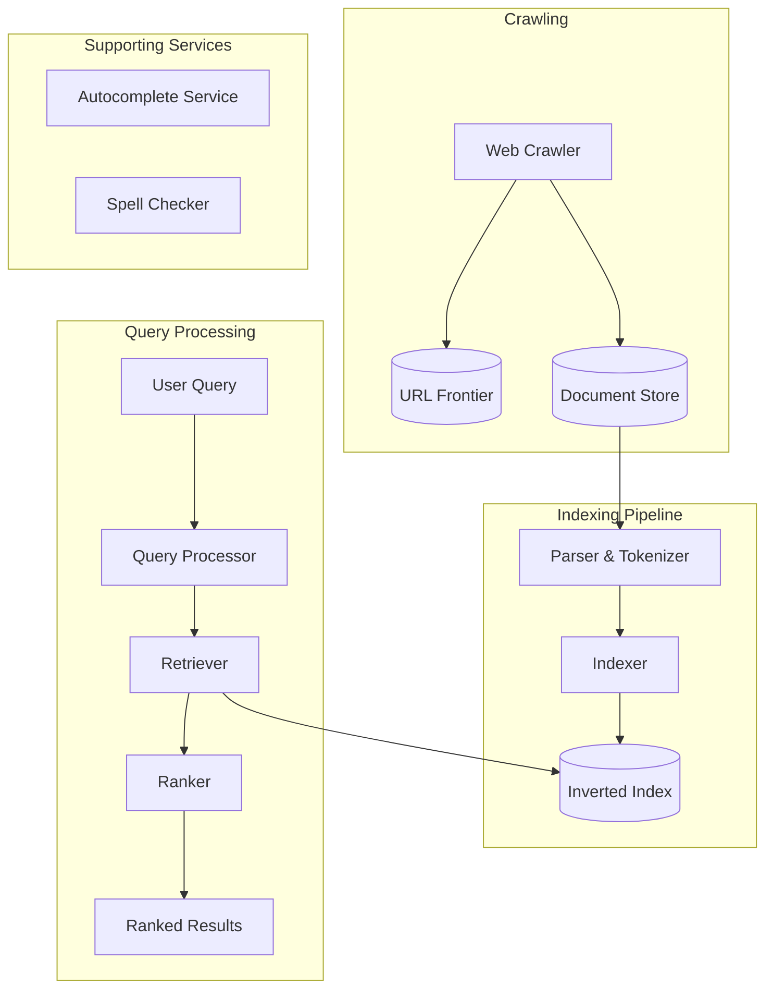
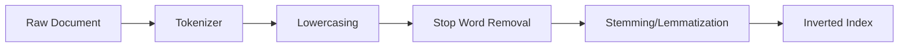
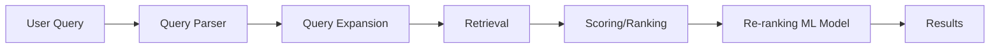
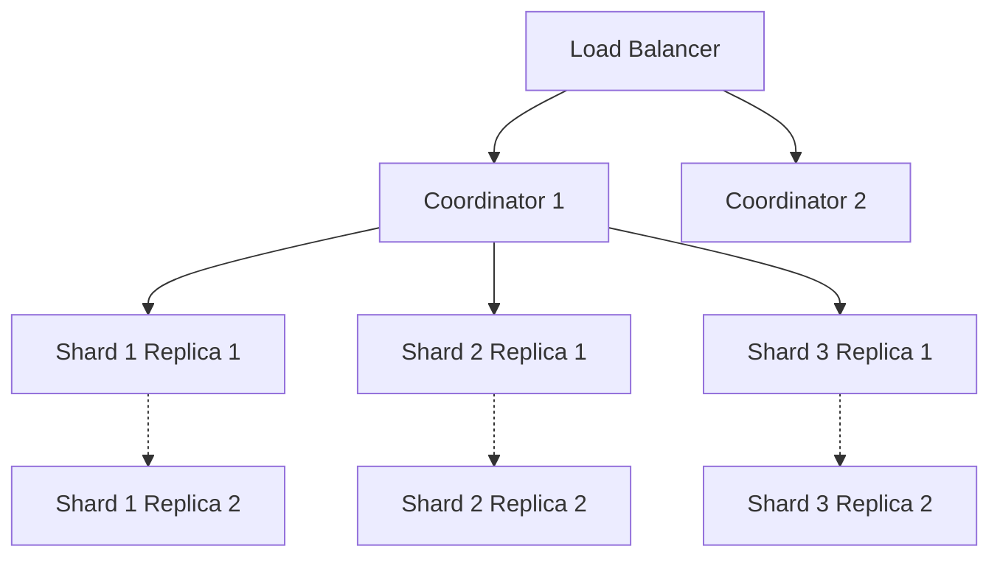
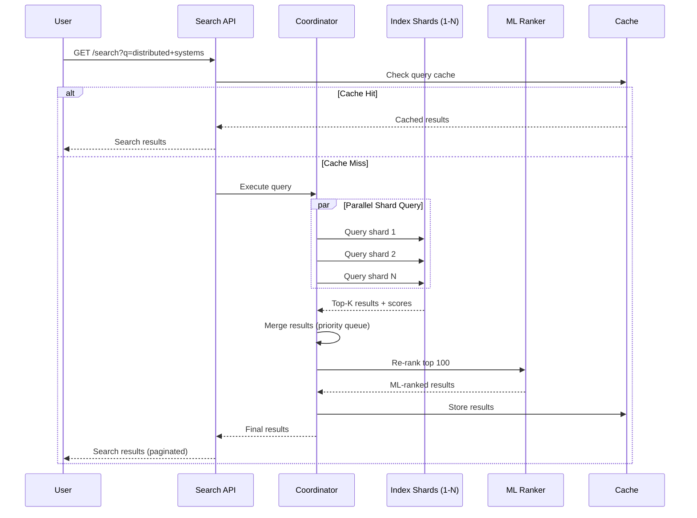
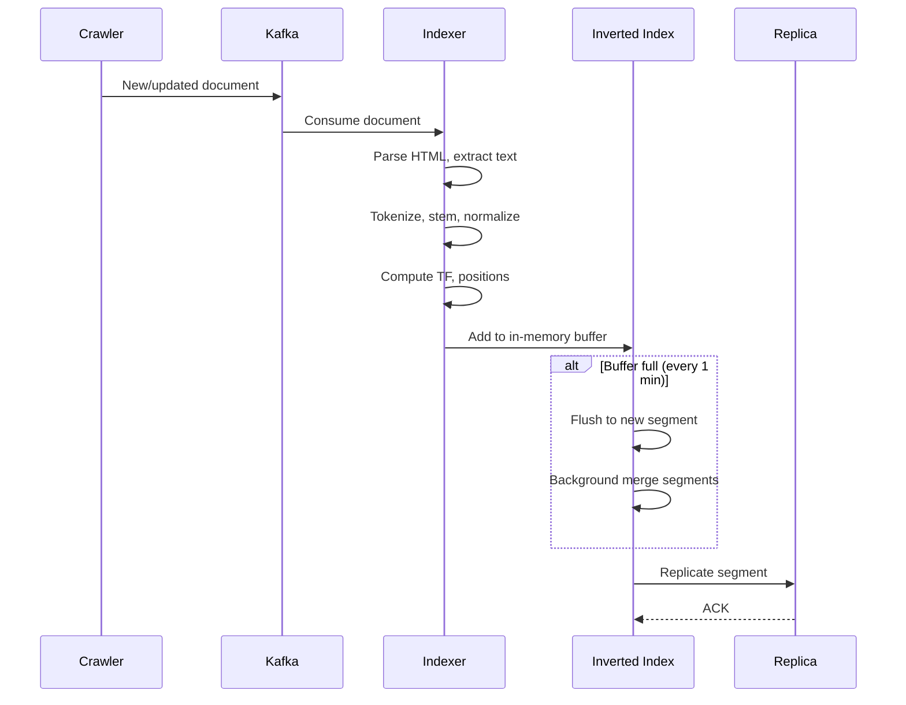

# Design a Search Engine (e.g., Google Search, Elasticsearch)

> **Model Interview Answer** - This document demonstrates L4/L5 level depth with complete BOTE, SLOs, failure modes, and runbooks.

## 1. Requirements

### Functional

1. **Crawl** web pages and build an index
2. **Index** documents for fast retrieval
3. **Query** processing with ranking
4. **Autocomplete** suggestions while typing
5. **Spell correction** for typos

### Non-Functional

1. **Low Latency**: Results in < 200ms
2. **High Availability**: 99.99% uptime
3. **Scalability**: Billions of documents, millions of QPS
4. **Freshness**: New content indexed quickly

## 2. Capacity Estimation

### Scale (Google-like)

| Metric | Value |
|--------|-------|
| Documents indexed | 100 Billion |
| Average document size | 100 KB (compressed: 10 KB) |
| Storage | 100B × 10KB = 1 Exabyte |
| Search QPS | 100,000+ QPS |
| Indexing rate | 1 Million docs/hour |

---

## 2.1 SLOs & Operational Targets

### Service Level Objectives

| Service | SLI | Target | Error Budget |
|---------|-----|--------|--------------|
| **Search API** | Availability | 99.99% | 4.3 min/month |
| **Search API** | p99 latency | < 200ms | - |
| **Search API** | p50 latency | < 50ms | - |
| **Indexing** | Freshness (news) | < 1 hour | - |
| **Indexing** | Freshness (general) | < 24 hours | - |
| **Shards** | Availability | 99.99% per shard | - |

### Key Metrics to Monitor

```yaml
Query Path:
  - search_requests_per_second
  - search_latency_ms (p50, p99)
  - query_success_rate
  - results_returned_count (avg)

Index:
  - index_size_bytes{shard}
  - documents_indexed_per_minute
  - index_freshness_lag_seconds
  - shard_replica_lag_bytes

Cache:
  - query_cache_hit_rate
  - posting_list_cache_hit_rate
  - cache_eviction_rate
```

### Alerting Thresholds

| Alert | Condition | Severity |
|-------|-----------|----------|
| Search p99 > 500ms | 5 min window | P1 - Page |
| Shard unavailable | Any primary | P1 - Page |
| Index freshness > 2 hours | News content | P2 - Ticket |
| Query cache hit rate < 80% | 15 min window | P2 - Ticket |
| Empty results rate > 10% | 5 min window | P2 - Ticket |

---

## 3. High-Level Architecture



---

## 4. Core Component: Inverted Index

The heart of any search engine. Maps **terms → documents** instead of documents → terms.

### Forward Index (What NOT to do)

```
Doc1 → [the, quick, brown, fox]
Doc2 → [the, lazy, dog]
Doc3 → [quick, brown, dog]
```

Problem: To find "quick", must scan ALL documents.

### Inverted Index (What TO do)

```
quick → [Doc1, Doc3]
brown → [Doc1, Doc3]
dog   → [Doc2, Doc3]
the   → [Doc1, Doc2]
```

Now finding "quick" is O(1) lookup!

### Posting List Structure

Each term points to a **posting list**:

```
Term: "quick"
Posting List: [
  {docId: 1, freq: 1, positions: [2]},
  {docId: 3, freq: 1, positions: [1]}
]
```

- **docId**: Which document
- **freq**: Term frequency (for ranking)
- **positions**: Where in doc (for phrase queries)

### Index Construction Pipeline



| Step | Example |
|------|---------|
| Raw | "The Quick Brown Foxes" |
| Tokenize | ["The", "Quick", "Brown", "Foxes"] |
| Lowercase | ["the", "quick", "brown", "foxes"] |
| Stop words | ["quick", "brown", "foxes"] |
| Stemming | ["quick", "brown", "fox"] |

---

## 5. Ranking: TF-IDF and BM25

### TF-IDF (Term Frequency - Inverse Document Frequency)

```
TF(t, d) = count of term t in document d / total terms in d
IDF(t) = log(total documents / documents containing t)
TF-IDF = TF × IDF
```

**Intuition**:

- High TF: Term appears often in this doc (relevant)
- High IDF: Term is rare across all docs (distinctive)

### BM25 (Industry Standard)

An improved TF-IDF that handles document length normalization:

```
score(D, Q) = Σ IDF(qi) × (f(qi, D) × (k1 + 1)) / (f(qi, D) + k1 × (1 - b + b × |D|/avgdl))
```

Where:

- `f(qi, D)` = term frequency of qi in D
- `|D|` = document length
- `avgdl` = average document length
- `k1`, `b` = tuning parameters (typically k1=1.5, b=0.75)

### Beyond Lexical: Semantic Search

Modern systems use **embeddings** (BERT, GPT) to understand meaning:

| Query | Lexical Match | Semantic Match |
|-------|---------------|----------------|
| "How to fix a flat tire" | "fix", "flat", "tire" | Also matches "change punctured wheel" |

---

## 6. Query Processing Pipeline



### Steps

1. **Parse**: Handle operators (AND, OR, quotes for phrases)
2. **Expand**: Add synonyms, spell corrections
3. **Retrieve**: Get candidate docs from inverted index
4. **Score**: Apply BM25 or similar
5. **Re-rank**: Apply ML model (LTR - Learning to Rank)

### Query Types

| Type | Example | How to Handle |
|------|---------|---------------|
| Single term | `python` | Direct posting list lookup |
| AND | `python AND tutorial` | Intersect posting lists |
| OR | `python OR java` | Union posting lists |
| Phrase | `"quick brown fox"` | Use position data |
| Wildcard | `pyth*` | Trie or n-gram index |

---

## 7. Distributed Search Architecture

### Sharding Strategies

#### Option 1: Document Partitioning (Preferred)

Each shard holds a subset of documents (complete index for those docs).

```
Shard 1: Docs 1-1M (full inverted index)
Shard 2: Docs 1M-2M (full inverted index)
...
```

**Query flow**: Scatter query to all shards → Gather and merge results

#### Option 2: Term Partitioning

Each shard holds a subset of terms.

```
Shard 1: Terms A-M
Shard 2: Terms N-Z
```

**Problem**: Multi-term queries require hitting multiple shards.

### Index Replication

- Multiple replicas per shard for availability
- Load balance read queries across replicas
- Primary-replica for write consistency

### Architecture Diagram



---

## 8. Caching Strategy

### What to Cache

| Cache Level | What | TTL |
|-------------|------|-----|
| **Query Cache** | Full results for popular queries | Minutes |
| **Posting List Cache** | Frequently accessed terms | Hours |
| **Document Cache** | Snippets for display | Hours |

### Cache Invalidation

- TTL-based for web search (freshness matters)
- Event-based for enterprise search (on document update)

---

## 9. Autocomplete / Typeahead

### Data Structure: Trie

```
        root
       /    \
      c      d
     /        \
    a          o
   /            \
  t              g
 /
s → "cats" (score: 100)
```

### Implementation Options

| Approach | Pros | Cons |
|----------|------|------|
| **Trie in memory** | Fast prefix lookup | Memory intensive |
| **Precomputed top-k** | Very fast | Storage for all prefixes |
| **Elasticsearch Suggest** | Easy to implement | Network hop |

---

## 10. Spell Correction

### Techniques

1. **Edit Distance (Levenshtein)**: "pythn" → "python" (1 deletion)
2. **N-gram matching**: Break into ["pyt", "yth", "thn"] and find similar
3. **Phonetic**: Soundex, Metaphone for "fyve" → "five"

### "Did you mean?" Logic

```
If results for query < threshold:
    Find closest term by edit distance
    Show: "Did you mean: [corrected]?"
```

---

## 11. Data Flow Summary

```
1. CRAWL: Fetch web pages → Store in Document Store
2. PARSE: Extract text, metadata, links
3. INDEX: Build inverted index (tokenize, stem, store postings)
4. STORE: Distribute index across shards
5. QUERY: Parse → Retrieve → Score → Rank → Return
```

---

## 12. Failure Modes & Runbooks

### Failure Scenarios

| Failure | Impact | Detection | Mitigation |
|---------|--------|-----------|------------|
| Shard primary down | Query latency spike, partial results | Health check, replica lag | Promote replica, rebalance |
| Index corruption | Wrong/missing results | Checksum mismatch, anomaly | Rebuild from source docs |
| Query latency spike | Poor user experience | p99 > threshold | Scale coordinators, check hot shards |
| Indexing pipeline lag | Stale results | Freshness metric | Scale indexers, check bottlenecks |
| Cache failure | Increased DB load | Cache hit rate drop | Enable degraded mode, scale DB |

### Runbook: High Query Latency

```markdown
## Alert: Search p99 > 500ms (P1)

### Symptoms
- Users reporting slow search
- Timeouts in search requests

### Diagnosis Steps

1. Check per-shard latency:
   - Is one shard slow (hot shard)?
   - All shards slow (systemic issue)?

2. Check query patterns:
   - Expensive queries (wildcards, long phrases)?
   - Sudden traffic spike?

3. Check index health:
   - Segment count (too many = slow)
   - Memory pressure (GC issues)

### Mitigation

1. **If hot shard**:
   - Add replicas to that shard
   - Re-shard if persistent imbalance

2. **If query spike**:
   - Enable query rate limiting
   - Scale coordinator nodes

3. **If index degradation**:
   - Force segment merge
   - Restart nodes if GC issues

### Recovery
- Latency should normalize within 5-10 min
- Monitor for recurrence
```

### Runbook: Index Corruption

```markdown
## Alert: Checksum Mismatch / Missing Documents (P1)

### Diagnosis

1. Identify affected shards:
   - Check replica consistency
   - Compare document counts

2. Determine scope:
   - Partial corruption: Use replica
   - Full corruption: Rebuild needed

### Mitigation

1. **If replica healthy**:
   - Promote replica to primary
   - Rebuild corrupted shard from replica

2. **If all replicas corrupted**:
   - Pause indexing to prevent spread
   - Rebuild shard from source documents
   - Re-index affected date range

### Prevention
- Enable checksum verification
- Regular backup of index snapshots
```

### Degraded Mode

```markdown
## Graceful Degradation

### Level 1: High Load
- Reduce results per page (10 → 5)
- Disable spell correction
- Simplify ranking (BM25 only, skip ML re-rank)

### Level 2: Partial Shard Failure
- Return partial results from available shards
- Show "Some results may be missing" banner
- Prioritize primary replicas

### Level 3: Severe Degradation
- Serve from query cache only
- Show cached popular results
- Enable maintenance page for fresh queries

### Level 4: Complete Outage
- Static "Search unavailable" page
- Redirect to alternative search (site map)
```

---

## 13. Trade-offs Summary

| Decision | Choice | Trade-off |
|----------|--------|-----------|
| **Sharding** | Document-based | Better parallelism, requires scatter-gather |
| **Ranking** | BM25 + ML re-rank | Balance of speed and relevance |
| **Freshness** | Near real-time indexing | Higher cost vs batch indexing |
| **Replication** | 2-3 replicas per shard | Storage cost vs availability |
| **Caching** | Query + posting list | Memory cost vs latency |

---

## 14. Security & Threat Model

### Attack Vectors

| Threat | Attack | Mitigation |
|--------|--------|------------|
| **Query Injection** | Malformed queries causing crashes | Query parser validation, sandboxing |
| **SEO Spam** | Keyword stuffing, link farms | PageRank, spam detection ML, penalties |
| **Click Fraud** | Fake clicks to boost ranking | Click fingerprinting, pattern detection |
| **Scraping** | Automated result extraction | Rate limiting, CAPTCHAs, legal action |
| **DoS** | Expensive queries to overload | Query complexity limits, timeout |
| **Result Poisoning** | Inject malicious content | Content moderation, Safe Browsing |

### Query Safety

```yaml
Query Sanitization:
  - Escape special characters (AND, OR, NOT)
  - Limit query length (1000 chars max)
  - Limit term count (32 terms max)
  - Block known malicious patterns

Result Filtering:
  - Safe Search (adult content filter)
  - Malware site detection (Safe Browsing)
  - Deceptive site warnings
  - Legal removals (DMCA, right to be forgotten)
```

---

## 15. Sequence Diagrams

### Search Query Flow



### Indexing Pipeline



---

## 16. Data Schema

### Inverted Index Structure

```
# Term → Posting List
index[term] = {
  doc_freq: 100000,        # Number of docs containing term
  postings: [
    { doc_id: 1, tf: 5, positions: [0, 10, 25] },
    { doc_id: 7, tf: 2, positions: [3, 50] },
    ...
  ]
}

# Forward Index (doc metadata)
docs[doc_id] = {
  url: "https://example.com/page1",
  title: "...",
  length: 1500,  # For BM25 length normalization
  pagerank: 0.85,
  indexed_at: 1642531200
}
```

### Elasticsearch Mapping

```json
{
  "mappings": {
    "properties": {
      "url": { "type": "keyword" },
      "title": { "type": "text", "analyzer": "standard" },
      "content": { "type": "text", "analyzer": "standard" },
      "domain": { "type": "keyword" },
      "pagerank": { "type": "float" },
      "indexed_at": { "type": "date" },
      "language": { "type": "keyword" }
    }
  },
  "settings": {
    "number_of_shards": 1000,
    "number_of_replicas": 2
  }
}
```

---

## 17. Cost Estimate (Monthly)

### Assumptions

- 100B documents, 100K QPS
- 1 EB total storage, 1M docs/hour indexing

| Resource | Quantity | Unit Cost | Monthly Cost |
|----------|----------|-----------|--------------|
| **Search Nodes** (r5.4xlarge, 128GB) | 1000 nodes | $1.01/hr | $727,200 |
| **Coordinator Nodes** (c5.2xlarge) | 100 nodes | $0.34/hr | $24,480 |
| **Storage (EBS gp3)** | 1 EB | $0.08/GB | $80,000,000 |
| **Indexing Workers** (c5.4xlarge) | 200 nodes | $0.68/hr | $97,920 |
| **Kafka (MSK)** | 50 brokers | $0.42/hr | $15,120 |
| **Redis Cache** (r6g.2xlarge) | 50 nodes | $0.52/hr | $18,720 |
| **ML Ranking** (GPU, p3.2xlarge) | 50 instances | $3.06/hr | $110,160 |
| **Total** | | | **~$80,993,600/month** |

### Note on Scale

This is Google-scale pricing. Most companies would have:

- 1-10M documents → ~$1,000/month (Elasticsearch Service)
- 100M-1B documents → ~$50,000/month

### Cost Optimization

- Use SSD for hot data, HDD for cold
- Aggressive segment merging reduces storage
- Query result caching (60%+ hit rate)
- Spot instances for indexing workers

---

## 14. Interview Presentation Tips

```markdown
### Opening (30 sec)
"A search engine indexes billions of documents and returns relevant results in milliseconds.
The key challenges are:
1) Inverted index for O(1) term lookup
2) Distributed search across 1000s of shards at 100K+ QPS
3) Ranking using BM25 + ML re-ranking for relevance
4) Sub-second freshness for news content"

### Key Talking Points
- "Inverted index maps terms to documents, not documents to terms"
- "BM25 is the industry standard - improved TF-IDF with length normalization"
- "Document sharding preferred over term sharding for parallelism"
- "Two-phase retrieval: fast BM25 candidate selection + ML re-ranking"

### Numbers to Remember
- 100 Billion documents indexed
- 100K+ QPS search traffic
- 1 Exabyte storage
- p99 < 200ms query latency
- 1M docs/hour indexing rate

### Common Follow-ups
Q: "How do you handle a multi-word query?"
A: "Intersect posting lists for AND, union for OR. Use position data for phrase queries."

Q: "Why document sharding over term sharding?"
A: "Multi-term queries would require hitting every shard with term sharding."

Q: "How do you handle typos?"
A: "Edit distance for suggestions, n-gram index for fuzzy matching, phonetic for sound-alike."
```

---

### Google-Specific Knowledge

- **PageRank**: Link-based authority signal
- **Caffeine**: Google's real-time indexing infrastructure
- **Hummingbird**: Semantic understanding
- **BERT**: Deep learning for query understanding
