# Design a Search Engine (e.g., Google Search, Elasticsearch)

## 1. Requirements

### Functional

1. **Crawl** web pages and build an index
2. **Index** documents for fast retrieval
3. **Query** processing with ranking
4. **Autocomplete** suggestions while typing
5. **Spell correction** for typos

### Non-Functional

1. **Low Latency**: Results in < 200ms
2. **High Availability**: 99.99% uptime
3. **Scalability**: Billions of documents, millions of QPS
4. **Freshness**: New content indexed quickly

## 2. Capacity Estimation

### Scale (Google-like)

| Metric | Value |
|--------|-------|
| Documents indexed | 100 Billion |
| Average document size | 100 KB (compressed: 10 KB) |
| Storage | 100B × 10KB = 1 Exabyte |
| Search QPS | 100,000+ QPS |
| Indexing rate | 1 Million docs/hour |

---

## 3. High-Level Architecture

```mermaid
graph TD
    subgraph "Crawling"
        Crawler[Web Crawler] --> URLFrontier[(URL Frontier)]
        Crawler --> DocStore[(Document Store)]
    end
    
    subgraph "Indexing Pipeline"
        DocStore --> Parser[Parser & Tokenizer]
        Parser --> Indexer[Indexer]
        Indexer --> InvIndex[(Inverted Index)]
    end
    
    subgraph "Query Processing"
        User[User Query] --> QP[Query Processor]
        QP --> Retriever[Retriever]
        Retriever --> InvIndex
        Retriever --> Ranker[Ranker]
        Ranker --> Results[Ranked Results]
    end
    
    subgraph "Supporting Services"
        AutoComplete[Autocomplete Service]
        SpellCheck[Spell Checker]
    end
```



---

## 4. Core Component: Inverted Index

The heart of any search engine. Maps **terms → documents** instead of documents → terms.

### Forward Index (What NOT to do)

```
Doc1 → [the, quick, brown, fox]
Doc2 → [the, lazy, dog]
Doc3 → [quick, brown, dog]
```

Problem: To find "quick", must scan ALL documents.

### Inverted Index (What TO do)

```
quick → [Doc1, Doc3]
brown → [Doc1, Doc3]
dog   → [Doc2, Doc3]
the   → [Doc1, Doc2]
```

Now finding "quick" is O(1) lookup!

### Posting List Structure

Each term points to a **posting list**:

```
Term: "quick"
Posting List: [
  {docId: 1, freq: 1, positions: [2]},
  {docId: 3, freq: 1, positions: [1]}
]
```

- **docId**: Which document
- **freq**: Term frequency (for ranking)
- **positions**: Where in doc (for phrase queries)

### Index Construction Pipeline


| Step | Example |
|------|---------|
| Raw | "The Quick Brown Foxes" |
| Tokenize | ["The", "Quick", "Brown", "Foxes"] |
| Lowercase | ["the", "quick", "brown", "foxes"] |
| Stop words | ["quick", "brown", "foxes"] |
| Stemming | ["quick", "brown", "fox"] |

---

## 5. Ranking: TF-IDF and BM25

### TF-IDF (Term Frequency - Inverse Document Frequency)

```
TF(t, d) = count of term t in document d / total terms in d
IDF(t) = log(total documents / documents containing t)
TF-IDF = TF × IDF
```

**Intuition**:

- High TF: Term appears often in this doc (relevant)
- High IDF: Term is rare across all docs (distinctive)

### BM25 (Industry Standard)

An improved TF-IDF that handles document length normalization:

```
score(D, Q) = Σ IDF(qi) × (f(qi, D) × (k1 + 1)) / (f(qi, D) + k1 × (1 - b + b × |D|/avgdl))
```

Where:

- `f(qi, D)` = term frequency of qi in D
- `|D|` = document length
- `avgdl` = average document length
- `k1`, `b` = tuning parameters (typically k1=1.5, b=0.75)

### Beyond Lexical: Semantic Search

Modern systems use **embeddings** (BERT, GPT) to understand meaning:

| Query | Lexical Match | Semantic Match |
|-------|---------------|----------------|
| "How to fix a flat tire" | "fix", "flat", "tire" | Also matches "change punctured wheel" |

---

## 6. Query Processing Pipeline


### Steps

1. **Parse**: Handle operators (AND, OR, quotes for phrases)
2. **Expand**: Add synonyms, spell corrections
3. **Retrieve**: Get candidate docs from inverted index
4. **Score**: Apply BM25 or similar
5. **Re-rank**: Apply ML model (LTR - Learning to Rank)

### Query Types

| Type | Example | How to Handle |
|------|---------|---------------|
| Single term | `python` | Direct posting list lookup |
| AND | `python AND tutorial` | Intersect posting lists |
| OR | `python OR java` | Union posting lists |
| Phrase | `"quick brown fox"` | Use position data |
| Wildcard | `pyth*` | Trie or n-gram index |

---

## 7. Distributed Search Architecture

### Sharding Strategies

#### Option 1: Document Partitioning (Preferred)

Each shard holds a subset of documents (complete index for those docs).

```
Shard 1: Docs 1-1M (full inverted index)
Shard 2: Docs 1M-2M (full inverted index)
...
```

**Query flow**: Scatter query to all shards → Gather and merge results

#### Option 2: Term Partitioning

Each shard holds a subset of terms.

```
Shard 1: Terms A-M
Shard 2: Terms N-Z
```

**Problem**: Multi-term queries require hitting multiple shards.

### Index Replication

- Multiple replicas per shard for availability
- Load balance read queries across replicas
- Primary-replica for write consistency

### Architecture Diagram


---

## 8. Caching Strategy

### What to Cache

| Cache Level | What | TTL |
|-------------|------|-----|
| **Query Cache** | Full results for popular queries | Minutes |
| **Posting List Cache** | Frequently accessed terms | Hours |
| **Document Cache** | Snippets for display | Hours |

### Cache Invalidation

- TTL-based for web search (freshness matters)
- Event-based for enterprise search (on document update)

---

## 9. Autocomplete / Typeahead

### Data Structure: Trie

```
        root
       /    \
      c      d
     /        \
    a          o
   /            \
  t              g
 /
s → "cats" (score: 100)
```

### Implementation Options

| Approach | Pros | Cons |
|----------|------|------|
| **Trie in memory** | Fast prefix lookup | Memory intensive |
| **Precomputed top-k** | Very fast | Storage for all prefixes |
| **Elasticsearch Suggest** | Easy to implement | Network hop |

---

## 10. Spell Correction

### Techniques

1. **Edit Distance (Levenshtein)**: "pythn" → "python" (1 deletion)
2. **N-gram matching**: Break into ["pyt", "yth", "thn"] and find similar
3. **Phonetic**: Soundex, Metaphone for "fyve" → "five"

### "Did you mean?" Logic

```
If results for query < threshold:
    Find closest term by edit distance
    Show: "Did you mean: [corrected]?"
```

---

## 11. Data Flow Summary

```
1. CRAWL: Fetch web pages → Store in Document Store
2. PARSE: Extract text, metadata, links
3. INDEX: Build inverted index (tokenize, stem, store postings)
4. STORE: Distribute index across shards
5. QUERY: Parse → Retrieve → Score → Rank → Return
```

---

## 12. Interview Talking Points

### Key Design Decisions

1. **Inverted Index**: Core data structure for O(1) term lookup
2. **Document Sharding**: Preferred over term sharding for parallelism
3. **BM25**: Industry standard ranking algorithm
4. **Two-phase retrieval**: Fast candidate retrieval + ML re-ranking

### Trade-offs to Mention

| Trade-off | Options |
|-----------|---------|
| Freshness vs Indexing Cost | Real-time indexing vs Batch |
| Precision vs Recall | Strict matching vs Fuzzy |
| Latency vs Relevance | Simple BM25 vs Complex ML models |

### Google-Specific Knowledge

- **PageRank**: Link-based authority signal
- **Caffeine**: Google's real-time indexing infrastructure
- **Hummingbird**: Semantic understanding
- **BERT**: Deep learning for query understanding
