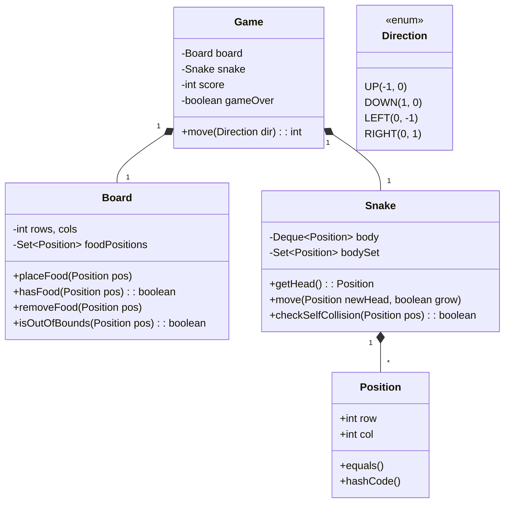

# LLD Case Study: Snake Game (Atlassian Favourite 🎯)

> ⚠️ **Not Snake & Ladder!** This is the classic Nokia Snake game where a snake moves on a grid, eats food, grows, and dies on collision.

## 1. Requirements

1. **Grid**: NxM board.
2. **Snake**: Starts at position (0,0), length 1, facing RIGHT.
3. **Move**: Snake moves one step in a direction (UP, DOWN, LEFT, RIGHT).
4. **Food**: Appears at random positions. Eating food grows the snake by 1.
5. **Death**: Snake dies if it hits a wall or its own body.
6. **Score**: +1 for each food eaten.

## 2. Classes

- `Game` (Controller/Driver)
- `Snake`
- `Board`
- `Position` (row, col)
- `Direction` (Enum: UP, DOWN, LEFT, RIGHT)

## 3. Class Diagram



## 4. Key Data Structures

| What | Data Structure | Why |
|------|---------------|-----|
| Snake Body | `Deque<Position>` | O(1) add to head, O(1) remove from tail |
| Body Lookup | `HashSet<Position>` | O(1) self-collision check |
| Food | `Set<Position>` or `Queue<Position>` | Quick check if position has food |

> 💡 **Why Deque over LinkedList?** Both work, but `Deque` (ArrayDeque/LinkedList) makes the head/tail semantics explicit: `addFirst()` for new head, `removeLast()` for tail.

## 5. Core Logic

### Move Algorithm (The Heart of the Game)

```
1. Calculate newHead = currentHead + direction offset
2. Check DEATH conditions:
   a. newHead is out of bounds → GAME OVER
   b. newHead collides with body → GAME OVER
3. Check FOOD:
   a. If newHead has food → DON'T remove tail (snake grows)
   b. If no food → Remove tail (snake stays same length)
4. Add newHead to front of body
5. Return score
```

## 6. Implementation (Java)

### Position Class

```java
class Position {
    int row, col;
    
    Position(int row, int col) {
        this.row = row;
        this.col = col;
    }

    // CRITICAL: Must override for HashSet/HashMap to work!
    @Override
    public boolean equals(Object o) {
        if (this == o) return true;
        if (!(o instanceof Position)) return false;
        Position p = (Position) o;
        return row == p.row && col == p.col;
    }

    @Override
    public int hashCode() {
        return Objects.hash(row, col);
    }
}
```

### Direction Enum

```java
enum Direction {
    UP(-1, 0), DOWN(1, 0), LEFT(0, -1), RIGHT(0, 1);
    
    int dr, dc;
    Direction(int dr, int dc) { this.dr = dr; this.dc = dc; }
}
```

### Snake Class

```java
class Snake {
    Deque<Position> body = new LinkedList<>();  // Front = Head, Back = Tail
    Set<Position> bodySet = new HashSet<>();
    
    Snake(Position start) {
        body.addFirst(start);
        bodySet.add(start);
    }
    
    Position getHead() {
        return body.peekFirst();
    }
    
    void move(Position newHead, boolean grow) {
        body.addFirst(newHead);
        bodySet.add(newHead);
        
        if (!grow) {
            Position removedTail = body.removeLast();
            bodySet.remove(removedTail);
        }
    }
    
    boolean collidesWithSelf(Position pos) {
        return bodySet.contains(pos);
    }
}
```

### Game Class

```java
class SnakeGame {
    int rows, cols, score;
    Snake snake;
    Set<Position> food;
    boolean gameOver;
    
    SnakeGame(int rows, int cols, int[][] foodPositions) {
        this.rows = rows;
        this.cols = cols;
        this.score = 0;
        this.gameOver = false;
        this.snake = new Snake(new Position(0, 0));
        this.food = new LinkedHashSet<>(); // Preserves insertion order
        for (int[] f : foodPositions) {
            food.add(new Position(f[0], f[1]));
        }
    }
    
    /**
     * @return score after move, or -1 if game over
     */
    int move(Direction dir) {
        if (gameOver) return -1;
        
        Position head = snake.getHead();
        Position newHead = new Position(head.row + dir.dr, head.col + dir.dc);
        
        // 1. Wall collision
        if (newHead.row < 0 || newHead.row >= rows || 
            newHead.col < 0 || newHead.col >= cols) {
            gameOver = true;
            return -1;
        }
        
        // 2. Check food BEFORE self-collision (important!)
        boolean ate = food.contains(newHead);
        if (ate) {
            food.remove(newHead);
            score++;
        }
        
        // 3. Move snake (grow if ate food)
        //    Must remove tail BEFORE checking self-collision
        //    because the tail will vacate its position
        if (!ate) {
            // Remove tail first so it doesn't count as collision
            Position tail = snake.body.removeLast();
            snake.bodySet.remove(tail);
        }
        
        // 4. Self collision (after tail removal!)
        if (snake.collidesWithSelf(newHead)) {
            gameOver = true;
            return -1;
        }
        
        // 5. Add new head
        snake.body.addFirst(newHead);
        snake.bodySet.add(newHead);
        
        return score;
    }
}
```

> ⚠️ **Gotcha**: Remove the tail BEFORE checking self-collision! The tail cell will be vacated, so the head can move into the old tail position without dying.

## 7. Extensions (Interview Follow-ups)

### A. Teleporting / Wrap-Around

Instead of dying at walls, snake appears on the opposite side.

```java
// Replace wall collision check with:
newHead.row = (newHead.row + rows) % rows;
newHead.col = (newHead.col + cols) % cols;
```

### B. Multiple Food Types

- **Normal Food**: +1 score, +1 length.
- **Super Food**: +3 score, +1 length.
- **Poison**: -1 length (remove tail).

```java
// Use an interface
interface Food {
    int getScoreValue();
    int getGrowthValue(); // +1, -1, etc.
}
```

Apply **Strategy Pattern** — different food types, different effects.

### C. Obstacles / Walls

```java
Set<Position> walls = new HashSet<>();
// In move(): check if newHead is in walls set
```

### D. Speed / Timed Mode

Not usually asked in LLD interviews, but if asked: introduce a `GameLoop` with a `Timer` that calls `move()` at intervals.

## 8. Design Patterns Used

| Pattern | Where |
|---------|-------|
| **Strategy** | Different Food effects, Different movement rules |
| **Observer** | Notify UI/Score when state changes (optional) |
| **State** | `GameState` enum: RUNNING, PAUSED, GAME_OVER |
| **Factory** | Creating different Food types |

## 9. Complexity

| Operation | Time | Space |
|-----------|------|-------|
| `move()` | O(1) | — |
| Self-collision check | O(1) | O(N) for HashSet |
| Food check | O(1) | O(F) for food set |
| Overall Space | — | O(N + F) where N = snake length, F = food count |

## 10. Common Interview Mistakes

1. ❌ Using a `List` and scanning for collision → O(N) per move
2. ❌ Forgetting `equals()` and `hashCode()` on Position → HashSet breaks
3. ❌ Checking self-collision before removing tail → false death
4. ❌ Not discussing trade-offs (Deque vs List vs Array)
