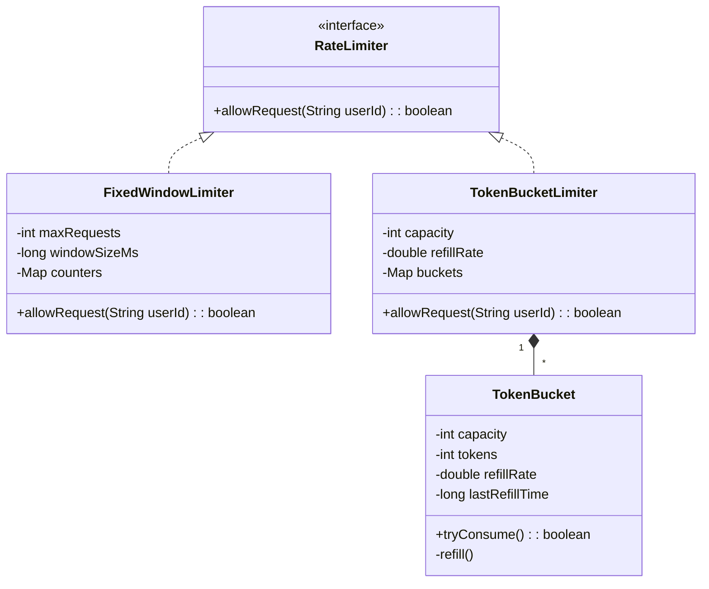

# LLD Case Study: Rate Limiter

> **Trigger**: "Design a system that limits the number of requests a user can make in a time window."

## 1. Requirements

1. **Limit**: Max N requests per time window (e.g., 100 requests/minute).
2. **Per-User**: Each user/client has their own limit.
3. **Reject**: Return `false` / HTTP 429 when limit exceeded.
4. **Thread-Safe**: Must handle concurrent requests.

## 2. Algorithms Overview

| Algorithm | Pros | Cons | Best For |
|-----------|------|------|----------|
| **Fixed Window** | Simple, low memory | Burst at window edges | Basic use |
| **Sliding Window Log** | Accurate | High memory (stores timestamps) | Precision needed |
| **Sliding Window Counter** | Good balance | Approximate | Production |
| **Token Bucket** | Allows bursts, smooth | Slightly complex | APIs (AWS, Stripe) |
| **Leaky Bucket** | Smooth output rate | No burst allowed | Streaming |

## 3. Algorithm 1: Fixed Window Counter

```
Window: [0s - 60s] → counter = 0
Request at 10s → counter = 1 ✅
Request at 30s → counter = 2 ✅
...
Request at 55s → counter = 100 ✅
Request at 58s → counter = 101 ❌ REJECTED
Window resets at 60s → counter = 0
```

**Problem**: 99 requests at 0:59, 99 requests at 1:01 → 198 requests in 2 seconds!

### Implementation

```java
class FixedWindowRateLimiter {
    int maxRequests;
    long windowSizeMs;
    Map<String, int[]> counters = new ConcurrentHashMap<>(); // userId -> [count, windowStart]

    FixedWindowRateLimiter(int maxRequests, long windowSizeMs) {
        this.maxRequests = maxRequests;
        this.windowSizeMs = windowSizeMs;
    }

    synchronized boolean allowRequest(String userId) {
        long now = System.currentTimeMillis();
        int[] data = counters.getOrDefault(userId, new int[]{0, (int)(now / windowSizeMs)});
        
        int currentWindow = (int)(now / windowSizeMs);
        
        if (data[1] != currentWindow) {
            // New window, reset
            data[0] = 0;
            data[1] = currentWindow;
        }
        
        if (data[0] < maxRequests) {
            data[0]++;
            counters.put(userId, data);
            return true;
        }
        return false; // Rate limited
    }
}
```

## 4. Algorithm 2: Sliding Window Log

Store timestamp of every request. Count requests in last `windowSize` seconds.

```java
class SlidingWindowLogLimiter {
    int maxRequests;
    long windowSizeMs;
    Map<String, Deque<Long>> logs = new ConcurrentHashMap<>();

    boolean allowRequest(String userId) {
        long now = System.currentTimeMillis();
        long windowStart = now - windowSizeMs;

        Deque<Long> timestamps = logs.computeIfAbsent(userId, k -> new LinkedList<>());

        // Remove expired timestamps
        while (!timestamps.isEmpty() && timestamps.peekFirst() <= windowStart) {
            timestamps.pollFirst();
        }

        if (timestamps.size() < maxRequests) {
            timestamps.addLast(now);
            return true;
        }
        return false;
    }
}
```

## 5. Algorithm 3: Token Bucket (Most Important ⭐)

- Bucket holds max `capacity` tokens.
- Tokens refill at a constant rate (`refillRate` tokens/second).
- Each request consumes 1 token.
- If no tokens → reject.

```
Bucket: capacity=10, refill=2/sec
t=0: tokens=10
t=0: 5 requests → tokens=5
t=1: refill 2 → tokens=7
t=1: 3 requests → tokens=4
t=5: refill 2*4=8 → tokens=min(10, 12)=10  (capped at capacity)
```

### Implementation

```java
class TokenBucket {
    int capacity;
    int tokens;
    double refillRate;      // tokens per second
    long lastRefillTime;

    TokenBucket(int capacity, double refillRate) {
        this.capacity = capacity;
        this.tokens = capacity; // Start full
        this.refillRate = refillRate;
        this.lastRefillTime = System.nanoTime();
    }

    synchronized boolean allowRequest() {
        refill();
        if (tokens > 0) {
            tokens--;
            return true;
        }
        return false;
    }

    private void refill() {
        long now = System.nanoTime();
        double elapsed = (now - lastRefillTime) / 1e9; // seconds
        int newTokens = (int)(elapsed * refillRate);
        
        if (newTokens > 0) {
            tokens = Math.min(capacity, tokens + newTokens);
            lastRefillTime = now;
        }
    }
}
```

### Per-User Token Bucket

```java
class RateLimiter {
    Map<String, TokenBucket> buckets = new ConcurrentHashMap<>();
    int capacity;
    double refillRate;

    RateLimiter(int capacity, double refillRate) {
        this.capacity = capacity;
        this.refillRate = refillRate;
    }

    boolean allowRequest(String userId) {
        TokenBucket bucket = buckets.computeIfAbsent(
            userId, k -> new TokenBucket(capacity, refillRate)
        );
        return bucket.allowRequest();
    }
}
```

## 6. Class Diagram



## 7. Design Patterns

| Pattern | Where |
|---------|-------|
| **Strategy** | `RateLimiter` interface → swap algorithms (Fixed, Token, Sliding) |
| **Factory** | `RateLimiterFactory.create("token_bucket", config)` |
| **Singleton** | Global rate limiter instance |

## 8. Interview Follow-Up Questions

- **Q**: How to handle distributed rate limiting (multiple servers)?
  - **A**: Use Redis with `INCR` + `EXPIRE` for atomic counter per window. Or Redis + Lua script for Token Bucket.
- **Q**: What if the clock drifts across servers?
  - **A**: Use a centralized time source (Redis server time) or accept slight inaccuracy with NTP sync.
- **Q**: How to clean up stale user buckets?
  - **A**: Background thread / scheduled task to evict users with no activity for > 2x window size.
