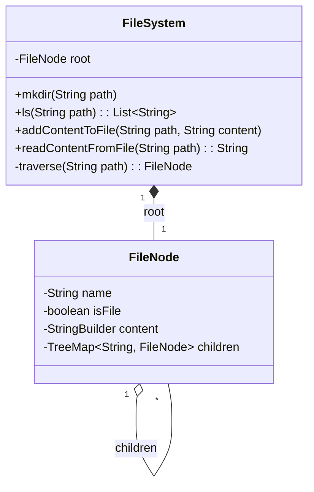

# LLD Case Study: In-Memory File System

> **Trigger**: "Design a Unix-like file system that supports mkdir, ls, addContent, readContent."

## 1. Requirements

1. **Directories**: Create nested directories (`/a/b/c`).
2. **Files**: Create files with text content.
3. **List**: List contents of a directory (sorted).
4. **Read/Write**: Read and append content to files.
5. **Path Navigation**: Support absolute paths like `/a/b/c/file.txt`.

## 2. Classes

- `FileSystem` (Controller)
- `FileNode` (Represents both File and Directory)
  - Alternative: Separate `File` and `Directory` classes with common `INode` interface

## 3. Key Design Decision: Unified vs Separate Node

### Option A: Unified `FileNode` (Simpler — Good for interviews)

```
FileNode {
    name, isFile, content, children
}
```

### Option B: Separate Classes (More SOLID)

```
INode (interface)
├── File { name, content }
└── Directory { name, Map<String, INode> children }
```

> 💡 **Interview Tip**: Start with Option A for speed. Mention Option B as "In production, I'd separate these using ISP."

## 4. Class Diagram



> **Why `TreeMap`?** Sorted keys → `ls()` returns alphabetically sorted results automatically (O(log n) insert, O(n) iteration). `HashMap` would need explicit sorting.

## 5. Implementation (Java)

### FileNode

```java
class FileNode {
    String name;
    boolean isFile;
    StringBuilder content;
    TreeMap<String, FileNode> children;  // Sorted by name

    FileNode(String name) {
        this.name = name;
        this.isFile = false;
        this.content = new StringBuilder();
        this.children = new TreeMap<>();
    }
}
```

### FileSystem

```java
class FileSystem {
    FileNode root;

    FileSystem() {
        root = new FileNode("/");
    }

    // ---- Helper: Navigate to a node by path ----
    private FileNode traverse(String path) {
        FileNode curr = root;
        if (path.equals("/")) return curr;

        String[] parts = path.split("/");
        for (String part : parts) {
            if (part.isEmpty()) continue; // Skip leading empty string from split
            curr = curr.children.get(part);
        }
        return curr;
    }

    // ---- mkdir: Create directory (and all intermediate dirs) ----
    void mkdir(String path) {
        FileNode curr = root;
        String[] parts = path.split("/");
        for (String part : parts) {
            if (part.isEmpty()) continue;
            curr.children.putIfAbsent(part, new FileNode(part));
            curr = curr.children.get(part);
        }
    }

    // ---- ls: List contents ----
    List<String> ls(String path) {
        FileNode node = traverse(path);

        if (node.isFile) {
            // If it's a file, return just the file name
            return List.of(node.name);
        }
        // If it's a directory, return sorted children names
        return new ArrayList<>(node.children.keySet()); // Already sorted (TreeMap)
    }

    // ---- addContentToFile: Create file if needed, append content ----
    void addContentToFile(String path, String content) {
        FileNode curr = root;
        String[] parts = path.split("/");
        
        // Navigate/create intermediate directories
        for (int i = 0; i < parts.length; i++) {
            if (parts[i].isEmpty()) continue;
            
            if (i == parts.length - 1) {
                // Last part = file name
                curr.children.putIfAbsent(parts[i], new FileNode(parts[i]));
                FileNode fileNode = curr.children.get(parts[i]);
                fileNode.isFile = true;
                fileNode.content.append(content);
            } else {
                // Intermediate = directory
                curr.children.putIfAbsent(parts[i], new FileNode(parts[i]));
                curr = curr.children.get(parts[i]);
            }
        }
    }

    // ---- readContentFromFile ----
    String readContentFromFile(String path) {
        FileNode node = traverse(path);
        return node.content.toString();
    }
}
```

## 6. Usage Example

```java
FileSystem fs = new FileSystem();

fs.mkdir("/a/b/c");
fs.addContentToFile("/a/b/c/hello.txt", "Hello ");
fs.addContentToFile("/a/b/c/hello.txt", "World");

fs.ls("/");          // ["a"]
fs.ls("/a/b");       // ["c"]
fs.ls("/a/b/c");     // ["hello.txt"]
fs.readContentFromFile("/a/b/c/hello.txt"); // "Hello World"
```

## 7. Extensions (Interview Follow-ups)

### A. Delete File/Directory

```java
void delete(String path) {
    String[] parts = path.split("/");
    FileNode parent = traverse(getParentPath(path));
    parent.children.remove(parts[parts.length - 1]);
}
```

> Follow-up: "What if directory is not empty?" → Ask interviewer: recursive delete or error?

### B. Move / Rename

```java
void mv(String srcPath, String destPath) {
    FileNode node = traverse(srcPath);
    delete(srcPath);
    // Re-attach node under destPath parent
    FileNode destParent = traverse(getParentPath(destPath));
    node.name = getFileName(destPath);
    destParent.children.put(node.name, node);
}
```

### C. Search / Find

```java
List<String> find(String path, String fileName) {
    // DFS from path, collect all nodes matching fileName
    List<String> results = new ArrayList<>();
    dfs(traverse(path), path, fileName, results);
    return results;
}

void dfs(FileNode node, String currentPath, String target, List<String> results) {
    if (node.name.equals(target)) results.add(currentPath);
    for (Map.Entry<String, FileNode> child : node.children.entrySet()) {
        dfs(child.getValue(), currentPath + "/" + child.getKey(), target, results);
    }
}
```

### D. Permissions (chmod)

Add `permissions` field to `FileNode`. Check before read/write operations.

### E. File Size Limit

Add a max size check in `addContentToFile`.

## 8. Design Patterns

| Pattern | Where |
|---------|-------|
| **Composite** | FileNode acts as both leaf (File) and composite (Directory) — classic Composite pattern |
| **Iterator** | `ls()` iterates over children |
| **Factory** | Creating File vs Directory nodes (if using separate classes) |

## 9. Complexity

| Operation | Time | Space |
|-----------|------|-------|
| `mkdir` | O(L) where L = path depth | O(L) new nodes |
| `ls` | O(K) where K = children count | O(K) result list |
| `addContent` | O(L + C) where C = content length | O(C) |
| `readContent` | O(L) | O(1) |
| `traverse` | O(L) | O(1) |

## 10. LeetCode Reference

- **LC 588**: Design In-Memory File System (Hard)
- Covers: `ls`, `mkdir`, `addContentToFile`, `readContentFromFile`
