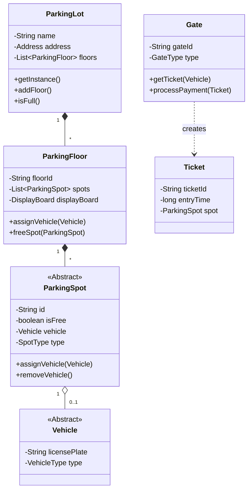

# LLD Case Study: Parking Lot

## 1. Requirements

### Functional

1. **Parking types**: Car, Bike, Truck.
2. **Floors**: Multiple floors.
3. **Spots**: Each floor has spots for specific types (Compact, Large, Handicapped).
4. **Ticket**: Entry logic generates a ticket.
5. **Payment**: Exit logic calculates fee (Hourly rate) and processes payment.
6. **Display**: Show available spots per floor.

### Actors

- **Admin**: Add floors, spots, pricing.
- **Customer**: Takes ticket, pays.
- **System**: Assigns spot, calculates fee.

## 2. Objects / Classes Identification

- `ParkingLot` (Singleton)
- `ParkingFloor`
- `ParkingSpot` (Abstract) -> `CompactSpot`, `LargeSpot` ...
- `Vehicle` (Abstract) -> `Car`, `Bike` ...
- `Ticket`
- `Gate` (Entry/Exit)
- `Payment`

## 3. Class Diagram



## 4. Key Design Patterns

- **Singleton**: `ParkingLot` class (Only one instance of the physical lot).
- **Factory**: To create `Vehicle` objects or `Payment` objects.
- **Strategy**: `ParkingStrategy` (Nearest spot first, or High Floor first). `PaymentStrategy` (CreditCard, Cash).
- **Observer**: `DisplayBoard` observes `ParkingFloor` to update free count.

## 5. Implementation Skeleton (Java)

```java
public enum VehicleType { CAR, TRUCK, BIKE }

public abstract class Vehicle {
    private String licensePlate;
    private VehicleType type;
    // Getters
}

public class ParkingSpot {
    private String id;
    private boolean isFree;
    private Vehicle vehicle;
    
    public synchronized void assignVehicle(Vehicle v) {
        this.vehicle = v;
        this.isFree = false;
    }
    
    public synchronized void removeVehicle() {
        this.vehicle = null;
        this.isFree = true;
    }
}
```

## 6. Concurrency Handling

- `assignVehicle` and `removeVehicle` must be synchronized or use `ReentrantLock` to prevent two cars booking the same spot simultaneously.
