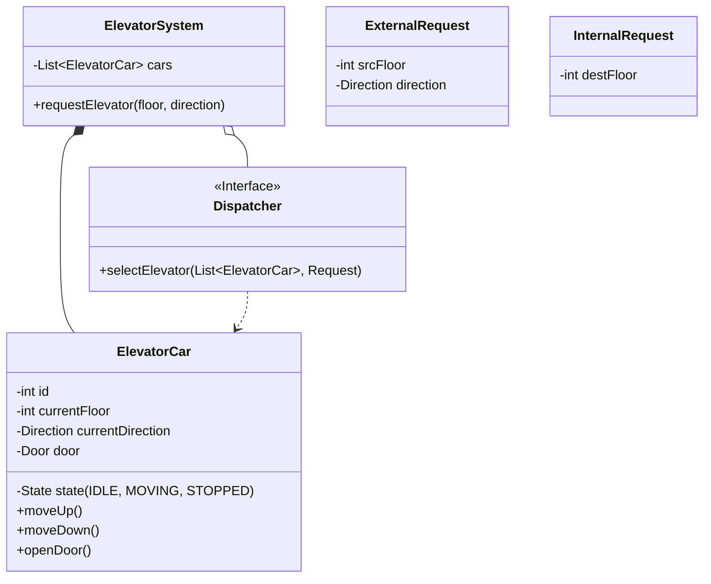

# LLD Case Study: Elevator System

## 1. Requirements

### Functional

1. **Multiple Elevators**: $N$ elevators in a building.
2. **Buttons**:
    - **Hall Panel**: Up/Down buttons on each floor.
    - **Elevator Panel**: Buttons 1, 2, 3... inside the cabin.
3. **Dispatching**: Efficiently assign elevator to request (SCAN/LOOK algorithm).
4. **Safety**: Max capacity, Door sensors.

## 2. Classes

- `ElevatorSystem` (Facade/Singleton)
- `ElevatorCar`
- `Floor`
- `Request` (Internal vs External)
- `Dispatcher` (Strategy)

## 3. Class Diagram



## 4. Key Design Patterns

- **State Pattern**: `ElevatorState` (Idle, MovingUp, MovingDown, Maintenance). elevator behavior changes based on state.
- **Strategy Pattern**: `Dispatcher` (OddEvenStrategy, NearestCarStrategy, SCANAlgorithm).
- **Singleton**: `ElevatorSystem`.

## 5. Dispatching Algorithms (The Core Logic)

- **FCFS (First Come First Serve)**: Simple but inefficient. Can cause zig-zag movements.
- **SCAN (Elevator Algorithm)**:
  - Continue in current direction until no more requests in that direction.
  - Then reverse.
  - Standard in most buildings.
- **Destination Dispatch**: User enters floor *before* entering elevator (Modern skyrises). Groups people going to same floors.

## 6. Full Implementation (SCAN Algorithm)

### Enums

```java
enum Direction { UP, DOWN }

enum State { IDLE, MOVING_UP, MOVING_DOWN }
```

### Request

```java
class Request {
    int floor;
    Direction direction; // null for internal requests

    Request(int floor) { this.floor = floor; }
    Request(int floor, Direction dir) { this.floor = floor; this.direction = dir; }
}
```

### ElevatorCar (SCAN Logic Lives Here)

```java
class ElevatorCar {
    int id;
    int currentFloor;
    State state;

    // SCAN uses two sorted sets: floors to visit going UP, floors to visit going DOWN
    TreeSet<Integer> upStops   = new TreeSet<>();   // sorted ascending  (natural)
    TreeSet<Integer> downStops = new TreeSet<>(Collections.reverseOrder()); // sorted descending

    ElevatorCar(int id) {
        this.id = id;
        this.currentFloor = 0;
        this.state = State.IDLE;
    }

    // --- Accept a new request ---
    void addRequest(int destFloor) {
        if (destFloor > currentFloor) {
            upStops.add(destFloor);
        } else if (destFloor < currentFloor) {
            downStops.add(destFloor);
        }
        // If destFloor == currentFloor, open door immediately (handled in step)
    }

    // --- SCAN: Process one step ---
    void step() {
        if (state == State.IDLE) {
            // Decide direction based on pending requests
            if (!upStops.isEmpty()) {
                state = State.MOVING_UP;
            } else if (!downStops.isEmpty()) {
                state = State.MOVING_DOWN;
            }
            return; // No requests → stay idle
        }

        if (state == State.MOVING_UP) {
            if (!upStops.isEmpty()) {
                // Move to next UP stop (smallest floor > currentFloor)
                currentFloor = upStops.pollFirst();
                System.out.println("Elevator " + id + " stopped at floor " + currentFloor + " (↑)");
            }

            // If no more UP stops, reverse to DOWN
            if (upStops.isEmpty()) {
                if (!downStops.isEmpty()) {
                    state = State.MOVING_DOWN;
                } else {
                    state = State.IDLE;
                }
            }
        }
        else if (state == State.MOVING_DOWN) {
            if (!downStops.isEmpty()) {
                // Move to next DOWN stop (largest floor < currentFloor)
                currentFloor = downStops.pollFirst(); // reverseOrder → gives highest first
                System.out.println("Elevator " + id + " stopped at floor " + currentFloor + " (↓)");
            }

            // If no more DOWN stops, reverse to UP
            if (downStops.isEmpty()) {
                if (!upStops.isEmpty()) {
                    state = State.MOVING_UP;
                } else {
                    state = State.IDLE;
                }
            }
        }
    }

    boolean isIdle() { return state == State.IDLE; }

    int pendingRequests() { return upStops.size() + downStops.size(); }
}
```

> 💡 **Why `TreeSet`?**
>
> - `TreeSet` keeps floors **sorted**, so `pollFirst()` always gives the next logical stop.
> - `upStops` in natural order → serves lowest pending floor first (moving up).
> - `downStops` in reverse order → serves highest pending floor first (moving down).
> - Insert & poll are both O(log N).

### Dispatcher (Strategy Pattern)

```java
interface Dispatcher {
    ElevatorCar selectElevator(List<ElevatorCar> cars, Request req);
}

// Strategy 1: Nearest Idle Car
class NearestIdleDispatcher implements Dispatcher {
    public ElevatorCar selectElevator(List<ElevatorCar> cars, Request req) {
        ElevatorCar best = null;
        int minDist = Integer.MAX_VALUE;

        for (ElevatorCar car : cars) {
            int dist = Math.abs(car.currentFloor - req.floor);
            // Prefer idle cars, then closest
            if (car.isIdle() && dist < minDist) {
                minDist = dist;
                best = car;
            }
        }

        // If no idle car, pick least busy
        if (best == null) {
            int minPending = Integer.MAX_VALUE;
            for (ElevatorCar car : cars) {
                if (car.pendingRequests() < minPending) {
                    minPending = car.pendingRequests();
                    best = car;
                }
            }
        }
        return best;
    }
}

// Strategy 2: Same Direction Priority (more realistic)
class SameDirectionDispatcher implements Dispatcher {
    public ElevatorCar selectElevator(List<ElevatorCar> cars, Request req) {
        ElevatorCar best = null;
        int minDist = Integer.MAX_VALUE;

        for (ElevatorCar car : cars) {
            int dist = Math.abs(car.currentFloor - req.floor);

            // Best case: car is moving TOWARDS this floor in same direction
            boolean movingTowards = false;
            if (car.state == State.MOVING_UP && req.floor > car.currentFloor)
                movingTowards = true;
            if (car.state == State.MOVING_DOWN && req.floor < car.currentFloor)
                movingTowards = true;

            if ((car.isIdle() || movingTowards) && dist < minDist) {
                minDist = dist;
                best = car;
            }
        }

        // Fallback: least busy car
        if (best == null) {
            best = cars.stream()
                .min(Comparator.comparingInt(ElevatorCar::pendingRequests))
                .orElse(cars.get(0));
        }
        return best;
    }
}
```

### ElevatorSystem (Facade)

```java
class ElevatorSystem {
    List<ElevatorCar> cars;
    Dispatcher dispatcher;

    ElevatorSystem(int numElevators, Dispatcher dispatcher) {
        this.dispatcher = dispatcher;
        this.cars = new ArrayList<>();
        for (int i = 0; i < numElevators; i++) {
            cars.add(new ElevatorCar(i));
        }
    }

    // External request: someone presses UP/DOWN on a floor
    void requestElevator(int floor, Direction dir) {
        Request req = new Request(floor, dir);
        ElevatorCar car = dispatcher.selectElevator(cars, req);
        car.addRequest(floor);
        System.out.println("Request floor " + floor + " → assigned to Elevator " + car.id);
    }

    // Internal request: someone inside presses a destination floor
    void pressFloor(int elevatorId, int destFloor) {
        cars.get(elevatorId).addRequest(destFloor);
    }

    // Simulate one tick for all elevators
    void tick() {
        for (ElevatorCar car : cars) {
            car.step();
        }
    }
}
```

### Simulation

```java
public class Main {
    public static void main(String[] args) {
        ElevatorSystem system = new ElevatorSystem(2, new NearestIdleDispatcher());

        // External: People press buttons on floors
        system.requestElevator(5, Direction.UP);    // Someone on floor 5 wants to go UP
        system.requestElevator(2, Direction.DOWN);   // Someone on floor 2 wants to go DOWN
        system.requestElevator(8, Direction.DOWN);   // Someone on floor 8 wants to go DOWN

        // Internal: Person in elevator 0 wants to go to floor 9
        system.pressFloor(0, 9);

        // Run simulation
        for (int t = 0; t < 15; t++) {
            System.out.println("--- Tick " + t + " ---");
            system.tick();
        }
    }
}
```

**Sample Output:**

```
Request floor 5 → assigned to Elevator 0
Request floor 2 → assigned to Elevator 1
Request floor 8 → assigned to Elevator 0
--- Tick 0 ---
Elevator 0 stopped at floor 5 (↑)
Elevator 1 stopped at floor 2 (↑)
--- Tick 1 ---
Elevator 0 stopped at floor 8 (↑)
--- Tick 2 ---
Elevator 0 stopped at floor 9 (↑)  // internal request served on the way
...
```

## 7. SCAN Algorithm — Visual

```
Floor 10 │                         ┌──→ reverse
Floor  9 │                      ▲  │
Floor  8 │                   ▲ [8] │
Floor  7 │                ▲        │
Floor  6 │             ▲           │
Floor  5 │          ▲ [5]          │  SERVE 5 on the way UP
Floor  4 │       ▲                 ▼
Floor  3 │    ▲                    │
Floor  2 │ [START]            [2]  │  SERVE 2 on the way DOWN
Floor  1 │                         ▼
         └────────────────────────────→ time

Key: ▲ = moving up, [5] = stop at floor 5
```

> **SCAN Rule**: Go all the way in one direction, serving requests on the way. Then reverse. Just like a disk arm or a real elevator.
