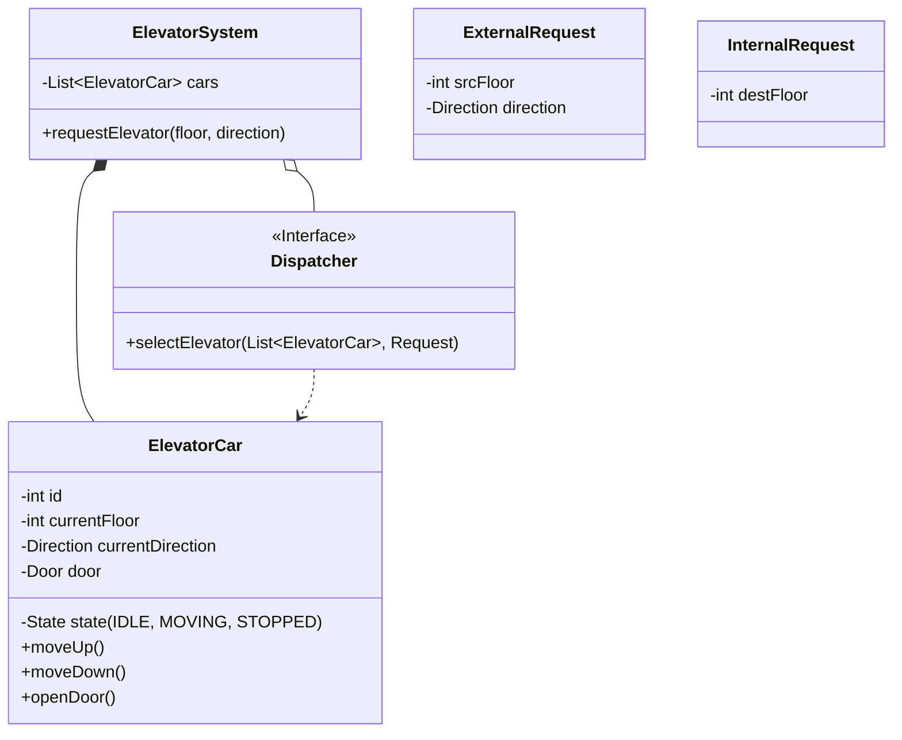

# LLD Case Study: Elevator System

## 1. Requirements

### Functional

1. **Multiple Elevators**: $N$ elevators in a building.
2. **Buttons**:
    - **Hall Panel**: Up/Down buttons on each floor.
    - **Elevator Panel**: Buttons 1, 2, 3... inside the cabin.
3. **Dispatching**: Efficiently assign elevator to request (SCAN/LOOK algorithm).
4. **Safety**: Max capacity, Door sensors.

## 2. Classes

- `ElevatorSystem` (Facade/Singleton)
- `ElevatorCar`
- `Floor`
- `Request` (Internal vs External)
- `Dispatcher` (Strategy)

## 3. Class Diagram



## 4. Key Design Patterns

- **State Pattern**: `ElevatorState` (Idle, MovingUp, MovingDown, Maintenance). elevator behavior changes based on state.
- **Strategy Pattern**: `Dispatcher` (OddEvenStrategy, NearestCarStrategy, SCANAlgorithm).
- **Singleton**: `ElevatorSystem`.

## 5. Dispatching Algorithms (The Core Logic)

- **FCFS (First Come First Serve)**: Simple but inefficient. Can cause zig-zag movements.
- **SCAN (Elevator Algorithm)**:
  - Continue in current direction until no more requests in that direction.
  - Then reverse.
  - Standard in most buildings.
- **Destination Dispatch**: User enters floor *before* entering elevator (Modern skyrises). Groups people going to same floors.

## 6. Code Snippet (State Pattern)

```java
public interface ElevatorState {
    void pressButton(Elevator elev, int floor);
}

public class IdleState implements ElevatorState {
    public void pressButton(Elevator elev, int floor) {
        if (floor > elev.currentFloor) {
            elev.setState(new MovingUpState());
            elev.moveUp();
        }
        // ...
    }
}
```
