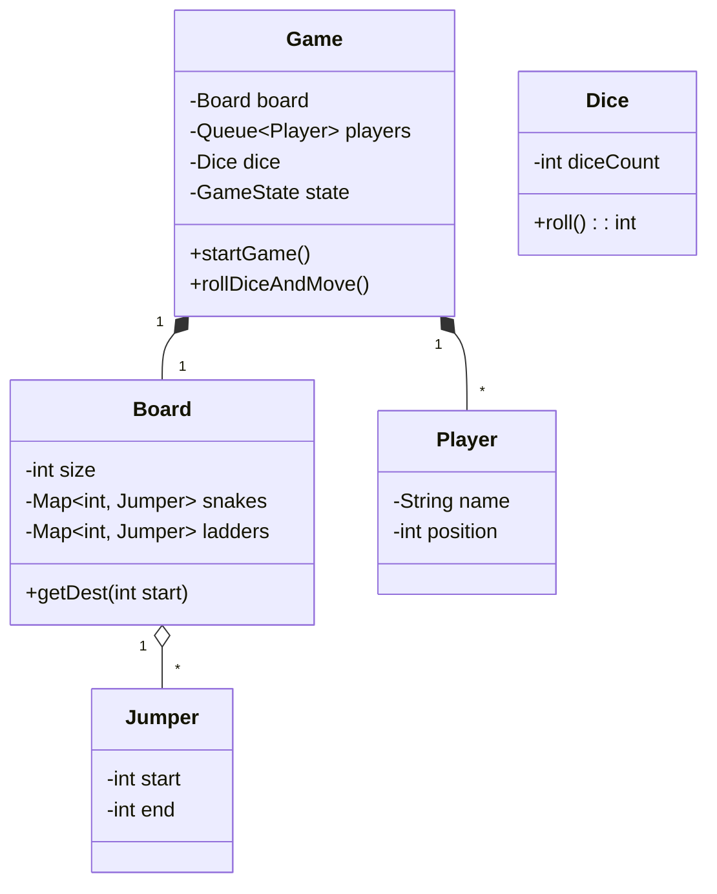

# LLD Case Study: Snake and Ladder

## 1. Requirements

1. **Board**: 100 cells.
2. **Players**: Multiple players (2-4).
3. **Entities**: Snakes (Start > End), Ladders (Start < End).
4. **Dice**: Standard 1-6 dice.
5. **Game Loop**: Turn based. Roll dice -> Move -> Check Snake/Ladder -> Check Win.

## 2. Classes

- `Game` (Singleton/Driver)
- `Board`
- `Cell`
- `Player`
- `Dice`
- `Jumper` (Snake or Ladder)

## 3. Class Diagram



## 4. Design Patterns

- **Singleton**: `Game` manager (optional).
- **Strategy**: `MovementStrategy` (if we have special moves). Usually not needed for simple Snake & Ladder.
- **Factory**: If generating different types of Boards (Easy, Hard - more snakes).

## 5. Extensibility

- **Question**: How to support 2 Dice?
  - Modify `Dice` class to accept `numConfig`.
- **Question**: How to add "Mine" (Lose turn)?
  - Make `Jumper` an abstract `BoardEntity`. `Snake`, `Ladder`, `Mine` extend it.
  - `Mine.effect()` -> `player.skipTurn = true`.

## 6. Code Logic (Game Loop)

```java
public void startGame() {
    while (winner == null) {
        Player p = players.poll(); // Get current player
        int val = dice.roll();
        int newPos = p.getPosition() + val;
        
        if (newPos > 100) {
            players.add(p); // Skip turn if >100
            continue;
        }
        
        // Check for Snake/Ladder
        if (board.hasJumper(newPos)) {
            newPos = board.getJumper(newPos).end;
        }
        
        p.setPosition(newPos);
        
        if (newPos == 100) {
            winner = p;
        } else {
            players.add(p); // Add back to queue for next turn
        }
    }
}
```
