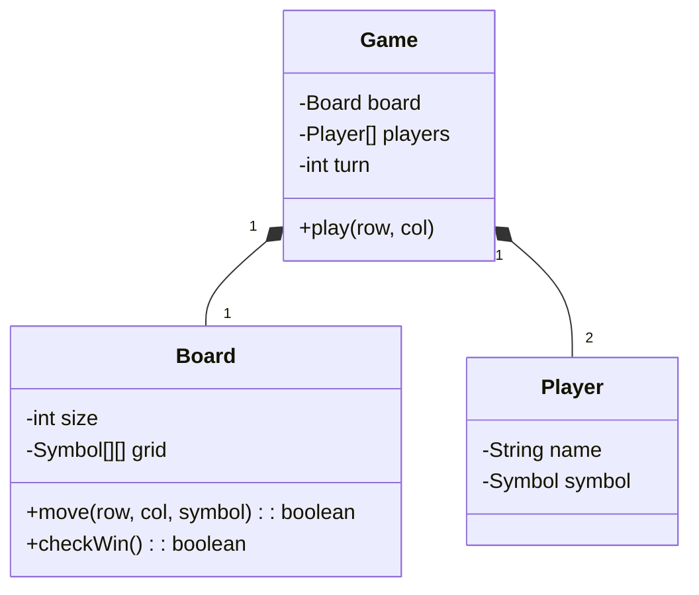

# LLD Case Study: Tic-Tac-Toe

## 1. Requirements

1. **Board**: 3x3 (extensible to NxN).
2. **Players**: 2 Players (X and O).
3. **Win Condition**: Row, Column, or Diagonal full of same symbol.

## 2. Classes

- `Game`
- `Board`
- `Player`
- `Move`
- `Symbol` (Enum)

## 3. Class Diagram



## 4. O(1) Check Win Algorithm

Instead of scanning the whole board O(N^2) or O(N) every move:

- Maintain `rows[]`, `cols[]`, `diag`, `antiDiag` counters.
- Player 1 adds +1, Player 2 adds -1.
- If any counter reaches `+N` or `-N`, that player wins.
- Only works for 2 players.

```java
public boolean move(int row, int col, int playerVal) {
    rows[row] += playerVal;
    cols[col] += playerVal;
    if (row == col) diag += playerVal;
    if (row + col == n - 1) antiDiag += playerVal;
    
    return Math.abs(rows[row]) == n || 
           Math.abs(cols[col]) == n || 
           Math.abs(diag) == n || 
           Math.abs(antiDiag) == n;
}
```
