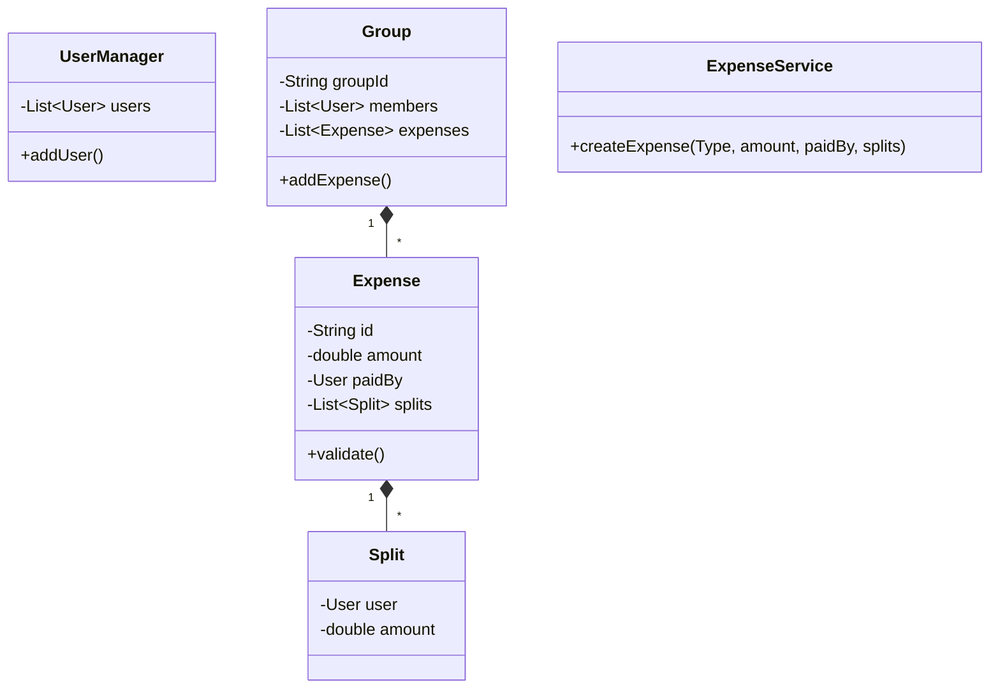

# LLD Case Study: Splitwise (Expense Sharing)

## 1. Requirements

1. **Users**: Create groups, add friends.
2. **Expenses**: Add expense.
    - **Equal**: Split equally.
    - **Exact**: Specific amounts.
    - **Percent**: Specific %.
3. **Settlement**: "Simplify Debt" (Graph simplification).
4. **Balance Sheet**: Show who owes whom.

## 2. Classes

- `UserManager`
- `Group`
- `Expense` (Abstract) -> `EqualExpense`, `ExactExpense`, `PercentExpense`.
- `Split` (Abstract)
- `BalanceSheetController`

## 3. Class Diagram



## 4. Key Design Patterns

- **Factory**: `ExpenseFactory.createExpense(Type)`.
- **Strategy**: `SplitStrategy` (Equal, Exact, Percent). Though often implemented as subclasses of `Expense` or `Split`.
- **Observer**: Notify users when added to an expense.

## 5. Simplify Debt Algorithm

This is the core algorithmic challenge, not just OOD.

- **Problem**: A owes B 10. B owes C 10.
- **Solution**: A owes C 10.
- **Graph Algorithm**:
  - Calculate net balance for each user.
  - Separate into `DebitList` (Negative balance) and `CreditList` (Positive balance).
  - Sort both lists.
  - Greedily settle Max Debtor with Max Creditor.

```java
// Logic
NetMap: {A: -10, B: 0, C: +10}
Process: Transfer 10 from A to C.
```
