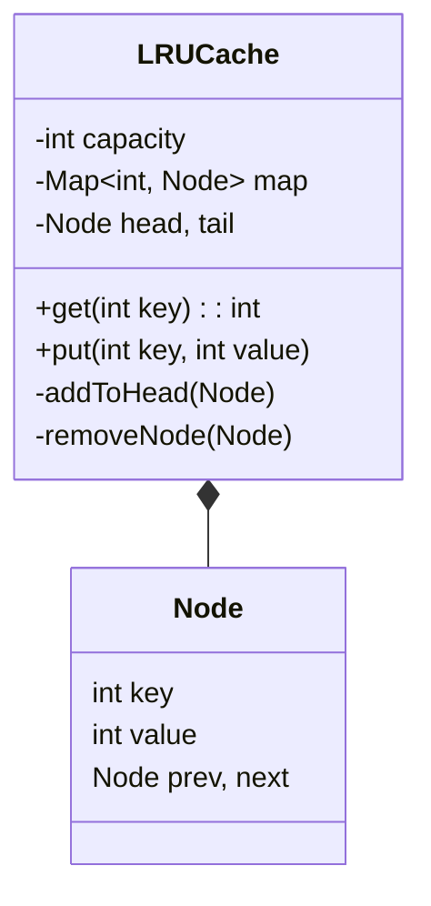

# LLD Case Study: LRU Cache (Least Recently Used)

## 1. Requirements

1. **Fixed Capacity**: The cache has a max size.
2. **Put(key, value)**: Insert value. If full, evict the *Least Recently Used* item.
3. **Get(key)**: Return value. Move this item to "Most Recently Used" position.
4. **Time Complexity**: $O(1)$ for both Put and Get.

## 2. Data Structures

To achieve $O(1)$, we need:

- **HashMap**: For $O(1)$ access/lookup (`Get`).
- **Doubly Linked List (DLL)**: For $O(1)$ ordering updates (Move to Head, Remove from Tail).
  - **Head**: Most Recently Used.
  - **Tail**: Least Recently Used.

## 3. Class Diagram



## 4. Implementation Logic

- **Get(key)**:
    1. Check Map. If null, return -1.
    2. Get Node.
    3. `removeNode(node)` (Disconnect from current pos).
    4. `addToHead(node)` (Move to front).
    5. Return value.

- **Put(key, value)**:
    1. If key exists: Update value, move to head.
    2. If key is new:
        - Create Node.
        - `addToHead(node)`.
        - Add to Map.
        - **Check Capacity**: If `map.size() > capacity`:
            - `removeNode(tail.prev)` (Remove actual tail).
            - Remove from Map.

## 5. Code Snippet

```java
class LRUCache {
    class Node { int key, val; Node prev, next; }
    // Dummy head and tail to avoid null checks
    Node head = new Node(), tail = new Node();
    Map<Integer, Node> map = new HashMap<>();
    int capacity;

    public LRUCache(int capacity) {
        this.capacity = capacity;
        head.next = tail; tail.prev = head;
    }

    public int get(int key) {
        if (!map.containsKey(key)) return -1;
        Node node = map.get(key);
        remove(node);
        insert(node);
        return node.val;
    }

    public void put(int key, int value) {
        if (map.containsKey(key)) remove(map.get(key));
        if (map.size() == capacity) remove(tail.prev);
        
        insert(new Node(key, value));
    }
    
    // Helper: Remove from current position
    void remove(Node node) {
        map.remove(node.key);
        node.prev.next = node.next;
        node.next.prev = node.prev;
    }
    
    // Helper: Insert at Head (Most Recently Used)
    void insert(Node node) {
        map.put(node.key, node);
        Node headNext = head.next;
        head.next = node;
        node.prev = head;
        node.next = headNext;
        headNext.prev = node;
    }
}
```
