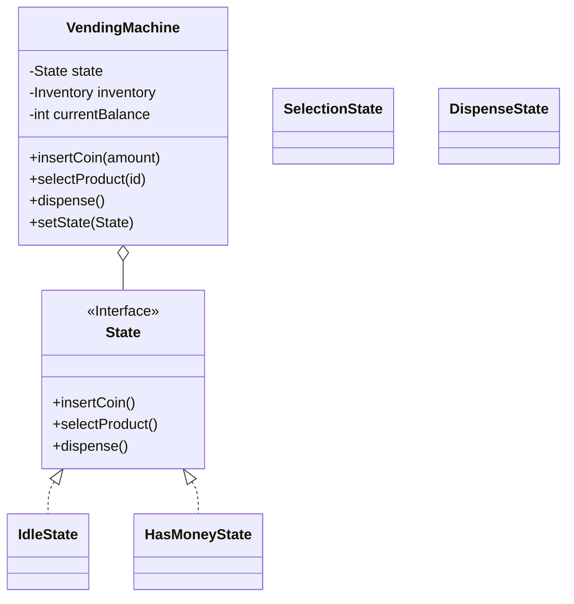

# LLD Case Study: Vending Machine

## 1. Requirements

1. **Inventory**: Store items with prices (Coke: $25, Chips: $10).
2. **Payment**: Accept coins/notes.
3. **States**:
    - Idle
    - Accept Money (HasCoin)
    - Selection
    - Dispense
4. **Refund**: Return change or cancel request.

## 2. Design Pattern: State Pattern

A Vending Machine is a classic **Finite State Machine (FSM)**. Using `if/else` checks for `isCoinInserted` is messy. We make each state a Class.

## 3. Class Diagram



## 4. Flow

1. **Idle**: User calls `insertCoin()`. Machine -> `HasMoneyState`.
2. **HasMoney**: User calls `selectProduct()`.
    - If Balance >= Price: Machine -> `DispenseState`.
    - Else: Error / Ask more money.
3. **Dispense**: Machine calls `dispenseProduct()`.
    - Reduce Inventory.
    - Return Change.
    - Machine -> `IdleState`.

## 5. Code Structure

```java
public interface State {
    void insertCoin(VendingMachine vm, int amount);
    void selectProduct(VendingMachine vm, int code);
}

public class IdleState implements State {
    @Override
    public void insertCoin(VendingMachine vm, int amount) {
        vm.addBalance(amount);
        System.out.println("Coin Accepted: " + amount);
        vm.setState(new HasMoneyState());
    }
    
    @Override
    public void selectProduct(VendingMachine vm, int code) {
        throw new RuntimeException("Insert coin first!");
    }
}

public class HasMoneyState implements State {
    @Override
    public void selectProduct(VendingMachine vm, int code) {
        Item item = vm.getInventory().getItem(code);
        if (vm.getBalance() >= item.getPrice()) {
            vm.setState(new DispenseState(vm, item));
        } else {
            System.out.println("Insufficient funds");
        }
    }
}
```
