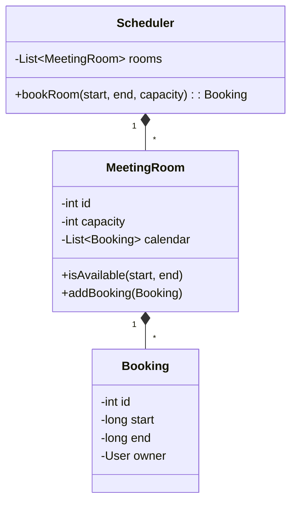

# LLD Case Study: Meeting Room Scheduler

## 1. Requirements

1. **Rooms**: $N$ rooms with different capacities.
2. **Booking**: Book a room for `(startTime, endTime)`.
3. **Conflict**: Cannot book if overlap exists.
4. **History**: View past bookings for a room.

## 2. Classes

- `Scheduler`
- `MeetingRoom`
- `Booking` (Interval)
- `User`
- `Calendar`

## 3. Class Diagram



## 4. Conflict Detection Logic

How to efficiently check if `(start, end)` overlaps with existing bookings?

- **Logic**: Two intervals $(S_1, E_1)$ and $(S_2, E_2)$ overlap if:
  $$max(S_1, S_2) < min(E_1, E_2)$$

- **Simple Check**: Iterate all bookings for the room. $O(N)$.
- **Optimized**: Store bookings in a `TreeMap` (Sorted by StartTime) or **Interval Tree**. $O(\log N)$.

## 5. Implementation Code

```java
public class MeetingRoom {
    // Sort logic handled here or by Scheduler
    List<Booking> bookings = new ArrayList<>(); 
    
    public synchronized boolean book(int start, int end) {
        for (Booking b : bookings) {
            // Check Overlap
            if (Math.max(b.start, start) < Math.min(b.end, end)) {
                return false; // Conflict found
            }
        }
        bookings.add(new Booking(start, end));
        return true;
    }
}
```

## 6. Concurrency

- `book()` method must be Thread-Safe!
- If User A and User B try to book Room 1 at 10:00 AM simultaneously:
  - Without locking, both pass the conflict check.
  - Both add booking.
  - **Double Booking** occurs.
- **Solution**: `synchronized` block or `ReentrantLock` on the `MeetingRoom` object.
