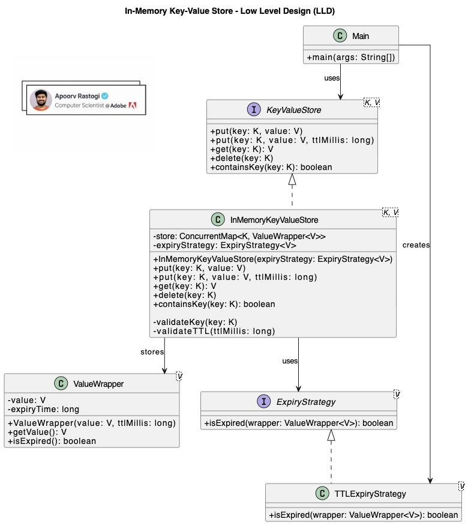

# Low Level Design: In-Memory Key-Value Store

This problem tests engineering judgment, thread safety handling, and API design extensibility.

## Problem Statement

Design an In-Memory Key-Value Store with the following requirements:

- **CRUD operations**: `get`, `put`, `delete`.
- **TTL (Time To Live)**: Support optional expiration for keys.
- **Thread Safety**: Must handle concurrent access correctly.
- **No External Database**: All data must be held in memory.
- **Extensible Design**: The design should be open for modification (e.g., changing eviction policies).

## Why Most Candidates Fail

The trap isn’t coding; it’s judgment. Most candidates can write a `Map<K, V>`, but few answer the critical questions:

- **Cleanup**: Should expiration be eager (background threads) or lazy (on access)?
- **TTL Nature**: Is TTL data or logic?
- **Contracts**: When does an expired key become an error?
- **Extensibility**: How do we add LRU or new policies without breaking the API?

## Key Design Decisions

### 1. TTL is Data, Not Logic

Expiry lives with the value, not scattered across the system. We wrap the value to hold metadata.

### 2. Expiry is a Strategy

We use the **Strategy Pattern** for expiration. Today it's TTL, tomorrow it could be LRU or sliding window, without changing the core store logic.

### 3. Exceptions are Contracts

- Missing key is not an error (return null or empty).
- Expired key is not silent (it is effectively missing/invalid).
- Null key is a programmer mistake (IllegalArgumentException).

### 4. No Background Threads

For this specific scope ("trivial LLD"), we avoid the complexity of background cleanup threads or schedulers unless explicitly asked. We rely on **lazy expiration**: check validity when the key is accessed.

## Class Diagram



## Java Implementation

### 1. Value Wrapper

Encapsulates the data and its metadata (like expiry time).

```java
public class ValueWrapper<V> {
    private final V value;
    private final long expiryTime; // -1 means no expiry

    public ValueWrapper(V value, long ttlMillis) {
        this.value = value;
        this.expiryTime = ttlMillis > 0 ? System.currentTimeMillis() + ttlMillis : -1;
    }

    public V getValue() {
        return value;
    }

    public boolean isExpired() {
        return expiryTime > 0 && System.currentTimeMillis() > expiryTime;
    }
}
```

### 2. Expiry Strategy Interface

Allows different definitions of "expiration" to be plugged in.

```java
public interface ExpiryStrategy<V> {
    boolean isExpired(ValueWrapper<V> wrapper);
}
```

### 3. Concrete Strategy: TTL

```java
public class TTLExpiryStrategy<V> implements ExpiryStrategy<V> {
    @Override
    public boolean isExpired(ValueWrapper<V> wrapper) {
        return wrapper.isExpired();
    }
}
```

### 4. Key Value Store Interface

```java
public interface KeyValueStore<K, V> {
    void put(K key, V value);
    void put(K key, V value, long ttlMillis);
    V get(K key);
    void delete(K key);
    boolean containsKey(K key);
}
```

### 5. In-Memory Implementation

Thread-safe implementation using `ConcurrentHashMap`.

```java
import java.util.concurrent.ConcurrentHashMap;
import java.util.concurrent.ConcurrentMap;

public class InMemoryKeyValueStore<K, V> implements KeyValueStore<K, V> {
    private final ConcurrentMap<K, ValueWrapper<V>> store;
    private final ExpiryStrategy<V> expiryStrategy;

    public InMemoryKeyValueStore(ExpiryStrategy<V> expiryStrategy) {
        // Validation: Strategy must not be null
        if (expiryStrategy == null) {
            throw new IllegalArgumentException("ExpiryStrategy cannot be null");
        }
        this.store = new ConcurrentHashMap<>();
        this.expiryStrategy = expiryStrategy;
    }

    // Convenience constructor for default TTL strategy
    public InMemoryKeyValueStore() {
        this(new TTLExpiryStrategy<>());
    }

    @Override
    public void put(K key, V value) {
        put(key, value, -1);
    }

    @Override
    public void put(K key, V value, long ttlMillis) {
        validateKey(key);
        // Clean implementation: simple wrapper creation
        store.put(key, new ValueWrapper<>(value, ttlMillis));
    }

    @Override
    public V get(K key) {
        validateKey(key);
        ValueWrapper<V> wrapper = store.get(key);

        // Key doesn't exist
        if (wrapper == null) {
            return null;
        }

        // Lazy Expiration Check
        if (expiryStrategy.isExpired(wrapper)) {
            // Found an expired key, clean it up proactively
            store.remove(key); 
            return null;
        }

        return wrapper.getValue();
    }

    @Override
    public void delete(K key) {
        validateKey(key);
        store.remove(key);
    }

    @Override
    public boolean containsKey(K key) {
        validateKey(key);
        // We must check if it exists AND is valid
        V val = get(key);
        return val != null;
    }

    private void validateKey(K key) {
        if (key == null) {
            throw new IllegalArgumentException("Key cannot be null");
        }
    }
    
    // Main for Demo
    public static void main(String[] args) throws InterruptedException {
        KeyValueStore<String, String> kvStore = new InMemoryKeyValueStore<>();

        kvStore.put("lang", "Java", 100); // 100ms TTL
        System.out.println("Get 'lang': " + kvStore.get("lang")); // Java

        Thread.sleep(150);
        System.out.println("Get 'lang' after 150ms: " + kvStore.get("lang")); // null (expired)
        
        kvStore.put("db", "Redis"); // No TTL
        System.out.println("Get 'db': " + kvStore.get("db")); // Redis
    }
}
```

## Production Considerations & Deep Dive

This is where you differentiate yourself as a Senior Engineer.

### 1. The "Cold Key" Memory Leak

**Problem**: Relying solely on **Lazy Expiration** (checking on access) has a fatal flaw. If a key expires but is never accessed again, it stays in memory forever. In a long-running service, this leads to an **OOM (Out Of Memory)** crash.

**Solution**: Propose a **Hybrid Approach**:

- **Lazy**: Cleanup on read (as implemented).
- **Active**: A background thread (e.g., `ScheduledExecutorService`) that runs periodically (e.g., every 100ms), samples 20 random keys, and deletes the expired ones. This is the exact strategy used by **Redis**.

### 2. Capacity & Eviction

**Problem**: An infinite `ConcurrentHashMap` will eventually crash the JVM.

**Solution**: Implement a `maxCapacity` limit. When full, trigger an eviction policy:

- **LRU (Least Recently Used)**: Requires a doubly-linked list or `LinkedHashMap`. Note that `ConcurrentHashMap` does *not* maintain access order, so implementing a thread-safe LRU on top of it is non-trivial (often involves a `ReadWriteLock` on the list).
- **Random**: Simpler, often effective enough for high-throughput caches.
- **FIFO**: Simple Queue.

### 3. Concurrency Guarantees

**Problem**: Check-then-Act race conditions exist even with concurrent maps.
*Example*: `if (!store.containsKey(k)) store.put(k, v)` is not atomic. Another thread could insert between the check and the put.

**Solution**:

- Use Atomic methods provided by the map: `store.putIfAbsent(k, v)`, `store.compute(k, (k,v) -> ...)`
- Explain that `ConcurrentHashMap` uses **Segment Locking** (Java 7) or **CAS + Synchronized buckets** (Java 8+) to ensure high throughput without locking the entire table.
