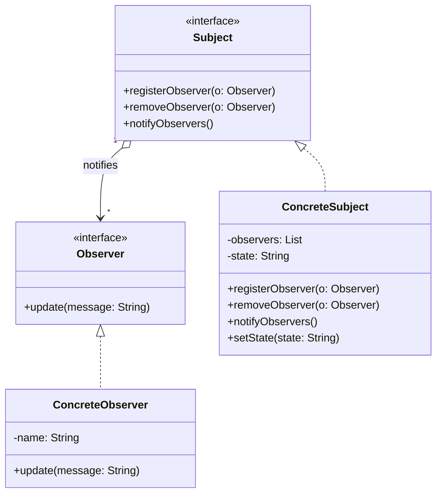

# Observer Design Pattern

## Definition

The **Observer Pattern** defines a one-to-many dependency between objects so that when one object (subject) changes state, all its dependents (observers) are notified and updated automatically.

---

## UML Class Diagram



---

## Use Cases

Common scenarios where the Observer Pattern is useful:

- **Event Handling Systems**
- **UI Frameworks** (e.g., Button click listeners)
- **Notification Systems**
- **Real-time Systems**
- **Pub/Sub (Publish–Subscribe) Mechanism**

---

## Real-World Analogies

- **YouTube Channel (Subject)** → Subscribers (Observers) get notified when a new video is posted.
- **Stock Market Ticker** → Investors (Observers) are notified when stock prices change.
- **Weather Station** → Display units (Observers) update in real-time when the weather changes.

---

## Why Use Observer Pattern?

### ✅ Decouples Subject and Observers

- Subject doesn't need to know details of observers.
- Promotes **low coupling** and **flexible code structure**.

### ✅ Scalable and Dynamic

- Observers can be added/removed at runtime.

### ✅ Useful in Event-driven Architecture

- Enables components to react to state changes dynamically.

---

## Frequently Asked in Interviews

> This is a **popular pattern in system design** and **event-driven architecture** discussions.

---

## Class Structure

### 1. Subject Interface

```java
interface Subject {
    void registerObserver(Observer o);
    void removeObserver(Observer o);
    void notifyObservers();
}
```

### 2. Observer Interface

```java
interface Observer {
    void update(String message);
}
```

### 3. Concrete Subject

```java
import java.util.ArrayList;
import java.util.List;

class NewsAgency implements Subject {
    private List<Observer> observers = new ArrayList<>();
    private String news;

    public void registerObserver(Observer o) {
        observers.add(o);
    }

    public void removeObserver(Observer o) {
        observers.remove(o);
    }

    public void notifyObservers() {
        for (Observer o : observers) {
            o.update(news);
        }
    }

    public void setNews(String news) {
        this.news = news;
        notifyObservers();
    }
}
```

### 4. Concrete Observers

```java
class EmailSubscriber implements Observer {
    private String name;

    EmailSubscriber(String name) {
        this.name = name;
    }

    public void update(String news) {
        System.out.println(name + " received news via Email: " + news);
    }
}

class SmsSubscriber implements Observer {
    private String name;

    SmsSubscriber(String name) {
        this.name = name;
    }

    public void update(String news) {
        System.out.println(name + " received news via SMS: " + news);
    }
}
```

### 5. Usage Example

```java
public class Main {
    public static void main(String[] args) {
        NewsAgency agency = new NewsAgency();

        Observer emailUser = new EmailSubscriber("Alice");
        Observer smsUser = new SmsSubscriber("Bob");

        agency.registerObserver(emailUser);
        agency.registerObserver(smsUser);

        agency.setNews("New Java Version Released!");

        agency.removeObserver(emailUser);

        agency.setNews("Spring Boot 3.0 Launched!");
    }
}
```

### Output

```text
Alice received news via Email: New Java Version Released!
Bob received news via SMS: New Java Version Released!
Bob received news via SMS: Spring Boot 3.0 Launched!
```

---

## 🔍 Deep Dive: Implementation Variations

### Push vs. Pull Model

1. **Push Model** (Used in example): Subject sends specific data to Observers via the update method.
    - *Pros*: Observers don't need to query back.
    - *Cons*: Subject might send unused data; coupling increases if data format is complex.
2. **Pull Model**: Subject notifies "I changed", and Observers call `subject.getState()` to fetch what they need.
    - *Pros*: Flexible; Observers fetch only relevant data.
    - *Cons*: Two calls required (notify + callback); Subject must expose getter methods.

### Java Historical Context

- **Deprecated**: `java.util.Observer` and `java.util.Observable` are **deprecated** since Java 9.
- **Issues**: `Observable` refers to a class (limiting multiple inheritance), no type safety, and not serializable.
- **Modern Replacement**: Use `java.beans.PropertyChangeListener` or **Java Flow API** (`java.util.concurrent.Flow`) for reactive streams.

---

## ⚠️ Common Pitfalls (Interview Hotspots)

### 1. The Lapsed Listener Problem (Memory Leak)

If an observer fails to unsubscribe (deregister), the Subject holds a strong reference to it, preventing Garbage Collection.

- **Solution**: Explicitly call `removeObserver()`, or use **WeakReferences** for observers.

### 2. Concurrency Issues

If multiple threads update the Subject, or if Observers take a long time to process, it can block the Subject.

- **Solution**: Use thread-safe lists (e.g., `CopyOnWriteArrayList`) or notify observers asynchronously.

---

## OOP Concepts Used

| Concept         | Description                                                                 |
|----------------|-----------------------------------------------------------------------------|
| **Encapsulation** | Each observer encapsulates its own response to a state change.              |
| **Abstraction**   | Both `Subject` and `Observer` define abstract contracts.                    |
| **Polymorphism**  | Different observers implement the same `update()` method differently.       |
| **Composition**   | Subject holds a list of observers and interacts through their interface.    |

## SOLID Principles Demonstrated

| Principle       | How It Applies                                                                 |
|-----------------|----------------------------------------------------------------------------------|
| **S - SRP**      | Subject and observers each manage only their own responsibilities.             |
| **O - OCP**      | New observer types can be added without modifying subject logic.               |
| **L - LSP**      | All observers follow the contract and can be replaced interchangeably.         |
| **I - ISP**      | Observer interface has only one method (`update`), adhering to minimalism.     |
| **D - DIP**      | Subject interacts with `Observer` interface, not concrete implementations.     |

## Key Concepts Recap

- **Subject (Observable)**: Knows its observers and notifies them of changes.
- **Observer**: Gets notified when the subject updates.
- **Push-based Communication**: Subject sends updated data to observers.
- **Loose Coupling**: Subject and observers are decoupled via interfaces.

> 🧠 Think of it like a real-time notification system — observers "subscribe" to a subject and get updated automatically when something changes.
