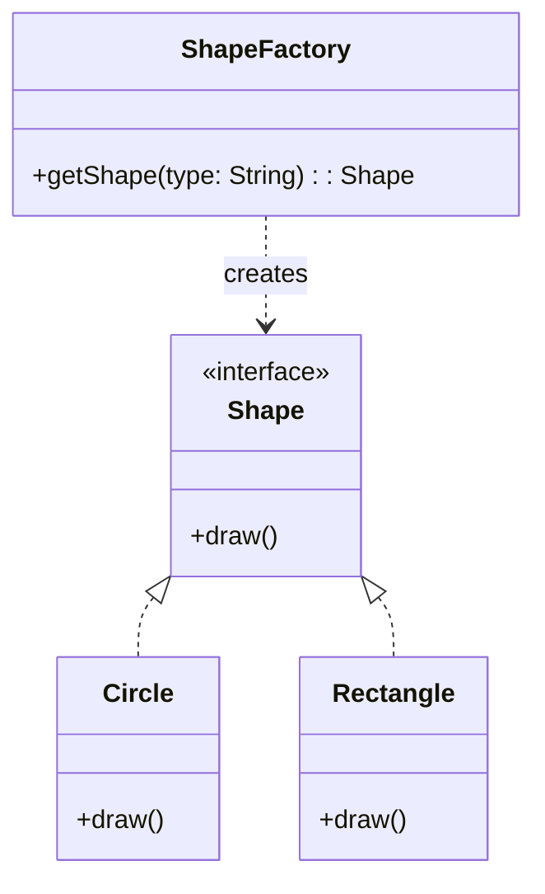

# Factory Design Pattern

## Definition

The **Factory Pattern** handles object creation logic. It defines an interface for creating objects, but allows subclasses (or a helper class) to decide which class to instantiate.

> ⚠️ **Nuance**: In interviews, distinguish between **Simple Factory** (a helper class with a switch-case) and **Factory Method Pattern** (inheritance-based creation). The example below is a **Simple Factory**.

---

## UML Class Diagram (Simple Factory)



---

## Use Cases

- **Decoupling**: Client doesn't need to know `new Circle()`.
- **Complex Construction**: If creating an object requires 5 steps/dependencies, do it in the factory.
- **Conditional Creation**: Create different objects based on environment (e.g., `WindowsButton` vs `MacButton`).

---

## Why Use Factory Pattern?

### ✅ Centralized Object Creation

- Keeps the "messy" `new` keyword logic in one place.

### ✅ Open/Closed Principle (Partial)

- Client code (`Main`) is Open for Extension (can handle new Shapes) but Closed for Modification (doesn't need changes if new Shapes are added).
- *Note*: The `ShapeFactory` itself might need modification unless dynamic registration usage is used.

---

## Class Structure (Simple Factory)

### 1. Product Interface

```java
interface Shape {
    void draw();
}
```

### 2. Concrete Implementations

```java
class Circle implements Shape {
    public void draw() {
        System.out.println("Drawing a Circle");
    }
}

class Rectangle implements Shape {
    public void draw() {
        System.out.println("Drawing a Rectangle");
    }
}
```

### 3. Factory Class

```java
class ShapeFactory {
    // 💡 Pro Tip: Make this static if you don't need state
    public static Shape getShape(String shapeType) {
        if (shapeType == null) return null;
        
        switch (shapeType.toLowerCase()) { // Java 7+ supports String in switch
            case "circle":
                return new Circle();
            case "rectangle":
                return new Rectangle();
            default:
                throw new IllegalArgumentException("Unknown shape type: " + shapeType);
        }
    }
}
```

### 4. Usage Example

```java
public class Main {
    public static void main(String[] args) {
        Shape shape1 = ShapeFactory.getShape("circle");
        shape1.draw(); // Drawing a Circle
    }
}
```

---

## 🚀 Advanced Implementation (Interview Bonus)

**Problem**: The `if-else` or `switch` violates OCP (you modify `ShapeFactory` to add `Triangle`).
**Solution**: Use a Map registry (Java Supplier).

```java
import java.util.HashMap;
import java.util.Map;
import java.util.function.Supplier;

class AdvancedShapeFactory {
    private static final Map<String, Supplier<Shape>> registry = new HashMap<>();

    static {
        registry.put("circle", Circle::new);
        registry.put("rectangle", Rectangle::new);
    }

    public static void registerShape(String type, Supplier<Shape> supplier) {
        registry.put(type, supplier);
    }

    public static Shape getShape(String type) {
        Supplier<Shape> shape = registry.get(type.toLowerCase());
        if (shape != null) return shape.get();
        throw new IllegalArgumentException("Invalid type");
    }
}
```

---

## OOP Concepts Used

| Concept         | Description                                                                 |
|----------------|-----------------------------------------------------------------------------|
| **Encapsulation** | Hides the complexity of object creation.                                     |
| **Abstraction**   | Client interacts with the `Shape` interface, not concrete classes.           |
| **Polymorphism**  | Factory returns the interface type (`Shape`).                                |

## SOLID Principles

| Principle       | How It Applies                                                                 |
|-----------------|----------------------------------------------------------------------------------|
| **S - SRP**      | Creation logic is moved out of the Client and into the Factory.                  |
| **O - OCP**      | The Client is closed for modification. Only the Factory needs updates (unless using Map approach). |
| **D - DIP**      | Client depends on Abstraction (`Shape`), not Concretions.                        |

## Summary

The Factory Pattern is the "entry point" to decoupling your system. By stopping code from using `new ConcreteClass()` everywhere, you make it testable and flexible.
