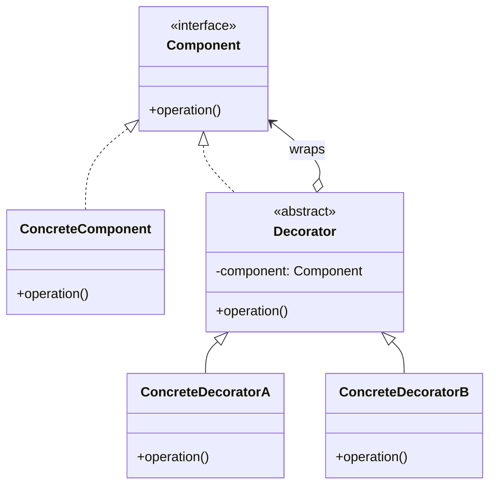

# Decorator Design Pattern

## Use Cases

The **Decorator Pattern** allows you to dynamically add behavior to objects without altering their structure (i.e., modifying the original class).

### Examples

- **Pizza**  
  `BasePizza + Extra Cheese + Mushroom + Extra Cheese`

- **Car**  
  `BaseCar + Seat Cover + AC + Power Steering`

- **Coffee**  
  `BaseCoffee + Milk + Sugar + Cream`

---

## UML Class Diagram



> **Key Feature**: `Decorator` IS-A `Component` (inheritance) AND HAS-A `Component` (composition).

---

## Why Use the Decorator Pattern?

### ✅ Problem: Class Explosion ("Combinatorial Explosion")

- Without Decorator, you'd need a subclass for every combination of features.
- Example:  
  - `PizzaWithCheeseAndMushroom`  
  - `PizzaWithCheeseOnly`  
  - `PizzaWithMushroomOnly`  
  - ... (scales squarely/exponentally)

### ✅ Solution: Dynamic Composition

- Adds features (like toppings or add-ons) at **runtime**.
- Promotes **flexibility** and **reusability**.
- Follows the **Open/Closed Principle** (open for extension, closed for modification).

---

## Interview Relevance

> This is a **frequently asked** design pattern. Expect questions on:
>
> 1. **Inheritance vs Decorator** (Static vs Dynamic).
> 2. **Real-world examples** (Java I/O).

---

## Class Structure Example: Pizza Cost Calculator

### 1. Abstract Base Class

```java
abstract class BasePizza {
    public abstract int cost();
}
```

### 2. Concrete Implementations

```java
class Margherita extends BasePizza {
    public int cost() {
        return 100;
    }
}

class VegDelight extends BasePizza {
    public int cost() {
        return 200;
    }
}
```

### 3. Abstract Decorator

```java
abstract class ToppingDecorator extends BasePizza {
    protected BasePizza basePizza;

    public ToppingDecorator(BasePizza basePizza) {
        this.basePizza = basePizza;
    }
}
```

📌 **Note**: `ToppingDecorator` extends `BasePizza` to maintain type compatibility, but holds a reference to a `BasePizza` to delegate calls.

### 4. Concrete Decorators

```java
class ExtraCheese extends ToppingDecorator {
    public ExtraCheese(BasePizza basePizza) {
        super(basePizza);
    }

    public int cost() {
        return basePizza.cost() + 20; // Add cost to wrapped object
    }
}

class Mushroom extends ToppingDecorator {
    public Mushroom(BasePizza basePizza) {
        super(basePizza);
    }

    public int cost() {
        return basePizza.cost() + 50;
    }
}
```

### 5. Usage Example

```java
public class Main {
    public static void main(String[] args) {
        // Base Pizza
        BasePizza pizza = new Margherita(); 
        System.out.println("Cost: " + pizza.cost()); // 100

        // Add Extra Cheese
        pizza = new ExtraCheese(pizza);
        System.out.println("Cost: " + pizza.cost()); // 120

        // Add Mushroom
        pizza = new Mushroom(pizza);
        System.out.println("Cost: " + pizza.cost()); // 170

        // Add Extra Cheese AGAIN
        pizza = new ExtraCheese(pizza);
        System.out.println("Cost: " + pizza.cost()); // 190
    }
}
```

---

## 🌍 Real-World Example (The "Killer" Interview Answer)

The **Java I/O** classes are the standard example of the Decorator pattern.

```java
// FileInputStream is the ConcreteComponent (reads bytes)
InputStream fileStream = new FileInputStream("data.txt");

// BufferedInputStream is a Decorator (adds buffering)
InputStream bufferedStream = new BufferedInputStream(fileStream);

// GZIPInputStream is a Decorator (adds decompression)
InputStream gzipStream = new GZIPInputStream(bufferedStream);

// Usage: You treat the final object just like any InputStream
int data = gzipStream.read();
```

---

## ⚠️ Common Pitfalls

### 1. Hard to Debug

A heavily decorated object is a stack of wrappers. Debugging can be confusing because the "real" object is hidden 10 layers deep.

### 2. Object Identity

`decoratedObject` is NOT the same instance as `originalObject`.

- If your code relies on `==` checks or specific types, decorators can break it.

### 3. Order Dependency

In some cases, the order decorators are applied matters (e.g., encryption should happen *after* compression, not before).

---

## OOP Concepts Used

| Concept         | Description                                                                 |
|----------------|-----------------------------------------------------------------------------|
| **Encapsulation** | Each decorator wraps functionality (state/behavior) in a separate class.    |
| **Abstraction**   | Client code depends on the `BasePizza` abstraction, not concrete types.     |
| **Polymorphism**  | All decorators are treated as `BasePizza`, allowing interchangeable use.    |
| **Composition**   | The core mechanism: Objects are composed (nested) at runtime.               |

## SOLID Principles Demonstrated

| Principle       | How It Applies                                                                 |
|-----------------|----------------------------------------------------------------------------------|
| **S - SRP**      | Pizza class only calculates base cost; Topping class only adds topping cost.   |
| **O - OCP**      | New toppings can be created without touching `Margherita` or `BasePizza`.       |
| **L - LSP**      | A `Mushroom` decorated pizza is still a `BasePizza` and behaves like one.      |
| **D - DIP**      | Classes depend on `BasePizza` abstraction, not concrete implementations.       |

## Key Concepts Recap

- **Wrapper**: A decorator "wraps" an object.
- **Transparent**: The client doesn't need to know it's dealing with a wrapper.
- **Stackable**: You can wrap a wrapper with another wrapper.

> 🧠 **Analogy**: Putting on clothes. You are the "Base Component". You put on a shirt (Decorator), then a jacket (Decorator). You are still "You", but with added layers of warmth/style. You can take them off or change order (mostly).
